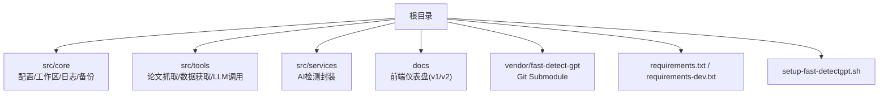
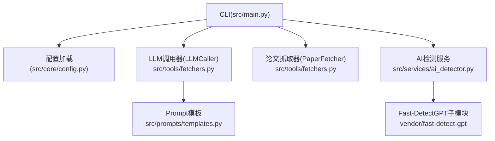
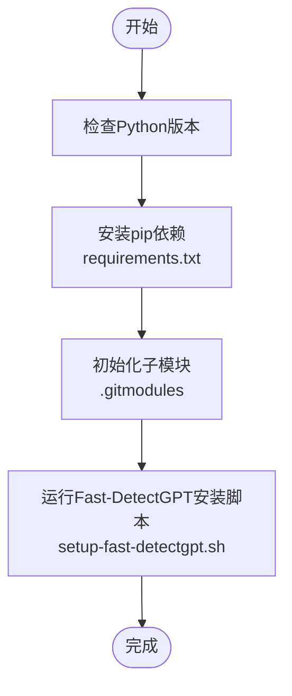
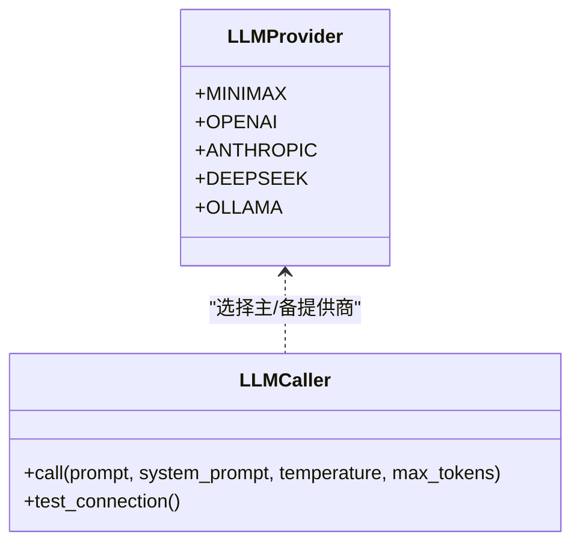
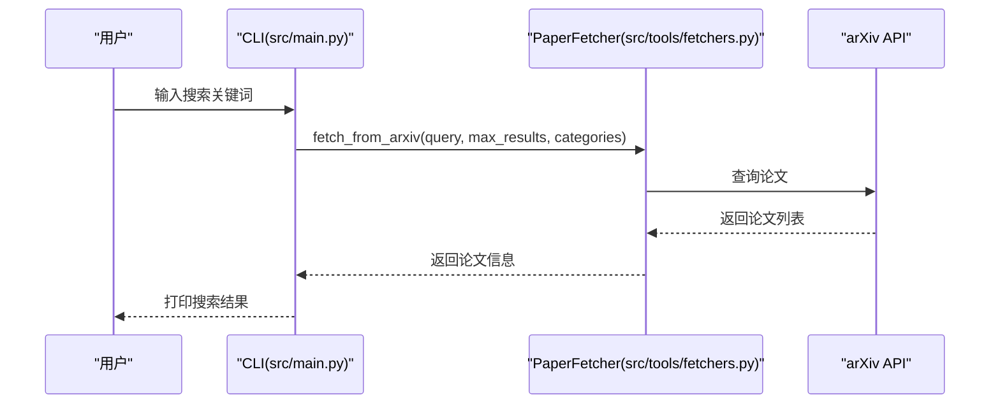
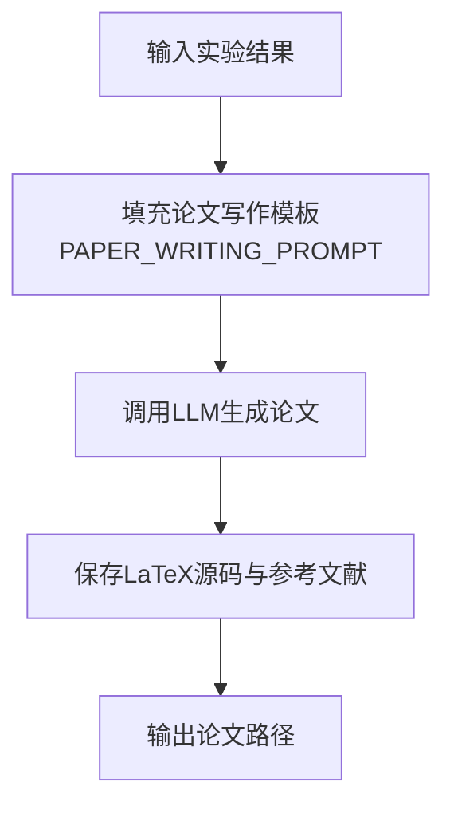
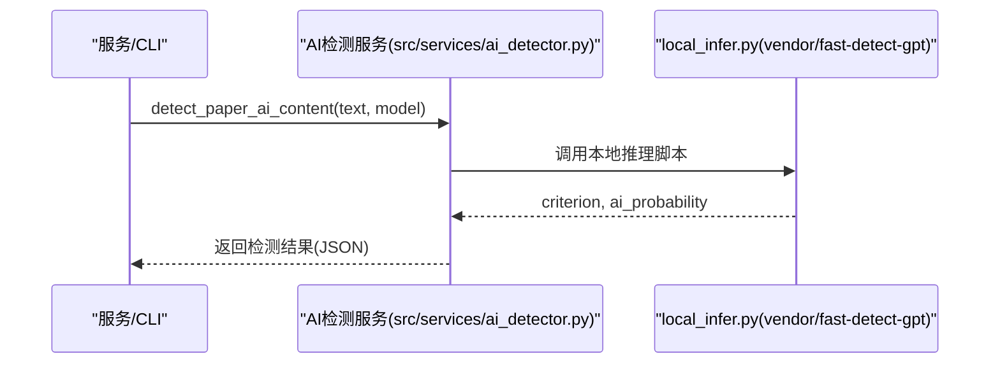
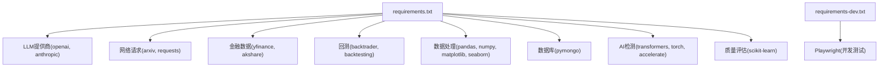

# 快速开始

<cite>
**本文引用的文件**
- [requirements.txt](file://requirements.txt)
- [requirements-dev.txt](file://requirements-dev.txt)
- [setup-fast-detectgpt.sh](file://setup-fast-detectgpt.sh)
- [README.md](file://README.md)
- [.gitmodules](file://.gitmodules)
- [src/main.py](file://src/main.py)
- [src/core/config.py](file://src/core/config.py)
- [src/tools/fetchers.py](file://src/tools/fetchers.py)
- [src/prompts/templates.py](file://src/prompts/templates.py)
- [src/services/ai_detector.py](file://src/services/ai_detector.py)
</cite>

## 目录
1. [简介](#简介)
2. [项目结构](#项目结构)
3. [核心组件](#核心组件)
4. [架构概览](#架构概览)
5. [详细组件分析](#详细组件分析)
6. [依赖分析](#依赖分析)
7. [性能考虑](#性能考虑)
8. [故障排除指南](#故障排除指南)
9. [结论](#结论)
10. [附录](#附录)

## 简介
本指南面向初学者，帮助你在本地快速搭建并运行 paperwriterAI（FARS）系统，完成从“量化金融论文”生成到“LLM连接测试”“学术论文搜索”的基础操作。你将学到：
- 环境与依赖配置（Python 版本、pip 安装、Fast-DetectGPT 子模块）
- LLM 提供商配置（OpenAI、Anthropic、MiniMax 等）
- 基本使用示例（CLI 命令、测试 LLM 连接、搜索论文）
- 常见问题与故障排除

## 项目结构
仓库采用“核心模块 + 工具 + 服务 + 前端仪表盘”的分层组织，其中：
- 核心模块：src/core（配置、工作区、日志、备份）
- 工具模块：src/tools（论文抓取、数据获取、LLM 调用）
- 服务模块：src/services（AI 检测封装）
- 前端仪表盘：docs（v1/v2）

**图表来源**
- [README.md:420-500](file://README.md#L420-L500)
- [.gitmodules:1-4](file://.gitmodules#L1-L4)

**章节来源**
- [README.md:420-500](file://README.md#L420-L500)

## 核心组件
- 配置与工作区：负责研究方向、日志、备份、LLM 提供商配置与合并
- LLM 调用器：统一调用 OpenAI、Anthropic、DeepSeek、MiniMax、Ollama，支持主备自动切换
- 论文抓取器：从 arXiv/Semantic Scholar 获取论文，支持 PDF 下载与清洗
- Prompt 模板：为四大 Agent（灵感/规划/实验/写作）提供结构化提示
- AI 检测服务：封装 Fast-DetectGPT，支持分段检测与批量检测

**章节来源**
- [src/core/config.py:18-57](file://src/core/config.py#L18-L57)
- [src/tools/fetchers.py:20-163](file://src/tools/fetchers.py#L20-L163)
- [src/prompts/templates.py:8-23](file://src/prompts/templates.py#L8-L23)
- [src/services/ai_detector.py:1-120](file://src/services/ai_detector.py#L1-L120)

## 架构概览
系统通过 CLI 或 API 与用户交互，核心流程如下：
- CLI 入口：src/main.py
- 配置加载：src/core/config.py
- LLM 调用：src/tools/fetchers.py 中的 LLMCaller
- 论文搜索：PaperFetcher（arXiv/Semantic Scholar）
- Prompt 模板：src/prompts/templates.py
- AI 检测：src/services/ai_detector.py（封装 vendor/fast-detect-gpt）

**图表来源**
- [src/main.py:443-517](file://src/main.py#L443-L517)
- [src/core/config.py:462-508](file://src/core/config.py#L462-L508)
- [src/tools/fetchers.py:290-800](file://src/tools/fetchers.py#L290-L800)
- [src/prompts/templates.py:1-120](file://src/prompts/templates.py#L1-L120)
- [src/services/ai_detector.py:1-120](file://src/services/ai_detector.py#L1-L120)

## 详细组件分析

### 环境与依赖配置
- Python 版本：项目 README 指明使用 Python 3.12+；请确保本地 Python 版本满足要求
- 依赖安装：使用 requirements.txt 安装核心依赖；如需 Playwright 测试，使用 requirements-dev.txt
- Fast-DetectGPT 子模块：通过 setup-fast-detectgpt.sh 安装 vendor/fast-detect-gpt，并自动下载模型

**图表来源**
- [README.md:544-590](file://README.md#L544-L590)
- [.gitmodules:1-4](file://.gitmodules#L1-L4)
- [setup-fast-detectgpt.sh:1-149](file://setup-fast-detectgpt.sh#L1-L149)

**章节来源**
- [requirements.txt:1-39](file://requirements.txt#L1-L39)
- [requirements-dev.txt:1-2](file://requirements-dev.txt#L1-L2)
- [README.md:544-590](file://README.md#L544-L590)
- [.gitmodules:1-4](file://.gitmodules#L1-L4)
- [setup-fast-detectgpt.sh:1-149](file://setup-fast-detectgpt.sh#L1-L149)

### LLM 提供商配置
系统支持多家 LLM 提供商，主配置来自 config.json，运行时会从环境变量注入 API Key。支持的提供商与默认模型如下：
- MiniMax：默认模型 MiniMax-M2.7-highspeed
- OpenAI：默认模型 gpt-4o
- Anthropic：默认模型 claude-3-5-sonnet
- DeepSeek：默认模型 deepseek-chat
- Ollama：默认模型 gemma4（本地模型）

**图表来源**
- [src/core/config.py:206-251](file://src/core/config.py#L206-L251)
- [src/tools/fetchers.py:290-450](file://src/tools/fetchers.py#L290-L450)

**章节来源**
- [src/core/config.py:206-251](file://src/core/config.py#L206-L251)
- [src/core/config.py:462-508](file://src/core/config.py#L462-L508)
- [src/tools/fetchers.py:290-450](file://src/tools/fetchers.py#L290-L450)

### 论文搜索与抓取
- 论文抓取器支持 arXiv 与 Semantic Scholar，可按关键词、分类筛选返回论文列表
- 支持下载 PDF 至本地 papers 目录
- 支持将论文信息清洗为结构化 JSON

**图表来源**
- [src/main.py:170-196](file://src/main.py#L170-L196)
- [src/tools/fetchers.py:27-74](file://src/tools/fetchers.py#L27-L74)

**章节来源**
- [src/tools/fetchers.py:20-163](file://src/tools/fetchers.py#L20-L163)

### Prompt 模板与论文生成
- 系统内置多套 Prompt 模板，覆盖论文分析、假设生成、实验计划、代码生成、论文写作等
- 生成论文时，系统会将实验结果与模板拼接，输出结构化 JSON，包含 LaTeX 源码与参考文献

**图表来源**
- [src/prompts/templates.py:355-389](file://src/prompts/templates.py#L355-L389)
- [src/main.py:279-351](file://src/main.py#L279-L351)

**章节来源**
- [src/prompts/templates.py:1-120](file://src/prompts/templates.py#L1-L120)
- [src/prompts/templates.py:355-389](file://src/prompts/templates.py#L355-L389)
- [src/main.py:279-351](file://src/main.py#L279-L351)

### AI 检测（Fast-DetectGPT）
- 通过 vendor/fast-detect-gpt 提供的本地检测模型，对论文进行分段检测
- 支持 gpt-neo-2.7B / gpt-j-6B / Llama3-8B 等模型，默认阈值为 1.9299
- 可输出整体 AI 概率、高风险段落与检测摘要

**图表来源**
- [src/services/ai_detector.py:146-297](file://src/services/ai_detector.py#L146-L297)
- [setup-fast-detectgpt.sh:92-127](file://setup-fast-detectgpt.sh#L92-L127)

**章节来源**
- [src/services/ai_detector.py:1-120](file://src/services/ai_detector.py#L1-L120)
- [src/services/ai_detector.py:146-297](file://src/services/ai_detector.py#L146-L297)
- [setup-fast-detectgpt.sh:92-127](file://setup-fast-detectgpt.sh#L92-L127)

## 依赖分析
- 核心依赖：openai、anthropic、arxiv、requests、yfinance、akshare、backtrader/backtesting、pandas/numpy/matplotlib/seaborn、pymongo、transformers/torch/accelerate、scikit-learn、python-dateutil、tqdm、rich
- 开发依赖：playwright（用于测试）
- LLM 提供商：MiniMax、OpenAI、Anthropic、DeepSeek、Ollama
- AI 检测：Fast-DetectGPT（vendor 子模块）

**图表来源**
- [requirements.txt:1-39](file://requirements.txt#L1-L39)
- [requirements-dev.txt:1-2](file://requirements-dev.txt#L1-L2)

**章节来源**
- [requirements.txt:1-39](file://requirements.txt#L1-L39)
- [requirements-dev.txt:1-2](file://requirements-dev.txt#L1-L2)

## 性能考虑
- LLM 调用：系统支持主备提供商自动切换，避免单点故障；建议在高并发或长上下文场景下调低 max_tokens，减少 token 成本
- 论文搜索：arXiv 查询默认限制结果数量，可根据需要调整 max_results
- AI 检测：Fast-DetectGPT 模型较大（约 10GB），建议在 GPU 环境运行以提升速度；CPU 回退可用但较慢
- 数据处理：pandas/numpy 等库在大数据集上注意内存占用，必要时分批处理

[本节为通用指导，无需特定文件引用]

## 故障排除指南
- 环境与依赖
  - Python 版本过低：升级至 Python 3.12+
  - 依赖安装失败：确认网络可达，必要时更换 pip 源；安装 playwright 仅在开发测试时需要
  - 子模块缺失：运行安装脚本前先初始化子模块
- LLM 连接
  - API Key 未设置：通过环境变量设置对应提供商的 KEY（MiniMax、OpenAI、Anthropic、DeepSeek）
  - 主提供商失败：系统会自动尝试备选（如 Ollama），若仍失败，检查网络与代理
- 论文搜索
  - arXiv 请求异常：检查网络连通性；适当降低 max_results
  - PDF 下载失败：确认论文 ID 正确，或改用其他来源
- AI 检测
  - Fast-DetectGPT 未安装：先运行安装脚本，等待模型下载完成
  - 检测结果为空：文本过短或解析失败，尝试增加文本长度或使用分段检测

**章节来源**
- [README.md:544-590](file://README.md#L544-L590)
- [src/tools/fetchers.py:415-449](file://src/tools/fetchers.py#L415-L449)
- [src/services/ai_detector.py:56-144](file://src/services/ai_detector.py#L56-L144)

## 结论
通过本快速开始指南，你已经完成了环境配置、LLM 提供商设置、Fast-DetectGPT 子模块初始化，并掌握了基本的 CLI 使用方法。建议在熟悉 CLI 后，进一步探索仪表盘与 API，以获得更丰富的可视化与自动化体验。

[本节为总结，无需特定文件引用]

## 附录

### 基本使用示例（CLI）
- 生成量化交易论文
  - 示例命令：python src/main.py --direction quant_finance --topic "Transformer-based momentum trading"
- 上传论文文件
  - 示例命令：python src/main.py --upload path/to/paper.pdf
- 测试 LLM 连接
  - 示例命令：python src/main.py --test-llm
- 搜索论文
  - 示例命令：python src/main.py --search --topic "deep learning stock prediction"
- 查看系统状态
  - 示例命令：python src/main.py --status

**章节来源**
- [src/main.py:443-517](file://src/main.py#L443-L517)

### LLM 提供商配置要点
- 在 config.json 中设置 provider/model/base_url/api_key 等参数
- API Key 通过环境变量注入，不在配置文件中硬编码
- 支持主备提供商自动切换，提升鲁棒性

**章节来源**
- [src/core/config.py:388-417](file://src/core/config.py#L388-L417)
- [src/core/config.py:462-508](file://src/core/config.py#L462-L508)
- [src/tools/fetchers.py:415-449](file://src/tools/fetchers.py#L415-L449)

### Fast-DetectGPT 安装与使用
- 安装脚本会自动下载模型（gpt-neo-2.7B 默认），支持 gpt-j-6B、Llama3-8B 等
- 可在 paperwriterAI 中直接调用 AI 检测服务，或通过 CLI 使用

**章节来源**
- [setup-fast-detectgpt.sh:1-149](file://setup-fast-detectgpt.sh#L1-L149)
- [src/services/ai_detector.py:1-120](file://src/services/ai_detector.py#L1-L120)