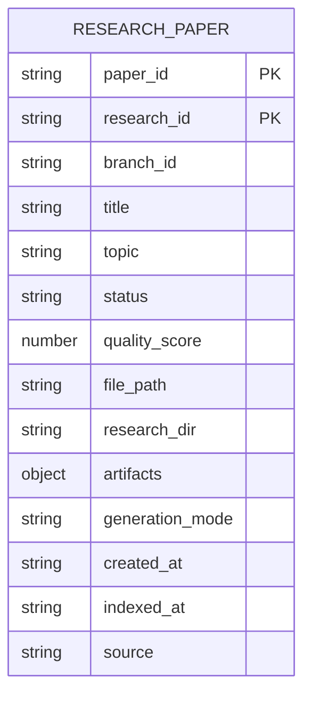
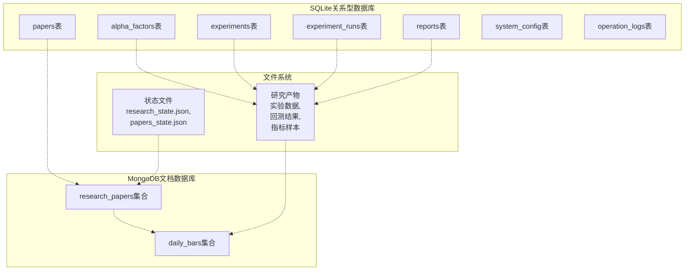
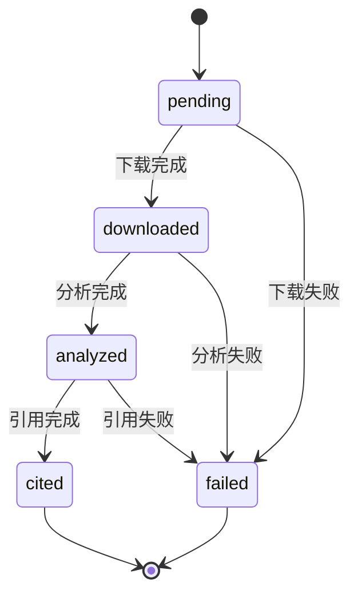

# 数据库Schema设计

<cite>
**本文档引用的文件**
- [database.py](file://src/core/database.py)
- [mongo_index.py](file://src/core/mongo_index.py)
- [data_registry.py](file://src/core/data_registry.py)
- [research_archive.py](file://src/core/research_archive.py)
- [config.json](file://config.json)
- [research_state.json](file://data/research_state.json)
- [papers_state.json](file://data/papers_state.json)
- [RS-20260621-102_experiment_data.json](file://data/research/RS-20260621-102_documentclass_article/data/RS-20260621-102_experiment_data.json)
- [RS-20260621-102_indicator_sample.json](file://data/research/RS-20260621-102_documentclass_article/data/RS-20260621-102_indicator_sample.json)
- [RS-20260621-102_backtest_results.json](file://data/research/RS-20260621-102_documentclass_article/metrics/RS-20260621-102_backtest_results.json)
</cite>

## 目录
1. [简介](#简介)
2. [项目结构](#项目结构)
3. [核心数据表结构](#核心数据表结构)
4. [MongoDB文档结构](#mongodb文档结构)
5. [数据模型关系图](#数据模型关系图)
6. [字段定义与约束](#字段定义与约束)
7. [索引设计与查询优化](#索引设计与查询优化)
8. [数据验证与业务规则](#数据验证与业务规则)
9. [示例数据结构](#示例数据结构)
10. [性能考虑](#性能考虑)
11. [故障排除指南](#故障排除指南)
12. [结论](#结论)

## 简介

paperwriterAI是一个基于大语言模型的量化研究论文写作系统，采用混合数据库架构设计。系统同时使用SQLite关系型数据库和MongoDB文档数据库来满足不同类型数据的存储需求。

该系统的核心目标是为量化研究提供完整的数据管理解决方案，包括论文数据管理、因子实验管理、研究报告生成和市场数据分析等功能。数据库Schema设计遵循以下原则：

- **关系型数据**：使用SQLite存储结构化的关系数据，如论文元数据、实验配置等
- **文档型数据**：使用MongoDB存储半结构化的研究档案和实验结果
- **数据一致性**：通过统一的数据注册表管理不同数据源的访问
- **可扩展性**：支持多租户和多分支的研究项目管理

## 项目结构

系统采用分层架构设计，数据库相关的核心文件分布在以下位置：

```mermaid
graph TB
subgraph "数据库层"
SQLite[SQLite数据库<br/>papers, alpha_factors,<br/>experiments等表]
MongoDB[MongoDB数据库<br/>research_papers集合]
end
subgraph "核心服务层"
DBInit[数据库初始化<br/>create_tables()]
MongoIndex[MongoDB索引<br/>index_paper_record()]
DataRegistry[数据注册表<br/>get_registry()]
end
subgraph "应用层"
ResearchArchive[研究档案管理<br/>create_research_workspace()]
Config[配置管理<br/>config.json]
StateFiles[状态文件<br/>research_state.json,<br/>papers_state.json]
end
Config --> DBInit
Config --> MongoIndex
DataRegistry --> ResearchArchive
DBInit --> SQLite
MongoIndex --> MongoDB
ResearchArchive --> StateFiles
```

**图表来源**
- [database.py:23-189](file://src/core/database.py#L23-L189)
- [mongo_index.py:30-60](file://src/core/mongo_index.py#L30-L60)
- [data_registry.py:48-97](file://src/core/data_registry.py#L48-L97)

**章节来源**
- [database.py:1-278](file://src/core/database.py#L1-L278)
- [mongo_index.py:1-117](file://src/core/mongo_index.py#L1-L117)
- [data_registry.py:1-189](file://src/core/data_registry.py#L1-L189)

## 核心数据表结构

### SQLite关系型数据库结构

系统使用SQLite作为主要的关系型数据库，包含以下核心表：

#### 论文表 (papers)
存储论文的基本信息和状态管理：

| 字段名 | 数据类型 | 约束 | 描述 |
|--------|----------|------|------|
| paper_id | TEXT | PRIMARY KEY | 论文唯一标识符 |
| source | VARCHAR(20) | NOT NULL | 数据来源（如arxiv） |
| external_id | VARCHAR(100) |  | 外部系统ID |
| title | TEXT | NOT NULL | 论文标题 |
| authors | TEXT |  | 作者信息（JSON数组） |
| abstract | TEXT |  | 论文摘要 |
| year | INTEGER |  | 发表年份 |
| categories | TEXT |  | 分类标签 |
| keywords | TEXT |  | 关键词 |
| pdf_url | TEXT |  | PDF链接 |
| pdf_path | TEXT |  | PDF本地路径 |
| status | VARCHAR(20) | DEFAULT 'pending' | 论文状态 |
| reading_notes | TEXT |  | 阅读笔记 |
| created_at | TIMESTAMP | DEFAULT CURRENT_TIMESTAMP | 创建时间 |
| updated_at | TIMESTAMP | DEFAULT CURRENT_TIMESTAMP | 更新时间 |

#### Alpha因子表 (alpha_factors)
存储量化因子的相关信息：

| 字段名 | 数据类型 | 约束 | 描述 |
|--------|----------|------|------|
| factor_id | TEXT | PRIMARY KEY | 因子唯一标识符 |
| source_paper_id | TEXT |  | 来源论文ID |
| factor_name | TEXT | NOT NULL | 因子名称 |
| description | TEXT |  | 因子描述 |
| trading_logic | TEXT | NOT NULL | 交易逻辑 |
| parameters | TEXT |  | 参数配置 |
| expected_direction | VARCHAR(20) |  | 预期方向 |
| risk_factors | TEXT |  | 风险因子 |
| market_universe | VARCHAR(50) |  | 市场范围 |
| time_horizon | VARCHAR(20) |  | 时间范围 |
| related_factors | TEXT |  | 相关因子 |
| status | VARCHAR(20) | DEFAULT 'generated' | 因子状态 |
| validation_results | TEXT |  | 验证结果 |
| created_at | TIMESTAMP | DEFAULT CURRENT_TIMESTAMP | 创建时间 |

#### 实验表 (experiments)
存储实验配置和状态：

| 字段名 | 数据类型 | 约束 | 描述 |
|--------|----------|------|------|
| experiment_id | TEXT | PRIMARY KEY | 实验唯一标识符 |
| hypothesis_id | TEXT | NOT NULL | 假设ID |
| experiment_name | TEXT | NOT NULL | 实验名称 |
| description | TEXT |  | 实验描述 |
| plan | TEXT | NOT NULL | 实验计划 |
| status | VARCHAR(20) | DEFAULT 'planned' | 实验状态 |
| created_at | TIMESTAMP | DEFAULT CURRENT_TIMESTAMP | 创建时间 |
| updated_at | TIMESTAMP | DEFAULT CURRENT_TIMESTAMP | 更新时间 |

#### 实验运行记录表 (experiment_runs)
存储实验执行详情：

| 字段名 | 数据类型 | 约束 | 描述 |
|--------|----------|------|------|
| run_id | TEXT | PRIMARY KEY | 运行记录ID |
| experiment_id | TEXT | NOT NULL | 关联实验ID |
| run_number | INTEGER | NOT NULL | 运行序号 |
| parameters | TEXT |  | 运行参数 |
| generated_code | TEXT |  | 生成的代码 |
| execution_log | TEXT |  | 执行日志 |
| result | TEXT |  | 实验结果 |
| judgment | TEXT |  | 判定结果 |
| status | VARCHAR(20) | DEFAULT 'pending' | 运行状态 |
| healing_attempts | INTEGER | DEFAULT 0 | 修复尝试次数 |
| started_at | TIMESTAMP |  | 开始时间 |
| completed_at | TIMESTAMP |  | 完成时间 |
| error_message | TEXT |  | 错误信息 |

#### 研究报告表 (reports)
存储研究报告内容：

| 字段名 | 数据类型 | 约束 | 描述 |
|--------|----------|------|------|
| report_id | TEXT | PRIMARY KEY | 报告ID |
| run_id | TEXT |  | 关联运行ID |
| report_type | VARCHAR(20) | DEFAULT 'paper' | 报告类型 |
| title | TEXT |  | 报告标题 |
| abstract | TEXT |  | 摘要 |
| content | TEXT |  | 内容 |
| figures | TEXT |  | 图表数据 |
| tables_data | TEXT |  | 表格数据 |
| references_bib | TEXT |  | 参考文献 |
| status | VARCHAR(20) | DEFAULT 'draft' | 报告状态 |
| feedback | TEXT |  | 反馈意见 |
| created_at | TIMESTAMP | DEFAULT CURRENT_TIMESTAMP | 创建时间 |
| updated_at | TIMESTAMP | DEFAULT CURRENT_TIMESTAMP | 更新时间 |

#### 系统配置表 (system_config)
存储系统配置信息：

| 字段名 | 数据类型 | 约束 | 描述 |
|--------|----------|------|------|
| key | TEXT | PRIMARY KEY | 配置键 |
| value | TEXT |  | 配置值 |
| description | TEXT |  | 描述 |
| updated_at | TIMESTAMP | DEFAULT CURRENT_TIMESTAMP | 更新时间 |

#### 操作日志表 (operation_logs)
存储系统操作日志：

| 字段名 | 数据类型 | 约束 | 描述 |
|--------|----------|------|------|
| log_id | INTEGER | PRIMARY KEY AUTOINCREMENT | 日志ID |
| agent_name | VARCHAR(50) |  | 代理名称 |
| operation | VARCHAR(100) |  | 操作类型 |
| input_data | TEXT |  | 输入数据 |
| output_data | TEXT |  | 输出数据 |
| status | VARCHAR(20) |  | 状态 |
| error_message | TEXT |  | 错误信息 |
| duration_ms | INTEGER |  | 持续时间(ms) |
| created_at | TIMESTAMP | DEFAULT CURRENT_TIMESTAMP | 创建时间 |

**章节来源**
- [database.py:28-138](file://src/core/database.py#L28-L138)

## MongoDB文档结构

### 研究论文索引集合 (research_papers)

MongoDB用于存储研究档案的元数据和索引信息，采用灵活的文档结构：

#### 索引文档结构



**图表来源**
- [mongo_index.py:40-55](file://src/core/mongo_index.py#L40-L55)

#### 核心字段说明

| 字段名 | 类型 | 描述 |
|--------|------|------|
| paper_id | string | 论文唯一标识符 |
| research_id | string | 研究ID（主键） |
| branch_id | string | 分支ID |
| title | string | 论文标题 |
| topic | string | 研究主题 |
| status | string | 状态（如generated, pending） |
| quality_score | number | 质量评分 |
| file_path | string | 论文文件路径 |
| research_dir | string | 研究目录路径 |
| artifacts | object | 产物文件映射 |
| generation_mode | string | 生成模式 |
| created_at | string | 创建时间 |
| indexed_at | string | 索引时间 |
| source | string | 数据来源 |

### 市场数据集合 (daily_bars)

用于存储金融市场的OHLCV数据：

#### 日线数据结构

| 字段名 | 类型 | 描述 |
|--------|------|------|
| date | string | 交易日期 |
| open | number | 开盘价 |
| high | number | 最高价 |
| low | number | 最低价 |
| close | number | 收盘价 |
| volume | number | 成交量 |
| adj_close | number | 复权收盘价 |

**章节来源**
- [mongo_index.py:30-60](file://src/core/mongo_index.py#L30-L60)
- [research_archive.py:259-293](file://src/core/research_archive.py#L259-L293)

## 数据模型关系图

系统采用混合数据库架构，不同数据模型之间存在复杂的关联关系：



**图表来源**
- [database.py:28-138](file://src/core/database.py#L28-L138)
- [mongo_index.py:30-93](file://src/core/mongo_index.py#L30-L93)
- [research_archive.py:118-147](file://src/core/research_archive.py#L118-L147)

## 字段定义与约束

### 主键和外键约束

#### SQLite主键约束
- **papers.paper_id**: 主键，唯一标识论文
- **alpha_factors.factor_id**: 主键，唯一标识因子
- **experiments.experiment_id**: 主键，唯一标识实验
- **experiment_runs.run_id**: 主键，唯一标识运行记录
- **reports.report_id**: 主键，唯一标识报告
- **system_config.key**: 主键，唯一标识配置项

#### 外键关系
- **alpha_factors.source_paper_id** → **papers.paper_id**: 因子来源论文
- **experiment_runs.experiment_id** → **experiments.experiment_id**: 运行记录所属实验
- **reports.run_id** → **experiment_runs.run_id**: 报告来源运行记录

### 索引约束
- **papers.source**: 索引，支持按数据源查询
- **papers.year**: 索引，支持按年份查询
- **papers.status**: 索引，支持按状态查询
- **alpha_factors.status**: 索引，支持按因子状态查询
- **alpha_factors.market_universe**: 索引，支持按市场范围查询
- **experiments.status**: 索引，支持按实验状态查询
- **experiments.hypothesis_id**: 索引，支持按假设查询
- **experiment_runs.experiment_id**: 索引，支持按实验查询
- **experiment_runs.status**: 索引，支持按运行状态查询
- **reports.status**: 索引，支持按报告状态查询
- **reports.report_type**: 索引，支持按报告类型查询
- **operation_logs.agent_name**: 索引，支持按代理查询
- **operation_logs.created_at**: 索引，支持按时间查询

### 数据类型约束

#### 字符串类型
- **VARCHAR(20)**: 状态字段，限制长度20字符
- **VARCHAR(50)**: 市场范围字段，限制长度50字符
- **VARCHAR(100)**: 外部ID字段，限制长度100字符

#### 数字类型
- **INTEGER**: 年份、运行序号、尝试次数等整数字段
- **TIMESTAMP**: 时间戳字段，支持自动时间管理

#### JSON类型
- **TEXT**: 存储JSON格式的复杂数据结构
- **authors**: 作者信息数组
- **parameters**: 参数配置对象
- **artifacts**: 产物文件映射对象

**章节来源**
- [database.py:165-183](file://src/core/database.py#L165-L183)

## 索引设计与查询优化

### SQLite查询优化策略

#### 索引设计原则
1. **高频查询字段**: 对经常用于WHERE条件的字段建立索引
2. **排序字段**: 对经常用于ORDER BY的字段建立索引
3. **连接字段**: 对JOIN操作的字段建立索引
4. **复合索引**: 对联合查询条件建立复合索引

#### 查询优化技巧
- **选择性索引**: 优先为选择性高的字段建立索引
- **覆盖索引**: 为常用查询建立覆盖索引，避免回表
- **索引合并**: 合理使用复合索引替代多个单列索引
- **统计信息**: 定期更新数据库统计信息，优化查询计划

### MongoDB查询优化策略

#### 文档设计优化
1. **嵌套文档**: 将相关的数据组织在嵌套文档中，减少查询次数
2. **数组字段**: 使用数组存储相关列表，支持聚合查询
3. **文档大小**: 控制单个文档大小，避免超大文档影响性能
4. **字段命名**: 使用简洁明了的字段命名，提高查询效率

#### 查询优化技巧
- **投影**: 只返回需要的字段，减少网络传输
- **分页**: 使用limit和skip进行分页查询
- **聚合管道**: 使用聚合管道进行复杂查询和数据处理
- **索引策略**: 为常用查询字段建立合适的索引

### 缓存策略
- **热点数据缓存**: 缓存频繁访问的论文和因子数据
- **查询结果缓存**: 缓存复杂的聚合查询结果
- **配置缓存**: 缓存系统配置信息，减少数据库访问

**章节来源**
- [database.py:165-183](file://src/core/database.py#L165-L183)
- [mongo_index.py:83-93](file://src/core/mongo_index.py#L83-L93)

## 数据验证与业务规则

### 数据完整性约束

#### SQLite约束规则
1. **NOT NULL约束**: 关键字段必须填写，如论文标题、实验计划等
2. **DEFAULT值**: 为状态字段设置合理的默认值
3. **UNIQUE约束**: 确保论文ID的唯一性
4. **CHECK约束**: 验证数据范围和格式

#### MongoDB文档验证
1. **必需字段验证**: 确保关键字段的存在
2. **数据类型验证**: 验证字段的数据类型
3. **范围验证**: 验证数值字段的合理范围
4. **格式验证**: 验证字符串字段的格式

### 业务规则约束

#### 论文状态流转


**图表来源**
- [database.py:57-66](file://src/core/database.py#L57-L66)

#### 实验状态管理
- **planned**: 实验已计划，等待执行
- **running**: 实验正在执行
- **completed**: 实验完成
- **failed**: 实验失败
- **aborted**: 实验中止

#### 因子状态管理
- **generated**: 因子已生成
- **validated**: 因子已验证
- **approved**: 因子已批准
- **deprecated**: 因子已废弃

### 数据一致性保证

#### 事务处理
- **原子性**: 关键操作使用事务保证原子性
- **一致性**: 通过约束和触发器保证数据一致性
- **隔离性**: 合理设置事务隔离级别
- **持久性**: 确保数据持久化存储

#### 锁机制
- **行级锁**: 保护并发访问的数据
- **表级锁**: 保护大批量操作
- **死锁检测**: 自动检测和解决死锁问题

**章节来源**
- [database.py:57-66](file://src/core/database.py#L57-L66)

## 示例数据结构

### 论文数据示例

#### 完整论文记录
```json
{
  "paper_id": "arxiv_2409.06289",
  "source": "arxiv",
  "external_id": "2409.06289",
  "title": "Automate Strategy Finding with LLM in Quant Investment",
  "authors": ["Zhou, Tao", "Wang, Wei", "Chen, Yi"],
  "abstract": "We present a novel framework that uses Large Language Models to automate the quantitative investment strategy discovery process...",
  "year": 2024,
  "categories": ["q-fin.TR", "cs.AI"],
  "keywords": ["quantitative trading", "LLM", "strategy discovery"],
  "pdf_url": "https://arxiv.org/pdf/2409.06289",
  "pdf_path": "/data/papers/arxiv_2409.06289.pdf",
  "status": "analyzed",
  "reading_notes": "核心贡献：自动化策略发现框架",
  "created_at": "2026-06-21T10:00:00Z",
  "updated_at": "2026-06-21T15:30:00Z"
}
```

#### Alpha因子示例
```json
{
  "factor_id": "factor_001",
  "source_paper_id": "arxiv_2409.06289",
  "factor_name": "LLM_Strategy_Finder",
  "description": "基于LLM的自动化策略发现因子",
  "trading_logic": "当LLM预测收益>阈值时买入，<阈值时卖出",
  "parameters": {
    "confidence_threshold": 0.7,
    "lookback_period": 20,
    "position_size": 0.1
  },
  "expected_direction": "positive",
  "risk_factors": ["market_risk", "liquidity_risk"],
  "market_universe": "US_STocks",
  "time_horizon": "medium_term",
  "related_factors": ["factor_002", "factor_003"],
  "status": "validated",
  "validation_results": {
    "sharpe_ratio": 1.2,
    "max_drawdown": -0.15,
    "win_rate": 0.58
  },
  "created_at": "2026-06-21T14:00:00Z"
}
```

#### 实验数据示例
```json
{
  "research_id": "RS-20260621-102",
  "title": "LLM Agent在量化交易中的应用",
  "topic": "LLM Agent在量化交易中的应用",
  "status": "generated",
  "note": "实验数据待运行 code 目录下实验脚本后生成",
  "created_at": "2026-06-21T23:06:17.334387"
}
```

#### 指标样本示例
```json
{
  "research_id": "RS-20260621-102",
  "title": "LLM Agent在量化交易中的应用",
  "sample": [
    {
      "date": "2024-08-06",
      "close": 9.05,
      "returns": 0.0012,
      "ma_5": 9.12,
      "ma_20": 9.21,
      "rsi": 27.18,
      "macd": -0.012,
      "bollinger_upper": 9.40,
      "bollinger_lower": 8.94
    }
  ]
}
```

#### 回测结果示例
```json
{
  "research_id": "RS-20260621-102",
  "title": "LLM Agent在量化交易中的应用",
  "status": "completed",
  "strategies": {
    "ma_crossover": {
      "total_return": 0.0769,
      "annualized_return": 0.0129,
      "sharpe_ratio": -0.06,
      "max_drawdown": -0.3678,
      "win_rate": 0.5091,
      "trade_count": 1367
    }
  },
  "benchmark": {
    "buy_and_hold": {
      "total_return": 0.4807,
      "annualized_return": 0.0704
    }
  }
}
```

**章节来源**
- [database.py:205-237](file://src/core/database.py#L205-L237)
- [RS-20260621-102_experiment_data.json:1-8](file://data/research/RS-20260621-102_documentclass_article/data/RS-20260621-102_experiment_data.json#L1-L8)
- [RS-20260621-102_indicator_sample.json:1-5](file://data/research/RS-20260621-102_documentclass_article/data/RS-20260621-102_indicator_sample.json#L1-L5)
- [RS-20260621-102_backtest_results.json:1-7](file://data/research/RS-20260621-102_documentclass_article/metrics/RS-20260621-102_backtest_results.json#L1-L7)

## 性能考虑

### 数据库性能优化

#### SQLite性能优化
1. **连接池管理**: 合理配置连接池大小，避免过多连接开销
2. **事务批处理**: 将多个操作合并到单个事务中执行
3. **查询计划**: 使用EXPLAIN QUERY PLAN分析查询性能
4. **内存配置**: 调整SQLite内存使用参数优化性能

#### MongoDB性能优化
1. **分片策略**: 对大数据集实施分片策略
2. **副本集配置**: 配置副本集提高可用性和读扩展
3. **索引优化**: 定期分析和优化索引使用
4. **聚合管道**: 使用聚合管道进行复杂查询

### 缓存策略
- **应用层缓存**: 使用Redis或Memcached缓存热点数据
- **数据库查询缓存**: 利用数据库内置查询缓存功能
- **文件系统缓存**: 缓存大型文件和计算结果

### 监控和诊断
- **性能监控**: 实时监控数据库性能指标
- **慢查询日志**: 记录和分析慢查询
- **资源使用监控**: 监控CPU、内存、磁盘使用情况

## 故障排除指南

### 常见问题和解决方案

#### 数据库连接问题
1. **连接超时**: 检查数据库服务器状态和网络连接
2. **权限错误**: 验证数据库用户权限配置
3. **连接池耗尽**: 调整连接池大小参数

#### 数据一致性问题
1. **事务冲突**: 检查并发事务的隔离级别设置
2. **死锁问题**: 分析死锁日志，优化事务执行顺序
3. **数据不一致**: 实施数据校验和修复机制

#### 性能问题
1. **查询缓慢**: 分析查询计划，添加必要的索引
2. **内存不足**: 优化查询语句，调整数据库内存配置
3. **磁盘空间不足**: 清理历史数据和日志文件

### 错误处理机制

#### SQLite错误处理
- **异常捕获**: 捕获SQL执行异常并记录详细信息
- **回滚机制**: 在事务失败时自动回滚
- **重试策略**: 对临时性错误实施自动重试

#### MongoDB错误处理
- **连接重试**: 实现连接失败的自动重试机制
- **超时处理**: 设置合理的操作超时时间
- **故障转移**: 配置主从切换和故障转移

**章节来源**
- [mongo_index.py:15-27](file://src/core/mongo_index.py#L15-L27)

## 结论

paperwriterAI的数据库Schema设计采用了混合架构，结合了SQLite的关系型优势和MongoDB的灵活性，为量化研究论文写作系统提供了完整的数据管理解决方案。

### 设计亮点

1. **混合架构**: 同时支持关系型和文档型数据存储，满足不同场景需求
2. **状态管理**: 完善的工作流状态管理，支持复杂的业务流程
3. **索引优化**: 针对高频查询场景设计的索引策略
4. **数据一致性**: 通过约束和事务保证数据完整性
5. **可扩展性**: 支持多租户和多分支的研究项目管理

### 应用场景

该数据库Schema适用于以下应用场景：
- **量化研究论文写作**: 管理研究论文的生命周期
- **因子实验管理**: 跟踪量化因子的开发和验证过程
- **市场数据分析**: 存储和分析金融市场的历史数据
- **研究报告生成**: 自动生成和管理研究报告
- **多智能体协作**: 支持多个研究代理的协作和数据共享

### 未来发展

随着系统规模的扩大和技术的发展，数据库Schema可以进一步优化：
- **分布式部署**: 支持更大规模的数据存储和访问
- **实时分析**: 集成流处理和实时分析能力
- **AI集成**: 更紧密地集成机器学习和深度学习模型
- **云原生**: 支持容器化和微服务架构

通过持续的优化和完善，paperwriterAI的数据库Schema将为量化研究领域提供更加高效和可靠的数据管理服务。