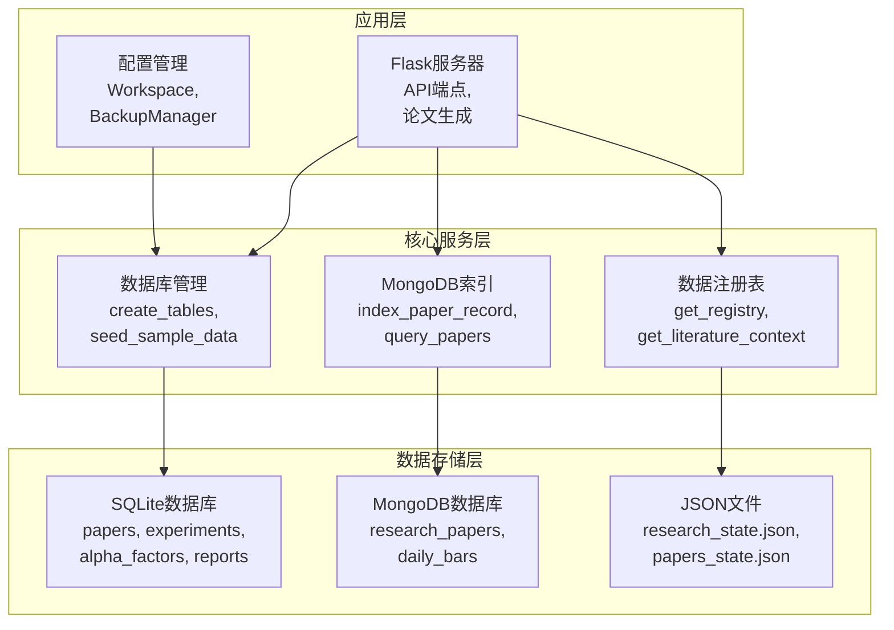
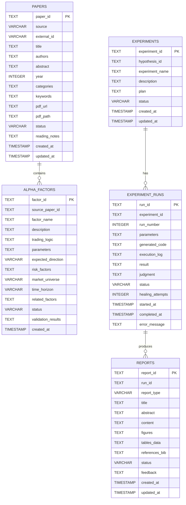
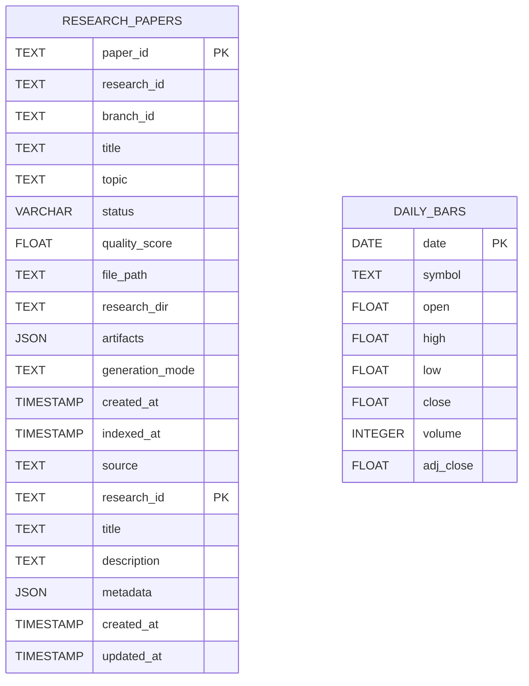
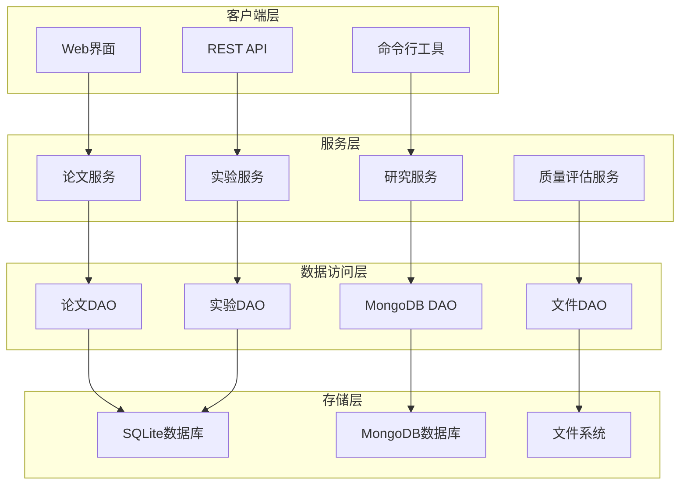
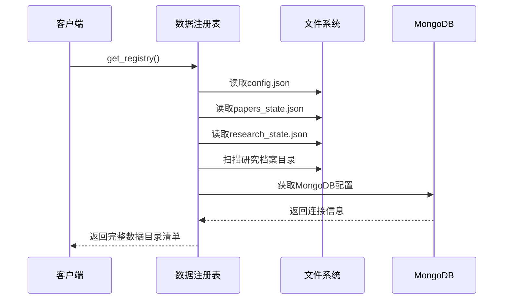
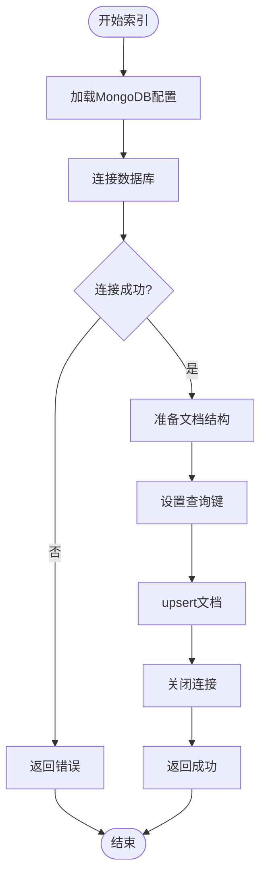
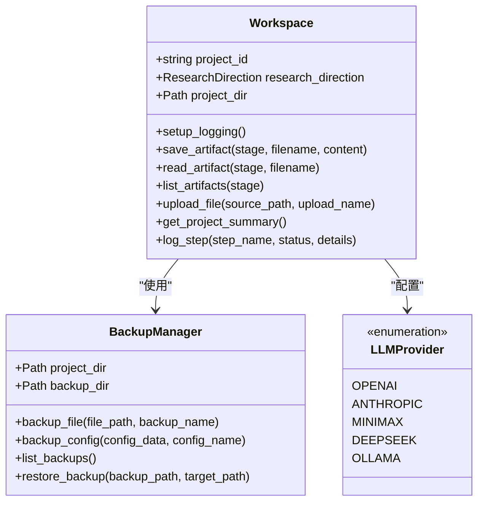
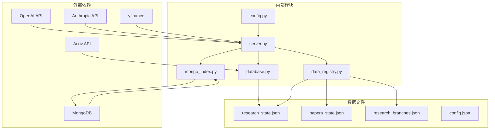

# 数据模型设计

<cite>
**本文档引用的文件**
- [src/core/database.py](file://src/core/database.py)
- [src/core/data_registry.py](file://src/core/data_registry.py)
- [src/core/mongo_index.py](file://src/core/mongo_index.py)
- [src/core/config.py](file://src/core/config.py)
- [server.py](file://server.py)
- [config.json](file://config.json)
- [data/research_state.json](file://data/research_state.json)
- [data/papers_state.json](file://data/papers_state.json)
- [data/research_branches.json](file://data/research_branches.json)
- [requirements.txt](file://requirements.txt)
</cite>

## 目录
1. [简介](#简介)
2. [项目结构](#项目结构)
3. [核心数据模型](#核心数据模型)
4. [架构概览](#架构概览)
5. [详细组件分析](#详细组件分析)
6. [依赖关系分析](#依赖关系分析)
7. [性能考虑](#性能考虑)
8. [故障排除指南](#故障排除指南)
9. [结论](#结论)
10. [附录](#附录)

## 简介

paperwriterAI是一个基于大语言模型的论文写作与研究自动化系统。本文档详细描述了系统的数据模型设计，包括实体关系、字段定义、数据类型、约束条件、索引策略以及数据访问模式。

系统采用混合数据存储架构，结合SQLite关系型数据库和MongoDB文档数据库，同时通过JSON文件实现工作流状态管理和研究档案持久化。

## 项目结构

系统采用模块化架构，主要包含以下核心组件：

**图表来源**
- [src/core/database.py:23-189](file://src/core/database.py#L23-L189)
- [src/core/mongo_index.py:30-93](file://src/core/mongo_index.py#L30-L93)
- [src/core/data_registry.py:48-97](file://src/core/data_registry.py#L48-L97)

**章节来源**
- [src/core/database.py:1-278](file://src/core/database.py#L1-L278)
- [src/core/mongo_index.py:1-117](file://src/core/mongo_index.py#L1-L117)
- [src/core/data_registry.py:1-189](file://src/core/data_registry.py#L1-L189)

## 核心数据模型

### 关系型数据库模型

系统使用SQLite作为主要的关系型数据存储，包含以下核心表结构：

**图表来源**
- [src/core/database.py:28-138](file://src/core/database.py#L28-L138)

### MongoDB文档模型

系统使用MongoDB存储研究论文索引和市场数据：

**图表来源**
- [src/core/mongo_index.py:40-60](file://src/core/mongo_index.py#L40-L60)

**章节来源**
- [src/core/database.py:28-138](file://src/core/database.py#L28-L138)
- [src/core/mongo_index.py:30-93](file://src/core/mongo_index.py#L30-L93)

## 架构概览

系统采用分层架构设计，实现了数据持久化、业务逻辑分离和可扩展的服务接口：

**图表来源**
- [server.py:75-80](file://server.py#L75-L80)
- [src/core/database.py:15-20](file://src/core/database.py#L15-L20)

## 详细组件分析

### 数据库初始化与表结构

系统在启动时自动初始化数据库结构，包含以下核心表：

#### 论文表 (papers)
- **主键**: `paper_id` (TEXT)
- **状态枚举**: `status` 字段包含 'pending', 'downloaded', 'analyzed', 'cited'
- **索引**: source, year, status
- **用途**: 存储学术论文元数据和状态信息

#### 因子表 (alpha_factors)
- **主键**: `factor_id` (TEXT)
- **外键**: `source_paper_id` → papers.paper_id
- **状态**: 'generated' (默认)
- **用途**: 存储量化因子设计和验证结果

#### 实验表 (experiments)
- **主键**: `experiment_id` (TEXT)
- **外键**: `hypothesis_id` (TEXT)
- **状态**: 'planned' (默认)
- **用途**: 管理研究假设的实验设计

#### 实验运行表 (experiment_runs)
- **主键**: `run_id` (TEXT)
- **外键**: `experiment_id` → experiments.experiment_id
- **复合索引**: experiment_id, status
- **用途**: 跟踪实验执行状态和结果

#### 报告表 (reports)
- **主键**: `report_id` (TEXT)
- **外键**: `run_id` → experiment_runs.run_id
- **状态**: 'draft' (默认)
- **报告类型**: 'paper' (默认)
- **用途**: 存储实验报告和论文草稿

**章节来源**
- [src/core/database.py:28-138](file://src/core/database.py#L28-L138)

### 数据注册表系统

数据注册表提供统一的数据位置管理和上下文生成功能：

**图表来源**
- [src/core/data_registry.py:48-97](file://src/core/data_registry.py#L48-L97)

**章节来源**
- [src/core/data_registry.py:48-189](file://src/core/data_registry.py#L48-L189)

### MongoDB索引管理

MongoDB索引系统负责将研究数据索引到MongoDB中：

#### 论文索引流程

**图表来源**
- [src/core/mongo_index.py:30-60](file://src/core/mongo_index.py#L30-L60)

**章节来源**
- [src/core/mongo_index.py:30-117](file://src/core/mongo_index.py#L30-L117)

### 配置管理系统

系统使用分层配置架构，支持环境变量覆盖和本地配置：

**图表来源**
- [src/core/config.py:256-384](file://src/core/config.py#L256-L384)

**章节来源**
- [src/core/config.py:189-563](file://src/core/config.py#L189-L563)

## 依赖关系分析

系统依赖关系呈现清晰的分层结构：

**图表来源**
- [requirements.txt:1-39](file://requirements.txt#L1-L39)
- [server.py:22-74](file://server.py#L22-L74)

**章节来源**
- [requirements.txt:1-39](file://requirements.txt#L1-L39)
- [server.py:1-800](file://server.py#L1-L800)

## 性能考虑

### 数据库性能优化

系统采用多层次的性能优化策略：

#### 索引策略
- **论文表**: 在source、year、status字段建立索引，支持高频查询
- **因子表**: 在status、market_universe字段建立索引，优化因子筛选
- **实验表**: 在hypothesis_id、status字段建立索引，加速实验管理
- **运行表**: 在experiment_id、status字段建立复合索引，提升查询效率

#### 缓存策略
- **配置缓存**: 配置文件变更监控，避免频繁磁盘IO
- **MongoDB连接池**: 复用数据库连接，减少连接开销
- **文件系统缓存**: 研究档案元数据缓存，提升目录扫描速度

### 数据访问模式

系统采用以下数据访问模式：

#### 读取模式
- **批量读取**: 使用IN子句进行批量数据查询
- **分页查询**: 对大数据集实施分页处理
- **条件过滤**: 基于状态和时间范围的精确过滤

#### 写入模式
- **事务处理**: 关键操作使用事务保证数据一致性
- **批量插入**: 使用executemany进行批量数据插入
- **增量更新**: 支持部分字段的增量更新

## 故障排除指南

### 常见问题诊断

#### 数据库连接问题
- **症状**: 数据库初始化失败
- **原因**: 权限不足或路径不存在
- **解决方案**: 检查工作目录权限，确保数据库文件夹可写

#### MongoDB连接问题
- **症状**: 论文索引失败
- **原因**: 数据库不可达或认证失败
- **解决方案**: 验证MongoDB服务状态和连接字符串

#### 配置加载问题
- **症状**: LLM配置不生效
- **原因**: 环境变量未设置或配置文件损坏
- **解决方案**: 检查环境变量设置和config.json格式

**章节来源**
- [src/core/database.py:192-256](file://src/core/database.py#L192-L256)
- [src/core/mongo_index.py:96-117](file://src/core/mongo_index.py#L96-L117)

## 结论

paperwriterAI的数据模型设计体现了现代AI研究系统的复杂性和多样性。通过关系型数据库、文档数据库和文件系统的有机结合，系统实现了：

1. **数据完整性**: 通过外键约束和事务处理保证数据一致性
2. **查询效率**: 合理的索引策略和缓存机制提升查询性能
3. **可扩展性**: 模块化设计支持功能扩展和性能优化
4. **可靠性**: 多层次的错误处理和故障恢复机制

该数据模型为论文写作、实验管理和研究分析提供了坚实的数据基础，支持从种子论文收集到最终论文生成的完整工作流程。

## 附录

### 数据验证规则

系统实施以下数据验证规则：

#### 字段约束
- **必填字段**: paper_id, title, source_paper_id
- **格式验证**: email格式、URL格式、日期格式
- **范围限制**: 数值字段的合理范围检查

#### 业务规则
- **状态流转**: 严格的状态转换规则
- **时间约束**: created_at ≤ updated_at
- **唯一性**: paper_id、factor_id等主键唯一性

### 数据生命周期管理

#### 保留策略
- **临时文件**: 7天自动清理
- **日志文件**: 30天滚动保留
- **备份文件**: 90天保留期

#### 归档规则
- **完成项目**: 自动归档到历史目录
- **长期未活动**: 180天未更新的项目自动归档
- **数据压缩**: 归档文件定期压缩存储