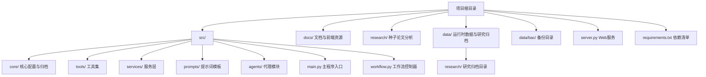
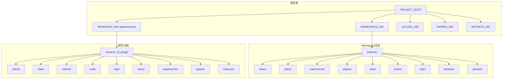
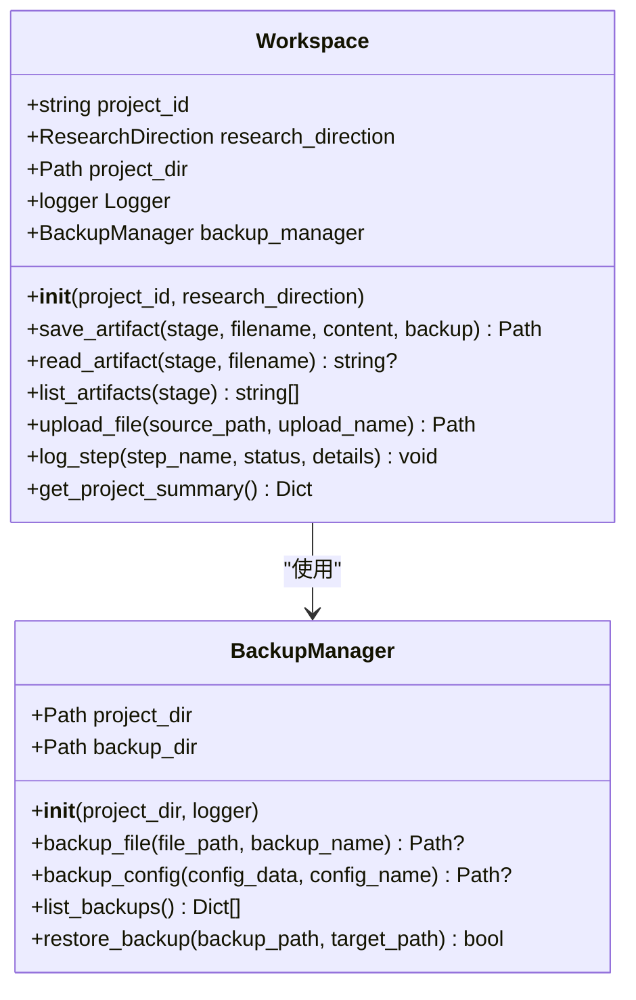
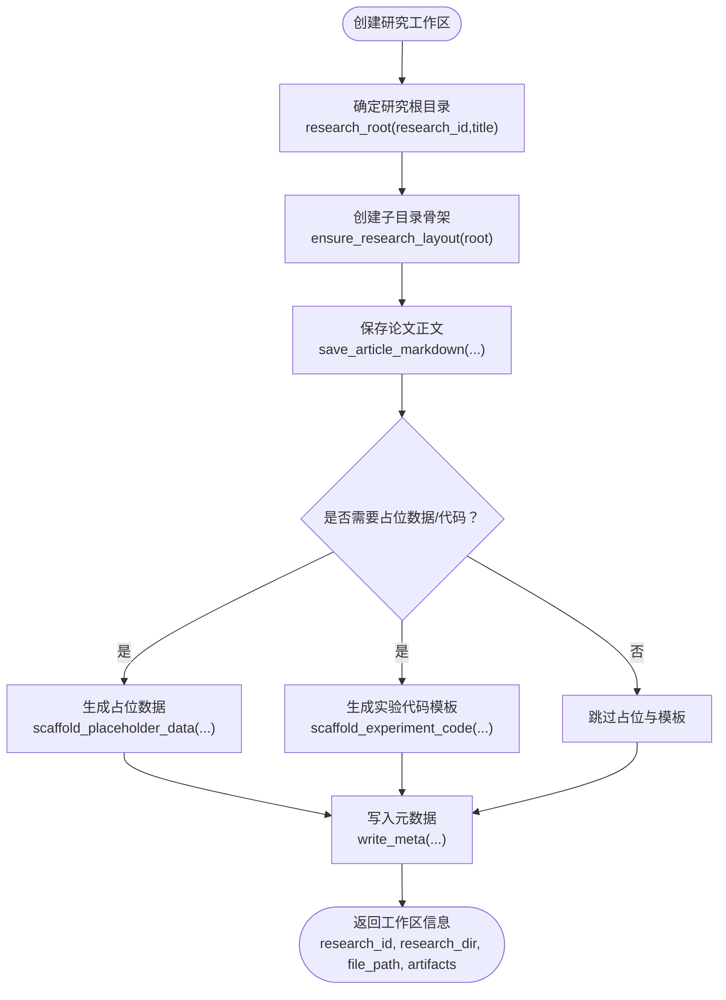
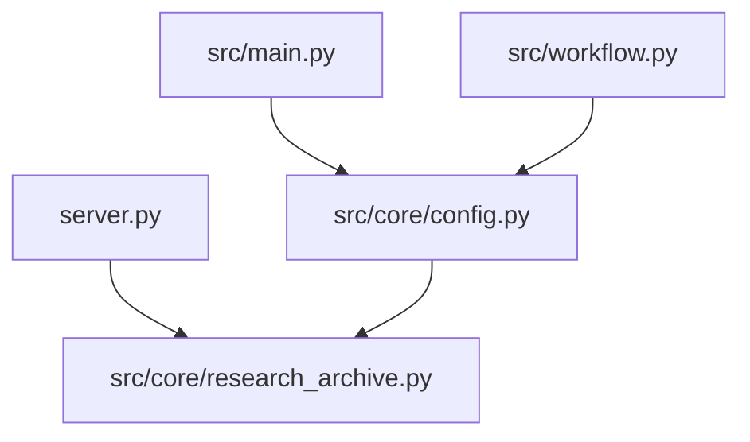

# 文件结构设计

<cite>
**本文档引用的文件**
- [src/core/config.py](file://src/core/config.py)
- [src/core/research_archive.py](file://src/core/research_archive.py)
- [src/main.py](file://src/main.py)
- [src/workflow.py](file://src/workflow.py)
- [server.py](file://server.py)
- [src/fars_research.py](file://src/fars_research.py)
- [requirements.txt](file://requirements.txt)
- [data/bac/20260620_172525/research/RS-20260620-001_Automate_Strategy_Finding_with_LLM_in_Qu/meta.json](file://data/bac/20260620_172525/research/RS-20260620-001_Automate_Strategy_Finding_with_LLM_in_Qu/meta.json)
</cite>

## 目录
1. [简介](#简介)
2. [项目结构](#项目结构)
3. [核心组件](#核心组件)
4. [架构总览](#架构总览)
5. [详细组件分析](#详细组件分析)
6. [依赖关系分析](#依赖关系分析)
7. [性能考量](#性能考量)
8. [故障排查指南](#故障排查指南)
9. [结论](#结论)
10. [附录](#附录)

## 简介
本文件结构设计文档面向paperwriterAI项目，系统阐述其文件组织与目录设计理念，重点覆盖以下方面：
- 根目录设计：WORKSPACE_DIR、PAPERS_DIR、REPORTS_DIR、UPLOAD_DIR 的职责与边界
- Workspace类的目录结构设计：projects、ideas、plans、experiments、papers、data、charts、logs、backups、uploads等子目录的功能与用途
- 文件命名规范与文件组织原则
- 工件保存机制（save_artifact）与文件备份策略
- 项目归档系统（ResearchArchive）的设计与实现
- 完整的目录树结构图与文件流转过程
- 文件操作最佳实践与注意事项
- 日志文件、备份文件与临时文件的管理策略

## 项目结构
paperwriterAI采用“根目录 + 多层子目录”的结构化组织方式，围绕“研究工作流”与“论文生成”两大主线展开。项目根目录下包含：
- 核心模块：src/core、src/tools、src/services、src/prompts、src/agents 等
- 文档与示例：docs、research
- 运行入口：src/main.py、server.py、src/workflow.py
- 数据与备份：data、data/bac（备份目录）

图表来源
- [src/core/config.py:191-201](file://src/core/config.py#L191-L201)
- [src/core/research_archive.py:25-27](file://src/core/research_archive.py#L25-L27)
- [src/main.py:18-25](file://src/main.py#L18-L25)
- [src/workflow.py:15-17](file://src/workflow.py#L15-L17)

章节来源
- [src/core/config.py:191-201](file://src/core/config.py#L191-L201)
- [src/core/research_archive.py:25-27](file://src/core/research_archive.py#L25-L27)
- [src/main.py:18-25](file://src/main.py#L18-L25)
- [src/workflow.py:15-17](file://src/workflow.py#L15-L17)

## 核心组件
本节聚焦根目录与Workspace类的目录结构设计，以及研究归档系统的文件组织。

- 根目录常量与目录创建
  - 根目录常量：PROJECT_ROOT、WORKSPACE_DIR、PAPERS_DIR、REPORTS_DIR、UPLOAD_DIR
  - 目录创建：确保上述目录存在，便于后续模块使用
  - 参考路径：[src/core/config.py:191-201](file://src/core/config.py#L191-L201)

- Workspace类的目录结构
  - 项目目录：WORKSPACE_DIR/projects/<project_id>
  - 子目录：ideas、plans、experiments、papers、data、charts、logs、backups、uploads
  - 初始化：自动创建上述子目录
  - 参考路径：[src/core/config.py:256-279](file://src/core/config.py#L256-L279)

- 研究归档系统（ResearchArchive）
  - 研究目录：data/research/{research_id}_{slug}/
  - 子目录：article、data、metrics、code、logs、ideas、experiments、graphs
  - 元数据：meta.json，记录研究ID、标题、主题、状态、父研究ID、遗留项目ID、创建时间、工件映射
  - 参考路径：[src/core/research_archive.py:4-14](file://src/core/research_archive.py#L4-L14)，[src/core/research_archive.py:29](file://src/core/research_archive.py#L29)，[src/core/research_archive.py:118-147](file://src/core/research_archive.py#L118-L147)

章节来源
- [src/core/config.py:191-201](file://src/core/config.py#L191-L201)
- [src/core/config.py:256-279](file://src/core/config.py#L256-L279)
- [src/core/research_archive.py:4-14](file://src/core/research_archive.py#L4-L14)
- [src/core/research_archive.py:29](file://src/core/research_archive.py#L29)
- [src/core/research_archive.py:118-147](file://src/core/research_archive.py#L118-L147)

## 架构总览
paperwriterAI的文件结构服务于两条主线：
- 研究工作流：Workspace负责项目生命周期内的工件管理与备份；ResearchArchive负责研究级别的统一归档与元数据管理
- 论文生成与发布：通过server.py提供Web接口，结合ResearchArchive与工作流控制器实现论文生成、编译、AI检测绕过、投稿等流程

图表来源
- [src/core/config.py:191-201](file://src/core/config.py#L191-L201)
- [src/core/config.py:256-279](file://src/core/config.py#L256-L279)
- [src/core/research_archive.py:25-27](file://src/core/research_archive.py#L25-L27)
- [src/core/research_archive.py:29](file://src/core/research_archive.py#L29)

## 详细组件分析

### Workspace类的目录结构与工件保存机制
Workspace类负责项目生命周期内的工件管理，其核心能力包括：
- 初始化项目目录：自动创建子目录（ideas、plans、experiments、papers、data、charts、logs、backups、uploads）
- 工件保存：save_artifact(stage, filename, content, backup)
  - 自动备份同名历史文件（可选）
  - 支持字符串与字典内容（字典自动序列化为JSON）
  - 返回保存路径
- 文件上传：upload_file(source_path, upload_name)
  - 自动备份同名目标文件
  - 支持任意文件类型
- 日志记录：log_step(step_name, status, details)
  - 自动生成带时间戳的日志文件
- 项目摘要：get_project_summary()
  - 汇总各阶段工件数量、备份数量、创建时间等

图表来源
- [src/core/config.py:256-384](file://src/core/config.py#L256-L384)
- [src/core/config.py:98-187](file://src/core/config.py#L98-L187)

章节来源
- [src/core/config.py:256-384](file://src/core/config.py#L256-L384)
- [src/core/config.py:98-187](file://src/core/config.py#L98-L187)

### 研究归档系统（ResearchArchive）设计与实现
ResearchArchive提供研究级别的统一归档，核心能力包括：
- 研究ID分配：allocate_research_id(papers_data, created_at)
  - 全局唯一研究编号：RS-YYYYMMDD-NNN
  - 基于日期与序列号去重
- 目录布局：ensure_research_layout(root)
  - 创建article、data、metrics、code、logs、ideas、experiments、graphs等子目录
- 元数据写入：write_meta(...)
  - 记录研究ID、paper_id、branch_id、标题、主题、状态、父研究ID、遗留项目ID、创建时间、artifacts映射
- 工件文件命名：artifact_filenames(research_id)
  - 统一命名规范：{research_id}_*.suffix
- 占位数据与实验代码生成：scaffold_placeholder_data(...)、scaffold_experiment_code(...)
  - 自动生成实验数据、指标样本、回测结果、量化代理追踪与结果、实验代码等
- 导入历史项目：import_legacy_project(...)
  - 将旧项目目录迁移至统一研究归档格式
- API工件映射：build_artifacts_record(...)、artifacts_for_api(...)

图表来源
- [src/core/research_archive.py:296-335](file://src/core/research_archive.py#L296-L335)
- [src/core/research_archive.py:107-115](file://src/core/research_archive.py#L107-L115)
- [src/core/research_archive.py:188-199](file://src/core/research_archive.py#L188-L199)
- [src/core/research_archive.py:202-254](file://src/core/research_archive.py#L202-L254)
- [src/core/research_archive.py:257-293](file://src/core/research_archive.py#L257-L293)
- [src/core/research_archive.py:318-328](file://src/core/research_archive.py#L318-L328)

章节来源
- [src/core/research_archive.py:47-83](file://src/core/research_archive.py#L47-L83)
- [src/core/research_archive.py:107-115](file://src/core/research_archive.py#L107-L115)
- [src/core/research_archive.py:118-147](file://src/core/research_archive.py#L118-L147)
- [src/core/research_archive.py:188-199](file://src/core/research_archive.py#L188-L199)
- [src/core/research_archive.py:202-254](file://src/core/research_archive.py#L202-L254)
- [src/core/research_archive.py:257-293](file://src/core/research_archive.py#L257-L293)
- [src/core/research_archive.py:296-335](file://src/core/research_archive.py#L296-L335)

### 文件命名规范与文件组织原则
- 研究归档命名
  - 目录名：{research_id}_{slug(title)}
  - 文件名：{research_id}_*.suffix（如_paper.md、_paper.tex、_experiment_data.json、_backtest_results.json、_experiment.py等）
  - 参考路径：[src/core/research_archive.py:94-104](file://src/core/research_archive.py#L94-L104)，[src/core/research_archive.py:86-87](file://src/core/research_archive.py#L86-L87)
- Workspace工件命名
  - 同阶段内文件名唯一，建议采用“任务名_时间戳_序号”或“任务名_描述”的形式，便于检索与版本控制
  - 参考路径：[src/core/config.py:280-306](file://src/core/config.py#L280-L306)
- 目录组织原则
  - 按功能域划分：article（论文）、data（数据）、metrics（指标）、code（实验代码）、logs（日志）、ideas（想法）、experiments（实验）、graphs（网络图）
  - 参考路径：[src/core/research_archive.py:29](file://src/core/research_archive.py#L29)

章节来源
- [src/core/research_archive.py:94-104](file://src/core/research_archive.py#L94-L104)
- [src/core/research_archive.py:86-87](file://src/core/research_archive.py#L86-L87)
- [src/core/config.py:280-306](file://src/core/config.py#L280-L306)
- [src/core/research_archive.py:29](file://src/core/research_archive.py#L29)

### 工件保存机制（save_artifact）与文件备份策略
- 工件保存（Workspace.save_artifact）
  - 自动备份同名历史文件（可配置）
  - 支持字符串与字典内容（字典自动序列化为JSON）
  - 返回保存路径
  - 参考路径：[src/core/config.py:280-306](file://src/core/config.py#L280-L306)
- 备份管理（BackupManager）
  - 备份文件：backup_file(file_path, backup_name)
  - 备份配置：backup_config(config_data, config_name)
  - 列出备份：list_backups()
  - 恢复备份：restore_backup(backup_path, target_path)
  - 参考路径：[src/core/config.py:98-187](file://src/core/config.py#L98-L187)
- 日志记录（Workspace.log_step）
  - 自动生成带时间戳的日志文件，便于追踪工作流步骤
  - 参考路径：[src/core/config.py:368-383](file://src/core/config.py#L368-L383)

章节来源
- [src/core/config.py:280-306](file://src/core/config.py#L280-L306)
- [src/core/config.py:98-187](file://src/core/config.py#L98-L187)
- [src/core/config.py:368-383](file://src/core/config.py#L368-L383)

### 项目归档系统（ResearchArchive）的设计与实现
- 统一研究编号与目录命名
  - allocate_research_id：全局唯一研究编号，基于日期与序列号
  - research_folder_name：将标题转为目录安全的slug
  - research_root：定位研究根目录
  - 参考路径：[src/core/research_archive.py:47-72](file://src/core/research_archive.py#L47-L72)，[src/core/research_archive.py:86-91](file://src/core/research_archive.py#L86-L91)
- 元数据与工件映射
  - write_meta：写入meta.json，包含研究ID、paper_id、branch_id、标题、主题、状态、父研究ID、遗留项目ID、创建时间、artifacts映射
  - build_artifacts_record：构建相对项目根路径的artifacts映射（供API/前端使用）
  - artifacts_for_api：返回供前端下载的URL路径（相对于站点根）
  - 参考路径：[src/core/research_archive.py:118-147](file://src/core/research_archive.py#L118-L147)，[src/core/research_archive.py:150-172](file://src/core/research_archive.py#L150-L172)，[src/core/research_archive.py:175-185](file://src/core/research_archive.py#L175-L185)
- 占位数据与实验代码生成
  - scaffold_placeholder_data：生成实验数据、指标样本、回测结果、量化代理追踪与结果等占位文件
  - scaffold_experiment_code：基于模板生成实验代码，并注入MongoDB配置与研究信息
  - 参考路径：[src/core/research_archive.py:202-254](file://src/core/research_archive.py#L202-L254)，[src/core/research_archive.py:257-293](file://src/core/research_archive.py#L257-L293)
- 历史项目导入
  - import_legacy_project：将旧项目目录导入统一研究档案，复制文章、数据、指标、代码、日志与想法等文件
  - 参考路径：[src/core/research_archive.py:346-427](file://src/core/research_archive.py#L346-L427)

章节来源
- [src/core/research_archive.py:47-72](file://src/core/research_archive.py#L47-L72)
- [src/core/research_archive.py:86-91](file://src/core/research_archive.py#L86-L91)
- [src/core/research_archive.py:118-147](file://src/core/research_archive.py#L118-L147)
- [src/core/research_archive.py:150-172](file://src/core/research_archive.py#L150-L172)
- [src/core/research_archive.py:175-185](file://src/core/research_archive.py#L175-L185)
- [src/core/research_archive.py:202-254](file://src/core/research_archive.py#L202-L254)
- [src/core/research_archive.py:257-293](file://src/core/research_archive.py#L257-L293)
- [src/core/research_archive.py:346-427](file://src/core/research_archive.py#L346-L427)

### 目录树结构图与文件流转过程
- 目录树结构（示例）
  - data/research/{research_id}_{slug}/
    - meta.json
    - article/{research_id}_paper.md
    - data/{research_id}_experiment_data.json
    - data/{research_id}_indicator_sample.json
    - metrics/{research_id}_backtest_results.json
    - code/{research_id}_experiment.py
    - logs/
    - ideas/
    - experiments/
    - graphs/
  - 参考路径：[src/core/research_archive.py:4-14](file://src/core/research_archive.py#L4-L14)，[src/core/research_archive.py:29](file://src/core/research_archive.py#L29)

- 文件流转过程（示例）
  - 生成论文正文：save_article_markdown(...)
  - 生成占位数据与指标：scaffold_placeholder_data(...)
  - 生成实验代码：scaffold_experiment_code(...)
  - 写入元数据：write_meta(...)
  - 返回API可用的工件映射：artifacts_for_api(...)
  - 参考路径：[src/core/research_archive.py:188-199](file://src/core/research_archive.py#L188-L199)，[src/core/research_archive.py:202-254](file://src/core/research_archive.py#L202-L254)，[src/core/research_archive.py:257-293](file://src/core/research_archive.py#L257-L293)，[src/core/research_archive.py:318-328](file://src/core/research_archive.py#L318-L328)，[src/core/research_archive.py:175-185](file://src/core/research_archive.py#L175-L185)

章节来源
- [src/core/research_archive.py:4-14](file://src/core/research_archive.py#L4-L14)
- [src/core/research_archive.py:29](file://src/core/research_archive.py#L29)
- [src/core/research_archive.py:188-199](file://src/core/research_archive.py#L188-L199)
- [src/core/research_archive.py:202-254](file://src/core/research_archive.py#L202-L254)
- [src/core/research_archive.py:257-293](file://src/core/research_archive.py#L257-L293)
- [src/core/research_archive.py:318-328](file://src/core/research_archive.py#L318-L328)
- [src/core/research_archive.py:175-185](file://src/core/research_archive.py#L175-L185)

### 文件操作最佳实践与注意事项
- 工件保存
  - 使用save_artifact统一保存，启用备份可避免覆盖重要历史版本
  - 对于大文件或二进制文件，建议使用专门的存储方案或压缩后再保存
  - 参考路径：[src/core/config.py:280-306](file://src/core/config.py#L280-L306)
- 备份策略
  - 使用BackupManager定期备份关键配置与工件
  - 备份文件名包含时间戳，便于追溯
  - 参考路径：[src/core/config.py:107-132](file://src/core/config.py#L107-L132)
- 日志与监控
  - 使用Workspace.log_step记录关键步骤，便于问题定位
  - 参考路径：[src/core/config.py:368-383](file://src/core/config.py#L368-L383)
- 命名规范
  - 研究归档采用统一命名规范，避免特殊字符与过长文件名
  - 参考路径：[src/core/research_archive.py:94-104](file://src/core/research_archive.py#L94-L104)
- 历史项目迁移
  - 使用import_legacy_project导入旧项目，确保元数据与工件完整性
  - 参考路径：[src/core/research_archive.py:346-427](file://src/core/research_archive.py#L346-L427)

章节来源
- [src/core/config.py:280-306](file://src/core/config.py#L280-L306)
- [src/core/config.py:107-132](file://src/core/config.py#L107-L132)
- [src/core/config.py:368-383](file://src/core/config.py#L368-L383)
- [src/core/research_archive.py:94-104](file://src/core/research_archive.py#L94-L104)
- [src/core/research_archive.py:346-427](file://src/core/research_archive.py#L346-L427)

### 日志文件、备份文件与临时文件的管理策略
- 日志文件
  - Workspace.setup_logging：自动创建logs目录并输出控制台与文件日志
  - 参考路径：[src/core/config.py:62-95](file://src/core/config.py#L62-L95)
- 备份文件
  - BackupManager：自动在backups目录下生成带时间戳的备份文件
  - 参考路径：[src/core/config.py:107-132](file://src/core/config.py#L107-L132)
- 临时文件
  - 项目内临时文件建议放置在logs或backups目录，便于清理与归档
  - 参考路径：[src/core/config.py:276](file://src/core/config.py#L276)

章节来源
- [src/core/config.py:62-95](file://src/core/config.py#L62-L95)
- [src/core/config.py:107-132](file://src/core/config.py#L107-L132)
- [src/core/config.py:276](file://src/core/config.py#L276)

## 依赖关系分析
- 根目录与模块依赖
  - src/main.py依赖src/core/config.py中的Workspace、BackupManager、配置加载等
  - server.py依赖src/core/research_archive.py中的研究归档函数
  - src/workflow.py依赖src/core/config.py中的WORKSPACE_DIR与ResearchDirection
  - 参考路径：[src/main.py:22-30](file://src/main.py#L22-L30)，[server.py:32-45](file://server.py#L32-L45)，[src/workflow.py:17](file://src/workflow.py#L17)

图表来源
- [src/main.py:22-30](file://src/main.py#L22-L30)
- [server.py:32-45](file://server.py#L32-L45)
- [src/workflow.py:17](file://src/workflow.py#L17)

章节来源
- [src/main.py:22-30](file://src/main.py#L22-L30)
- [server.py:32-45](file://server.py#L32-L45)
- [src/workflow.py:17](file://src/workflow.py#L17)

## 性能考量
- 目录层级与IO开销
  - 研究归档采用两级目录（data/research/{research_id}_{slug}），减少单目录文件数量，提升IO性能
  - 参考路径：[src/core/research_archive.py:25-27](file://src/core/research_archive.py#L25-L27)
- 备份策略
  - 备份文件包含时间戳，便于快速定位与恢复，避免频繁全量备份
  - 参考路径：[src/core/config.py:121-123](file://src/core/config.py#L121-L123)
- 日志与监控
  - 控制台与文件双通道日志，便于生产环境监控与问题定位
  - 参考路径：[src/core/config.py:70-95](file://src/core/config.py#L70-L95)

## 故障排查指南
- 研究归档元数据缺失
  - 检查meta.json是否存在与完整性，必要时重新写入write_meta(...)
  - 参考路径：[src/core/research_archive.py:118-147](file://src/core/research_archive.py#L118-L147)
- 工件映射异常
  - 使用build_artifacts_record与artifacts_for_api校验工件路径
  - 参考路径：[src/core/research_archive.py:150-172](file://src/core/research_archive.py#L150-L172)，[src/core/research_archive.py:175-185](file://src/core/research_archive.py#L175-L185)
- 备份与恢复
  - 使用BackupManager.list_backups()查看备份列表，restore_backup()恢复指定备份
  - 参考路径：[src/core/config.py:157-168](file://src/core/config.py#L157-L168)，[src/core/config.py:170-186](file://src/core/config.py#L170-L186)
- 历史项目导入失败
  - 检查import_legacy_project的源目录与目标目录权限，确保文件存在
  - 参考路径：[src/core/research_archive.py:346-427](file://src/core/research_archive.py#L346-L427)

章节来源
- [src/core/research_archive.py:118-147](file://src/core/research_archive.py#L118-L147)
- [src/core/research_archive.py:150-172](file://src/core/research_archive.py#L150-L172)
- [src/core/research_archive.py:175-185](file://src/core/research_archive.py#L175-L185)
- [src/core/config.py:157-168](file://src/core/config.py#L157-L168)
- [src/core/config.py:170-186](file://src/core/config.py#L170-L186)
- [src/core/research_archive.py:346-427](file://src/core/research_archive.py#L346-L427)

## 结论
paperwriterAI的文件结构设计围绕“研究归档”与“项目工件管理”两大核心，通过统一的研究编号、规范的命名与目录组织，实现了可追溯、可备份、可迁移的研究数据管理。Workspace与ResearchArchive协同工作，既满足日常开发与实验的灵活性，又保证了研究成果的长期保存与版本演进。配合完善的日志与备份策略，项目具备良好的可维护性与可扩展性。

## 附录
- 示例元数据文件
  - [data/bac/20260620_172525/research/RS-20260620-001_Automate_Strategy_Finding_with_LLM_in_Qu/meta.json](file://data/bac/20260620_172525/research/RS-20260620-001_Automate_Strategy_Finding_with_LLM_in_Qu/meta.json)
- 依赖清单
  - [requirements.txt](file://requirements.txt)