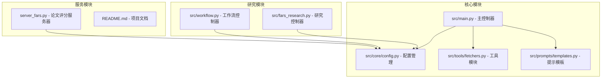
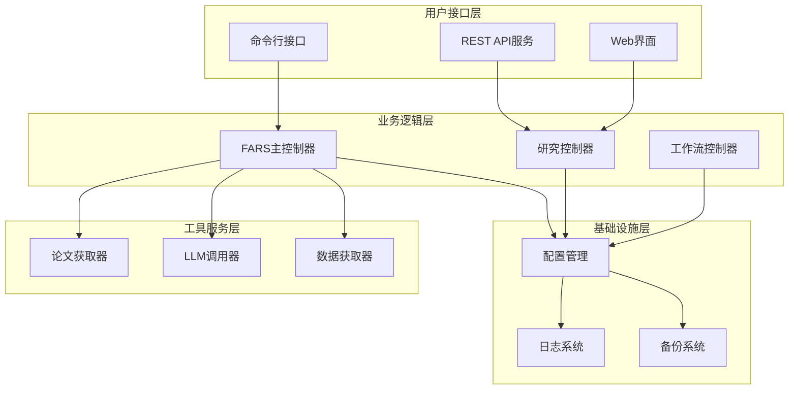
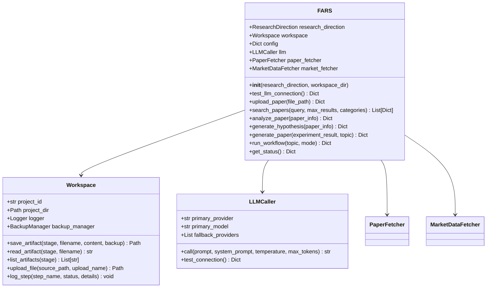
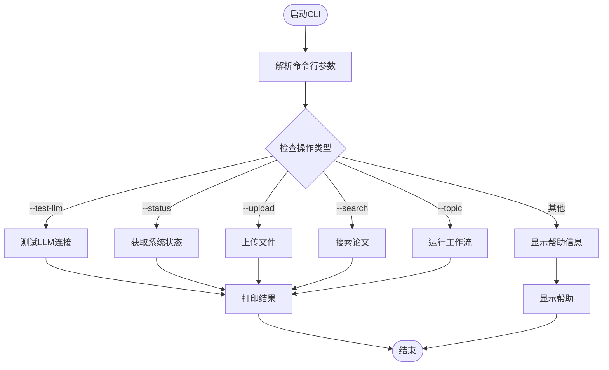
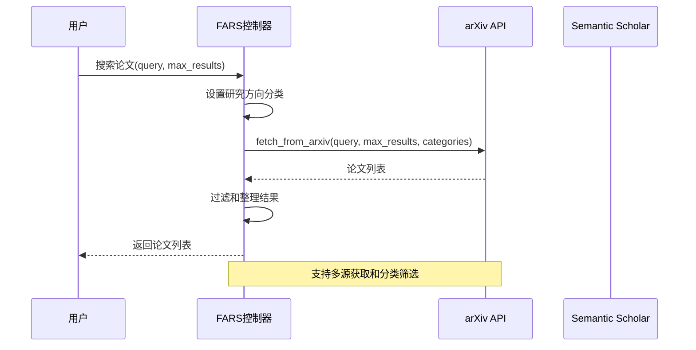
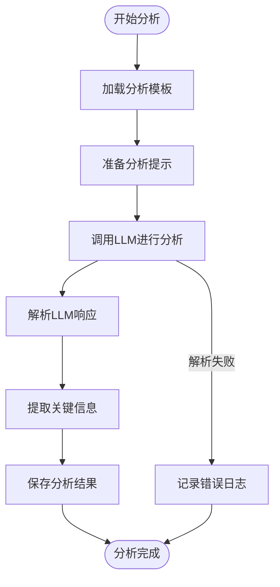
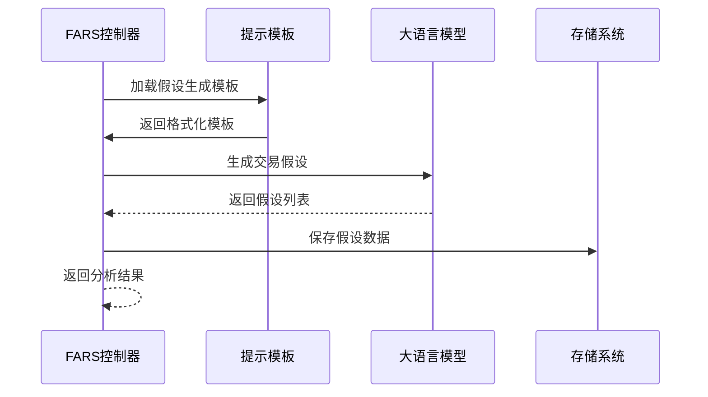
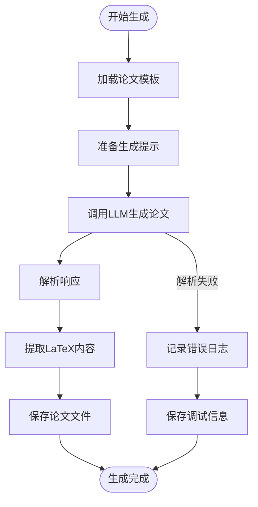
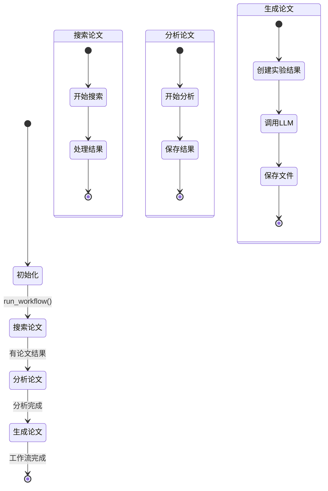
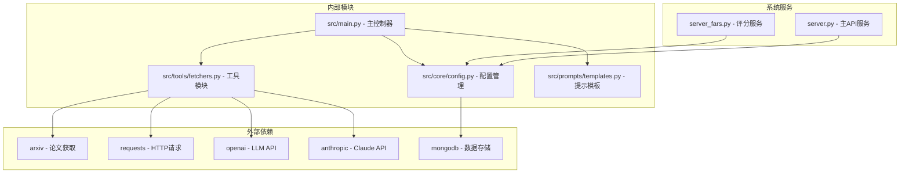

# FARS主控制器

<cite>
**本文档引用的文件**
- [src/main.py](file://src/main.py)
- [src/core/config.py](file://src/core/config.py)
- [src/tools/fetchers.py](file://src/tools/fetchers.py)
- [src/prompts/templates.py](file://src/prompts/templates.py)
- [src/fars_research.py](file://src/fars_research.py)
- [src/workflow.py](file://src/workflow.py)
- [server_fars.py](file://server_fars.py)
- [README.md](file://README.md)
</cite>

## 目录
1. [简介](#简介)
2. [项目结构](#项目结构)
3. [核心组件](#核心组件)
4. [架构概览](#架构概览)
5. [详细组件分析](#详细组件分析)
6. [依赖关系分析](#依赖关系分析)
7. [性能考虑](#性能考虑)
8. [故障排除指南](#故障排除指南)
9. [结论](#结论)

## 简介

FARS（Fully Automated Research System）是一个基于大语言模型的全自动学术论文生成系统，专注于量化交易与金融科技领域。该系统从种子论文出发，构建多代理协作的研究流水线，循环产出高质量学术论文。

系统采用模块化设计，包含四个核心代理（Ideation、Planning、Experiment、Writing）和完整的质量控制流水线。通过断点续分析机制和优雅降级策略，确保研究过程的稳定性和可靠性。

## 项目结构

FARS项目采用清晰的模块化架构，主要包含以下核心模块：

**图表来源**
- [src/main.py:1-521](file://src/main.py#L1-L521)
- [src/core/config.py:1-563](file://src/core/config.py#L1-L563)

**章节来源**
- [README.md:420-500](file://README.md#L420-L500)

## 核心组件

### FARS主控制器

FARS主控制器是整个系统的核心，负责协调各个组件的工作。其主要职责包括：

- **初始化管理**：配置研究方向、工作空间和LLM调用器
- **工作流控制**：执行完整的论文生成流程
- **CLI接口**：提供命令行参数解析和用户交互
- **错误处理**：统一的异常捕获和日志记录

### 配置管理系统

配置管理系统提供了完整的系统配置管理功能：

- **研究方向定义**：支持量化金融、计算机视觉、强化学习三种研究方向
- **工作空间管理**：自动创建和管理项目工作目录
- **日志系统**：双通道日志记录（控制台和文件）
- **备份管理**：自动文件备份和恢复机制

### 工具模块

工具模块包含多个实用工具类：

- **PaperFetcher**：论文获取和解析工具
- **MarketDataFetcher**：市场数据获取工具  
- **LLMCaller**：大语言模型调用器，支持多Provider自动切换

**章节来源**
- [src/main.py:35-438](file://src/main.py#L35-L438)
- [src/core/config.py:18-563](file://src/core/config.py#L18-L563)
- [src/tools/fetchers.py:20-800](file://src/tools/fetchers.py#L20-L800)

## 架构概览

FARS系统采用分层架构设计，从底层基础设施到顶层应用服务形成完整的生态系统：

**图表来源**
- [src/main.py:443-521](file://src/main.py#L443-L521)
- [src/fars_research.py:335-484](file://src/fars_research.py#L335-L484)
- [src/workflow.py:19-286](file://src/workflow.py#L19-L286)

## 详细组件分析

### FARS主控制器类分析

FARS主控制器采用面向对象设计，提供了完整的论文生成生命周期管理：

**图表来源**
- [src/main.py:35-438](file://src/main.py#L35-L438)
- [src/core/config.py:256-384](file://src/core/config.py#L256-L384)
- [src/tools/fetchers.py:290-800](file://src/tools/fetchers.py#L290-L800)

#### 初始化过程

FARS控制器的初始化过程包含多个关键步骤：

1. **研究方向配置**：根据传入的研究方向参数设置系统配置
2. **工作空间创建**：初始化项目工作目录和相关子目录
3. **LLM配置**：设置主Provider和备用Provider配置
4. **工具初始化**：创建论文获取器和市场数据获取器实例

#### CLI接口实现

系统提供了丰富的命令行接口，支持多种操作模式：

**图表来源**
- [src/main.py:443-521](file://src/main.py#L443-L521)

**章节来源**
- [src/main.py:35-521](file://src/main.py#L35-L521)

### 论文搜索功能

论文搜索功能实现了多源论文获取和智能筛选：

**图表来源**
- [src/main.py:170-196](file://src/main.py#L170-L196)
- [src/tools/fetchers.py:27-74](file://src/tools/fetchers.py#L27-L74)

#### 搜索算法逻辑

论文搜索采用智能分类策略：

1. **研究方向适配**：根据不同的研究方向自动调整默认分类
2. **多源获取**：同时从arXiv和Semantic Scholar获取论文
3. **智能筛选**：基于分类标签进行精确匹配
4. **结果排序**：按照提交时间倒序排列

**章节来源**
- [src/main.py:170-196](file://src/main.py#L170-L196)
- [src/tools/fetchers.py:27-121](file://src/tools/fetchers.py#L27-L121)

### 论文分析功能

论文分析功能负责深度解析学术论文并提取关键信息：

**图表来源**
- [src/main.py:198-235](file://src/main.py#L198-L235)
- [src/prompts/templates.py:88-155](file://src/prompts/templates.py#L88-L155)

#### 分析流程详解

论文分析包含五个关键分析维度：

1. **方法论提取**：识别核心方法和技术路线
2. **关键发现**：提取3-5个核心研究发现
3. **因子分析**：提取可编程的因子表达式
4. **研究局限**：识别论文的假设和限制条件
5. **创新点评估**：分析相对于传统方法的创新性

**章节来源**
- [src/main.py:198-235](file://src/main.py#L198-L235)
- [src/prompts/templates.py:88-155](file://src/prompts/templates.py#L88-L155)

### 假设生成功能

假设生成功能从论文中提取可量化的交易逻辑：

**图表来源**
- [src/main.py:237-277](file://src/main.py#L237-L277)
- [src/prompts/templates.py:28-85](file://src/prompts/templates.py#L28-L85)

#### 假设生成算法

假设生成遵循严格的结构化流程：

1. **论文理解**：深入分析论文的核心发现和方法论
2. **逻辑提取**：将可量化的内容转化为数学公式
3. **多角度生成**：生成多个候选假设确保创新性
4. **质量评估**：评估每个假设的预期效果和风险

**章节来源**
- [src/main.py:237-277](file://src/main.py#L237-L277)
- [src/prompts/templates.py:28-85](file://src/prompts/templates.py#L28-L85)

### 论文生成功能

论文生成功能负责创建完整的学术论文：

**图表来源**
- [src/main.py:279-351](file://src/main.py#L279-L351)
- [src/prompts/templates.py:357-389](file://src/prompts/templates.py#L357-L389)

#### 论文生成流程

论文生成采用严格的学术规范：

1. **模板应用**：使用标准的ICML格式模板
2. **内容生成**：生成完整的论文章节内容
3. **格式规范**：确保LaTeX格式的正确性
4. **质量控制**：包含参考文献和图表需求

**章节来源**
- [src/main.py:279-351](file://src/main.py#L279-L351)
- [src/prompts/templates.py:357-389](file://src/prompts/templates.py#L357-L389)

### 工作流管理

工作流管理提供了完整的论文生成生命周期：

**图表来源**
- [src/main.py:353-427](file://src/main.py#L353-L427)

#### 工作流执行策略

工作流支持多种执行模式：

1. **完整模式**：执行所有步骤（搜索→分析→生成）
2. **搜索模式**：仅执行论文搜索
3. **分析模式**：执行搜索和分析
4. **生成模式**：跳过搜索，直接生成论文

**章节来源**
- [src/main.py:353-427](file://src/main.py#L353-L427)

## 依赖关系分析

FARS系统采用了清晰的依赖层次结构：

**图表来源**
- [src/main.py:22-31](file://src/main.py#L22-L31)
- [src/tools/fetchers.py:1-17](file://src/tools/fetchers.py#L1-L17)

### 组件耦合分析

系统采用了松耦合的设计原则：

- **低耦合高内聚**：每个模块职责明确，接口清晰
- **依赖注入**：通过构造函数注入依赖，便于测试和维护
- **接口抽象**：工具类通过抽象接口提供统一的使用体验

**章节来源**
- [src/main.py:22-31](file://src/main.py#L22-L31)
- [src/core/config.py:256-384](file://src/core/config.py#L256-L384)

## 性能考虑

### LLM调用优化

系统实现了多Provider自动切换机制：

- **主Provider优先**：优先使用配置的主Provider
- **备用Provider**：在主Provider失败时自动切换
- **降级策略**：支持本地Ollama模型作为最终备用
- **错误恢复**：记录失败原因，便于问题诊断

### 文件处理优化

- **异步处理**：支持并发文件上传和处理
- **增量备份**：只备份变更的文件，减少存储占用
- **缓存机制**：论文搜索结果和分析结果的本地缓存

### 内存管理

- **流式处理**：大文件处理采用流式读取
- **资源清理**：及时释放不再使用的资源
- **垃圾回收**：合理使用Python的垃圾回收机制

## 故障排除指南

### 常见问题及解决方案

#### LLM连接问题

**问题症状**：LLM调用失败，返回连接错误

**解决方案**：
1. 检查API密钥配置
2. 验证网络连接
3. 查看备用Provider配置
4. 检查API配额限制

#### 文件上传问题

**问题症状**：文件上传失败或文件损坏

**解决方案**：
1. 验证文件路径和权限
2. 检查磁盘空间
3. 确认文件格式支持
4. 查看备份文件恢复

#### 论文生成问题

**问题症状**：论文生成失败或格式错误

**解决方案**：
1. 检查LLM响应解析
2. 验证模板完整性
3. 查看调试文件
4. 检查LaTeX编译环境

**章节来源**
- [src/main.py:88-100](file://src/main.py#L88-L100)
- [src/main.py:102-168](file://src/main.py#L102-L168)
- [src/main.py:279-351](file://src/main.py#L279-L351)

### 日志分析

系统提供了多层次的日志记录：

- **控制台日志**：实时显示关键信息
- **文件日志**：详细的操作记录
- **错误日志**：异常情况的完整堆栈跟踪
- **性能日志**：调用耗时和资源使用情况

**章节来源**
- [src/core/config.py:62-95](file://src/core/config.py#L62-L95)
- [src/tools/fetchers.py:324-390](file://src/tools/fetchers.py#L324-L390)

## 结论

FARS主控制器是一个设计精良的全自动研究系统，具有以下特点：

### 技术优势

1. **模块化设计**：清晰的分层架构和职责分离
2. **容错机制**：完善的错误处理和恢复策略
3. **扩展性强**：支持多Provider和多研究方向
4. **用户体验**：友好的CLI接口和详细的日志系统

### 应用价值

- **学术研究**：自动化论文生成，提高研究效率
- **教育用途**：作为教学案例展示AI应用
- **商业价值**：可扩展为企业级研究平台

### 发展前景

系统具备良好的扩展基础，可以进一步集成：
- 更多的LLM Provider
- 更丰富的研究方向
- 更强大的质量控制工具
- 更智能的论文评审系统

通过持续的优化和扩展，FARS系统有望成为学术界和工业界都认可的优秀工具。