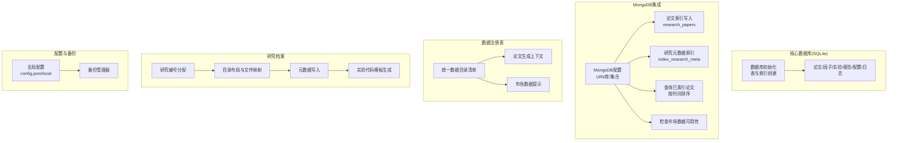
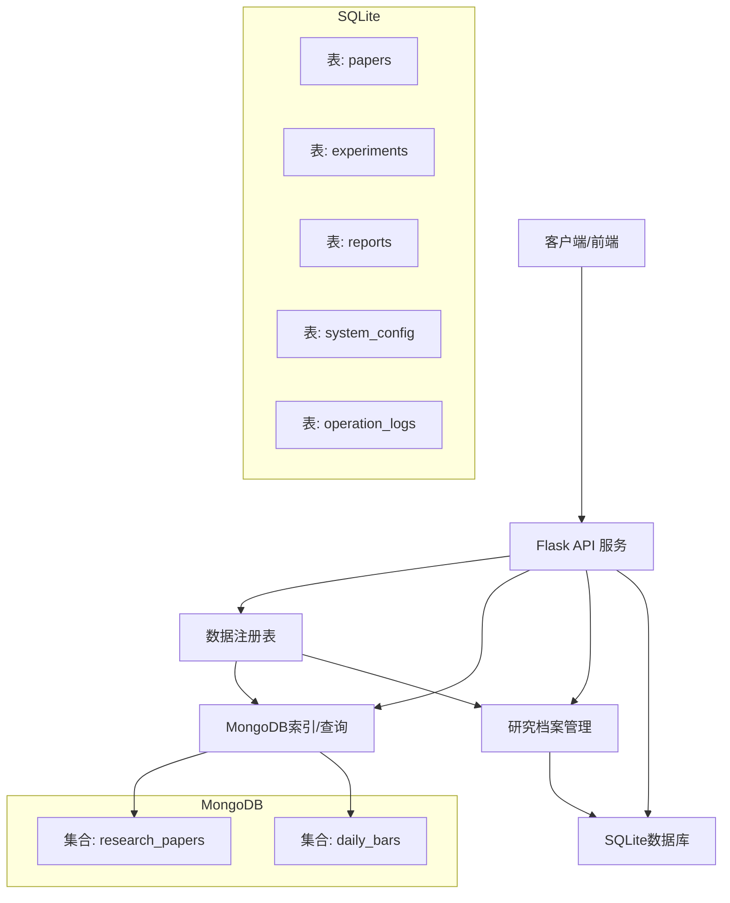
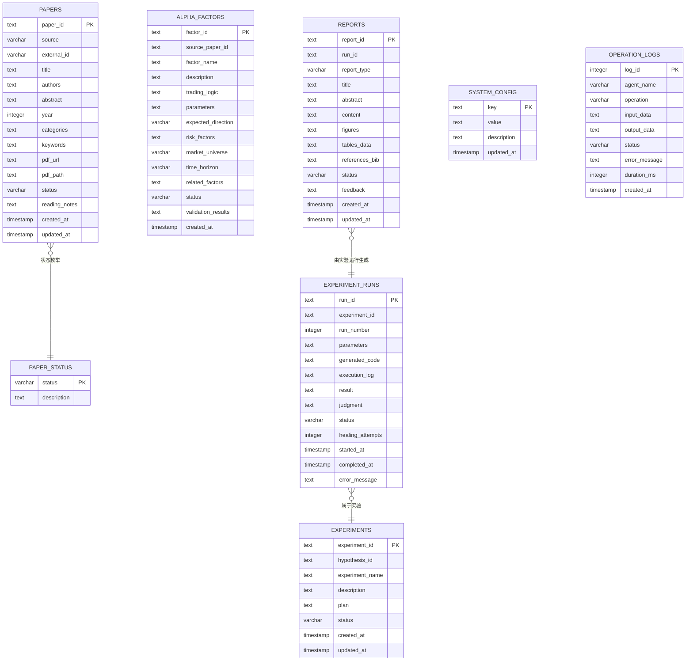
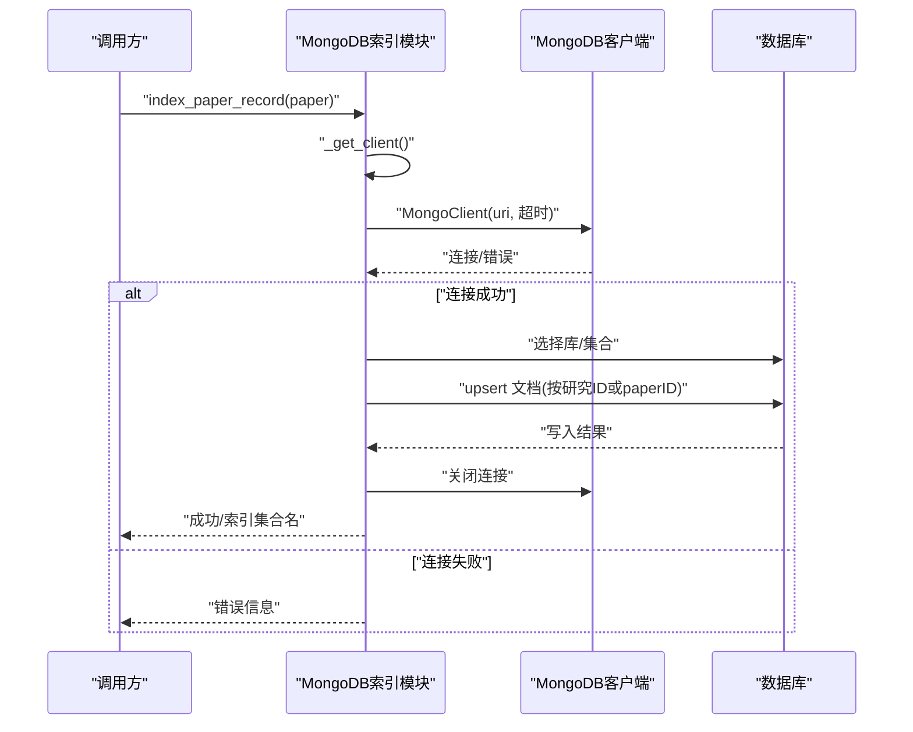
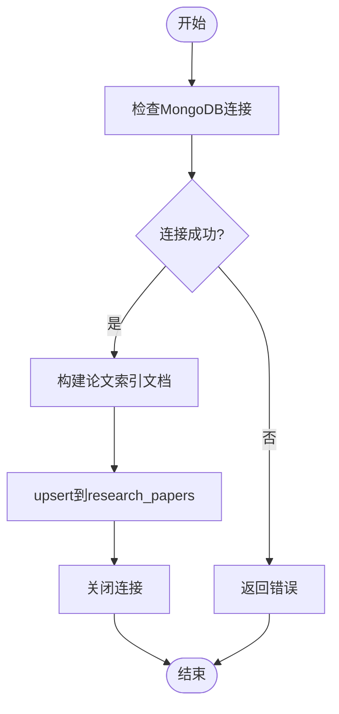
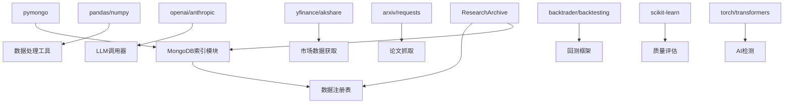

# 数据库管理

<cite>
**本文档引用的文件**
- [src/core/database.py](file://src/core/database.py)
- [src/core/mongo_index.py](file://src/core/mongo_index.py)
- [src/core/data_registry.py](file://src/core/data_registry.py)
- [src/core/config.py](file://src/core/config.py)
- [src/core/research_archive.py](file://src/core/research_archive.py)
- [src/main.py](file://src/main.py)
- [server.py](file://server.py)
- [src/tools/fetchers.py](file://src/tools/fetchers.py)
- [requirements.txt](file://requirements.txt)
- [config.json](file://config.json)
- [config.local.json](file://config.local.json)
</cite>

## 目录
1. [简介](#简介)
2. [项目结构](#项目结构)
3. [核心组件](#核心组件)
4. [架构总览](#架构总览)
5. [详细组件分析](#详细组件分析)
6. [依赖关系分析](#依赖关系分析)
7. [性能考虑](#性能考虑)
8. [故障排除指南](#故障排除指南)
9. [结论](#结论)
10. [附录](#附录)

## 简介
本文件面向数据库管理系统，围绕论文记录、实验结果、用户数据等实体关系展开，系统性阐述以下内容：
- 数据库设计与数据模型：涵盖 SQLite 表结构、MongoDB 研究索引与市场数据集合、以及研究档案元数据组织。
- MongoDB 集成实现：连接管理、查询优化、索引策略与可用性检查。
- 数据持久化机制：存储、检索、更新、删除的流程与最佳实践。
- 数据迁移与备份策略：数据完整性保障、版本升级处理与历史归档。
- 性能监控与故障排除：日志记录、LLM 调用统计、错误追踪与恢复建议。
- 与其他系统的数据交换与集成：配置中心、外部数据源与实验代码的数据对接。

## 项目结构
该项目采用“功能分层 + 模块化”的组织方式，数据库相关能力主要分布在核心模块与服务层：
- 核心数据库：SQLite 初始化与表结构定义（论文、状态枚举、因子、实验、实验运行、报告、系统配置、操作日志）。
- MongoDB 索引与查询：论文与研究档案元数据索引、市场数据可用性检查。
- 数据注册表：统一暴露数据位置、配置与上下文，供前后端与生成逻辑使用。
- 研究档案管理：研究编号分配、目录布局、元数据写入与实验代码模板生成。
- 配置与备份：全局配置、环境变量覆盖、备份管理器。
- 服务与工具：论文抓取、市场数据获取、LLM 调用与日志记录。

图表来源
- [src/core/database.py:23-189](file://src/core/database.py#L23-L189)
- [src/core/mongo_index.py:30-116](file://src/core/mongo_index.py#L30-L116)
- [src/core/data_registry.py:38-97](file://src/core/data_registry.py#L38-L97)
- [src/core/research_archive.py:47-335](file://src/core/research_archive.py#L47-L335)
- [src/core/config.py:388-514](file://src/core/config.py#L388-L514)

章节来源
- [src/core/database.py:23-189](file://src/core/database.py#L23-L189)
- [src/core/mongo_index.py:30-116](file://src/core/mongo_index.py#L30-L116)
- [src/core/data_registry.py:38-97](file://src/core/data_registry.py#L38-L97)
- [src/core/research_archive.py:47-335](file://src/core/research_archive.py#L47-L335)
- [src/core/config.py:388-514](file://src/core/config.py#L388-L514)

## 核心组件
本节聚焦数据库与数据集成的关键组件及其职责：
- SQLite 数据库初始化与表结构：负责论文、因子、实验、实验运行、报告、系统配置、操作日志等表的创建与索引建立。
- MongoDB 索引与查询：提供论文记录索引、研究元数据索引、论文查询与市场数据可用性检查。
- 数据注册表：统一暴露数据目录、MongoDB 配置、工作流状态、种子论文清单与研究档案列表。
- 研究档案管理：研究编号分配、目录骨架、元数据写入、占位数据与实验代码模板生成。
- 配置与备份：全局配置加载与合并、备份管理器、日志系统。
- 服务与工具：论文抓取、市场数据获取、LLM 调用与日志记录。

章节来源
- [src/core/database.py:23-189](file://src/core/database.py#L23-L189)
- [src/core/mongo_index.py:30-116](file://src/core/mongo_index.py#L30-L116)
- [src/core/data_registry.py:38-97](file://src/core/data_registry.py#L38-L97)
- [src/core/research_archive.py:47-335](file://src/core/research_archive.py#L47-L335)
- [src/core/config.py:388-514](file://src/core/config.py#L388-L514)

## 架构总览
数据库与数据集成的整体架构如下：
- SQLite 用于系统内部结构化数据存储（论文、实验、配置、日志），提供稳定的事务与查询能力。
- MongoDB 用于论文与研究档案元数据的快速检索与市场数据的高效访问，配合索引策略提升查询性能。
- 数据注册表统一对外暴露数据位置与配置，便于前端与生成逻辑使用。
- 研究档案管理模块负责研究编号、目录布局与元数据写入，确保每次研究产出的可追溯性。
- 配置与备份模块提供灵活的配置加载与数据备份能力，保障系统稳定性与可恢复性。

图表来源
- [server.py:48-57](file://server.py#L48-L57)
- [src/core/mongo_index.py:38-45](file://src/core/mongo_index.py#L38-L45)
- [src/core/data_registry.py:38-45](file://src/core/data_registry.py#L38-L45)
- [src/core/research_archive.py:308-335](file://src/core/research_archive.py#L308-L335)
- [src/core/database.py:23-189](file://src/core/database.py#L23-L189)

## 详细组件分析

### SQLite 数据库设计与数据模型
- 表结构概览
  - 论文表：存储论文元信息、状态、阅读笔记与时间戳。
  - 论文状态枚举表：维护状态值与描述。
  - Alpha 因子表：存储因子定义、参数、预期方向、风险因素、市场范围、时间跨度、关联因子、验证结果与创建时间。
  - 实验表：存储实验计划、描述、状态与时间戳。
  - 实验运行记录表：存储每次运行的参数、生成代码、执行日志、结果、判断、状态、修复尝试次数、起止时间与错误信息。
  - 报告表：存储报告类型、标题、摘要、内容、图表、表格数据、参考文献、状态、反馈与时间戳。
  - 系统配置表：键值对配置与更新时间。
  - 操作日志表：记录 Agent 操作、输入输出、状态、错误消息、耗时与时间戳。
- 索引策略
  - 在论文表上按来源、年份、状态建立索引；在因子表上按状态与市场范围建立索引；在实验表上按状态与假设建立索引；在实验运行记录表上按实验 ID 与状态建立索引；在报告表上按状态与类型建立索引；在操作日志表上按 Agent 与创建时间建立索引。
- 示例数据播种：插入示例论文与系统配置，便于演示与测试。

图表来源
- [src/core/database.py:28-138](file://src/core/database.py#L28-L138)

章节来源
- [src/core/database.py:23-189](file://src/core/database.py#L23-L189)

### MongoDB 集成实现
- 连接管理
  - 通过配置中心读取 MongoDB URI、数据库名与集合名，使用超时设置进行连接与 ping 检测，异常时返回错误信息。
- 论文索引写入
  - 将论文记录转换为标准化文档，包含研究 ID、分支 ID、标题、主题、状态、质量分数、文件路径、研究目录、制品映射、生成模式与时间戳，并以 upsert 方式写入 research_papers 集合。
- 研究元数据索引
  - 读取研究档案 meta.json，构造论文样式的文档并调用论文索引函数。
- 查询与可用性检查
  - 查询已索引论文，按 indexed_at 倒序返回；检查市场数据集合是否存在与样本键结构，返回可用性与文档计数。

图表来源
- [src/core/mongo_index.py:15-60](file://src/core/mongo_index.py#L15-L60)

章节来源
- [src/core/mongo_index.py:30-116](file://src/core/mongo_index.py#L30-L116)
- [src/core/data_registry.py:38-45](file://src/core/data_registry.py#L38-L45)

### 数据持久化机制
- 存储
  - 研究档案：通过研究编号分配与目录布局，写入 meta.json 并生成占位数据与实验代码模板。
  - SQLite：通过初始化脚本创建表与索引，插入示例数据，便于后续业务使用。
- 检索
  - MongoDB：按研究 ID 或 paper ID 更新/查询，按时间倒序返回论文列表。
  - 数据注册表：聚合数据目录、MongoDB 配置、工作流状态与研究档案列表，供 API 与生成逻辑使用。
- 更新与删除
  - MongoDB：使用 upsert 更新现有记录；删除可通过替换文档或集合清理策略实现（需结合业务需求）。
  - SQLite：通过标准 SQL UPDATE/DELETE 语句更新或删除记录，注意外键约束与事务一致性。
- 备份与恢复
  - 备份管理器：支持文件与配置备份、列出备份、恢复备份，保障数据可恢复性。

图表来源
- [src/core/mongo_index.py:30-60](file://src/core/mongo_index.py#L30-L60)

章节来源
- [src/core/research_archive.py:296-335](file://src/core/research_archive.py#L296-L335)
- [src/core/database.py:259-274](file://src/core/database.py#L259-L274)
- [src/core/config.py:98-187](file://src/core/config.py#L98-L187)

### 数据迁移与备份策略
- 数据完整性保障
  - SQLite：通过事务与外键约束保证数据一致性；索引策略提升查询效率。
  - MongoDB：通过 upsert 保证幂等更新；集合命名与字段结构保持稳定。
- 版本升级处理
  - 配置文件：config.json 为基础配置，config.local.json 为本地覆盖，加载时进行深度合并，确保升级后兼容性。
  - 研究档案：通过研究编号分配与目录布局，确保历史研究可追溯。
- 备份策略
  - 文件备份：对重要工件与配置进行时间戳命名备份，支持恢复。
  - 配置备份：将当前配置导出为 JSON 文件，便于版本对比与回滚。

章节来源
- [src/core/config.py:420-484](file://src/core/config.py#L420-L484)
- [src/core/research_archive.py:47-83](file://src/core/research_archive.py#L47-L83)
- [src/core/config.py:98-187](file://src/core/config.py#L98-L187)

### 性能监控与故障排除
- 性能监控
  - LLM 调用统计：记录调用次数、错误数、Token 使用量与估算值，按阶段聚合，支持写入运行指标。
  - 日志系统：控制台与文件双通道日志，便于定位问题。
- 故障排除
  - MongoDB 连接失败：检查 URI、网络连通性与认证配置。
  - 查询性能：确认索引是否命中，必要时增加复合索引或调整查询条件。
  - 备份与恢复：通过备份管理器列出备份并恢复至目标路径。

章节来源
- [src/tools/fetchers.py:324-390](file://src/tools/fetchers.py#L324-L390)
- [src/core/config.py:62-95](file://src/core/config.py#L62-L95)
- [src/core/config.py:98-187](file://src/core/config.py#L98-L187)

### 与其他系统的数据交换与集成
- 配置中心
  - 通过 config.json 与 config.local.json 提供统一配置，支持环境变量覆盖，便于不同部署环境的差异化配置。
- 外部数据源
  - 论文抓取：支持 arXiv 与 Semantic Scholar，返回结构化论文信息。
  - 市场数据：支持 yfinance 与 akshare，获取美股与 A 股数据，指数数据在两个库间自动切换。
- 实验代码集成
  - 研究档案模块生成实验代码模板，内嵌 MongoDB 连接参数与数据路径，便于实验直接读取市场数据。

章节来源
- [config.json:1-65](file://config.json#L1-L65)
- [config.local.json:1-40](file://config.local.json#L1-L40)
- [src/tools/fetchers.py:27-162](file://src/tools/fetchers.py#L27-L162)
- [src/core/research_archive.py:257-293](file://src/core/research_archive.py#L257-L293)

## 依赖关系分析
- 外部依赖
  - MongoDB 客户端：pymongo，用于连接与操作集合。
  - 数据处理：pandas、numpy、matplotlib、seaborn。
  - LLM 供应商：openai、anthropic。
  - 市场数据：yfinance、akshare。
  - 其他：arxiv、requests、backtrader、backtesting、scikit-learn、torch、transformers 等。
- 内部依赖
  - 数据注册表依赖配置中心与数据目录，统一暴露给 API 与生成逻辑。
  - MongoDB 索引模块依赖数据注册表提供的配置。
  - 研究档案管理依赖数据注册表与 MongoDB 配置，生成实验代码模板。

图表来源
- [requirements.txt:1-39](file://requirements.txt#L1-L39)
- [src/core/mongo_index.py:12-28](file://src/core/mongo_index.py#L12-L28)
- [src/core/data_registry.py:38-45](file://src/core/data_registry.py#L38-L45)
- [src/core/research_archive.py:257-293](file://src/core/research_archive.py#L257-L293)

章节来源
- [requirements.txt:1-39](file://requirements.txt#L1-L39)
- [src/core/mongo_index.py:12-28](file://src/core/mongo_index.py#L12-L28)
- [src/core/data_registry.py:38-45](file://src/core/data_registry.py#L38-L45)
- [src/core/research_archive.py:257-293](file://src/core/research_archive.py#L257-L293)

## 性能考虑
- 索引策略
  - 在论文、因子、实验、实验运行、报告与操作日志表上建立常用查询字段索引，减少全表扫描。
  - MongoDB 上按研究 ID 或 paper ID upsert，避免重复写入；查询按 indexed_at 倒序，提高最新数据可见性。
- 查询优化
  - 限制查询返回字段（如排除 _id），减少网络传输与解析开销。
  - 对高频查询建立复合索引，如按状态+时间的复合索引。
- 连接管理
  - MongoDB 客户端使用短超时与 ping 检测，避免阻塞；及时关闭连接释放资源。
- 数据规模
  - 大量日志与调用记录应定期归档或清理，避免影响查询性能。

## 故障排除指南
- MongoDB 连接失败
  - 检查 URI 与认证配置；确认网络可达；查看错误信息并重试。
- 查询无结果
  - 确认索引是否正确创建；检查查询条件与字段类型；验证 upsert 是否成功。
- 备份与恢复
  - 列出备份文件，选择最近一次备份进行恢复；恢复后验证数据完整性。
- LLM 调用异常
  - 查看 LLM 调用日志文件，定位错误原因；必要时切换备用 Provider。

章节来源
- [src/core/mongo_index.py:15-28](file://src/core/mongo_index.py#L15-L28)
- [src/tools/fetchers.py:324-390](file://src/tools/fetchers.py#L324-L390)
- [src/core/config.py:98-187](file://src/core/config.py#L98-L187)

## 结论
本数据库管理系统通过 SQLite 与 MongoDB 的协同，实现了论文与研究档案的结构化存储与高效检索，配合数据注册表、研究档案管理与配置备份体系，提供了完整的数据生命周期管理能力。通过合理的索引策略、连接管理与性能监控，系统在高并发与大数据场景下仍能保持稳定与高效。建议持续完善索引与查询优化，并加强数据治理与版本控制，以支撑长期演进与扩展。

## 附录
- 关键配置项
  - MongoDB URI 与数据库名：在配置文件中定义，支持本地覆盖。
  - LLM Provider 与模型：支持多供应商自动切换，便于弹性扩展。
  - 回测框架与基准：统一回测入口，便于实验复现与比较。
- 常用文件路径
  - 配置文件：config.json、config.local.json
  - 数据目录：data/research、data/papers、data/reports 等
  - 备份目录：data/bac 下按时间戳组织的历史备份

章节来源
- [config.json:1-65](file://config.json#L1-L65)
- [config.local.json:1-40](file://config.local.json#L1-L40)
- [src/core/config.py:388-514](file://src/core/config.py#L388-L514)