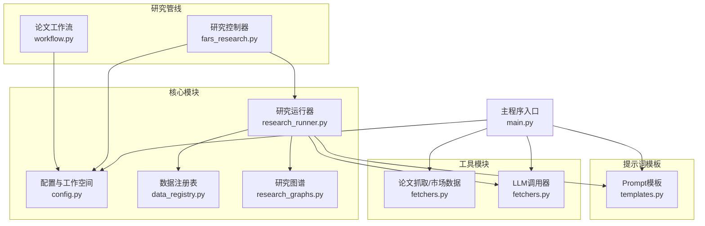
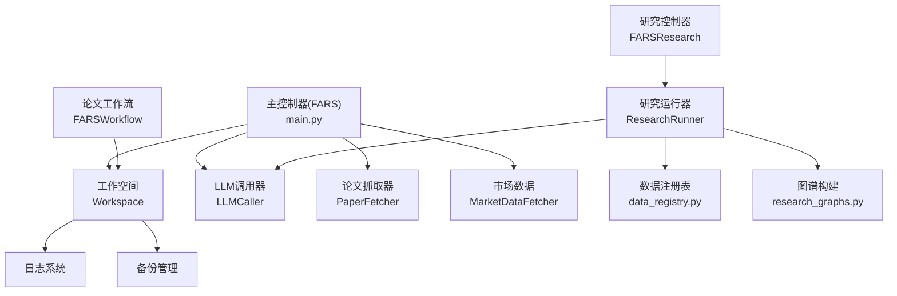
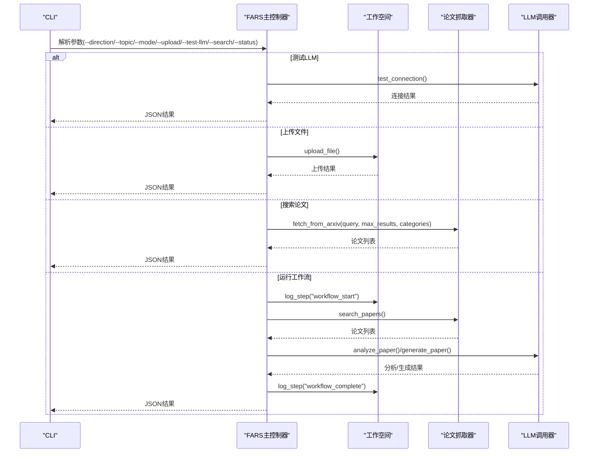
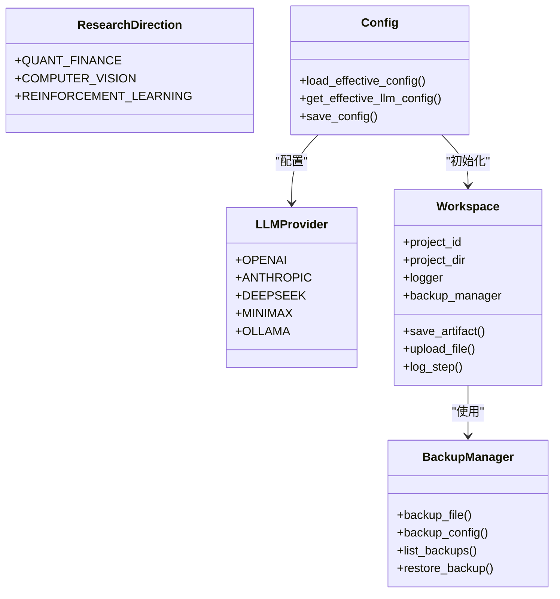
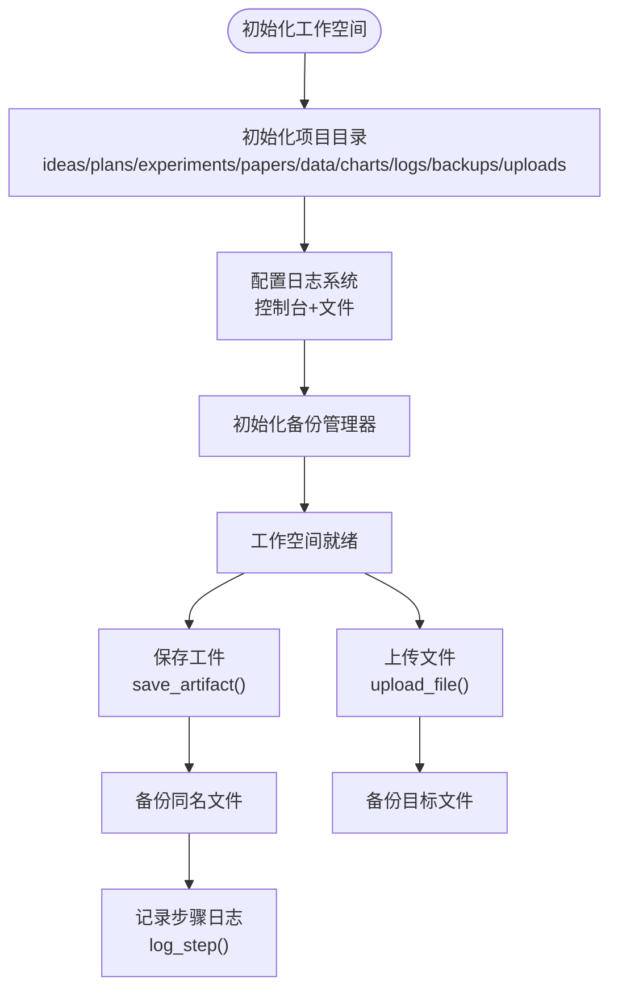
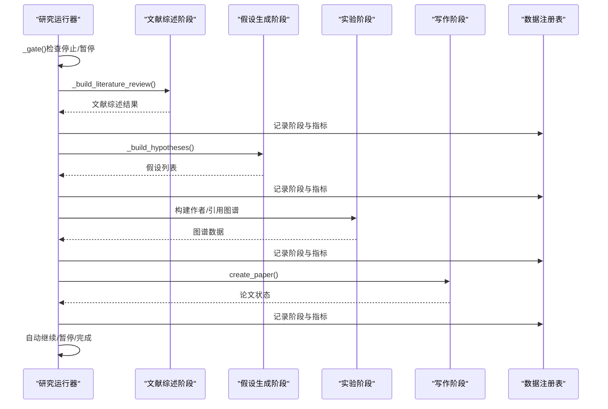
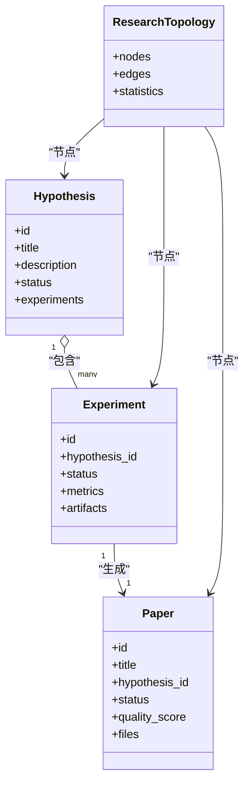
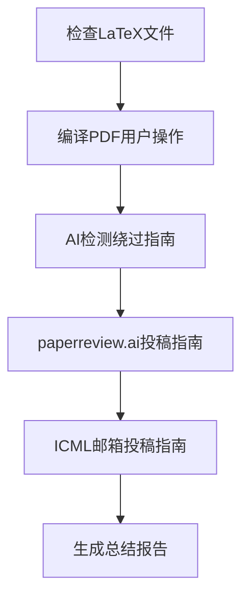
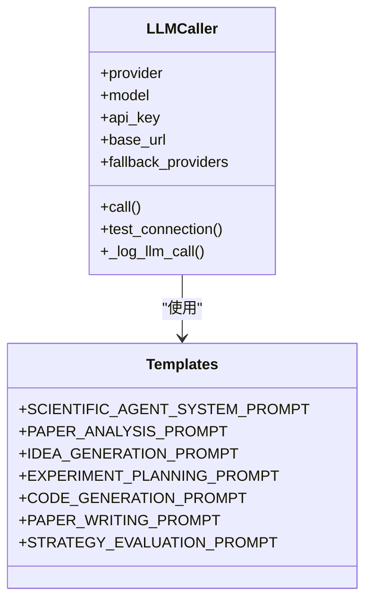
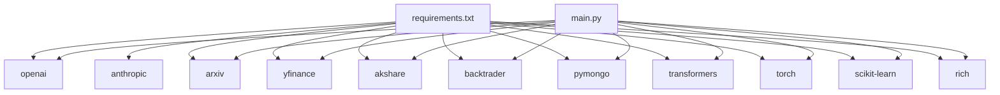

# 核心模块详解

<cite>
**本文档引用的文件**
- [src/main.py](file://src/main.py)
- [src/core/config.py](file://src/core/config.py)
- [src/core/research_runner.py](file://src/core/research_runner.py)
- [src/core/data_registry.py](file://src/core/data_registry.py)
- [src/core/research_graphs.py](file://src/core/research_graphs.py)
- [src/tools/fetchers.py](file://src/tools/fetchers.py)
- [src/prompts/templates.py](file://src/prompts/templates.py)
- [src/fars_research.py](file://src/fars_research.py)
- [src/workflow.py](file://src/workflow.py)
- [requirements.txt](file://requirements.txt)
</cite>

## 目录
1. [简介](#简介)
2. [项目结构](#项目结构)
3. [核心组件](#核心组件)
4. [架构总览](#架构总览)
5. [详细组件分析](#详细组件分析)
6. [依赖关系分析](#依赖关系分析)
7. [性能考虑](#性能考虑)
8. [故障排除指南](#故障排除指南)
9. [结论](#结论)
10. [附录](#附录)

## 简介
本文件面向paperwriterAI核心模块，系统性阐述FARS主控制器的设计与实现，涵盖CLI接口、工作流管理、状态跟踪、配置管理、研究方向管理、工作空间管理、日志与备份、研究运行器的断点续跑与优雅降级等。文档同时给出与各组件的关系图、典型使用模式与常见问题排查建议，帮助开发者快速理解并高效扩展系统。

## 项目结构
项目采用“核心模块 + 工具模块 + 提示词模板”的分层组织：
- 核心模块：负责配置、工作空间、研究运行器、数据注册表、图谱构建等
- 工具模块：论文抓取、市场数据、LLM调用等
- 提示词模板：为各类Agent提供标准化Prompt
- 研究管线：面向研究流程的自动化运行器
- 工作流：论文产出后的编译、AI检测绕过、投稿等后续流程

**图表来源**
- [src/main.py](file://src/main.py)
- [src/core/config.py](file://src/core/config.py)
- [src/core/research_runner.py](file://src/core/research_runner.py)
- [src/core/data_registry.py](file://src/core/data_registry.py)
- [src/core/research_graphs.py](file://src/core/research_graphs.py)
- [src/tools/fetchers.py](file://src/tools/fetchers.py)
- [src/prompts/templates.py](file://src/prompts/templates.py)
- [src/fars_research.py](file://src/fars_research.py)
- [src/workflow.py](file://src/workflow.py)

**章节来源**
- [src/main.py](file://src/main.py)
- [src/core/config.py](file://src/core/config.py)
- [src/core/research_runner.py](file://src/core/research_runner.py)
- [src/core/data_registry.py](file://src/core/data_registry.py)
- [src/core/research_graphs.py](file://src/core/research_graphs.py)
- [src/tools/fetchers.py](file://src/tools/fetchers.py)
- [src/prompts/templates.py](file://src/prompts/templates.py)
- [src/fars_research.py](file://src/fars_research.py)
- [src/workflow.py](file://src/workflow.py)

## 核心组件
- FARS主控制器：CLI入口、工作流编排、LLM初始化、文件上传、论文搜索与生成
- 配置与工作空间：研究方向枚举、LLM提供商配置、日志与备份、项目工作区目录结构
- 研究运行器：研究流水线的断点续跑、阶段同步、指标聚合、优雅降级
- 数据注册表：统一数据位置、种子论文清单、工作流状态、研究归档
- 研究图谱：作者合作网络与引用关系网络构建
- 工具模块：论文抓取、市场数据、LLM调用器（支持主备Provider自动切换）
- 提示词模板：科学Agent、假设生成、实验规划、代码生成、论文写作等
- 研究控制器：基于实体的假设-实验-论文生命周期管理
- 论文工作流：编译、AI检测绕过、投稿指南生成

**章节来源**
- [src/main.py](file://src/main.py)
- [src/core/config.py](file://src/core/config.py)
- [src/core/research_runner.py](file://src/core/research_runner.py)
- [src/core/data_registry.py](file://src/core/data_registry.py)
- [src/core/research_graphs.py](file://src/core/research_graphs.py)
- [src/tools/fetchers.py](file://src/tools/fetchers.py)
- [src/prompts/templates.py](file://src/prompts/templates.py)
- [src/fars_research.py](file://src/fars_research.py)
- [src/workflow.py](file://src/workflow.py)

## 架构总览
FARS采用“主控制器 + 工作空间 + 研究运行器 + 工具链 + 提示词模板”的分层架构。主控制器负责CLI与工作流编排；工作空间提供统一的项目目录与日志备份；研究运行器承载研究流水线的断点续跑与状态同步；工具链提供论文抓取、市场数据与LLM调用；提示词模板为各Agent提供标准化输入；研究控制器与论文工作流分别面向研究生命周期与论文产出后的流程。

**图表来源**
- [src/main.py](file://src/main.py)
- [src/core/config.py](file://src/core/config.py)
- [src/core/research_runner.py](file://src/core/research_runner.py)
- [src/core/data_registry.py](file://src/core/data_registry.py)
- [src/core/research_graphs.py](file://src/core/research_graphs.py)
- [src/tools/fetchers.py](file://src/tools/fetchers.py)
- [src/fars_research.py](file://src/fars_research.py)
- [src/workflow.py](file://src/workflow.py)

## 详细组件分析

### FARS主控制器（CLI与工作流）
- CLI接口：支持研究方向选择、主题输入、运行模式、文件上传、LLM连通性测试、状态查询、搜索论文等
- 工作流管理：搜索论文 → 分析论文 → 生成论文（三阶段），并记录步骤日志
- 状态跟踪：通过工作空间的日志步骤记录与状态摘要接口暴露系统状态
- LLM初始化：支持主Provider与Ollama备选Provider自动切换
- 文件上传：支持PDF、LaTeX、JSON、文本等类型，自动备份同名文件

**图表来源**
- [src/main.py](file://src/main.py)
- [src/tools/fetchers.py](file://src/tools/fetchers.py)
- [src/prompts/templates.py](file://src/prompts/templates.py)

**章节来源**
- [src/main.py](file://src/main.py)
- [src/tools/fetchers.py](file://src/tools/fetchers.py)
- [src/prompts/templates.py](file://src/prompts/templates.py)

### 配置管理系统
- 研究方向：量化金融、计算机视觉、强化学习，含优先级与方向描述
- LLM提供商：OpenAI、Anthropic、DeepSeek、MiniMax、Ollama，支持主备Provider自动切换
- 工作空间：统一项目目录结构（ideas/plans/experiments/papers/data/charts/logs/backups/uploads），日志与备份管理
- 配置合并：基础配置与本地配置深合并，支持从环境变量注入API密钥
- 数据Schema：论文、因子、实验的标准字段定义

**图表来源**
- [src/core/config.py](file://src/core/config.py)

**章节来源**
- [src/core/config.py](file://src/core/config.py)

### 工作空间管理机制
- 目录结构：项目根目录下按阶段划分目录，便于工件管理与审计
- 文件备份：同名文件覆盖前自动备份，支持配置备份与恢复
- 日志系统：控制台与文件双通道，按项目命名，支持步骤日志记录
- 项目摘要：聚合各阶段工件数量、备份数量、创建时间等

**图表来源**
- [src/core/config.py](file://src/core/config.py)

**章节来源**
- [src/core/config.py](file://src/core/config.py)

### 研究运行器（断点续跑与状态跟踪）
- 断点续跑：支持从“写作”阶段恢复，继续撰写并落盘产物
- 阶段同步：将当前阶段映射到实验阶段（文献综述/假设/实验/写作），并同步实验状态
- 指标聚合：按阶段记录耗时、论文数量、主题数量等指标，并持久化到运行度量
- 优雅降级：异常捕获与状态回滚，记录错误日志并标记失败
- 自动继续：支持完成一轮后自动开启下一轮研究

**图表来源**
- [src/core/research_runner.py](file://src/core/research_runner.py)
- [src/core/data_registry.py](file://src/core/data_registry.py)

**章节来源**
- [src/core/research_runner.py](file://src/core/research_runner.py)
- [src/core/data_registry.py](file://src/core/data_registry.py)

### 研究控制器（实体驱动的生命周期）
- 实体模型：假设、实验、论文、研究拓扑
- 生命周期：假设 → 规划 → 实验 → 写作 → 成功/失败/废弃
- 数据库：JSON文件持久化，支持增删改查与拓扑重建
- 统计与导出：成功率、平均质量分、状态分布、拓扑数据导出

**图表来源**
- [src/fars_research.py](file://src/fars_research.py)

**章节来源**
- [src/fars_research.py](file://src/fars_research.py)

### 论文工作流（编译、AI检测绕过、投稿）
- 步骤1：检查LaTeX文件是否存在
- 步骤2：编译LaTeX为PDF（提示用户使用Overleaf或本地TeX环境）
- 步骤3：AI检测绕过指南（JustDone等工具）
- 步骤4：paperreview.ai投稿指南
- 步骤5：ICML邮箱投稿指南
- 总结报告：记录各步骤执行结果与时间戳

**图表来源**
- [src/workflow.py](file://src/workflow.py)

**章节来源**
- [src/workflow.py](file://src/workflow.py)

### 提示词模板与LLM调用
- 提示词模板：科学Agent系统提示、论文分析、假设生成、实验规划、代码生成、论文写作、评审与修订等
- LLM调用器：支持OpenAI、Anthropic、DeepSeek、MiniMax、Ollama，具备主备Provider自动切换与调用历史记录

**图表来源**
- [src/tools/fetchers.py](file://src/tools/fetchers.py)
- [src/prompts/templates.py](file://src/prompts/templates.py)

**章节来源**
- [src/tools/fetchers.py](file://src/tools/fetchers.py)
- [src/prompts/templates.py](file://src/prompts/templates.py)

## 依赖关系分析
- 核心依赖：OpenAI、Anthropic、arxiv、yfinance、akshare、backtrader、pymongo、transformers、torch、scikit-learn、rich等
- 组件耦合：主控制器依赖配置、工具模块与提示词模板；研究运行器依赖数据注册表与图谱构建；研究控制器独立于运行器但共享实体模型

**图表来源**
- [requirements.txt](file://requirements.txt)
- [src/main.py](file://src/main.py)

**章节来源**
- [requirements.txt](file://requirements.txt)
- [src/main.py](file://src/main.py)

## 性能考虑
- LLM调用：主备Provider自动切换，减少单点故障；调用历史记录便于成本与延迟分析
- 研究运行器：阶段指标聚合与轻量图谱构建，避免重复计算；断点续跑减少重跑开销
- 数据访问：MongoDB配置集中管理，种子论文清单与工作流状态缓存，降低IO压力
- 日志与备份：文件级备份与步骤日志，兼顾可观测性与磁盘占用

## 故障排除指南
- LLM连接失败：检查API密钥与网络；确认主Provider不可用时备选Provider是否正确配置
- 论文搜索无结果：调整关键词与arXiv分类；检查网络与arXiv服务可用性
- 写作阶段失败：查看运行器日志与错误记录；确认实验产物是否正确落盘
- 备份恢复：使用备份管理器列出备份并恢复到目标路径
- 研究暂停/继续：通过运行器设置暂停后自动继续或手动恢复

**章节来源**
- [src/tools/fetchers.py](file://src/tools/fetchers.py)
- [src/core/config.py](file://src/core/config.py)
- [src/core/research_runner.py](file://src/core/research_runner.py)

## 结论
FARS通过主控制器、工作空间、研究运行器与工具链的协同，实现了从论文搜索、假设生成、实验验证到论文产出与后续流程的端到端自动化。配置与工作空间提供了统一的基础设施，研究运行器保障了断点续跑与状态一致性，提示词模板与LLM调用器确保了生成质量与鲁棒性。该架构既满足研究探索的灵活性，又兼顾生产环境的稳定性与可观测性。

## 附录
- 使用模式建议：优先使用主Provider，确保备选Provider可用；在研究运行器中启用断点续跑以应对长时间任务；通过工作空间备份保护关键工件；利用提示词模板与LLM调用器的历史记录进行成本与质量分析。
- 扩展建议：新增研究方向时扩展配置与提示词模板；新增LLM Provider时在调用器中增加对应分支；研究控制器可与运行器并行演进，保持实体模型稳定。