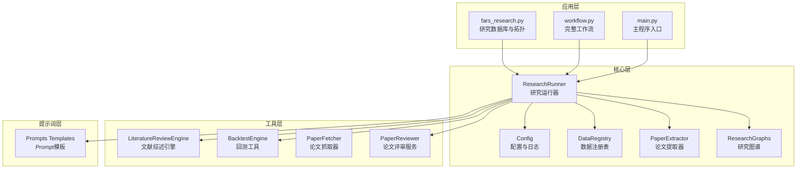
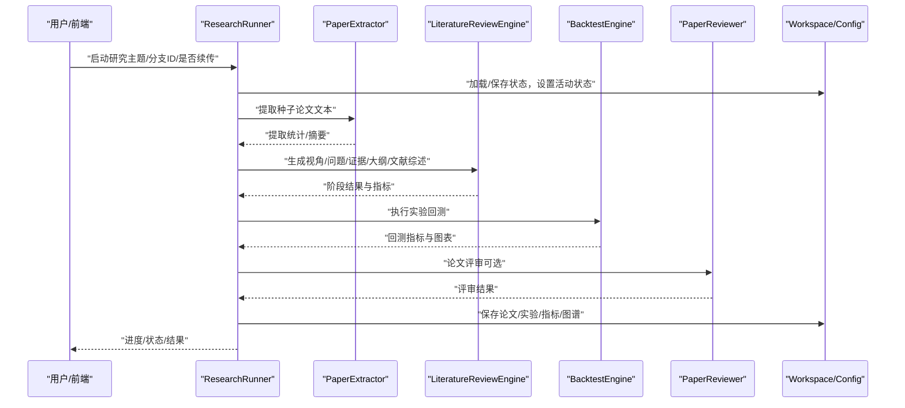
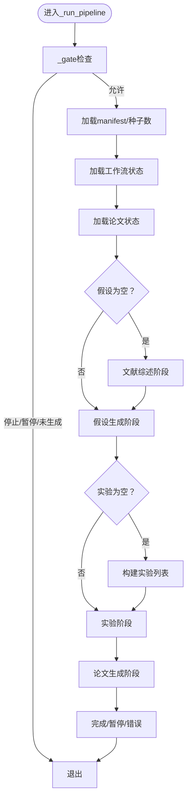
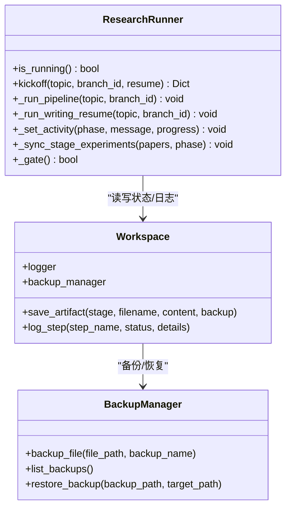
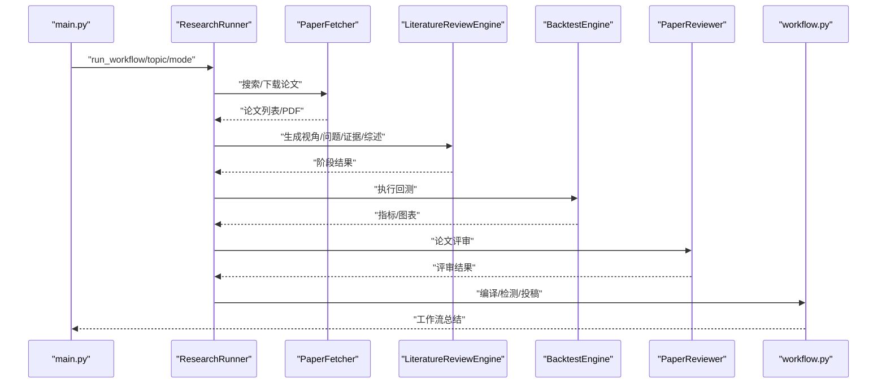
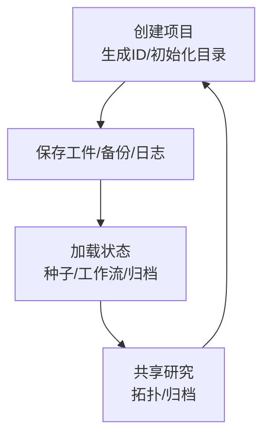
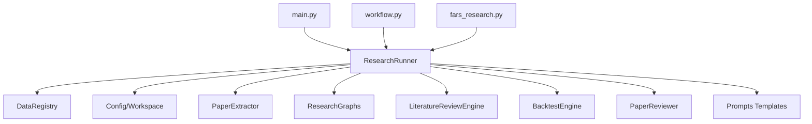

# 研究运行器

<cite>
**本文档引用的文件**
- [src/core/research_runner.py](file://src/core/research_runner.py)
- [src/main.py](file://src/main.py)
- [src/workflow.py](file://src/workflow.py)
- [src/fars_research.py](file://src/fars_research.py)
- [src/core/config.py](file://src/core/config.py)
- [src/core/data_registry.py](file://src/core/data_registry.py)
- [src/core/research_graphs.py](file://src/core/research_graphs.py)
- [src/core/paper_extractor.py](file://src/core/paper_extractor.py)
- [src/tools/literature_review_engine.py](file://src/tools/literature_review_engine.py)
- [src/tools/backtest.py](file://src/tools/backtest.py)
- [src/services/paper_reviewer.py](file://src/services/paper_reviewer.py)
- [src/prompts/templates.py](file://src/prompts/templates.py)
- [src/tools/fetchers.py](file://src/tools/fetchers.py)
</cite>

## 目录
1. [简介](#简介)
2. [项目结构](#项目结构)
3. [核心组件](#核心组件)
4. [架构总览](#架构总览)
5. [详细组件分析](#详细组件分析)
6. [依赖分析](#依赖分析)
7. [性能考量](#性能考量)
8. [故障排查指南](#故障排查指南)
9. [结论](#结论)
10. [附录](#附录)

## 简介
本技术文档面向“研究运行器”，系统阐述其工作原理与实现细节，重点覆盖以下方面：
- 断点续传与优雅降级：通过全局状态与分支管理实现中断恢复与失败回滚
- 状态跟踪与日志：阶段化活动记录、运行指标聚合、实验阶段同步
- 研究流程执行机制：论文搜索、分析、假设生成、实验设计、回测执行、论文生成
- 状态管理与生命周期：创建、保存、加载、共享、暂停/恢复
- 性能优化与资源管理：并发控制、缓存与去重、IO限流与降级

## 项目结构
项目采用分层与功能域结合的组织方式：
- 核心层：研究运行器、配置、数据注册表、图谱构建、论文提取
- 工具层：文献综述引擎、回测工具、数据抓取器、论文评审服务
- 应用层：主程序入口、完整工作流脚本
- 提示词层：各类Agent的Prompt模板

**图表来源**
- [src/core/research_runner.py:278-566](file://src/core/research_runner.py#L278-L566)
- [src/core/config.py:256-384](file://src/core/config.py#L256-L384)
- [src/core/data_registry.py:48-97](file://src/core/data_registry.py#L48-L97)
- [src/core/paper_extractor.py:149-224](file://src/core/paper_extractor.py#L149-L224)
- [src/core/research_graphs.py:16-179](file://src/core/research_graphs.py#L16-L179)
- [src/tools/literature_review_engine.py:18-631](file://src/tools/literature_review_engine.py#L18-L631)
- [src/tools/backtest.py:181-347](file://src/tools/backtest.py#L181-L347)
- [src/tools/fetchers.py:20-163](file://src/tools/fetchers.py#L20-L163)
- [src/services/paper_reviewer.py:159-302](file://src/services/paper_reviewer.py#L159-L302)
- [src/prompts/templates.py:1-758](file://src/prompts/templates.py#L1-L758)
- [src/main.py:35-427](file://src/main.py#L35-L427)
- [src/workflow.py:19-286](file://src/workflow.py#L19-L286)
- [src/fars_research.py:335-476](file://src/fars_research.py#L335-L476)

**章节来源**
- [src/core/research_runner.py:1-1130](file://src/core/research_runner.py#L1-L1130)
- [src/core/config.py:1-563](file://src/core/config.py#L1-L563)
- [src/core/data_registry.py:1-189](file://src/core/data_registry.py#L1-L189)
- [src/core/paper_extractor.py:1-398](file://src/core/paper_extractor.py#L1-L398)
- [src/core/research_graphs.py:1-264](file://src/core/research_graphs.py#L1-L264)
- [src/tools/literature_review_engine.py:1-850](file://src/tools/literature_review_engine.py#L1-L850)
- [src/tools/backtest.py:1-433](file://src/tools/backtest.py#L1-L433)
- [src/tools/fetchers.py:1-899](file://src/tools/fetchers.py#L1-L899)
- [src/services/paper_reviewer.py:1-473](file://src/services/paper_reviewer.py#L1-L473)
- [src/prompts/templates.py:1-758](file://src/prompts/templates.py#L1-L758)
- [src/main.py:1-521](file://src/main.py#L1-L521)
- [src/workflow.py:1-286](file://src/workflow.py#L1-L286)
- [src/fars_research.py:1-569](file://src/fars_research.py#L1-L569)

## 核心组件
- 研究运行器（ResearchRunner）：负责启动/暂停/恢复研究流程，协调各阶段执行与状态持久化，维护运行指标与实验阶段映射
- 配置与日志（Workspace/BackupManager）：统一工作空间、日志与备份管理
- 数据注册表（DataRegistry）：集中管理数据路径、种子论文清单、工作流状态与研究归档
- 论文提取器（PaperExtractor）：从PDF提取文本、生成摘要、重建分析报告
- 图谱构建（ResearchGraphs）：作者合作网络与引用/共引关系网络
- 文献综述引擎（LiteratureReviewEngine）：多视角生成、问题提问、证据收集、大纲与章节生成
- 回测工具（BacktestEngine）：基于Backtrader的策略回测与指标计算
- 论文评审服务（PaperReviewer）：多Provider评审与雷达图数据
- 提示词模板（Prompts Templates）：为各Agent提供标准化Prompt
- 主程序与完整工作流：CLI入口与论文编译、AI检测绕过、投稿流程

**章节来源**
- [src/core/research_runner.py:278-566](file://src/core/research_runner.py#L278-L566)
- [src/core/config.py:256-384](file://src/core/config.py#L256-L384)
- [src/core/data_registry.py:48-97](file://src/core/data_registry.py#L48-L97)
- [src/core/paper_extractor.py:149-224](file://src/core/paper_extractor.py#L149-L224)
- [src/core/research_graphs.py:16-179](file://src/core/research_graphs.py#L16-L179)
- [src/tools/literature_review_engine.py:18-631](file://src/tools/literature_review_engine.py#L18-L631)
- [src/tools/backtest.py:181-347](file://src/tools/backtest.py#L181-L347)
- [src/services/paper_reviewer.py:159-302](file://src/services/paper_reviewer.py#L159-L302)
- [src/prompts/templates.py:1-758](file://src/prompts/templates.py#L1-L758)
- [src/main.py:35-427](file://src/main.py#L35-L427)
- [src/workflow.py:19-286](file://src/workflow.py#L19-L286)
- [src/fars_research.py:335-476](file://src/fars_research.py#L335-L476)

## 架构总览
研究运行器以“阶段化流水线”为核心，贯穿文献综述、假设生成、实验设计、回测执行与论文生成，并通过状态持久化与指标聚合实现断点续传与进度监控。

**图表来源**
- [src/core/research_runner.py:301-566](file://src/core/research_runner.py#L301-L566)
- [src/core/paper_extractor.py:149-224](file://src/core/paper_extractor.py#L149-L224)
- [src/tools/literature_review_engine.py:557-631](file://src/tools/literature_review_engine.py#L557-L631)
- [src/tools/backtest.py:248-327](file://src/tools/backtest.py#L248-L327)
- [src/services/paper_reviewer.py:159-302](file://src/services/paper_reviewer.py#L159-L302)
- [src/core/config.py:256-384](file://src/core/config.py#L256-L384)

## 详细组件分析

### 研究运行器（ResearchRunner）
- 启动与续传：支持从“写作阶段”续传，恢复当前运行ID、分支ID与活动状态，立即写入状态避免前端轮询竞态
- 阶段化执行：starting → literature_review → hypothesis → experiment → writing → completed/paused/error
- 实验阶段同步：根据当前阶段自动同步实验列表的状态（pending/success/failed/experimenting）
- 运行指标聚合：按阶段记录开始/结束时间、耗时、论文数量、主题/问题计数等
- 优雅降级：通过门控函数（_gate）在停止请求、暂停、未生成状态下及时退出
- 线程安全：全局锁保护运行状态，避免并发冲突

**图表来源**
- [src/core/research_runner.py:642-800](file://src/core/research_runner.py#L642-L800)
- [src/core/research_runner.py:301-566](file://src/core/research_runner.py#L301-L566)

**章节来源**
- [src/core/research_runner.py:278-566](file://src/core/research_runner.py#L278-L566)

### 状态管理与日志记录
- 活动状态：research_activity（phase/message/progress/updated_at），实时反映当前阶段
- 阶段历史：phase_history（最多30条），记录每次阶段的详情与时间戳
- 运行指标：run_metrics（按阶段聚合），包含开始/结束时间、耗时、论文数、主题/问题计数
- 实验同步：根据阶段自动更新实验列表状态（pending/success/failed/experimenting）
- 日志与备份：Workspace统一日志与备份管理，便于审计与恢复

**图表来源**
- [src/core/research_runner.py:278-566](file://src/core/research_runner.py#L278-L566)
- [src/core/config.py:256-384](file://src/core/config.py#L256-L384)
- [src/core/config.py:98-187](file://src/core/config.py#L98-L187)

**章节来源**
- [src/core/research_runner.py:165-193](file://src/core/research_runner.py#L165-L193)
- [src/core/research_runner.py:567-629](file://src/core/research_runner.py#L567-L629)
- [src/core/config.py:62-95](file://src/core/config.py#L62-L95)
- [src/core/config.py:98-187](file://src/core/config.py#L98-L187)

### 研究流程执行机制
- 论文搜索与抓取：PaperFetcher支持arXiv/Semantic Scholar，可下载PDF并解析为结构化JSON
- 文献分析与综述：LiteratureReviewEngine生成多视角、问题、证据、大纲与文献综述章节
- 假设生成：基于论文分析与主题抽取生成可验证假设
- 实验设计与回测：BacktestEngine提供策略基类、指标计算与回测执行
- 论文生成：使用Prompt模板生成LaTeX论文源码，支持评审与修订循环
- 完整工作流：workflow.py提供编译、AI检测绕过、投稿指导

**图表来源**
- [src/main.py:353-427](file://src/main.py#L353-L427)
- [src/tools/fetchers.py:27-163](file://src/tools/fetchers.py#L27-L163)
- [src/tools/literature_review_engine.py:557-631](file://src/tools/literature_review_engine.py#L557-L631)
- [src/tools/backtest.py:248-327](file://src/tools/backtest.py#L248-L327)
- [src/services/paper_reviewer.py:159-302](file://src/services/paper_reviewer.py#L159-L302)
- [src/workflow.py:233-278](file://src/workflow.py#L233-L278)

**章节来源**
- [src/main.py:170-427](file://src/main.py#L170-L427)
- [src/tools/fetchers.py:27-163](file://src/tools/fetchers.py#L27-L163)
- [src/tools/literature_review_engine.py:18-631](file://src/tools/literature_review_engine.py#L18-L631)
- [src/tools/backtest.py:181-347](file://src/tools/backtest.py#L181-L347)
- [src/services/paper_reviewer.py:159-302](file://src/services/paper_reviewer.py#L159-L302)
- [src/workflow.py:233-278](file://src/workflow.py#L233-L278)

### 研究项目生命周期管理
- 创建：生成项目ID与工作空间，初始化目录结构与日志
- 保存：保存工件（阶段产物）、备份、日志步骤
- 加载：从数据注册表与状态文件加载种子论文、工作流状态与研究归档
- 共享：通过研究拓扑（作者/机构/引用网络）与归档目录共享研究成果

**图表来源**
- [src/core/config.py:256-384](file://src/core/config.py#L256-L384)
- [src/core/data_registry.py:48-97](file://src/core/data_registry.py#L48-L97)
- [src/fars_research.py:110-146](file://src/fars_research.py#L110-L146)

**章节来源**
- [src/core/config.py:256-384](file://src/core/config.py#L256-L384)
- [src/core/data_registry.py:48-97](file://src/core/data_registry.py#L48-L97)
- [src/fars_research.py:110-146](file://src/fars_research.py#L110-L146)

### 性能优化与资源管理
- 并发控制：主线程守护与门控函数避免重复执行与竞态
- IO限流：论文提取时延时，防止IO过载
- 缓存与去重：合并摘要文件去重，避免重复处理
- 降级策略：LLM调用器支持主Provider失败时自动切换备选（如Ollama）
- 指标聚合：按阶段统计耗时与产出，便于瓶颈定位

**章节来源**
- [src/core/research_runner.py:630-641](file://src/core/research_runner.py#L630-L641)
- [src/core/paper_extractor.py:206-207](file://src/core/paper_extractor.py#L206-L207)
- [src/tools/fetchers.py:290-449](file://src/tools/fetchers.py#L290-L449)
- [src/tools/backtest.py:248-327](file://src/tools/backtest.py#L248-L327)

## 依赖分析
研究运行器通过数据注册表与配置模块实现松耦合，工具层与应用层通过接口回调与状态文件交互。

**图表来源**
- [src/core/research_runner.py:1-1130](file://src/core/research_runner.py#L1-L1130)
- [src/core/data_registry.py:1-189](file://src/core/data_registry.py#L1-L189)
- [src/core/config.py:1-563](file://src/core/config.py#L1-L563)
- [src/tools/literature_review_engine.py:1-850](file://src/tools/literature_review_engine.py#L1-L850)
- [src/tools/backtest.py:1-433](file://src/tools/backtest.py#L1-L433)
- [src/services/paper_reviewer.py:1-473](file://src/services/paper_reviewer.py#L1-L473)
- [src/prompts/templates.py:1-758](file://src/prompts/templates.py#L1-L758)
- [src/main.py:1-521](file://src/main.py#L1-L521)
- [src/workflow.py:1-286](file://src/workflow.py#L1-L286)
- [src/fars_research.py:1-569](file://src/fars_research.py#L1-L569)

**章节来源**
- [src/core/research_runner.py:1-1130](file://src/core/research_runner.py#L1-L1130)
- [src/core/data_registry.py:1-189](file://src/core/data_registry.py#L1-L189)
- [src/core/config.py:1-563](file://src/core/config.py#L1-L563)

## 性能考量
- I/O密集：论文提取与PDF解析应避免并发高峰，采用限流与分批处理
- LLM成本：通过Provider切换与降级策略减少失败重试开销
- 指标驱动：阶段指标帮助识别瓶颈（如文献综述耗时、回测执行耗时）
- 资源隔离：日志与备份独立目录，避免磁盘争用

## 故障排查指南
- 研究未启动/卡住：检查_stop_requested/is_generating/is_paused状态，确认_gate返回值
- 文献综述异常：检查种子论文清单与PDF可用性，确认PaperExtractor输出
- 回测失败：检查数据可用性与策略实现，查看BacktestEngine输出
- 论文生成失败：检查Prompt模板与LLM调用日志，确认输出解析
- 备份/恢复：通过BackupManager列出备份并恢复目标文件

**章节来源**
- [src/core/research_runner.py:630-641](file://src/core/research_runner.py#L630-L641)
- [src/core/paper_extractor.py:149-224](file://src/core/paper_extractor.py#L149-L224)
- [src/tools/backtest.py:248-327](file://src/tools/backtest.py#L248-L327)
- [src/services/paper_reviewer.py:159-302](file://src/services/paper_reviewer.py#L159-L302)
- [src/core/config.py:98-187](file://src/core/config.py#L98-L187)

## 结论
研究运行器以“阶段化流水线+状态持久化+指标聚合”为核心，实现了从种子论文到论文生成的端到端自动化研究流程。通过断点续传、优雅降级与完善的日志备份体系，系统在复杂研究场景中具备良好的鲁棒性与可观测性。配合图谱构建与评审服务，进一步提升了研究的可复现性与质量保障。

## 附录
- 研究数据库与拓扑：FARSDatabase提供假设/实验/论文的增删改查与拓扑重建
- 完整工作流：workflow.py涵盖编译、AI检测绕过与投稿指导
- 提示词模板：为各Agent提供标准化Prompt，确保输出结构化与一致性

**章节来源**
- [src/fars_research.py:110-146](file://src/fars_research.py#L110-L146)
- [src/fars_research.py:229-293](file://src/fars_research.py#L229-L293)
- [src/workflow.py:233-278](file://src/workflow.py#L233-L278)
- [src/prompts/templates.py:1-758](file://src/prompts/templates.py#L1-L758)