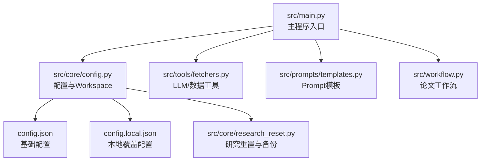
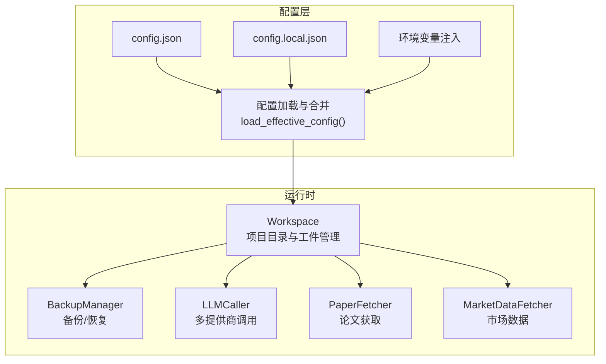
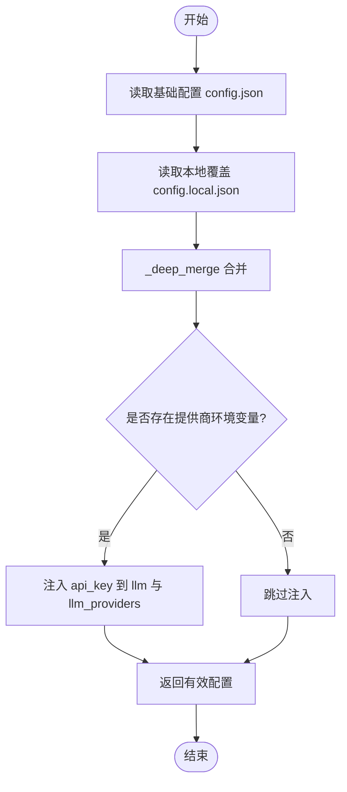
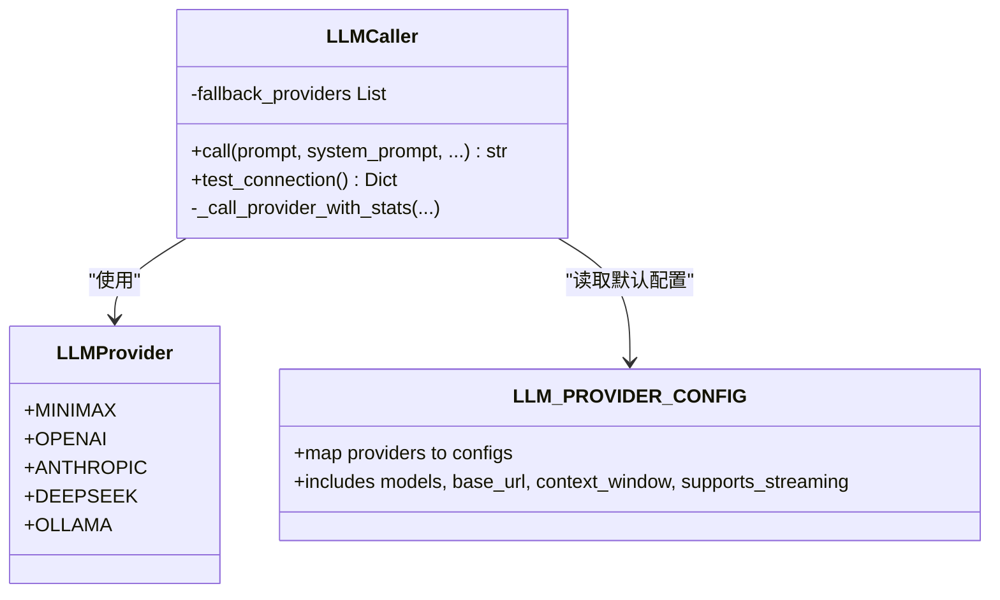
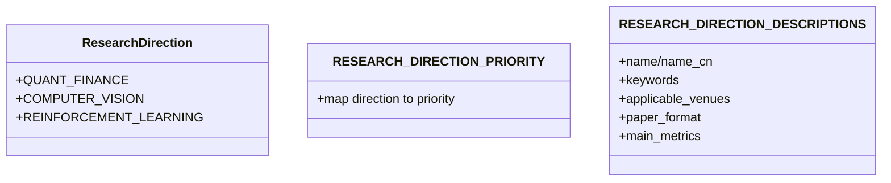
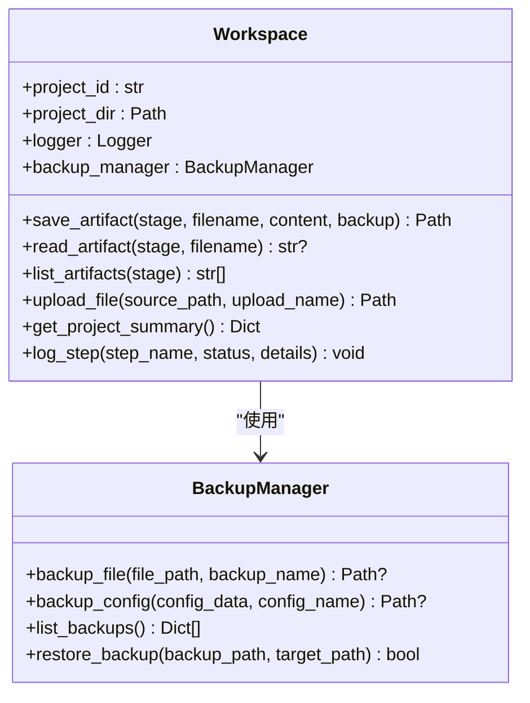
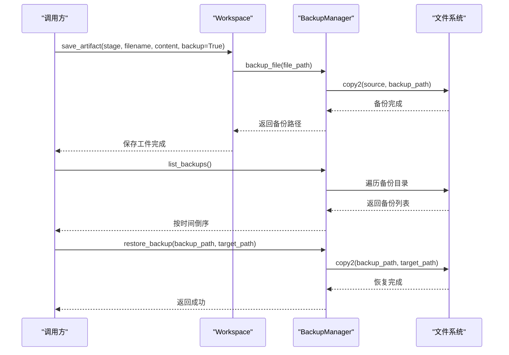
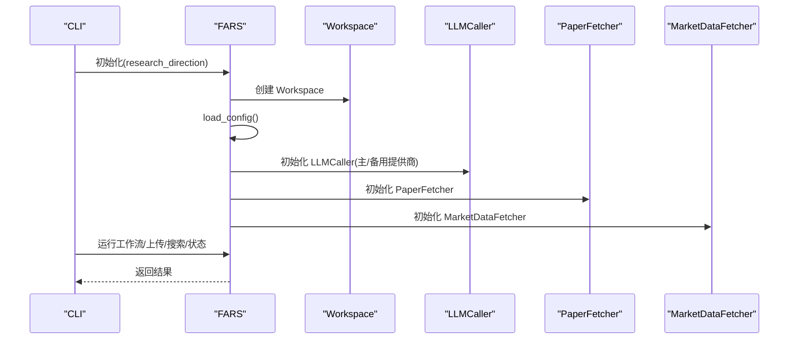
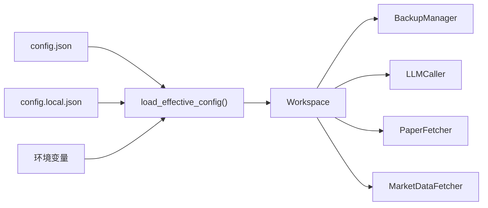

# 配置管理系统

<cite>
**本文档引用的文件**
- [src/core/config.py](file://src/core/config.py)
- [src/main.py](file://src/main.py)
- [src/workflow.py](file://src/workflow.py)
- [src/tools/fetchers.py](file://src/tools/fetchers.py)
- [src/prompts/templates.py](file://src/prompts/templates.py)
- [config.json](file://config.json)
- [config.local.json](file://config.local.json)
- [src/core/research_reset.py](file://src/core/research_reset.py)
</cite>

## 目录
1. [简介](#简介)
2. [项目结构](#项目结构)
3. [核心组件](#核心组件)
4. [架构总览](#架构总览)
5. [详细组件分析](#详细组件分析)
6. [依赖关系分析](#依赖关系分析)
7. [性能考虑](#性能考虑)
8. [故障排除指南](#故障排除指南)
9. [结论](#结论)
10. [附录](#附录)

## 简介
本文件面向“配置管理系统”的技术文档，聚焦以下目标：
- 深入解释配置文件结构与加载机制，涵盖 LLM 提供商配置、研究方向设置、工作空间配置等
- 详细说明 Workspace 类的设计，包括目录结构、文件组织、备份管理等功能
- 解释 BackupManager 的实现，包括自动备份、版本控制、恢复机制等
- 提供配置文件示例与最佳实践
- 说明如何扩展新的配置项与自定义配置选项
- 包含配置验证与错误处理机制

## 项目结构
本项目采用分层与功能模块化组织，核心配置与工作流相关的关键文件如下：
- 配置与工作空间：src/core/config.py
- 主程序入口与集成：src/main.py
- 工作流编排：src/workflow.py
- LLM 调用与数据获取：src/tools/fetchers.py
- Prompt 模板：src/prompts/templates.py
- 全局配置文件：config.json、config.local.json
- 研究重置与备份：src/core/research_reset.py

**图示来源**
- [src/main.py:1-521](file://src/main.py#L1-L521)
- [src/core/config.py:1-563](file://src/core/config.py#L1-L563)
- [src/tools/fetchers.py:1-899](file://src/tools/fetchers.py#L1-L899)
- [src/prompts/templates.py:1-758](file://src/prompts/templates.py#L1-L758)
- [src/workflow.py:1-286](file://src/workflow.py#L1-L286)
- [src/core/research_reset.py:1-147](file://src/core/research_reset.py#L1-L147)

**章节来源**
- [src/main.py:1-521](file://src/main.py#L1-L521)
- [src/core/config.py:1-563](file://src/core/config.py#L1-L563)

## 核心组件
本节概述配置系统的关键组件与其职责：
- 配置加载与合并：基础配置与本地覆盖配置的合并策略，以及环境变量注入
- LLM 提供商与模型配置：统一的提供商枚举与配置映射
- 研究方向与优先级：研究方向枚举、优先级与描述
- 工作空间 Workspace：项目级目录结构、工件保存/读取、日志与备份
- 备份管理 BackupManager：文件与配置备份、列表与恢复
- 数据 Schema：数据库实体字段定义与结构约束
- 主程序集成：FARS 主控制器，初始化 LLM、工具与工作流

**章节来源**
- [src/core/config.py:1-563](file://src/core/config.py#L1-L563)
- [src/main.py:1-521](file://src/main.py#L1-L521)

## 架构总览
配置系统围绕“配置文件 + 运行时配置对象 + Workspace + BackupManager”的架构展开，主程序通过加载配置驱动 LLM 调用器与工具模块。

**图示来源**
- [src/core/config.py:462-508](file://src/core/config.py#L462-L508)
- [src/core/config.py:256-384](file://src/core/config.py#L256-L384)
- [src/core/config.py:98-187](file://src/core/config.py#L98-L187)
- [src/main.py:35-101](file://src/main.py#L35-L101)
- [src/tools/fetchers.py:290-800](file://src/tools/fetchers.py#L290-L800)

## 详细组件分析

### 配置文件结构与加载机制
- 基础配置 config.json：包含 LLM、数据源、回测、评估、报告等键值
- 本地覆盖 config.local.json：用于本地 API Key、模型与提供商开关
- 加载策略：
  - 读取基础配置与本地覆盖配置
  - 深度合并（递归合并字典）
  - 通过环境变量注入 API Key，优先级高于配置文件
- LLM 配置获取：
  - 从合并后的配置中提取 llm 与 llm_providers
  - 若存在对应提供商的环境变量，则注入 api_key
  - 返回标准化的 llm 配置（provider/model/base_url/temperature/max_tokens/api_key）

**图示来源**
- [src/core/config.py:462-484](file://src/core/config.py#L462-L484)
- [src/core/config.py:427-436](file://src/core/config.py#L427-L436)
- [src/core/config.py:447-459](file://src/core/config.py#L447-L459)

**章节来源**
- [config.json:1-65](file://config.json#L1-L65)
- [config.local.json:1-40](file://config.local.json#L1-L40)
- [src/core/config.py:462-508](file://src/core/config.py#L462-L508)

### LLM 提供商配置与模型映射
- 提供商枚举与配置映射：支持 minimax/openai/anthropic/deepseek/ollama
- 每个提供商包含名称、可用模型列表、基础 URL、上下文窗口、是否支持流式等
- 主程序初始化 LLMCaller 时，支持主提供商与备用提供商（如 Ollama 本地模型）

**图示来源**
- [src/core/config.py:206-251](file://src/core/config.py#L206-L251)
- [src/main.py:62-87](file://src/main.py#L62-L87)
- [src/tools/fetchers.py:290-800](file://src/tools/fetchers.py#L290-L800)

**章节来源**
- [src/core/config.py:206-251](file://src/core/config.py#L206-L251)
- [src/main.py:62-87](file://src/main.py#L62-L87)
- [src/tools/fetchers.py:290-800](file://src/tools/fetchers.py#L290-L800)

### 研究方向设置与优先级
- 研究方向枚举：量化金融、计算机视觉、强化学习
- 优先级映射：量化金融为主方向，其他为次方向
- 描述映射：包含英文/中文名称、关键词、适用会议、论文格式、主指标等

**图示来源**
- [src/core/config.py:18-57](file://src/core/config.py#L18-L57)

**章节来源**
- [src/core/config.py:18-57](file://src/core/config.py#L18-L57)

### Workspace 类设计
- 目录结构：项目根目录下创建 projects/<project_id>，并在其中初始化 ideas/plans/experiments/papers/data/charts/logs/backups/uploads 子目录
- 工件管理：
  - save_artifact(stage, filename, content, backup=True)：保存工件，若同名文件存在则先备份
  - read_artifact(stage, filename)：读取工件
  - list_artifacts(stage)：列出阶段内所有工件
- 文件上传：upload_file(source_path, upload_name=None)，自动备份同名文件
- 日志与步骤：setup_logging 与 log_step 记录工作流步骤
- 项目摘要：get_project_summary 汇总项目状态与备份数量

**图示来源**
- [src/core/config.py:256-384](file://src/core/config.py#L256-L384)
- [src/core/config.py:98-187](file://src/core/config.py#L98-L187)

**章节来源**
- [src/core/config.py:256-384](file://src/core/config.py#L256-L384)

### BackupManager 实现
- 备份文件：按时间戳命名，自动拷贝至 backups 目录
- 备份配置：将配置字典序列化为 JSON 文件
- 备份列表：遍历 backups 目录，返回按创建时间倒序的备份清单
- 恢复备份：将备份文件复制到目标路径

**图示来源**
- [src/core/config.py:98-187](file://src/core/config.py#L98-L187)

**章节来源**
- [src/core/config.py:98-187](file://src/core/config.py#L98-L187)

### 数据 Schema 定义
- papers：论文实体字段（唯一标识、标题、作者、年份、arXiv ID、URL、摘要、方法论摘要、核心贡献、状态、笔记、创建时间）
- alpha_factors：因子实体字段（因子标识、名称、类别、LaTeX 公式、Python 表达式、来源论文、回测结果指标、状态、创建时间）
- experiments：实验实体字段（实验标识、研究假设、代码路径、结果指标、状态、错误信息、创建时间）

这些定义用于指导数据存储与查询的一致性。

**章节来源**
- [src/core/config.py:518-562](file://src/core/config.py#L518-L562)

### 主程序集成与工作流
- FARS 主控制器：初始化 Workspace、加载配置、初始化 LLMCaller（支持主提供商与备用提供商）、PaperFetcher、MarketDataFetcher
- CLI 入口：支持测试 LLM 连接、查看状态、上传论文、搜索论文、运行工作流等
- 工作流编排：src/workflow.py 提供论文工作流的步骤化执行与人工干预点提示

**图示来源**
- [src/main.py:35-101](file://src/main.py#L35-L101)
- [src/main.py:443-518](file://src/main.py#L443-L518)
- [src/workflow.py:19-278](file://src/workflow.py#L19-L278)

**章节来源**
- [src/main.py:35-101](file://src/main.py#L35-L101)
- [src/main.py:443-518](file://src/main.py#L443-L518)
- [src/workflow.py:19-278](file://src/workflow.py#L19-L278)

## 依赖关系分析
- 配置加载依赖：config.json 与 config.local.json 的读取与合并，环境变量注入
- Workspace 依赖：BackupManager、日志系统 setup_logging
- LLMCaller 依赖：多提供商 SDK（OpenAI、Anthropic、DeepSeek、MiniMax、Ollama）
- 主程序依赖：Workspace、配置加载、工具模块

**图示来源**
- [src/core/config.py:462-508](file://src/core/config.py#L462-L508)
- [src/core/config.py:256-384](file://src/core/config.py#L256-L384)
- [src/tools/fetchers.py:290-800](file://src/tools/fetchers.py#L290-L800)

**章节来源**
- [src/core/config.py:462-508](file://src/core/config.py#L462-L508)
- [src/core/config.py:256-384](file://src/core/config.py#L256-L384)
- [src/tools/fetchers.py:290-800](file://src/tools/fetchers.py#L290-L800)

## 性能考虑
- 配置加载：仅在启动时读取与合并，避免频繁 IO
- 备份策略：按需备份（同名文件覆盖时），减少冗余
- LLM 调用：主提供商失败时自动切换备用提供商，提升可用性
- 日志：控制台与文件双通道，避免阻塞主线程

## 故障排除指南
- LLM 连接失败：
  - 使用 CLI 参数测试连接：python src/main.py --test-llm
  - 检查环境变量是否正确注入 API Key
  - 确认主提供商与备用提供商配置
- 配置加载异常：
  - 检查 config.json 与 config.local.json 的 JSON 语法
  - 确认合并后的 llm 与 llm_providers 字段结构一致
- 工件保存失败：
  - 检查目标阶段目录是否存在与权限
  - 确认备份目录可写
- 研究重置：
  - 使用研究重置脚本备份并清空状态文件，避免误删种子文献

**章节来源**
- [src/main.py:88-100](file://src/main.py#L88-L100)
- [src/core/config.py:462-508](file://src/core/config.py#L462-L508)
- [src/core/research_reset.py:69-147](file://src/core/research_reset.py#L69-L147)

## 结论
本配置管理系统通过清晰的配置文件结构、可靠的加载与合并机制、完善的 Workspace 与 BackupManager，实现了研究方向、LLM 提供商、数据源与工作流的统一管理。系统具备良好的扩展性与容错能力，适合在多研究方向与多提供商环境下稳定运行。

## 附录

### 配置文件示例与最佳实践
- 基础配置（config.json）示例要点：
  - llm.provider/model/temperature/max_tokens/base_url
  - llm_providers.<provider>.enabled/model/base_url/api_key
  - data.yfinance_enabled/akshare_enabled/mongodb_uri/mongodb_db
  - backtest.framework/default_frequency/benchmark
  - evaluation.min_sharpe_ratio/max_drawdown_threshold/min_ic
  - report.format/template_dir
- 本地覆盖（config.local.json）示例要点：
  - 仅覆盖敏感字段（如 api_key），避免改动结构
  - 支持多提供商 api_keys 列表，便于轮换
- 最佳实践：
  - 将 API Key 存放在环境变量中，避免提交到版本库
  - 使用 config.local.json 管理本地差异化配置
  - 在 Workspace 中启用备份，防止覆盖导致的数据丢失

**章节来源**
- [config.json:1-65](file://config.json#L1-L65)
- [config.local.json:1-40](file://config.local.json#L1-L40)
- [src/core/config.py:462-508](file://src/core/config.py#L462-L508)

### 扩展新的配置项与自定义选项
- 新增配置项步骤：
  - 在基础配置中添加键值
  - 在本地覆盖中提供默认值或留空
  - 在加载逻辑中进行深合并与环境变量注入
  - 在 Workspace 或工具模块中读取并使用
- 自定义 LLM 提供商：
  - 在 LLMProvider 枚举中新增提供商
  - 在 LLM_PROVIDER_CONFIG 中补充配置
  - 在 LLMCaller 中增加对应的调用分支
- 自定义研究方向：
  - 在 ResearchDirection 中新增枚举值
  - 在优先级与描述映射中补充对应字段

**章节来源**
- [src/core/config.py:206-251](file://src/core/config.py#L206-L251)
- [src/core/config.py:18-57](file://src/core/config.py#L18-L57)
- [src/tools/fetchers.py:290-800](file://src/tools/fetchers.py#L290-L800)