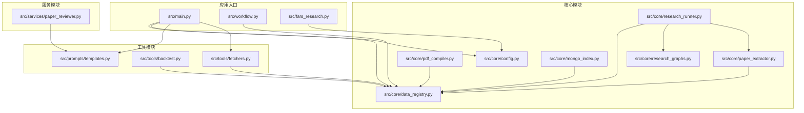
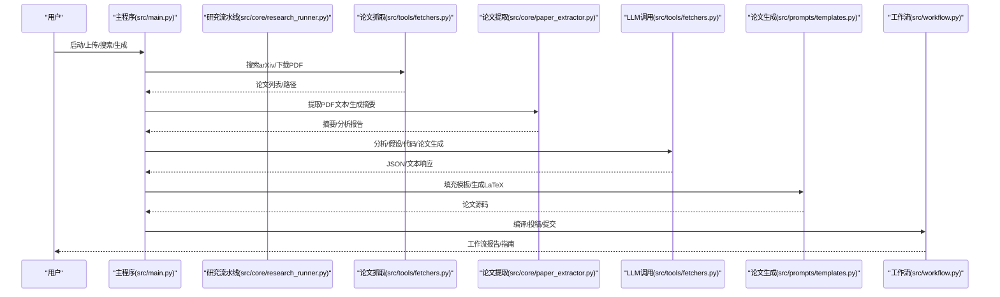
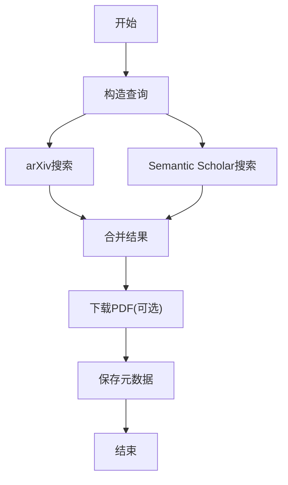
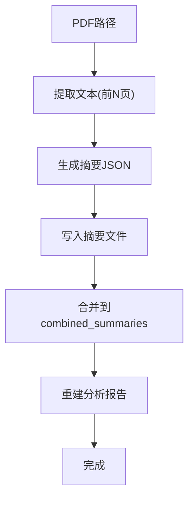
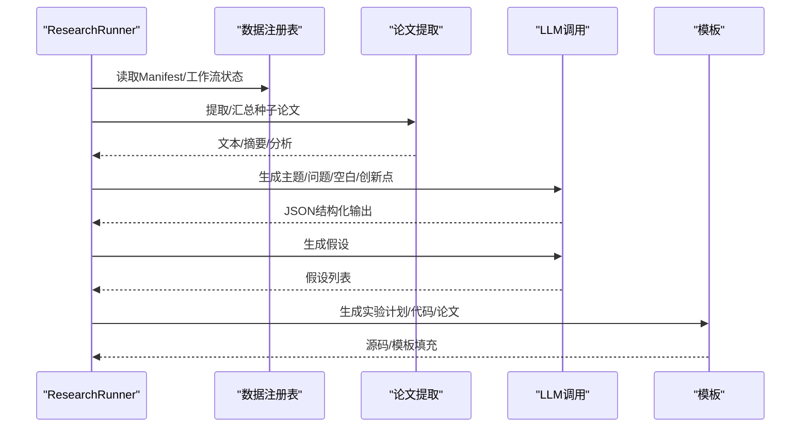
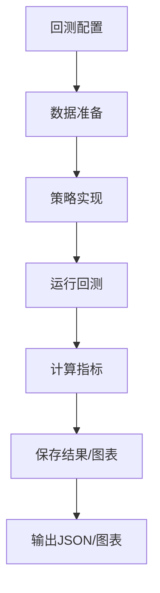
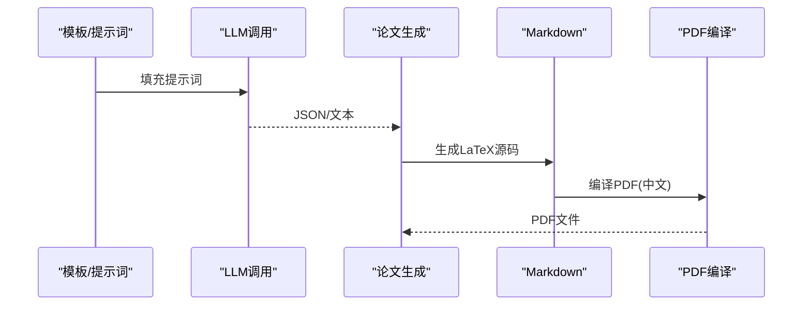
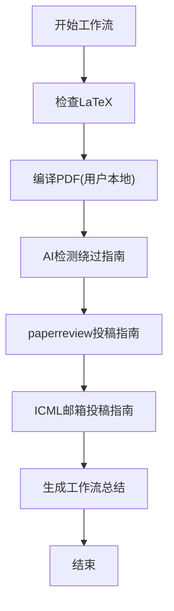
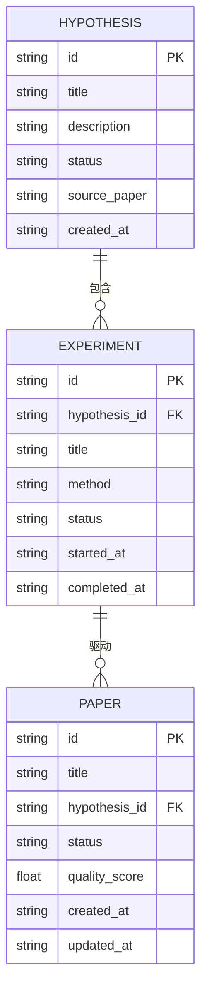
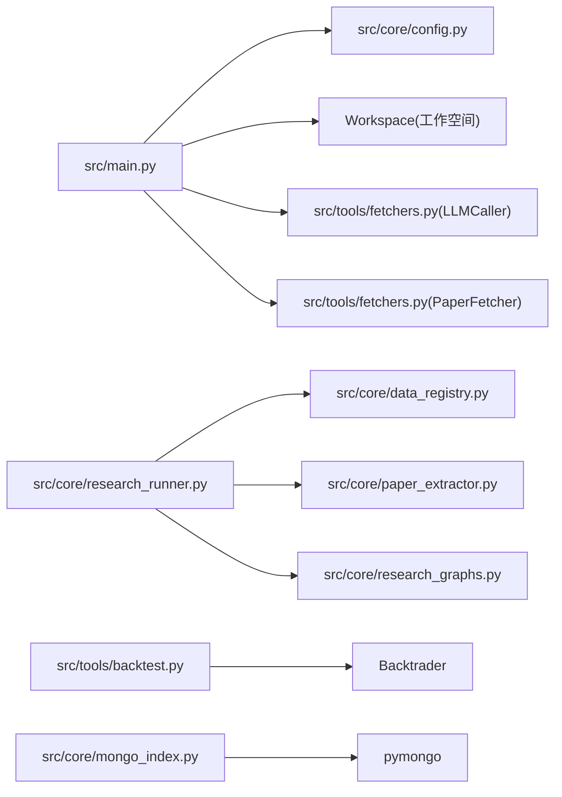

# 数据流设计

<cite>
**本文引用的文件**
- [src/main.py](file://src/main.py)
- [src/workflow.py](file://src/workflow.py)
- [src/fars_research.py](file://src/fars_research.py)
- [src/core/research_runner.py](file://src/core/research_runner.py)
- [src/core/data_registry.py](file://src/core/data_registry.py)
- [src/core/config.py](file://src/core/config.py)
- [src/core/paper_extractor.py](file://src/core/paper_extractor.py)
- [src/core/pdf_compiler.py](file://src/core/pdf_compiler.py)
- [src/core/research_graphs.py](file://src/core/research_graphs.py)
- [src/core/mongo_index.py](file://src/core/mongo_index.py)
- [src/tools/fetchers.py](file://src/tools/fetchers.py)
- [src/tools/backtest.py](file://src/tools/backtest.py)
- [src/prompts/templates.py](file://src/prompts/templates.py)
- [src/services/paper_reviewer.py](file://src/services/paper_reviewer.py)
</cite>

## 目录
1. [简介](#简介)
2. [项目结构](#项目结构)
3. [核心组件](#核心组件)
4. [架构总览](#架构总览)
5. [详细组件分析](#详细组件分析)
6. [依赖关系分析](#依赖关系分析)
7. [性能考量](#性能考量)
8. [故障排查指南](#故障排查指南)
9. [结论](#结论)
10. [附录](#附录)

## 简介
本文件为 paperwriterAI 的数据流设计文档，聚焦系统中“论文数据”与“实验数据”的全生命周期流转：从搜索、下载、解析、分析，到实验生成、回测执行、结果评估与报告生成。文档还涵盖工作空间文件组织、命名规范、版本管理、缓存与临时文件管理、持久化存储方案，并给出数据一致性与并发控制策略。

## 项目结构
项目采用“核心模块 + 工具模块 + 服务模块”的分层组织：
- 核心模块：负责工作流编排、数据注册表、配置与工作空间、论文提取与分析、MongoDB 索引、图谱构建等
- 工具模块：论文抓取、市场数据获取、回测引擎、提示词模板
- 服务模块：论文评审服务

**图示来源**
- [src/main.py](file://src/main.py)
- [src/workflow.py](file://src/workflow.py)
- [src/fars_research.py](file://src/fars_research.py)
- [src/core/research_runner.py](file://src/core/research_runner.py)
- [src/core/data_registry.py](file://src/core/data_registry.py)
- [src/core/config.py](file://src/core/config.py)
- [src/core/paper_extractor.py](file://src/core/paper_extractor.py)
- [src/core/pdf_compiler.py](file://src/core/pdf_compiler.py)
- [src/core/research_graphs.py](file://src/core/research_graphs.py)
- [src/core/mongo_index.py](file://src/core/mongo_index.py)
- [src/tools/fetchers.py](file://src/tools/fetchers.py)
- [src/tools/backtest.py](file://src/tools/backtest.py)
- [src/prompts/templates.py](file://src/prompts/templates.py)
- [src/services/paper_reviewer.py](file://src/services/paper_reviewer.py)

**章节来源**
- [src/main.py](file://src/main.py)
- [src/core/config.py](file://src/core/config.py)
- [src/core/data_registry.py](file://src/core/data_registry.py)

## 核心组件
- 工作流编排器：负责从文献综述、假设生成、实验设计、论文生成到投稿全流程的调度与状态记录
- 数据注册表：统一暴露数据位置、种子论文清单、工作流状态、研究归档等
- 配置与工作空间：集中管理 LLM Provider、数据源、日志与备份、项目目录结构
- 论文提取与分析：从 PDF 提取文本、生成摘要、重建分析报告
- 回测引擎：基于 Backtrader 的策略回测与指标计算
- MongoDB 索引：将研究产物与元数据写入数据库，便于检索与追踪
- 图谱构建：作者合作网络与引用关系网络
- 论文评审服务：多来源评审与雷达图可视化

**章节来源**
- [src/core/research_runner.py](file://src/core/research_runner.py)
- [src/core/data_registry.py](file://src/core/data_registry.py)
- [src/core/config.py](file://src/core/config.py)
- [src/core/paper_extractor.py](file://src/core/paper_extractor.py)
- [src/tools/backtest.py](file://src/tools/backtest.py)
- [src/core/mongo_index.py](file://src/core/mongo_index.py)
- [src/core/research_graphs.py](file://src/core/research_graphs.py)
- [src/services/paper_reviewer.py](file://src/services/paper_reviewer.py)

## 架构总览
系统数据流分为两条主线：
- 论文数据主线：搜索 arXiv → 下载 PDF → 提取文本 → 生成摘要 → 文献综述分析 → 假设生成 → 论文生成
- 实验数据主线：实验设计 → 代码生成 → 回测执行 → 指标计算 → 结果评估 → 报告生成

**图示来源**
- [src/main.py](file://src/main.py)
- [src/core/research_runner.py](file://src/core/research_runner.py)
- [src/tools/fetchers.py](file://src/tools/fetchers.py)
- [src/core/paper_extractor.py](file://src/core/paper_extractor.py)
- [src/prompts/templates.py](file://src/prompts/templates.py)
- [src/workflow.py](file://src/workflow.py)

## 详细组件分析

### 组件A：论文搜索与下载
- 输入：关键词、分类、最大结果数
- 处理：调用 arXiv 客户端与 Semantic Scholar API
- 输出：论文元数据列表（标题、作者、摘要、arXiv ID、PDF 链接等）

**图示来源**
- [src/tools/fetchers.py](file://src/tools/fetchers.py)

**章节来源**
- [src/tools/fetchers.py](file://src/tools/fetchers.py)

### 组件B：论文解析与摘要生成
- 输入：PDF 路径
- 处理：逐页提取文本、去重、统计字符数、生成摘要 JSON
- 输出：摘要文件、合并摘要清单、分析报告

**图示来源**
- [src/core/paper_extractor.py](file://src/core/paper_extractor.py)

**章节来源**
- [src/core/paper_extractor.py](file://src/core/paper_extractor.py)

### 组件C：研究流水线（Literature → Hypothesis → Experiment → Writing）
- 输入：主题、分支、Manifest、种子论文清单
- 处理：文献综述、主题抽取、研究空白/创新点、假设生成、实验设计、论文生成
- 输出：阶段历史、运行指标、论文草稿

**图示来源**
- [src/core/research_runner.py](file://src/core/research_runner.py)
- [src/core/data_registry.py](file://src/core/data_registry.py)
- [src/core/paper_extractor.py](file://src/core/paper_extractor.py)
- [src/prompts/templates.py](file://src/prompts/templates.py)

**章节来源**
- [src/core/research_runner.py](file://src/core/research_runner.py)
- [src/core/data_registry.py](file://src/core/data_registry.py)

### 组件D：实验回测与评估
- 输入：策略参数、数据源（yfinance/akshare/MongoDB）、回测配置
- 处理：Backtrader 回测、指标计算（夏普、最大回撤、卡玛、索提诺、胜率、盈亏比）
- 输出：回测结果 JSON、权益曲线、交易记录

**图示来源**
- [src/tools/backtest.py](file://src/tools/backtest.py)

**章节来源**
- [src/tools/backtest.py](file://src/tools/backtest.py)

### 组件E：论文生成与编译
- 输入：实验结果、模板、提示词
- 处理：LaTeX 源码生成、Markdown → PDF 编译（中文支持）
- 输出：LaTeX 源码、PDF（用户本地编译）

**图示来源**
- [src/prompts/templates.py](file://src/prompts/templates.py)
- [src/core/pdf_compiler.py](file://src/core/pdf_compiler.py)

**章节来源**
- [src/prompts/templates.py](file://src/prompts/templates.py)
- [src/core/pdf_compiler.py](file://src/core/pdf_compiler.py)

### 组件F：工作流执行（编译/投稿）
- 输入：项目ID、LaTeX 源文件
- 处理：检查/编译/生成编译信息/AI检测绕过指南/投稿指南
- 输出：工作流总结、各阶段状态

**图示来源**
- [src/workflow.py](file://src/workflow.py)

**章节来源**
- [src/workflow.py](file://src/workflow.py)

### 组件G：研究数据库与拓扑
- 数据模型：Hypothesis、Experiment、Paper、Topology
- 功能：增删改查、拓扑重建、统计指标（成功率、平均质量分、状态分布）
- 输出：JSON 导出、拓扑数据

**图示来源**
- [src/fars_research.py](file://src/fars_research.py)

**章节来源**
- [src/fars_research.py](file://src/fars_research.py)

## 依赖关系分析
- 组件耦合
  - 主程序依赖配置、工作空间、LLM 调用器、论文抓取器
  - 研究流水线依赖数据注册表、论文提取器、图谱构建器
  - 回测引擎依赖 Backtrader，指标计算独立
  - MongoDB 索引依赖数据注册表配置
- 外部依赖
  - arXiv API、Semantic Scholar API、Backtrader、pymongo、pdfplumber、ReportLab
- 并发与锁
  - 研究流水线使用全局锁与运行标志，避免重复启动
  - 工作空间保存工件时可选备份，防止覆盖

**图示来源**
- [src/main.py](file://src/main.py)
- [src/core/config.py](file://src/core/config.py)
- [src/tools/fetchers.py](file://src/tools/fetchers.py)
- [src/core/research_runner.py](file://src/core/research_runner.py)
- [src/core/data_registry.py](file://src/core/data_registry.py)
- [src/core/paper_extractor.py](file://src/core/paper_extractor.py)
- [src/core/research_graphs.py](file://src/core/research_graphs.py)
- [src/tools/backtest.py](file://src/tools/backtest.py)
- [src/core/mongo_index.py](file://src/core/mongo_index.py)

**章节来源**
- [src/main.py](file://src/main.py)
- [src/core/research_runner.py](file://src/core/research_runner.py)
- [src/core/mongo_index.py](file://src/core/mongo_index.py)

## 性能考量
- I/O 限流：论文提取器对 PDF 逐页读取并限制页数，避免长时间阻塞
- 缓存与增量：合并摘要文件去重，仅处理新增论文
- LLM 调用统计：记录 token 使用与延迟，便于成本与性能监控
- 回测指标：使用高效向量化计算（pandas/numpy），避免循环冗余

[本节为通用指导，无需特定文件引用]

## 故障排查指南
- LLM 连接失败：检查主/备 Provider 配置与 API Key，查看调用日志
- arXiv/Semantic Scholar 请求异常：确认网络与 API Key，查看异常堆栈
- 回测报错：使用 Debug 提示词修复代码，关注数据格式与列名映射
- MongoDB 不可用：检查 URI、认证与网络连通性
- PDF 编译失败：确认本地 TeX 环境或使用 Overleaf

**章节来源**
- [src/tools/fetchers.py](file://src/tools/fetchers.py)
- [src/services/paper_reviewer.py](file://src/services/paper_reviewer.py)
- [src/core/mongo_index.py](file://src/core/mongo_index.py)

## 结论
paperwriterAI 的数据流以“研究流水线”为核心，串联论文搜索、解析、假设生成、实验回测与论文生成，并通过工作流与评审服务完成闭环。系统通过数据注册表统一数据位置，借助工作空间与备份管理保障数据安全，利用 MongoDB 与图谱构建实现可检索与可追踪。建议在生产环境中进一步完善并发控制、断点续跑与可观测性建设。

[本节为总结性内容，无需特定文件引用]

## 附录

### 数据流图（概念）

[本图为概念性流程图，不对应具体源文件]

### 文件结构与命名规范
- 工作空间目录
  - projects/{project_id}/ideas/plans/experiments/papers/data/charts/logs/backups/uploads
- 备份命名：{原文件名}_{时间戳}.扩展名
- 论文文件命名：paper_{标题简写}_{时间戳}.tex
- 日志文件：fars_{日期时间}.log
- 临时文件：由回测/编译过程生成，建议纳入 .gitignore

**章节来源**
- [src/core/config.py](file://src/core/config.py)
- [src/main.py](file://src/main.py)

### 版本管理与一致性
- 备份策略：工作空间保存工件时自动备份同名文件；配置与文件均可备份
- 并发控制：研究流水线使用全局锁与运行标志，避免重复启动
- 数据一致性：MongoDB upsert 保证幂等；数据注册表提供统一视图

**章节来源**
- [src/core/config.py](file://src/core/config.py)
- [src/core/research_runner.py](file://src/core/research_runner.py)
- [src/core/mongo_index.py](file://src/core/mongo_index.py)