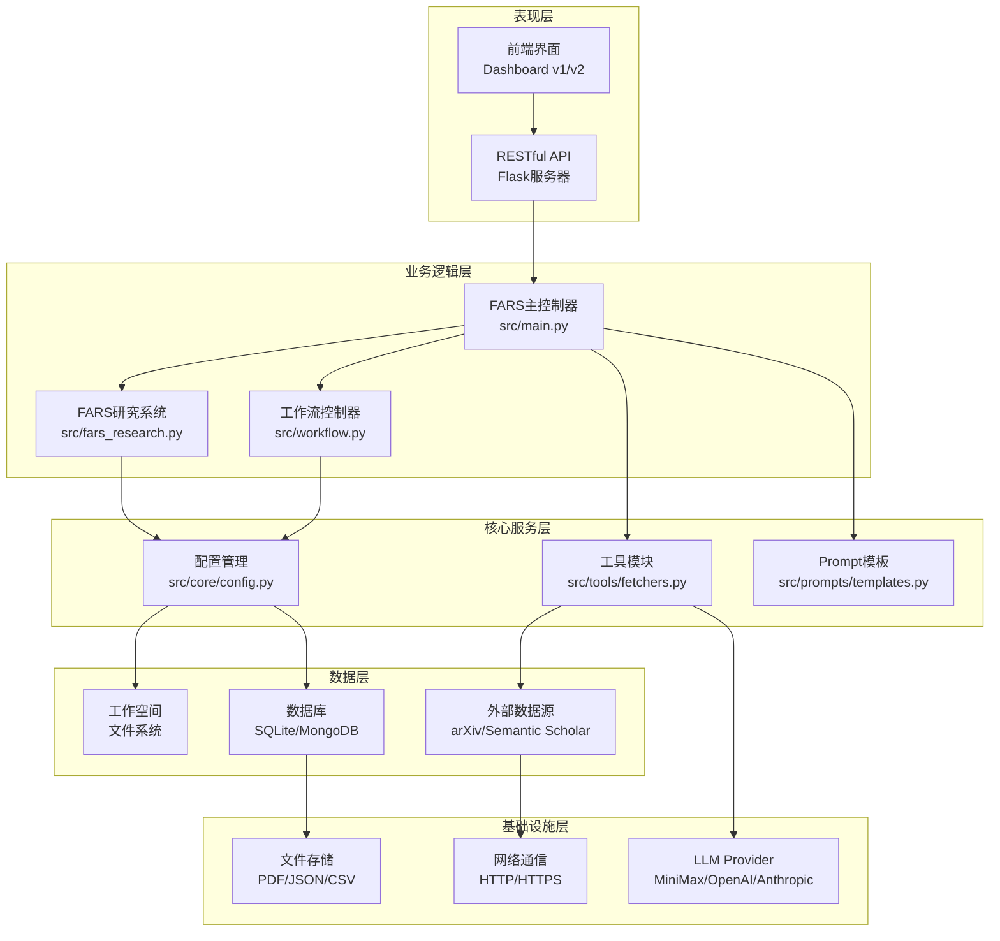
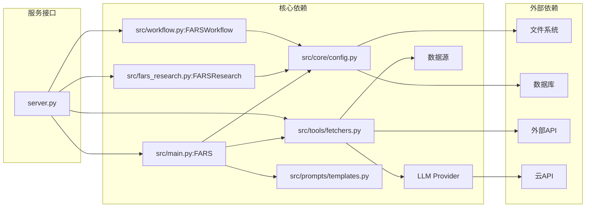
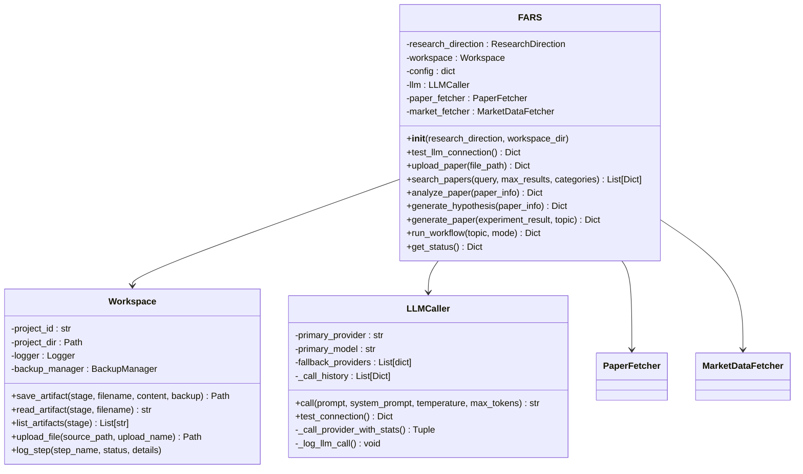
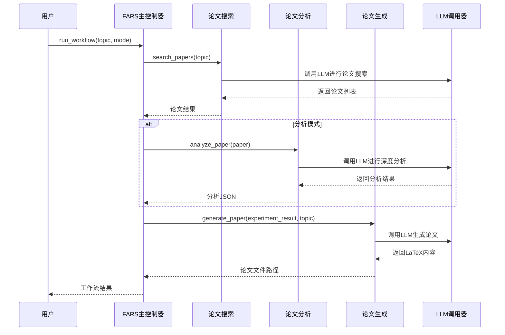
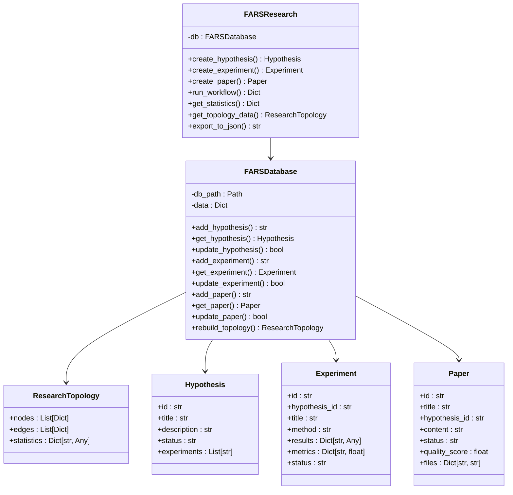
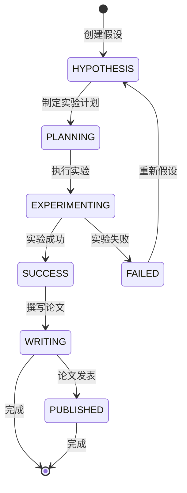
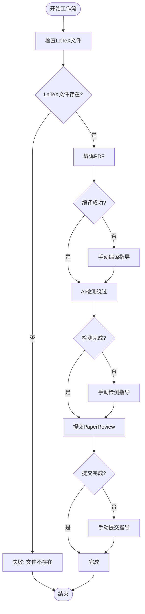
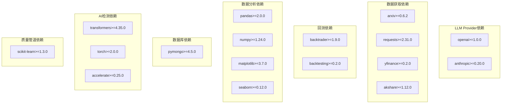
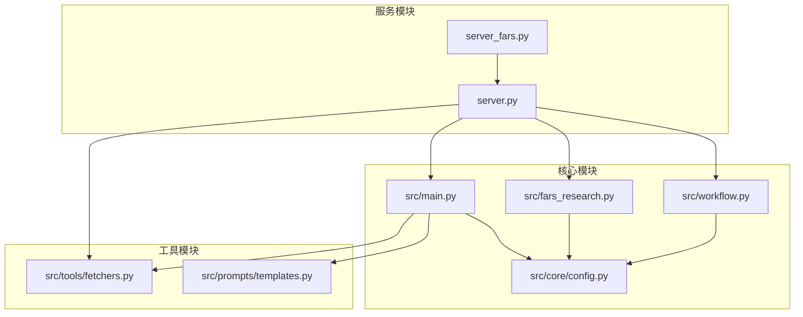

# 整体架构设计

<cite>
**本文档引用的文件**
- [src/main.py](file://src/main.py)
- [src/fars_research.py](file://src/fars_research.py)
- [src/workflow.py](file://src/workflow.py)
- [server_fars.py](file://server_fars.py)
- [server.py](file://server.py)
- [src/core/config.py](file://src/core/config.py)
- [src/tools/fetchers.py](file://src/tools/fetchers.py)
- [src/prompts/templates.py](file://src/prompts/templates.py)
- [README.md](file://README.md)
- [docs/FARS_ARCHITECTURE.md](file://docs/FARS_ARCHITECTURE.md)
- [requirements.txt](file://requirements.txt)
</cite>

## 目录
1. [系统概述](#系统概述)
2. [项目结构](#项目结构)
3. [核心组件](#核心组件)
4. [架构概览](#架构概览)
5. [详细组件分析](#详细组件分析)
6. [依赖关系分析](#依赖关系分析)
7. [性能考虑](#性能考虑)
8. [故障排除指南](#故障排除指南)
9. [结论](#结论)

## 系统概述

FARS（Fully Automated Research System）是一个基于大语言模型的全自动学术论文生成系统，专注于量化交易与金融科技领域。该系统采用分层架构设计，通过多代理协作实现从种子论文到最终论文的完整自动化流程。

### 系统核心特性

- **多代理协作架构**：包含Ideation、Planning、Experiment、Writing四大Agent，每个Agent负责特定的研究阶段
- **断点续分析机制**：每步完成后持久化状态，支持从任意断点恢复
- **优雅降级机制**：在Token限制或超时情况下自动降级，确保部分结果可用
- **多研究方向支持**：支持量化金融、计算机视觉、强化学习三个研究方向
- **多LLM Provider集成**：支持MiniMax、OpenAI、Anthropic、DeepSeek、Ollama等多个大模型提供商

### 系统边界定义

系统边界包括：
- **内部边界**：src/目录下的所有核心模块和工具
- **外部边界**：与arXiv、Semantic Scholar等外部论文数据库的交互
- **API边界**：Flask服务器提供的RESTful API接口
- **数据边界**：论文、实验结果、配置等数据的存储和管理

## 项目结构

项目采用模块化组织原则，按照功能层次进行划分：

```
paperwriterAI/
├── src/                           # 核心源代码
│   ├── main.py                   # FARS主控制器
│   ├── fars_research.py           # 研究系统核心
│   ├── workflow.py               # 完整工作流控制器
│   ├── core/                     # 核心配置和工具
│   ├── agents/                   # 多代理实现
│   ├── tools/                    # 工具模块
│   ├── prompts/                  # Prompt模板
│   └── services/                 # 服务层
├── server.py                     # Flask API服务器
├── server_fars.py               # FARS专用服务器
├── docs/                        # 文档和前端界面
├── research/                    # 研究相关文件
└── data/                        # 数据存储
```

### 模块化组织原则

1. **按功能分层**：核心业务逻辑、工具模块、接口层清晰分离
2. **按职责划分**：每个模块专注于特定的功能领域
3. **接口抽象**：通过统一接口实现模块间的松耦合
4. **配置驱动**：通过配置文件实现灵活的系统行为调整

## 核心组件

### FARS主控制器

FARS类是整个系统的协调中心，负责：
- 初始化研究环境和工作空间
- 管理LLM调用器和工具模块
- 协调多代理的工作流程
- 处理用户命令和CLI交互

### Workspace工作空间管理

Workspace类提供共享的工作空间，包含：
- 项目目录结构管理
- 文件备份和恢复机制
- 日志记录和状态追踪
- 跨代理的数据共享

### LLM调用器集成

LLMCaller类实现：
- 多Provider自动切换机制
- 统一的API调用接口
- 调用历史记录和统计
- 错误处理和重试机制

### 工具模块调用

工具模块包括：
- **PaperFetcher**：论文获取和解析
- **MarketDataFetcher**：市场数据获取
- **BacktestEngine**：量化回测执行
- **QualityPipeline**：论文质量评估

**章节来源**
- [src/main.py:35-438](file://src/main.py#L35-L438)
- [src/core/config.py:254-384](file://src/core/config.py#L254-L384)
- [src/tools/fetchers.py:290-800](file://src/tools/fetchers.py#L290-L800)

## 架构概览

系统采用分层架构设计，从底层到顶层依次为：



**图表来源**
- [src/main.py:35-438](file://src/main.py#L35-L438)
- [src/fars_research.py:335-476](file://src/fars_research.py#L335-L476)
- [src/workflow.py:19-286](file://src/workflow.py#L19-L286)

### 组件间依赖关系



**图表来源**
- [src/main.py:22-31](file://src/main.py#L22-L31)
- [src/fars_research.py:338-340](file://src/fars_research.py#L338-L340)
- [src/workflow.py:17-27](file://src/workflow.py#L17-L27)

## 详细组件分析

### FARS主控制器分析

FARS类是系统的核心协调者，采用面向对象设计模式：



**图表来源**
- [src/main.py:35-438](file://src/main.py#L35-L438)
- [src/core/config.py:254-384](file://src/core/config.py#L254-L384)
- [src/tools/fetchers.py:290-800](file://src/tools/fetchers.py#L290-L800)

#### 工作流执行序列



**图表来源**
- [src/main.py:353-427](file://src/main.py#L353-L427)
- [src/main.py:170-196](file://src/main.py#L170-L196)
- [src/main.py:198-235](file://src/main.py#L198-L235)
- [src/main.py:279-351](file://src/main.py#L279-L351)

**章节来源**
- [src/main.py:35-438](file://src/main.py#L35-L438)

### 研究系统架构

FARS研究系统采用数据驱动的设计模式：



**图表来源**
- [src/fars_research.py:335-476](file://src/fars_research.py#L335-L476)
- [src/fars_research.py:110-333](file://src/fars_research.py#L110-L333)

#### 研究状态转换流程



**图表来源**
- [src/fars_research.py:28-46](file://src/fars_research.py#L28-L46)

**章节来源**
- [src/fars_research.py:335-476](file://src/fars_research.py#L335-L476)

### 工作流控制器分析

工作流控制器负责完整的论文生成和发布流程：



**图表来源**
- [src/workflow.py:19-286](file://src/workflow.py#L19-L286)

**章节来源**
- [src/workflow.py:19-286](file://src/workflow.py#L19-L286)

## 依赖关系分析

### 外部依赖管理

系统通过requirements.txt管理外部依赖：



**图表来源**
- [requirements.txt:1-39](file://requirements.txt#L1-L39)

### 内部模块依赖



**图表来源**
- [src/main.py:22-31](file://src/main.py#L22-L31)
- [src/fars_research.py:338-340](file://src/fars_research.py#L338-L340)
- [src/workflow.py:17-27](file://src/workflow.py#L17-L27)

**章节来源**
- [requirements.txt:1-39](file://requirements.txt#L1-L39)

## 性能考虑

### 架构决策的技术考量

1. **分层架构**：通过清晰的层次分离实现了良好的可维护性和可扩展性
2. **模块化设计**：每个模块职责单一，便于独立开发和测试
3. **异步处理**：在可能的情况下采用异步模式提高并发处理能力
4. **缓存机制**：实现文件和配置的自动备份，防止数据丢失
5. **断点续传**：每步完成后持久化状态，避免重复计算

### 性能影响分析

- **LLM调用性能**：通过多Provider自动切换和调用历史记录优化
- **数据处理性能**：使用pandas和numpy进行高效的数据分析
- **存储性能**：采用文件系统和轻量级数据库结合的方式
- **网络性能**：合理的API设计和请求超时控制

### 可扩展性设计

1. **插件化架构**：支持新的LLM Provider和数据源的轻松集成
2. **配置驱动**：通过配置文件实现灵活的行为调整
3. **API标准化**：统一的RESTful API接口便于第三方集成
4. **监控和日志**：完善的日志系统支持系统监控和故障诊断

## 故障排除指南

### 常见问题及解决方案

1. **LLM连接失败**
   - 检查API密钥配置
   - 验证网络连接
   - 查看备用Provider配置

2. **论文生成失败**
   - 检查Token限制
   - 验证Prompt模板完整性
   - 查看调用历史记录

3. **数据获取异常**
   - 检查数据源可用性
   - 验证API凭证
   - 查看网络连接状态

### 调试工具和方法

- **日志系统**：详细的日志记录支持问题定位
- **状态监控**：实时监控系统状态和性能指标
- **错误报告**：自动化的错误收集和报告机制
- **备份恢复**：完整的数据备份和恢复机制

**章节来源**
- [src/main.py:88-100](file://src/main.py#L88-L100)
- [src/tools/fetchers.py:324-390](file://src/tools/fetchers.py#L324-L390)

## 结论

FARS系统通过精心设计的分层架构和模块化组织，成功实现了从种子论文到最终论文的全自动生成流程。系统的主要优势包括：

1. **高度模块化**：清晰的职责分离和接口抽象
2. **强大的扩展性**：支持多种LLM Provider和数据源
3. **可靠的容错机制**：断点续传和优雅降级
4. **完善的监控体系**：全面的日志记录和状态追踪

该架构设计为未来的功能扩展和技术升级奠定了坚实的基础，能够适应不断变化的研究需求和技术发展。