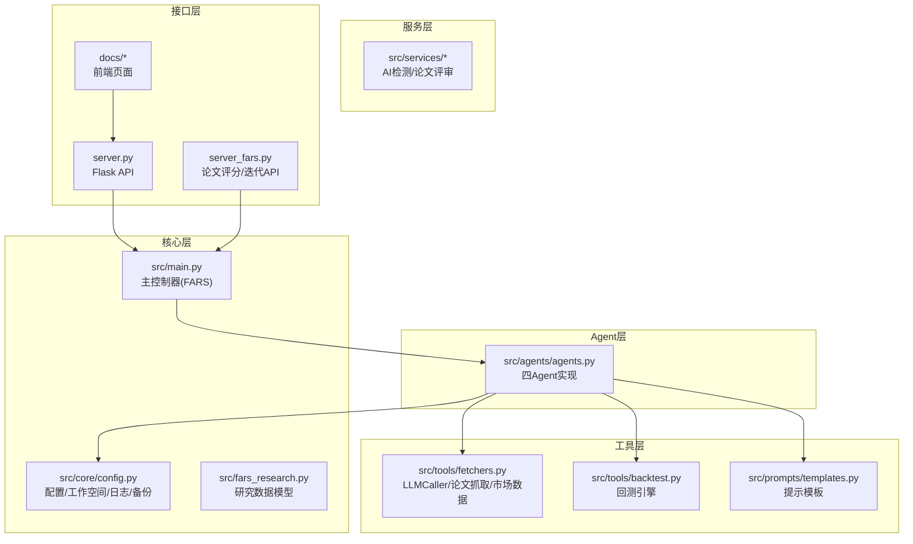
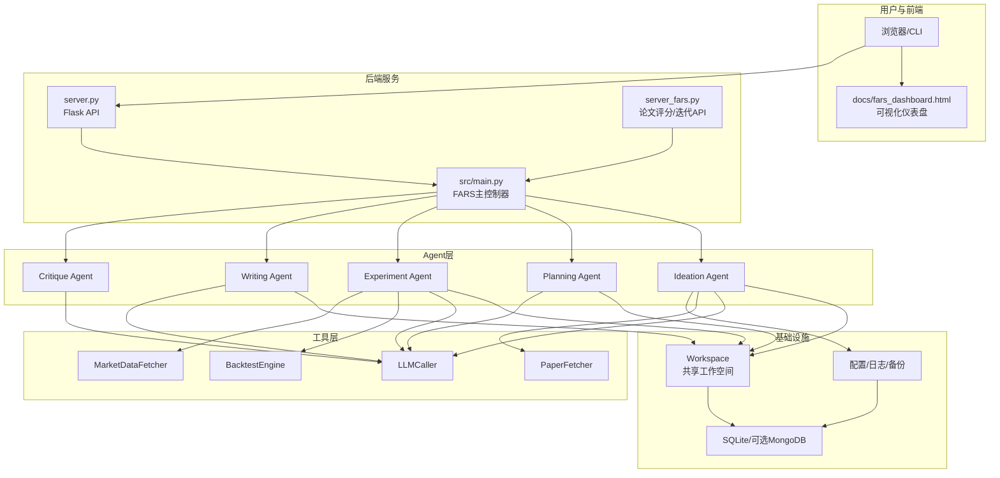
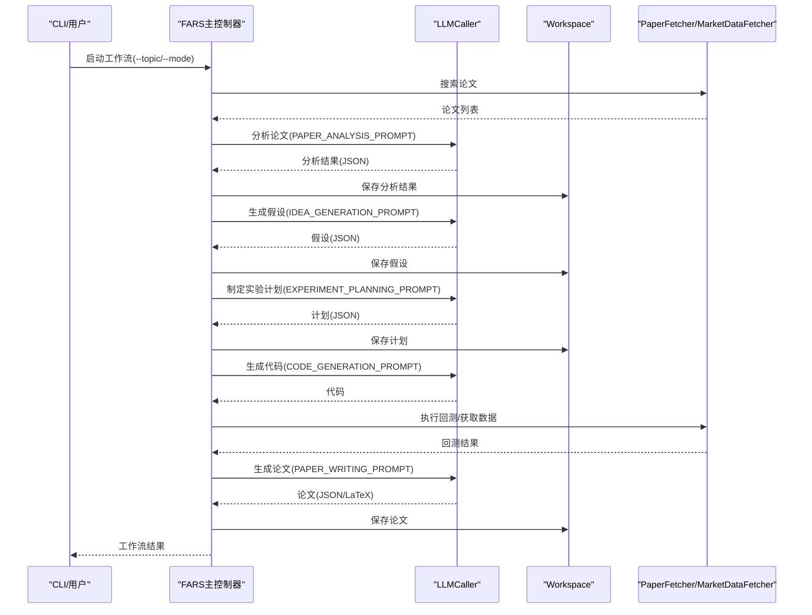
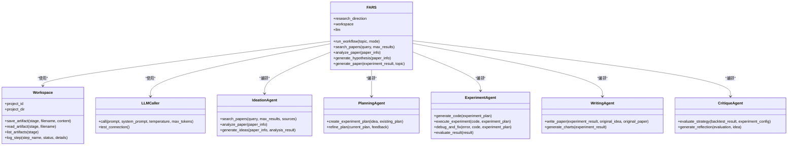
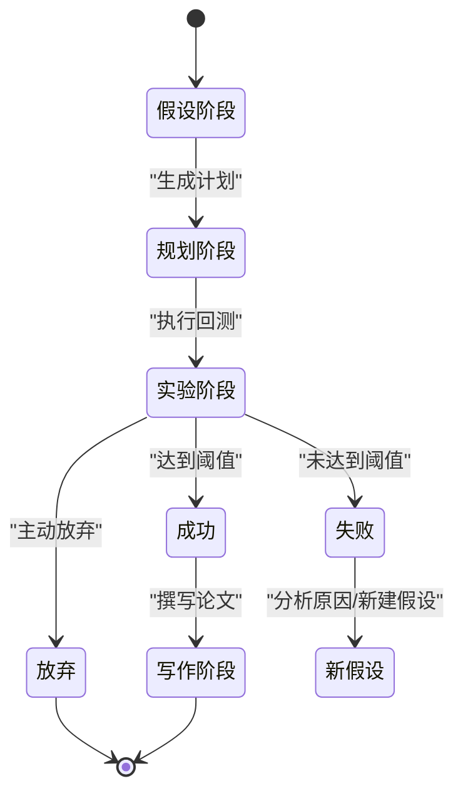
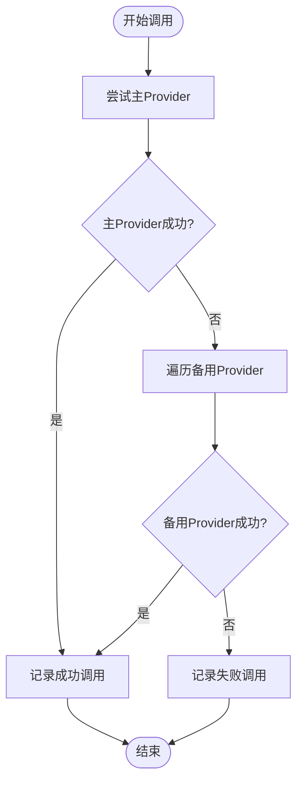
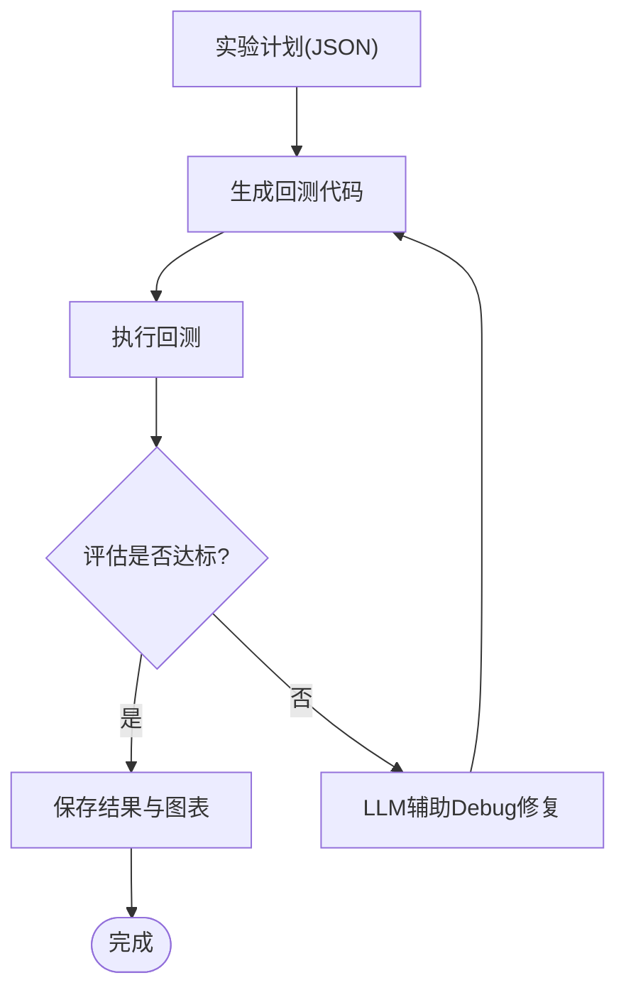

# 系统架构设计

<cite>
**本文档引用的文件**
- [src/main.py](file://src/main.py)
- [src/fars_research.py](file://src/fars_research.py)
- [server.py](file://server.py)
- [server_fars.py](file://server_fars.py)
- [src/core/config.py](file://src/core/config.py)
- [src/agents/agents.py](file://src/agents/agents.py)
- [src/tools/fetchers.py](file://src/tools/fetchers.py)
- [src/prompts/templates.py](file://src/prompts/templates.py)
- [src/tools/backtest.py](file://src/tools/backtest.py)
- [AGENTS.md](file://AGENTS.md)
- [docs/FARS_ARCHITECTURE.md](file://docs/FARS_ARCHITECTURE.md)
- [requirements.txt](file://requirements.txt)
</cite>

## 目录
1. [系统概述](#系统概述)
2. [项目结构](#项目结构)
3. [核心组件](#核心组件)
4. [架构总览](#架构总览)
5. [详细组件分析](#详细组件分析)
6. [依赖关系分析](#依赖关系分析)
7. [性能考量](#性能考量)
8. [故障排查指南](#故障排查指南)
9. [结论](#结论)
10. [附录](#附录)

## 系统概述

FARS（Fully Automated Research System）是一个面向量化金融与金融科技领域的全自动学术论文生成系统。系统以多Agent协作为核心，围绕“种子论文”驱动，实现从文献分析→假设生成→实验设计→回测验证→论文撰写→质量评估的完整闭环。

- **系统边界**：系统由主控制器（FARS类）、Agent层、工具层、服务层、提示模板层以及前端界面组成，通过统一的工作空间（Workspace）进行数据与状态共享。
- **架构模式**：采用主控制器-多Agent协作模式，结合工具模块化与提示模板标准化，形成可扩展的研究流水线。
- **关键技术决策**：
  - 使用多Provider LLM调用器（LLMCaller）实现主备自动切换，提升鲁棒性。
  - 通过分块论文生成（ChunkedPaperGenerator）规避API Token限制。
  - 采用Backtrader进行回测，结合多种评估指标保障实验质量。
  - 使用D3.js可视化研究拓扑与状态。

**章节来源**
- [AGENTS.md: 1-157:1-157](file://AGENTS.md#L1-L157)
- [docs/FARS_ARCHITECTURE.md: 1-257:1-257](file://docs/FARS_ARCHITECTURE.md#L1-L257)

## 项目结构

系统采用分层架构，文件组织遵循“功能域+层次”的原则：

- **src/**：核心业务代码
  - **core/**：配置管理、工作空间、数据库、研究引擎等基础能力
  - **agents/**：四Agent实现（Ideation/Planning/Experiment/Writing/Critique）
  - **tools/**：论文抓取、数据获取、回测引擎、LLM调用、质量流水线等工具
  - **prompts/**：统一的提示模板库
  - **services/**：AI检测、论文评审等服务
- **docs/**：前端页面与文档
- **data/**：运行时数据、研究状态、分支管理、论文归档等
- **scripts/**：论文生成脚本（如分块生成器）

**图表来源**
- [src/main.py: 35-100:35-100](file://src/main.py#L35-L100)
- [src/agents/agents.py: 23-738:23-738](file://src/agents/agents.py#L23-L738)
- [src/tools/fetchers.py: 290-800:290-800](file://src/tools/fetchers.py#L290-L800)
- [src/tools/backtest.py: 181-433:181-433](file://src/tools/backtest.py#L181-L433)
- [src/prompts/templates.py: 1-758:1-758](file://src/prompts/templates.py#L1-L758)
- [src/core/config.py: 254-384:254-384](file://src/core/config.py#L254-L384)
- [server.py: 75-800:75-800](file://server.py#L75-L800)
- [server_fars.py: 13-800:13-800](file://server_fars.py#L13-L800)

**章节来源**
- [AGENTS.md: 18-57:18-57](file://AGENTS.md#L18-L57)
- [docs/FARS_ARCHITECTURE.md: 188-216:188-216](file://docs/FARS_ARCHITECTure.md#L188-L216)

## 核心组件

- **主控制器（FARS类）**：负责研究方向配置、LLM初始化、工具装配、工作流编排与CLI入口。
- **工作空间（Workspace）**：统一的共享存储与日志备份，按阶段划分目录（ideas/plans/experiments/papers/data/charts/logs/backups/uploads）。
- **四Agent协作**：
  - **Ideation Agent**：论文搜索与分析，生成交易假设
  - **Planning Agent**：制定实验计划与优化
  - **Experiment Agent**：代码生成、回测执行、错误修复与结果评估
  - **Writing Agent**：论文撰写与图表生成
  - **Critique Agent**：策略评估与反思
- **工具模块**：
  - **LLMCaller**：多Provider自动切换与调用记录
  - **PaperFetcher/MarketDataFetcher**：论文与市场数据获取
  - **BacktestEngine**：基于Backtrader的回测框架
- **提示模板**：统一的系统提示与各Agent专用模板
- **服务模块**：AI检测与论文评审服务

**章节来源**
- [src/main.py: 35-100:35-100](file://src/main.py#L35-L100)
- [src/core/config.py: 254-384:254-384](file://src/core/config.py#L254-L384)
- [src/agents/agents.py: 23-738:23-738](file://src/agents/agents.py#L23-L738)
- [src/tools/fetchers.py: 290-800:290-800](file://src/tools/fetchers.py#L290-L800)
- [src/tools/backtest.py: 181-433:181-433](file://src/tools/backtest.py#L181-L433)
- [src/prompts/templates.py: 1-758:1-758](file://src/prompts/templates.py#L1-L758)

## 架构总览

**图表来源**
- [src/main.py: 35-100:35-100](file://src/main.py#L35-L100)
- [src/agents/agents.py: 23-738:23-738](file://src/agents/agents.py#L23-L738)
- [src/tools/fetchers.py: 290-800:290-800](file://src/tools/fetchers.py#L290-L800)
- [src/tools/backtest.py: 181-433:181-433](file://src/tools/backtest.py#L181-L433)
- [server.py: 75-800:75-800](file://server.py#L75-L800)
- [server_fars.py: 13-800:13-800](file://server_fars.py#L13-L800)

## 详细组件分析

### 主控制器（FARS类）

- **职责**：初始化研究方向与工作空间、装配LLM与工具、编排完整工作流、提供CLI入口。
- **关键流程**：
  - 初始化LLMCaller（支持主备Provider自动切换）
  - 搜索论文、分析论文、生成假设、回测实验、生成论文
  - 记录工作流步骤与状态，便于追踪与恢复
- **集成点**：
  - 与Workspace共享工件（ideas/plans/experiments/papers）
  - 与Prompt模板配合生成结构化输出
  - 与LLMCaller协作完成多轮对话与结果抽取

**图表来源**
- [src/main.py: 353-427:353-427](file://src/main.py#L353-L427)
- [src/agents/agents.py: 87-162:87-162](file://src/agents/agents.py#L87-L162)
- [src/prompts/templates.py: 88-156:88-156](file://src/prompts/templates.py#L88-L156)

**章节来源**
- [src/main.py: 35-100:35-100](file://src/main.py#L35-L100)
- [src/main.py: 170-352:170-352](file://src/main.py#L170-L352)

### 四Agent协作架构

- **Ideation Agent**：负责从arXiv/Semantic Scholar获取论文，深度分析并生成可量化的交易假设。
- **Planning Agent**：将假设转化为可执行的实验计划，设定评估指标与成功标准。
- **Experiment Agent**：生成回测代码、执行回测、评估结果、错误自愈与修复。
- **Writing Agent**：基于实验结果撰写完整论文，生成LaTeX源码与图表。
- **Critique Agent**：对策略进行评估与反思，提供改进建议。

**图表来源**
- [src/main.py: 35-100:35-100](file://src/main.py#L35-L100)
- [src/core/config.py: 254-384:254-384](file://src/core/config.py#L254-L384)
- [src/agents/agents.py: 23-738:23-738](file://src/agents/agents.py#L23-L738)

**章节来源**
- [src/agents/agents.py: 23-738:23-738](file://src/agents/agents.py#L23-L738)

### 研究数据模型与拓扑

- **研究状态**：HYPOTHESIS → PLANNING → EXPERIMENTING → SUCCESS/FAILED/ABANDONED
- **数据模型**：Hypothesis/Experiment/Paper/ResearchTopology，支持拓扑重建与统计分析
- **数据库**：默认SQLite，可选MongoDB用于语义检索

**图表来源**
- [src/fars_research.py: 28-46:28-46](file://src/fars_research.py#L28-L46)
- [src/fars_research.py: 406-466:406-466](file://src/fars_research.py#L406-L466)

**章节来源**
- [src/fars_research.py: 110-333:110-333](file://src/fars_research.py#L110-L333)

### LLM调用与多Provider切换

- **LLMCaller**：统一封装OpenAI、Anthropic、DeepSeek、MiniMax、Ollama等Provider，支持主备自动切换与调用记录。
- **调用统计**：记录prompt/completion token用量、延迟、状态与错误详情，便于成本与质量追踪。
- **配置优先级**：config.local.json > config.json > 环境变量

**图表来源**
- [src/tools/fetchers.py: 290-450:290-450](file://src/tools/fetchers.py#L290-L450)

**章节来源**
- [src/tools/fetchers.py: 290-800:290-800](file://src/tools/fetchers.py#L290-L800)

### 回测与实验评估

- **BacktestEngine**：基于Backtrader，提供动量与均值回归策略示例，支持指标计算（夏普比率、最大回撤、胜率、IC等）。
- **实验Agent**：生成代码、执行回测、评估结果、错误修复与重试。

**图表来源**
- [src/tools/backtest.py: 181-327:181-327](file://src/tools/backtest.py#L181-L327)
- [src/agents/agents.py: 279-497:279-497](file://src/agents/agents.py#L279-L497)

**章节来源**
- [src/tools/backtest.py: 181-433:181-433](file://src/tools/backtest.py#L181-L433)
- [src/agents/agents.py: 279-497:279-497](file://src/agents/agents.py#L279-L497)

### 前端与可视化

- **仪表盘**：D3.js力导向图展示假设→实验→论文拓扑关系，支持统计卡片与状态颜色编码。
- **API端点**：提供研究流程、论文分析、文献综述、质量流水线、种子论文、分支管理等REST接口。

**章节来源**
- [docs/FARS_ARCHITECTURE.md: 169-187:169-187](file://docs/FARS_ARCHITECTURE.md#L169-L187)
- [AGENTS.md: 136-148:136-148](file://AGENTS.md#L136-L148)

## 依赖关系分析

- **技术栈与第三方依赖**：OpenAI、Anthropic、arxiv、yfinance、akshare、backtrader、backtesting、pandas、numpy、matplotlib、seaborn、pymongo、transformers、torch、scikit-learn、python-dateutil、tqdm、rich。
- **版本兼容性**：Python 3.12+，依赖版本在requirements.txt中声明，建议使用虚拟环境隔离。
- **配置与环境**：config.json（默认模板，不跟踪）、config.local.json（本地覆盖，不跟踪）、环境变量（API Key优先级最高）。

```mermaid
graph TB
REQ["requirements.txt<br/>第三方依赖清单"]
PY["Python 3.12+"]
OPENAI["openai>=1.0.0"]
ANTHROPIC["anthropic>=0.20.0"]
ARXIV["arxiv>=0.6.2"]
YF["yfinance>=0.2.0"]
AK["akshare>=1.12.0"]
BT["backtrader>=1.9.0"]
BTK["backtesting>=0.2.0"]
PD["pandas>=2.0.0"]
NP["numpy>=1.24.0"]
MATPLOTLIB["matplotlib>=3.7.0"]
SEABORN["seaborn>=0.12.0"]
MONGO["pymongo>=4.5.0"]
TRANSFORMERS["transformers>=4.35.0"]
TORCH["torch>=2.0.0"]
SKLEARN["scikit-learn>=1.3.0"]
REQ --> PY
REQ --> OPENAI
REQ --> ANTHROPIC
REQ --> ARXIV
REQ --> YF
REQ --> AK
REQ --> BT
REQ --> BTK
REQ --> PD
REQ --> NP
REQ --> MATPLOTLIB
REQ --> SEABORN
REQ --> MONGO
REQ --> TRANSFORMERS
REQ --> TORCH
REQ --> SKLEARN
```

**图表来源**
- [requirements.txt: 1-39:1-39](file://requirements.txt#L1-L39)

**章节来源**
- [requirements.txt: 1-39:1-39](file://requirements.txt#L1-L39)
- [src/core/config.py: 462-514:462-514](file://src/core/config.py#L462-L514)

## 性能考量

- **LLM调用优化**：
  - 主备Provider自动切换，提升可用性与稳定性
  - 统一超时与重试策略，避免阻塞
  - 调用统计与日志记录，便于成本与性能分析
- **论文生成优化**：
  - 分块论文生成（8个章节），控制prompt大小，提高成功率
  - 上下文传递（前3章摘要），平衡上下文与效率
- **回测性能**：
  - Backtrader框架高效回测，支持多种分析器
  - 指标计算（夏普、IC、IR等）标准化，便于横向比较
- **存储与备份**：
  - Workspace按阶段目录组织，便于增量更新与版本控制
  - 自动备份与恢复机制，降低数据丢失风险

**章节来源**
- [docs/FARS_ARCHITECTURE.md: 83-107:83-107](file://docs/FARS_ARCHITECTURE.md#L83-L107)
- [src/tools/fetchers.py: 290-450:290-450](file://src/tools/fetchers.py#L290-L450)
- [src/tools/backtest.py: 181-327:181-327](file://src/tools/backtest.py#L181-L327)

## 故障排查指南

- **LLM调用失败**：
  - 检查API Key配置（config.local.json或环境变量）
  - 查看调用记录（llm_call_logs.json），定位错误详情
  - 启用备用Provider（Ollama本地模型）
- **回测异常**：
  - 检查数据源可用性（yfinance/akshare）
  - 查看实验Agent的错误修复输出
  - 核对实验计划与数据范围
- **论文生成失败**：
  - 检查分块生成配置与上下文大小
  - 确认LaTeX编译环境（如需）
- **系统状态与日志**：
  - 使用FARS.get_status()查看系统状态
  - 检查Workspace日志与备份目录

**章节来源**
- [src/tools/fetchers.py: 324-390:324-390](file://src/tools/fetchers.py#L324-L390)
- [src/main.py: 429-438:429-438](file://src/main.py#L429-L438)
- [src/core/config.py: 98-187:98-187](file://src/core/config.py#L98-L187)

## 结论

FARS系统通过主控制器-多Agent协作架构，实现了从种子论文到学术论文的自动化研究闭环。系统在技术决策上强调鲁棒性（多Provider切换）、可扩展性（分层模块化）、可观测性（调用统计与日志）与可维护性（Workspace统一存储）。结合Backtrader回测与LaTeX论文生成，系统能够稳定地产出高质量的研究成果，并通过可视化仪表盘直观呈现研究进展与拓扑关系。

## 附录

- **启动方式**：
  - 安装依赖：pip install -r requirements.txt
  - 配置API Key（config.local.json或环境变量）
  - 启动服务器：python server.py
  - CLI模式：python src/main.py --direction quant_finance --topic "LLM in trading"
- **API端点概览**：见AGENTS.md第136-148行
- **配置文件**：config.json（默认模板）、config.local.json（本地覆盖）、config.py（Python配置管理）

**章节来源**
- [AGENTS.md: 117-134:117-134](file://AGENTS.md#L117-L134)
- [AGENTS.md: 136-148:136-148](file://AGENTS.md#L136-L148)
- [src/core/config.py: 420-484:420-484](file://src/core/config.py#L420-L484)