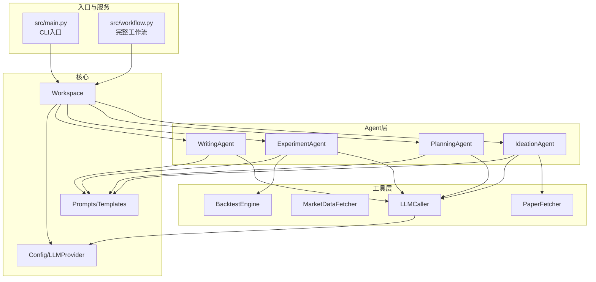
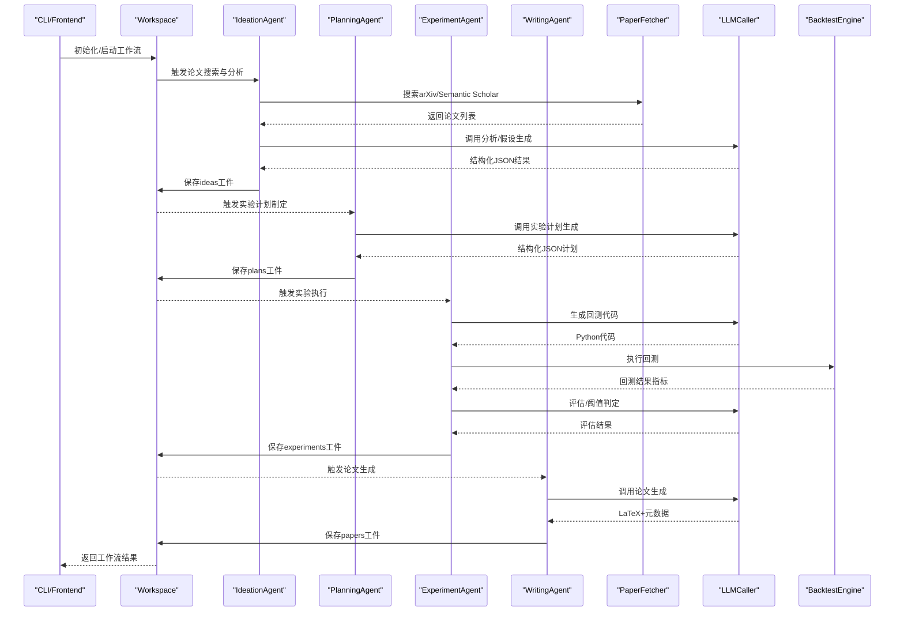
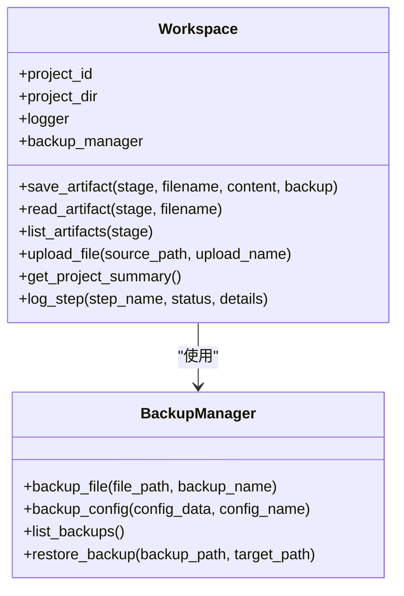
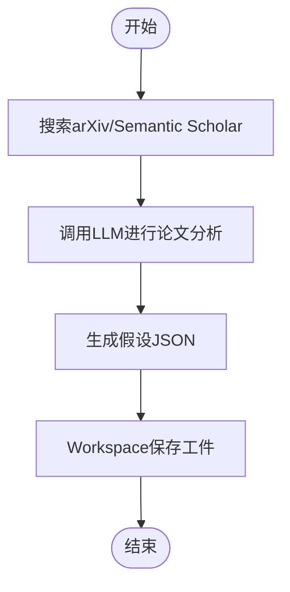
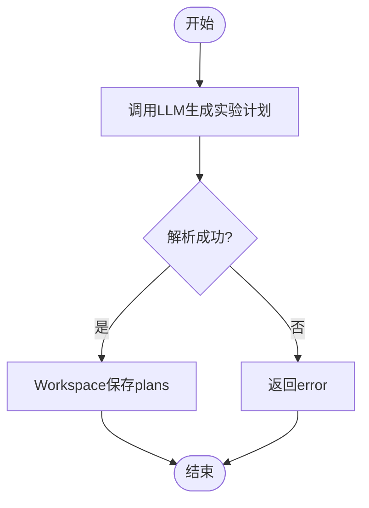
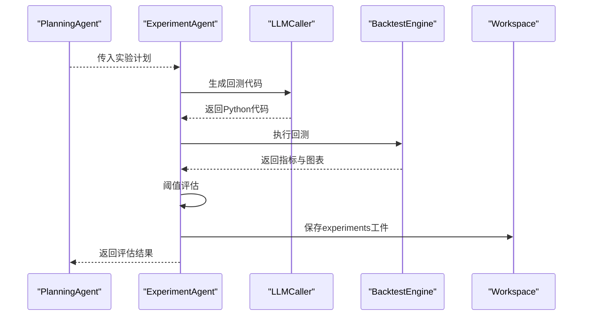
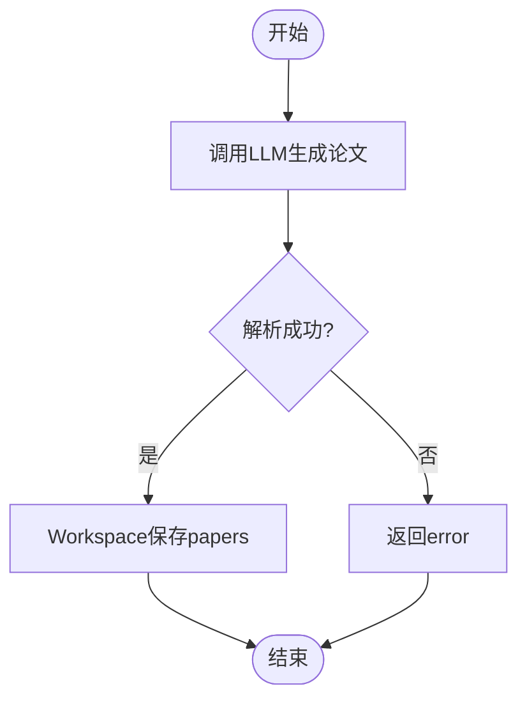
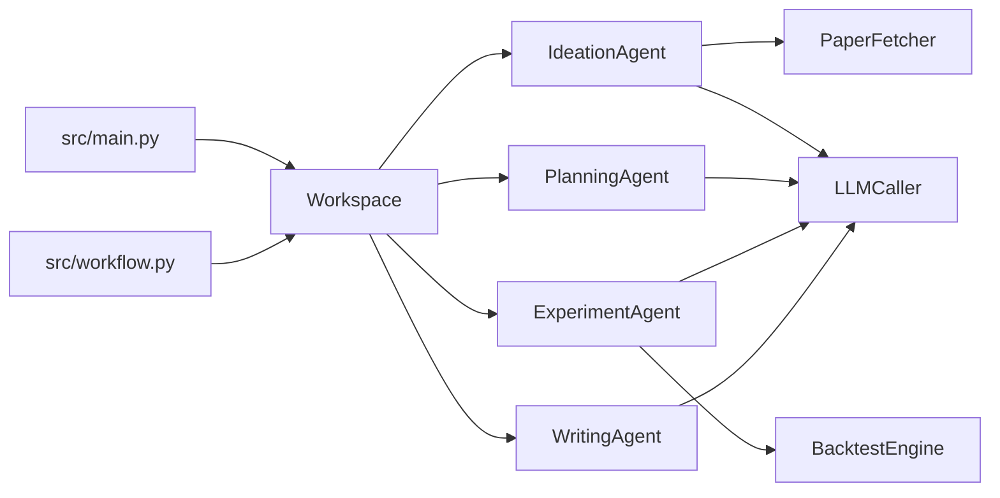

# 组件交互模式

<cite>
**本文引用的文件**
- [src/main.py](file://src/main.py)
- [src/workflow.py](file://src/workflow.py)
- [src/agents/agents.py](file://src/agents/agents.py)
- [src/tools/fetchers.py](file://src/tools/fetchers.py)
- [src/core/config.py](file://src/core/config.py)
- [src/prompts/templates.py](file://src/prompts/templates.py)
- [src/tools/backtest.py](file://src/tools/backtest.py)
- [AGENTS.md](file://AGENTS.md)
</cite>

## 目录
1. [简介](#简介)
2. [项目结构](#项目结构)
3. [核心组件](#核心组件)
4. [架构总览](#架构总览)
5. [详细组件分析](#详细组件分析)
6. [依赖关系分析](#依赖关系分析)
7. [性能考量](#性能考量)
8. [故障排查指南](#故障排查指南)
9. [结论](#结论)
10. [附录](#附录)

## 简介
本文件聚焦 paperwriterAI 的多 Agent 协作架构，系统性阐述 Ideation Agent、Planning Agent、Experiment Agent、Writing Agent 之间的交互协议与数据传递机制；说明 Workspace 作为中央协调器如何管理状态同步与资源共享；梳理工具模块与 Agent 的集成模式（PaperFetcher、MarketDataFetcher、LLMCaller 等）；并给出错误处理与异常传播机制及解耦设计原则。同时提供交互时序图与状态转换图，帮助读者快速把握典型工作流中的组件协作过程。

## 项目结构
- 后端核心由 server.py 提供 API，CLI 由 src/main.py 提供；研究流水线由 src/workflow.py 和 src/core/research_runner.py 驱动。
- Agent 层集中于 src/agents/agents.py，包含 Ideation、Planning、Experiment、Writing 四类 Agent。
- 工具层位于 src/tools，涵盖 PaperFetcher、MarketDataFetcher、LLMCaller、BacktestEngine 等。
- 配置与工作空间由 src/core/config.py 提供，包含 Workspace、日志、备份、LLM Provider 等。
- Prompt 模板位于 src/prompts/templates.py，为各 Agent 提供标准化提示词。

**图表来源**
- [src/main.py:35-100](file://src/main.py#L35-L100)
- [src/workflow.py:19-37](file://src/workflow.py#L19-L37)
- [src/agents/agents.py:23-195](file://src/agents/agents.py#L23-L195)
- [src/tools/fetchers.py:20-162](file://src/tools/fetchers.py#L20-L162)
- [src/core/config.py:256-384](file://src/core/config.py#L256-L384)
- [src/prompts/templates.py:8-23](file://src/prompts/templates.py#L8-L23)

**章节来源**
- [AGENTS.md:18-57](file://AGENTS.md#L18-L57)
- [src/main.py:35-100](file://src/main.py#L35-L100)
- [src/workflow.py:19-37](file://src/workflow.py#L19-L37)

## 核心组件
- Workspace：统一的工作空间与状态协调器，负责目录初始化、工件保存/读取、日志记录、备份管理、项目摘要等。
- LLMCaller：统一封装多 Provider 的 LLM 调用，支持主备切换、调用统计与日志记录。
- PaperFetcher/MarketDataFetcher：论文与市场数据获取工具，提供 arXiv/Semantic Scholar、yfinance/akshare 等接口。
- BacktestEngine：基于 Backtrader 的回测引擎，提供策略基类、示例策略与指标计算。
- Prompts/Templates：为各 Agent 提供标准化提示词模板，保证输出结构化 JSON。

**章节来源**
- [src/core/config.py:256-384](file://src/core/config.py#L256-L384)
- [src/tools/fetchers.py:290-450](file://src/tools/fetchers.py#L290-L450)
- [src/tools/fetchers.py:20-162](file://src/tools/fetchers.py#L20-L162)
- [src/tools/backtest.py:181-347](file://src/tools/backtest.py#L181-L347)
- [src/prompts/templates.py:8-23](file://src/prompts/templates.py#L8-L23)

## 架构总览
多 Agent 协作遵循“提示词驱动 + 工件流转”的模式：
- Ideation Agent：从 arXiv/Semantic Scholar 获取论文，进行深度分析与假设生成，产出 ideas。
- Planning Agent：将假设转化为实验计划，设定评估指标与步骤。
- Experiment Agent：生成回测代码、执行回测、评估结果、必要时进行 Debug 修复。
- Writing Agent：基于实验结果撰写论文，输出 LaTeX 源码与元数据。
- Workspace：贯穿全链路，负责工件存储、日志记录、状态同步与资源管理。

**图表来源**
- [src/agents/agents.py:23-195](file://src/agents/agents.py#L23-L195)
- [src/agents/agents.py:197-277](file://src/agents/agents.py#L197-L277)
- [src/agents/agents.py:279-497](file://src/agents/agents.py#L279-L497)
- [src/agents/agents.py:499-651](file://src/agents/agents.py#L499-L651)
- [src/tools/fetchers.py:20-162](file://src/tools/fetchers.py#L20-L162)
- [src/tools/fetchers.py:290-450](file://src/tools/fetchers.py#L290-L450)
- [src/tools/backtest.py:181-347](file://src/tools/backtest.py#L181-L347)
- [src/core/config.py:256-384](file://src/core/config.py#L256-L384)

## 详细组件分析

### Workspace：中央协调器
- 职责
  - 初始化项目目录与阶段子目录（ideas/plans/experiments/papers/data/charts/logs/backups/uploads）。
  - 提供 save_artifact/read_artifact/list_artifacts/upload_file 等统一接口，实现工件的持久化与版本备份。
  - 记录工作流步骤日志，便于审计与回溯。
  - 提供项目摘要 get_project_summary，汇总各阶段工件数量与备份情况。
- 与 Agent 的交互
  - Agent 在完成阶段性成果后，通过 Workspace.save_artifact 将 JSON/文本/图表等工件落盘。
  - Agent 通过 Workspace.logger 记录步骤状态，便于 Workflow 层感知。
- 与配置的耦合
  - 通过 CONFIG 获取 LLM Provider、回测参数、评估阈值等全局配置。
- 错误处理
  - 文件存在性检查、备份失败日志记录、读取不存在工件的警告。

**图表来源**
- [src/core/config.py:256-384](file://src/core/config.py#L256-L384)
- [src/core/config.py:98-187](file://src/core/config.py#L98-L187)

**章节来源**
- [src/core/config.py:256-384](file://src/core/config.py#L256-L384)

### Ideation Agent：论文搜索与假设生成
- 职责
  - 搜索 arXiv/Semantic Scholar，去重合并，返回论文列表。
  - 调用 LLM 对论文进行深度分析，提取方法论、关键发现、可编程因子等。
  - 基于分析结果生成交易假设，输出结构化 JSON，并保存到 Workspace。
- 通信协议
  - 输入：query、max_results、sources。
  - 输出：论文列表；分析 JSON；假设 JSON。
- 数据传递
  - PaperFetcher 返回论文元信息；LLMCaller 返回结构化 JSON；Workspace 保存工件。
- 错误处理
  - LLM 解析失败时返回 error 字段；PaperFetcher 异常捕获并返回空列表。

**图表来源**
- [src/agents/agents.py:42-194](file://src/agents/agents.py#L42-L194)
- [src/tools/fetchers.py:27-121](file://src/tools/fetchers.py#L27-L121)
- [src/prompts/templates.py:88-156](file://src/prompts/templates.py#L88-L156)

**章节来源**
- [src/agents/agents.py:23-195](file://src/agents/agents.py#L23-L195)

### Planning Agent：实验计划制定
- 职责
  - 将假设转化为可执行的实验计划，包含数据配置、回测配置、评估指标、步骤清单、备选策略与风险缓解措施。
  - 可根据反馈优化计划（refine_plan）。
- 通信协议
  - 输入：idea（包含假设详情）。
  - 输出：实验计划 JSON。
- 数据传递
  - LLMCaller 生成计划；Workspace 保存 plans 工件。
- 错误处理
  - LLM 解析失败时返回 error 字段。

**图表来源**
- [src/agents/agents.py:215-277](file://src/agents/agents.py#L215-L277)
- [src/prompts/templates.py:160-234](file://src/prompts/templates.py#L160-L234)

**章节来源**
- [src/agents/agents.py:197-277](file://src/agents/agents.py#L197-L277)

### Experiment Agent：实验执行与回测
- 职责
  - 根据实验计划生成回测代码，执行回测，评估结果（阈值判定），必要时进行 Debug 修复。
  - 通过 BacktestEngine 执行策略，计算指标并生成图表。
- 通信协议
  - 输入：experiment_plan。
  - 输出：回测结果 JSON（包含指标、图表路径、状态）。
- 数据传递
  - LLMCaller 生成代码；BacktestEngine 执行回测；Workspace 保存 experiments 工件。
- 错误处理
  - 代码执行失败时，调用 LLMCaller 进行 Debug 并保存修复后的代码；多次重试后仍失败则返回 error。

**图表来源**
- [src/agents/agents.py:302-497](file://src/agents/agents.py#L302-L497)
- [src/tools/backtest.py:181-347](file://src/tools/backtest.py#L181-L347)
- [src/prompts/templates.py:239-305](file://src/prompts/templates.py#L239-L305)

**章节来源**
- [src/agents/agents.py:279-497](file://src/agents/agents.py#L279-L497)

### Writing Agent：论文撰写
- 职责
  - 基于实验结果撰写论文，输出 LaTeX 源码与元数据（参考文献、图表需求等）。
  - 可生成图表代码并保存到 Workspace。
- 通信协议
  - 输入：experiment_result、original_idea、original_paper。
  - 输出：论文 JSON（包含 tex_content、references、charts_needed 等）。
- 数据传递
  - LLMCaller 生成论文；Workspace 保存 papers 工件。
- 错误处理
  - LLM 解析失败时返回 error 字段。

**图表来源**
- [src/agents/agents.py:517-651](file://src/agents/agents.py#L517-L651)
- [src/prompts/templates.py:357-389](file://src/prompts/templates.py#L357-L389)

**章节来源**
- [src/agents/agents.py:499-651](file://src/agents/agents.py#L499-L651)

### 工具模块与 Agent 的集成模式
- PaperFetcher
  - 为 Ideation Agent 提供论文搜索与解析能力，支持 arXiv 与 Semantic Scholar。
  - 通过 Workspace 保存解析后的论文 JSON。
- MarketDataFetcher
  - 为 Experiment Agent 提供美股/港股数据获取能力，支持 yfinance/akshare。
  - Agent 可在实验计划中声明数据需求，回测时按需拉取。
- LLMCaller
  - 统一封装多 Provider（OpenAI、Anthropic、DeepSeek、MiniMax、Ollama）调用，支持主备切换与调用统计。
  - 为各 Agent 提供稳定的提示词注入与结构化 JSON 输出保障。
- BacktestEngine
  - 为 Experiment Agent 提供策略回测执行与指标计算，支持多种分析器与可视化。

**章节来源**
- [src/tools/fetchers.py:20-162](file://src/tools/fetchers.py#L20-L162)
- [src/tools/fetchers.py:290-450](file://src/tools/fetchers.py#L290-L450)
- [src/tools/backtest.py:181-347](file://src/tools/backtest.py#L181-L347)

### 错误处理与异常传播机制
- LLM 调用失败
  - LLMCaller 会记录失败调用并尝试备用 Provider；若全部失败，返回 None 并记录错误。
- Agent 解析失败
  - 各 Agent 在解析 LLM 输出为 JSON 失败时，返回包含 error 的字典，避免中断后续流程。
- 回测执行失败
  - Experiment Agent 在执行失败时，调用 LLMCaller 进行 Debug 并保存修复后的代码；支持多次重试。
- Workspace 备份与日志
  - Workspace 在覆盖写入前自动备份旧文件；日志记录步骤状态与细节，便于审计与恢复。

**章节来源**
- [src/tools/fetchers.py:415-449](file://src/tools/fetchers.py#L415-L449)
- [src/agents/agents.py:118-162](file://src/agents/agents.py#L118-L162)
- [src/agents/agents.py:429-462](file://src/agents/agents.py#L429-L462)
- [src/core/config.py:98-187](file://src/core/config.py#L98-L187)

### 解耦设计原则
- 统一接口：Workspace 提供 save_artifact/read_artifact/list_artifacts，Agent 仅依赖接口，不关心底层存储细节。
- 提示词驱动：各 Agent 通过 Prompts/Templates 生成标准化输入，减少对具体实现的耦合。
- 工件化：中间产物以 JSON/文本/图表形式落盘，便于 Agent 间解耦与复用。
- 工具抽象：PaperFetcher/MarketDataFetcher/LLMCaller/BacktestEngine 以类封装，Agent 仅通过方法调用使用，降低变更影响面。

**章节来源**
- [src/core/config.py:280-323](file://src/core/config.py#L280-L323)
- [src/prompts/templates.py:679-707](file://src/prompts/templates.py#L679-L707)

## 依赖关系分析
- Agent 依赖 Workspace 进行工件管理与日志记录。
- Agent 依赖 LLMCaller 进行结构化 JSON 输出。
- Experiment Agent 依赖 BacktestEngine 执行回测。
- Ideation Agent 依赖 PaperFetcher 获取论文。
- 写作与工作流：CLI/Frontend 通过 Workspace 触发 Agent 流程；Workflow 层负责端到端编译、AI检测、投稿等后续步骤。

**图表来源**
- [src/agents/agents.py:23-651](file://src/agents/agents.py#L23-L651)
- [src/tools/fetchers.py:20-800](file://src/tools/fetchers.py#L20-L800)
- [src/tools/backtest.py:181-347](file://src/tools/backtest.py#L181-L347)
- [src/core/config.py:256-384](file://src/core/config.py#L256-L384)
- [src/main.py:35-100](file://src/main.py#L35-L100)
- [src/workflow.py:19-37](file://src/workflow.py#L19-L37)

**章节来源**
- [src/agents/agents.py:23-651](file://src/agents/agents.py#L23-L651)
- [src/tools/fetchers.py:20-800](file://src/tools/fetchers.py#L20-L800)
- [src/tools/backtest.py:181-347](file://src/tools/backtest.py#L181-L347)
- [src/core/config.py:256-384](file://src/core/config.py#L256-L384)
- [src/main.py:35-100](file://src/main.py#L35-L100)
- [src/workflow.py:19-37](file://src/workflow.py#L19-L37)

## 性能考量
- LLM 调用
  - LLMCaller 支持主备切换与调用统计，避免单点故障；建议在高并发场景下增加队列与限流。
- 回测执行
  - BacktestEngine 基于 Backtrader，建议在大规模数据回测时采用分批数据与并行策略（需在 Agent 层扩展）。
- 文件 I/O
  - Workspace 的 save_artifact 会在覆盖写入前备份，频繁覆盖会影响性能；建议在批量写入时合并操作或延迟备份。
- 提示词长度
  - Prompt 模板较长时可能触发上下文窗口限制，建议在 Agent 层对输入进行裁剪与摘要。

[本节为通用指导，无需特定文件引用]

## 故障排查指南
- LLM 调用失败
  - 检查 API Key 与 Provider 配置；查看 LLMCaller 的调用日志；确认备用 Provider 是否可用。
- 回测执行失败
  - 查看 Experiment Agent 的错误日志与修复后的代码；确认数据源可用性与策略参数合理性。
- 工件缺失
  - 检查 Workspace 的工件目录是否存在；查看备份文件是否可恢复。
- 日志审计
  - 通过 Workspace.log_step 与 Workspace.logger 的日志定位问题发生阶段。

**章节来源**
- [src/tools/fetchers.py:415-449](file://src/tools/fetchers.py#L415-L449)
- [src/agents/agents.py:429-462](file://src/agents/agents.py#L429-L462)
- [src/core/config.py:368-384](file://src/core/config.py#L368-L384)

## 结论
paperwriterAI 通过 Workspace 实现多 Agent 的解耦协作，借助统一的提示词模板与工具抽象，形成“搜索→分析→计划→回测→撰写”的闭环。LLMCaller、PaperFetcher、MarketDataFetcher、BacktestEngine 等工具模块与 Agent 的集成模式清晰，具备良好的扩展性与可维护性。通过完善的错误处理与日志记录，系统能够在复杂工作流中稳定运行并支持断点续传与优雅降级。

[本节为总结，无需特定文件引用]

## 附录
- 典型工作流时序图与状态转换图见“架构总览”与“详细组件分析”相应小节。
- 配置与提示词模板参见对应文件。

[本节为补充说明，无需特定文件引用]