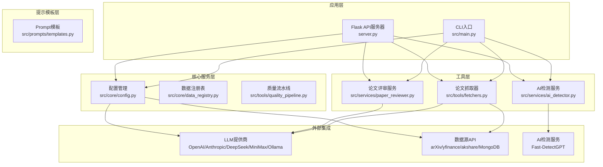
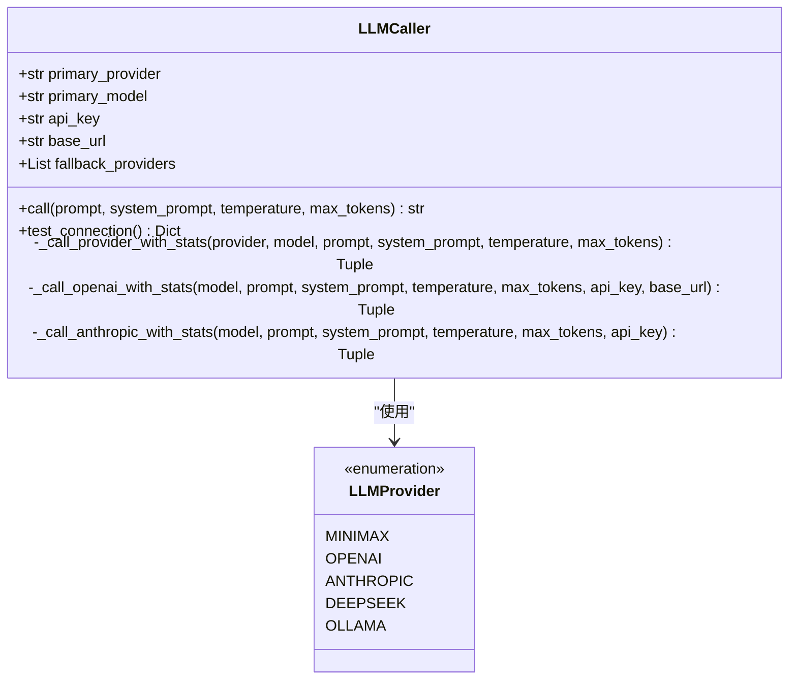
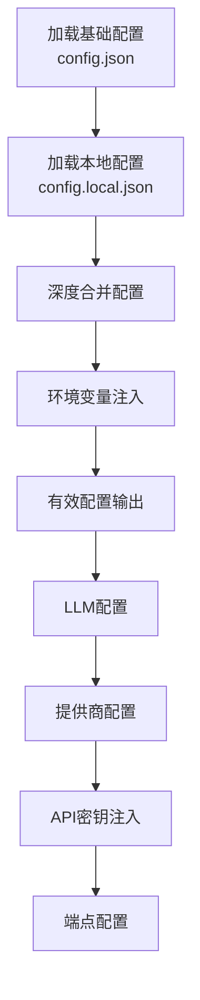
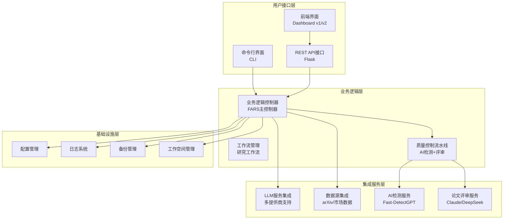
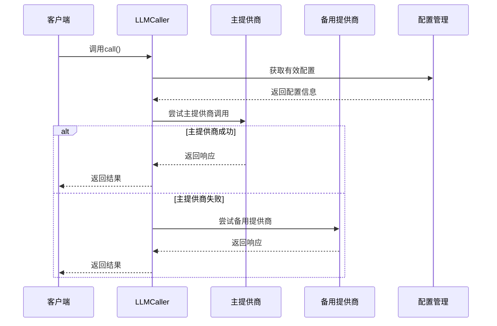
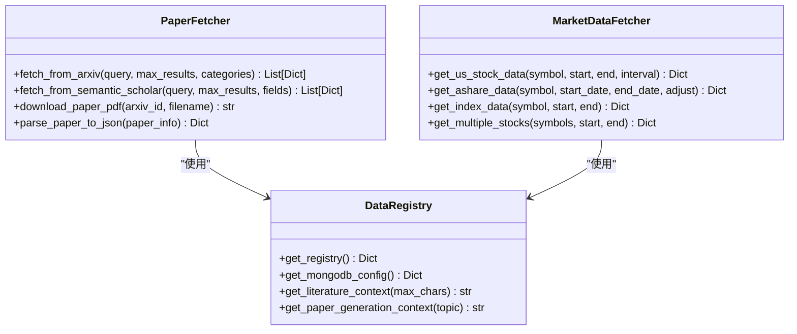
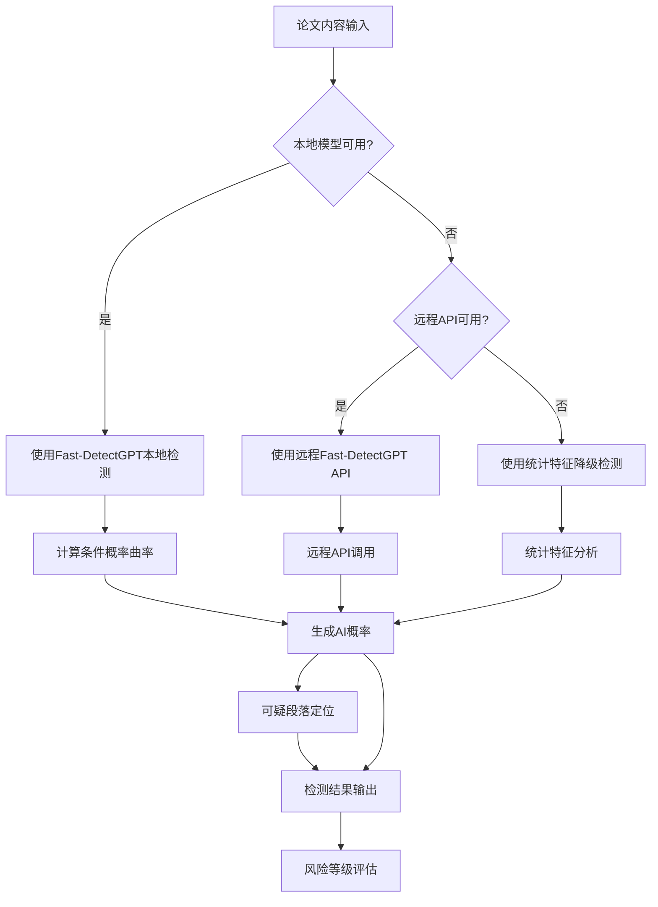
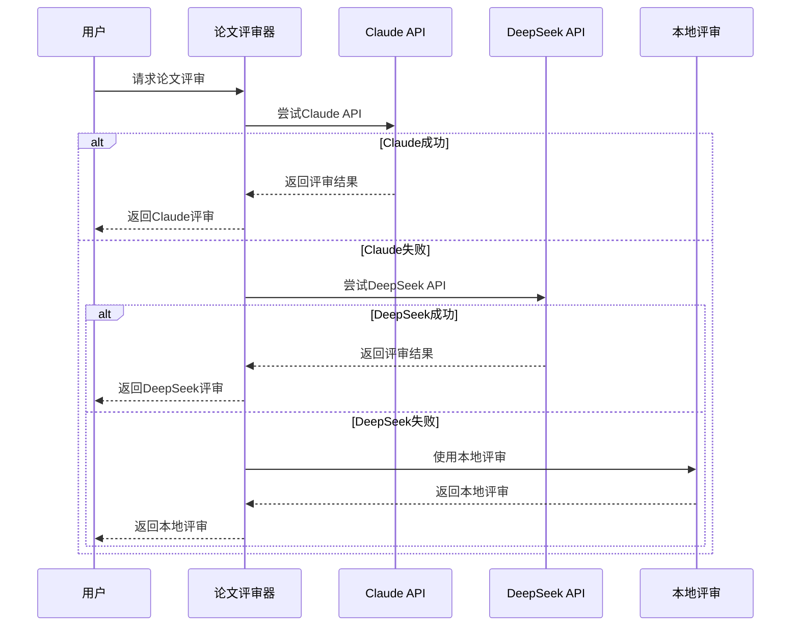
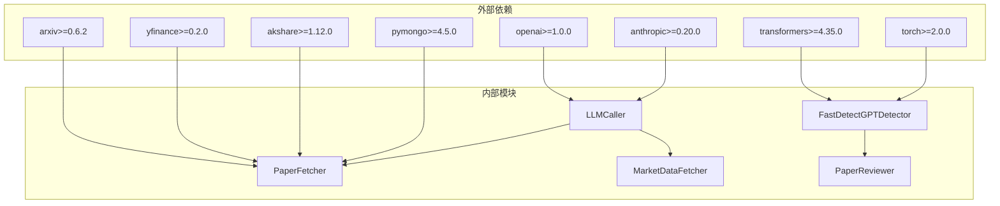

# 集成模式设计

<cite>
**本文档引用的文件**
- [src/main.py](file://src/main.py)
- [src/core/config.py](file://src/core/config.py)
- [src/tools/fetchers.py](file://src/tools/fetchers.py)
- [src/services/ai_detector.py](file://src/services/ai_detector.py)
- [src/services/paper_reviewer.py](file://src/services/paper_reviewer.py)
- [src/prompts/templates.py](file://src/prompts/templates.py)
- [server.py](file://server.py)
- [src/core/data_registry.py](file://src/core/data_registry.py)
- [src/tools/quality_pipeline.py](file://src/tools/quality_pipeline.py)
- [README.md](file://README.md)
- [requirements.txt](file://requirements.txt)
</cite>

## 目录
1. [简介](#简介)
2. [项目结构](#项目结构)
3. [核心组件](#核心组件)
4. [架构概览](#架构概览)
5. [详细组件分析](#详细组件分析)
6. [依赖关系分析](#依赖关系分析)
7. [性能考虑](#性能考虑)
8. [故障排除指南](#故障排除指南)
9. [结论](#结论)

## 简介

paperwriterAI是一个基于大语言模型的全自动学术论文生成系统，专注于量化金融和金融科技领域。该系统采用插件化架构设计，支持与多种外部服务和第三方组件的集成，包括LLM提供商、数据源API和AI检测服务等。

系统的核心设计理念是通过配置驱动的方式实现灵活的集成模式，支持可扩展的LLM提供商支持、可配置的数据源适配器和可替换的服务实现。这种架构使得系统能够轻松集成新的外部服务和第三方组件，同时保持良好的可维护性和可扩展性。

## 项目结构

paperwriterAI项目采用模块化设计，主要分为以下几个核心层次：

**图表来源**
- [src/main.py:1-521](file://src/main.py#L1-L521)
- [src/core/config.py:1-563](file://src/core/config.py#L1-L563)
- [src/tools/fetchers.py:1-899](file://src/tools/fetchers.py#L1-L899)

**章节来源**
- [README.md:420-500](file://README.md#L420-L500)
- [src/main.py:1-521](file://src/main.py#L1-L521)

## 核心组件

### LLM调用器（LLMCaller）

LLMCaller是系统的核心组件，负责统一管理各种LLM提供商的调用。它支持多种提供商（OpenAI、Anthropic、DeepSeek、MiniMax、Ollama），并实现了自动切换机制。

**图表来源**
- [src/tools/fetchers.py:290-800](file://src/tools/fetchers.py#L290-L800)
- [src/core/config.py:206-251](file://src/core/config.py#L206-L251)

### 配置管理系统

配置管理系统提供了统一的配置管理机制，支持环境变量、本地配置文件和全局配置的合并。

**图表来源**
- [src/core/config.py:420-514](file://src/core/config.py#L420-L514)

**章节来源**
- [src/core/config.py:386-514](file://src/core/config.py#L386-L514)
- [src/tools/fetchers.py:290-450](file://src/tools/fetchers.py#L290-L450)

## 架构概览

系统采用分层架构设计，通过插件化的方式集成各种外部服务：

**图表来源**
- [README.md:50-88](file://README.md#L50-L88)
- [src/main.py:35-428](file://src/main.py#L35-L428)

## 详细组件分析

### LLM提供商集成架构

系统实现了高度可扩展的LLM提供商集成架构，支持多种主流LLM服务：

**图表来源**
- [src/tools/fetchers.py:391-450](file://src/tools/fetchers.py#L391-L450)
- [src/core/config.py:487-508](file://src/core/config.py#L487-L508)

#### 支持的LLM提供商

系统支持以下LLM提供商：

| 提供商 | 支持的模型 | API端点 | 特殊功能 |
|--------|------------|---------|----------|
| OpenAI | gpt-4o, gpt-4o-mini, gpt-4-turbo | api.openai.com/v1 | 流式响应支持 |
| Anthropic | claude-3-5-sonnet, claude-3-opus | api.anthropic.com | Claude API |
| DeepSeek | deepseek-chat, deepseek-coder | api.deepseek.com | 代码生成优化 |
| MiniMax | MiniMax-M2.7-highspeed, MiniMax-M2.8-32K | token.juda.dev/v1 | 高速推理 |
| Ollama | gemma4, qwen3.6, llama3.1 | localhost:11434/v1 | 本地部署 |

**章节来源**
- [src/core/config.py:206-251](file://src/core/config.py#L206-L251)
- [src/tools/fetchers.py:451-775](file://src/tools/fetchers.py#L451-L775)

### 数据源API集成

系统集成了多种数据源API，包括学术论文获取、市场数据获取等：

**图表来源**
- [src/tools/fetchers.py:20-270](file://src/tools/fetchers.py#L20-L270)
- [src/core/data_registry.py:48-189](file://src/core/data_registry.py#L48-L189)

#### 数据源集成特性

| 数据源 | 获取方式 | 缓存策略 | 错误处理 |
|--------|----------|----------|----------|
| arXiv API | 异步请求 | 本地文件缓存 | 重试机制 |
| Semantic Scholar | REST API | 内存缓存 | 超时处理 |
| yfinance | Python库 | 本地磁盘缓存 | 异常捕获 |
| akshare | Python库 | 本地磁盘缓存 | 异常捕获 |
| MongoDB | PyMongo | 连接池管理 | 连接重试 |

**章节来源**
- [src/tools/fetchers.py:27-163](file://src/tools/fetchers.py#L27-L163)
- [src/core/data_registry.py:38-46](file://src/core/data_registry.py#L38-L46)

### AI检测服务集成

系统集成了Fast-DetectGPT AI检测服务，提供本地和远程两种检测模式：

**图表来源**
- [src/tools/quality_pipeline.py:87-400](file://src/tools/quality_pipeline.py#L87-L400)
- [src/services/ai_detector.py:146-184](file://src/services/ai_detector.py#L146-L184)

#### AI检测服务特性

| 检测模式 | 模型支持 | 性能特点 | 适用场景 |
|----------|----------|----------|----------|
| 本地检测 | gpt-neo-2.7B, gpt-j-6B, Llama3-8B | 高精度, 隐私保护 | 本地部署, 高质量检测 |
| 远程API | gpt-neo-2.7B, gpt-j-6B, Llama3-8B | 云端处理, 可扩展 | 网络环境, 大规模检测 |
| 统计降级 | 特征工程 | 快速响应, 低资源 | 资源受限, 快速筛查 |

**章节来源**
- [src/tools/quality_pipeline.py:87-392](file://src/tools/quality_pipeline.py#L87-L392)
- [src/services/ai_detector.py:146-298](file://src/services/ai_detector.py#L146-L298)

### 论文评审服务集成

系统集成了多种论文评审服务，包括Claude API、DeepSeek API和本地评审：

**图表来源**
- [src/services/paper_reviewer.py:159-181](file://src/services/paper_reviewer.py#L159-L181)

#### 论文评审维度

系统提供全面的论文评审维度，支持多维度评分和结构化反馈：

| 评审维度 | 满分 | 说明 | 评分标准 |
|----------|------|------|----------|
| 创新性 | 10分 | 假设的新颖程度 | 原创性贡献评估 |
| 严谨性 | 10分 | 方法论的科学性 | 实验设计合理性 |
| 完整性 | 10分 | 论文结构的完整性 | 文献综述和实验验证 |
| 可读性 | 10分 | 写作表达的清晰度 | 逻辑结构和表达质量 |
| 引用质量 | 10分 | 参考文献的相关性 | 文献时效性和相关性 |
| 实验设计 | 10分 | 实验的可复现性 | 回测和验证方法 |
| 写作规范 | 10分 | 格式和语法规范 | 学术写作标准 |

**章节来源**
- [src/services/paper_reviewer.py:34-112](file://src/services/paper_reviewer.py#L34-L112)
- [src/services/paper_reviewer.py:159-302](file://src/services/paper_reviewer.py#L159-L302)

## 依赖关系分析

系统采用松耦合的设计原则，通过接口抽象和配置驱动实现组件间的解耦：

**图表来源**
- [requirements.txt:1-39](file://requirements.txt#L1-L39)

**章节来源**
- [requirements.txt:1-39](file://requirements.txt#L1-L39)

## 性能考虑

### LLM调用性能优化

系统实现了多种性能优化策略：

1. **连接池管理**：通过统一的LLMCaller管理不同提供商的连接
2. **缓存机制**：实现配置和响应缓存减少重复调用
3. **超时控制**：为不同类型的调用设置合理的超时时间
4. **错误重试**：实现智能重试机制提高成功率

### 数据获取性能优化

1. **异步处理**：支持异步数据获取减少等待时间
2. **批量操作**：支持批量数据处理提高效率
3. **增量更新**：实现增量数据同步避免全量重新获取
4. **本地缓存**：实现多级缓存策略减少网络请求

## 故障排除指南

### 常见问题及解决方案

| 问题类型 | 症状 | 可能原因 | 解决方案 |
|----------|------|----------|----------|
| LLM连接失败 | API调用超时或认证错误 | API密钥配置错误或网络问题 | 检查环境变量配置和网络连接 |
| 数据获取失败 | arXiv或市场数据API调用异常 | API限制或服务不可用 | 实施重试机制和降级策略 |
| AI检测异常 | Fast-DetectGPT模型加载失败 | 模型文件缺失或依赖问题 | 检查模型缓存和依赖安装 |
| 评审服务不可用 | Claude或DeepSeek API调用失败 | API配额限制或服务中断 | 使用本地评审降级方案 |

### 调试和监控

系统提供了完善的调试和监控机制：

1. **日志记录**：详细的调用日志和错误信息
2. **性能监控**：LLM调用统计和性能指标
3. **状态检查**：系统健康检查和状态监控
4. **错误报告**：自动化的错误收集和报告

**章节来源**
- [src/tools/fetchers.py:324-390](file://src/tools/fetchers.py#L324-L390)
- [src/core/config.py:62-95](file://src/core/config.py#L62-L95)

## 结论

paperwriterAI的集成模式设计体现了现代软件架构的最佳实践，通过插件化架构、配置驱动和模块化设计实现了高度的可扩展性和灵活性。

系统的核心优势包括：

1. **高度可扩展**：支持任意数量的LLM提供商和数据源集成
2. **配置驱动**：通过配置文件和环境变量实现灵活的运行时配置
3. **容错性强**：实现多级降级和错误恢复机制
4. **性能优化**：通过缓存、连接池和异步处理提升性能
5. **易于维护**：清晰的模块划分和接口抽象便于维护

这种集成模式为paperwriterAI提供了强大的扩展能力，使其能够适应不断变化的技术环境和业务需求，为未来的功能扩展和技术升级奠定了坚实的基础。