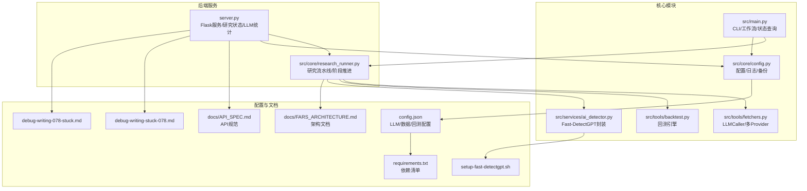
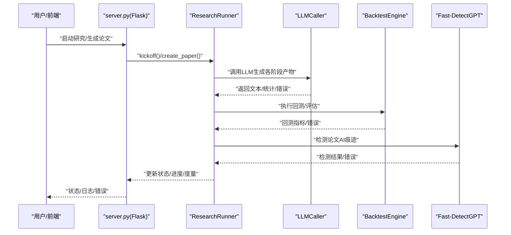
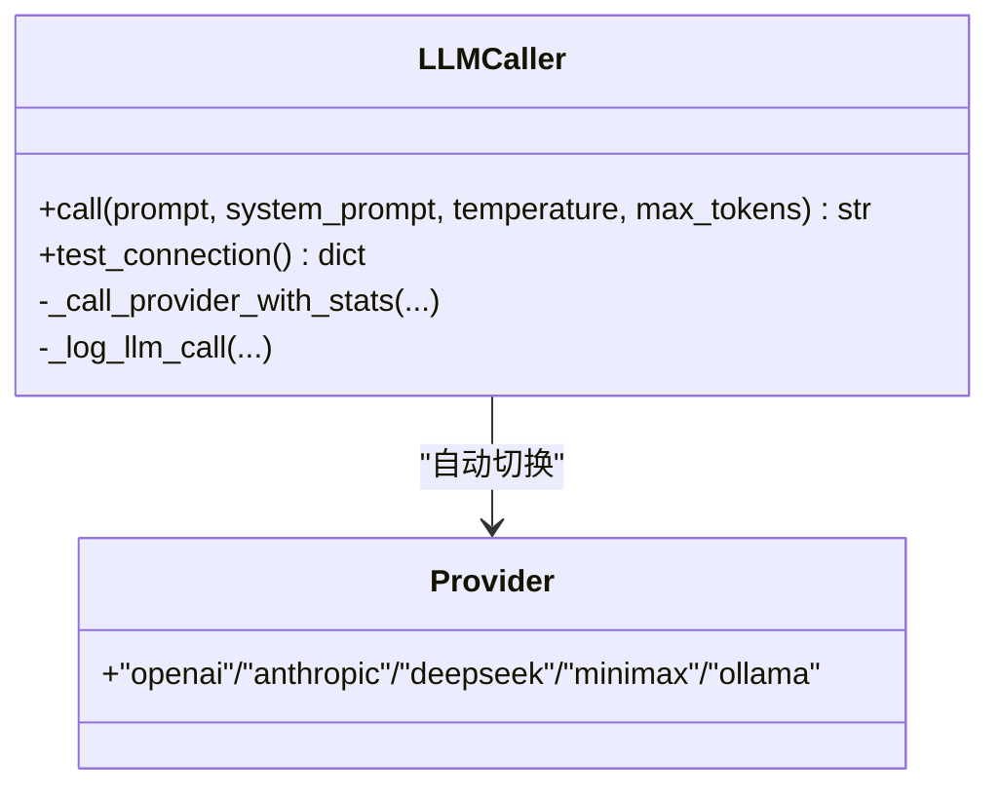
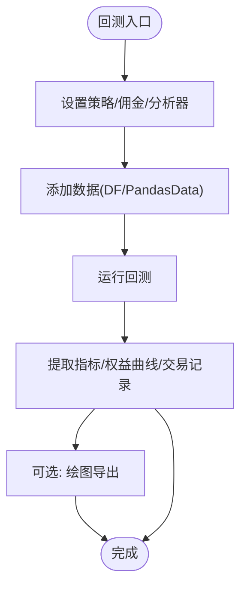
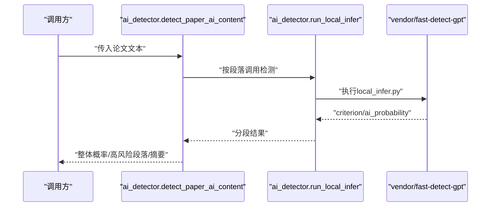
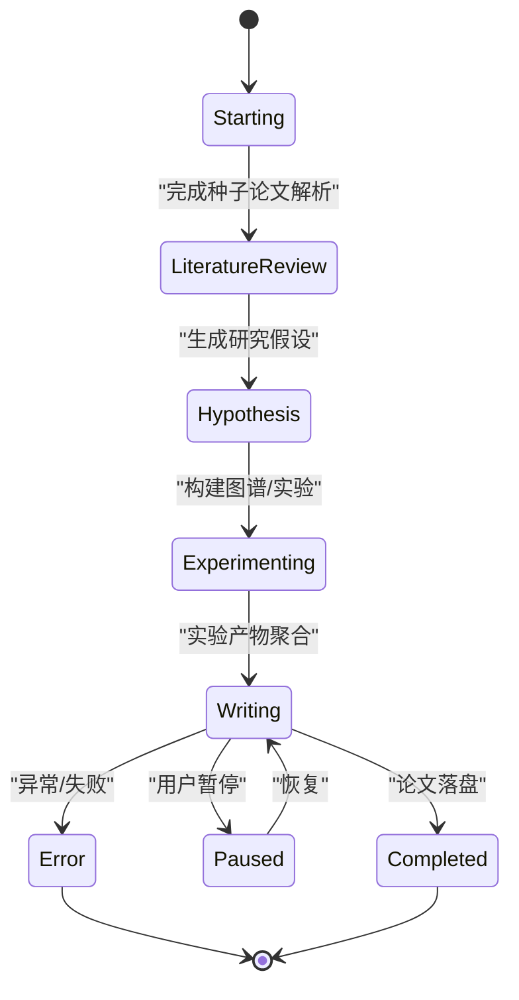
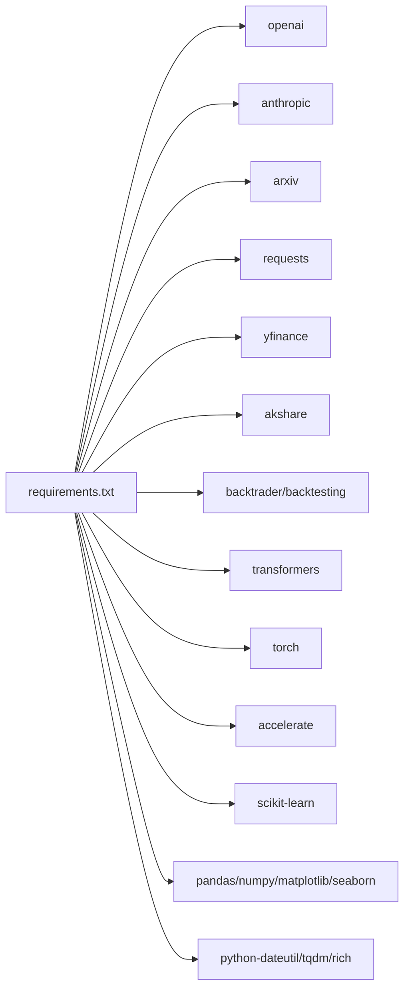
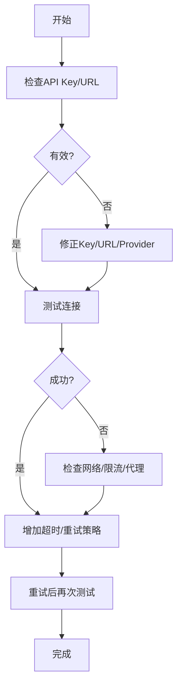
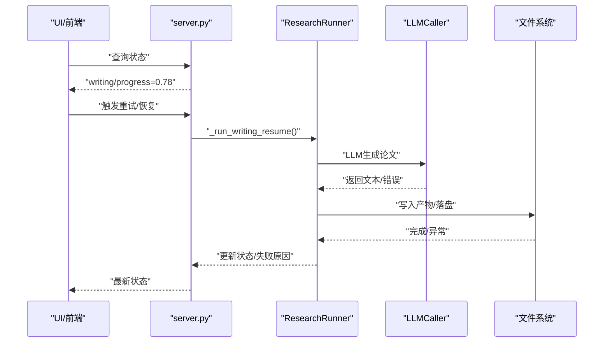
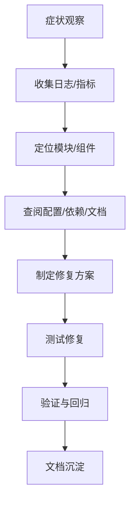

# 故障排除

<cite>
**本文引用的文件**   
- [server.py](file://server.py)
- [src/main.py](file://src/main.py)
- [src/core/research_runner.py](file://src/core/research_runner.py)
- [src/tools/fetchers.py](file://src/tools/fetchers.py)
- [src/tools/backtest.py](file://src/tools/backtest.py)
- [src/services/ai_detector.py](file://src/services/ai_detector.py)
- [src/core/config.py](file://src/core/config.py)
- [requirements.txt](file://requirements.txt)
- [config.json](file://config.json)
- [docs/API_SPEC.md](file://docs/API_SPEC.md)
- [docs/FARS_ARCHITECTURE.md](file://docs/FARS_ARCHITECTURE.md)
- [debug-writing-stuck-078.md](file://debug-writing-stuck-078.md)
- [debug-writing-078-stuck.md](file://debug-writing-078-stuck.md)
- [setup-fast-detectgpt.sh](file://setup-fast-detectgpt.sh)
</cite>

## 目录
1. [简介](#简介)
2. [项目结构](#项目结构)
3. [核心组件](#核心组件)
4. [架构总览](#架构总览)
5. [详细组件分析](#详细组件分析)
6. [依赖分析](#依赖分析)
7. [性能考量](#性能考量)
8. [故障排除指南](#故障排除指南)
9. [结论](#结论)
10. [附录](#附录)

## 简介
本指南面向paperwriterAI使用者与维护者，聚焦以下四类常见问题的诊断与处置：LLM API连接失败、回测执行错误、论文生成失败、AI检测异常。文档提供系统化的症状识别、原因分析、解决步骤、调试工具与方法，并给出紧急处理程序、问题上报与反馈机制、预防措施与最佳实践，以及FAQ。

## 项目结构
- 后端服务入口与研究流水线：server.py、src/core/research_runner.py
- 核心工作流与CLI：src/main.py
- LLM调用与多Provider切换：src/tools/fetchers.py
- 回测引擎：src/tools/backtest.py
- AI检测（Fast-DetectGPT）：src/services/ai_detector.py
- 配置与日志：src/core/config.py、config.json、requirements.txt
- API规范与架构文档：docs/API_SPEC.md、docs/FARS_ARCHITECTURE.md
- 写作卡住专题排查：debug-writing-stuck-078.md、debug-writing-078-stuck.md
- AI检测安装脚本：setup-fast-detectgpt.sh

**图表来源**
- [server.py:1-120](file://server.py#L1-L120)
- [src/core/research_runner.py:1-120](file://src/core/research_runner.py#L1-L120)
- [src/main.py:1-120](file://src/main.py#L1-L120)
- [src/tools/fetchers.py:290-450](file://src/tools/fetchers.py#L290-L450)
- [src/tools/backtest.py:181-260](file://src/tools/backtest.py#L181-L260)
- [src/services/ai_detector.py:146-184](file://src/services/ai_detector.py#L146-L184)
- [src/core/config.py:420-485](file://src/core/config.py#L420-L485)
- [config.json:1-65](file://config.json#L1-L65)
- [requirements.txt:1-39](file://requirements.txt#L1-L39)
- [docs/API_SPEC.md:1-120](file://docs/API_SPEC.md#L1-L120)
- [docs/FARS_ARCHITECTURE.md:1-120](file://docs/FARS_ARCHITECTURE.md#L1-L120)
- [debug-writing-stuck-078.md:1-35](file://debug-writing-stuck-078.md#L1-L35)
- [debug-writing-078-stuck.md:1-46](file://debug-writing-078-stuck.md#L1-L46)
- [setup-fast-detectgpt.sh:1-149](file://setup-fast-detectgpt.sh#L1-L149)

**章节来源**
- [server.py:1-120](file://server.py#L1-L120)
- [src/core/research_runner.py:1-120](file://src/core/research_runner.py#L1-L120)
- [src/main.py:1-120](file://src/main.py#L1-L120)
- [src/tools/fetchers.py:290-450](file://src/tools/fetchers.py#L290-L450)
- [src/tools/backtest.py:181-260](file://src/tools/backtest.py#L181-L260)
- [src/services/ai_detector.py:146-184](file://src/services/ai_detector.py#L146-L184)
- [src/core/config.py:420-485](file://src/core/config.py#L420-L485)
- [config.json:1-65](file://config.json#L1-L65)
- [requirements.txt:1-39](file://requirements.txt#L1-L39)
- [docs/API_SPEC.md:1-120](file://docs/API_SPEC.md#L1-L120)
- [docs/FARS_ARCHITECTURE.md:1-120](file://docs/FARS_ARCHITECTURE.md#L1-L120)
- [debug-writing-stuck-078.md:1-35](file://debug-writing-stuck-078.md#L1-L35)
- [debug-writing-078-stuck.md:1-46](file://debug-writing-078-stuck.md#L1-L46)
- [setup-fast-detectgpt.sh:1-149](file://setup-fast-detectgpt.sh#L1-L149)

## 核心组件
- 研究流水线与状态推进：负责文献综述、假设生成、实验与论文写作阶段推进，维护run状态、阶段度量与UI进度。
- LLM调用器：支持OpenAI、Anthropic、DeepSeek、MiniMax、Ollama多Provider自动切换，具备调用统计与失败回写能力。
- 回测引擎：基于Backtrader，提供策略回测、指标计算与可视化。
- AI检测：封装Fast-DetectGPT，支持分段检测与批量检测。
- 配置与日志：集中管理LLM/数据/回测配置，提供日志与备份管理。
- 服务端：提供研究状态查询、LLM统计、调试打点与性能度量。

**章节来源**
- [src/core/research_runner.py:278-566](file://src/core/research_runner.py#L278-L566)
- [src/tools/fetchers.py:290-800](file://src/tools/fetchers.py#L290-L800)
- [src/tools/backtest.py:181-347](file://src/tools/backtest.py#L181-L347)
- [src/services/ai_detector.py:146-298](file://src/services/ai_detector.py#L146-L298)
- [src/core/config.py:62-95](file://src/core/config.py#L62-L95)
- [server.py:498-666](file://server.py#L498-L666)

## 架构总览

**图表来源**
- [server.py:773-800](file://server.py#L773-L800)
- [src/core/research_runner.py:429-566](file://src/core/research_runner.py#L429-L566)
- [src/tools/fetchers.py:391-450](file://src/tools/fetchers.py#L391-L450)
- [src/tools/backtest.py:248-327](file://src/tools/backtest.py#L248-L327)
- [src/services/ai_detector.py:237-298](file://src/services/ai_detector.py#L237-L298)

## 详细组件分析

### LLM调用与多Provider切换
- 支持主Provider与多个备选Provider自动切换，记录调用统计与失败细节。
- 提供测试连接方法，便于快速定位API Key、Base URL与网络问题。
- 调用日志持久化，便于后续审计与性能分析。

**图表来源**
- [src/tools/fetchers.py:290-800](file://src/tools/fetchers.py#L290-L800)

**章节来源**
- [src/tools/fetchers.py:88-100](file://src/tools/fetchers.py#L88-L100)
- [src/tools/fetchers.py:391-450](file://src/tools/fetchers.py#L391-L450)
- [src/tools/fetchers.py:451-501](file://src/tools/fetchers.py#L451-L501)
- [src/tools/fetchers.py:503-666](file://src/tools/fetchers.py#L503-L666)
- [src/main.py:88-100](file://src/main.py#L88-L100)

### 回测引擎与指标计算
- 基于Backtrader，提供策略回测、分析器与指标计算。
- 支持多指标（夏普比率、最大回撤、年化收益、胜率、盈亏比等）。
- 提供数据准备与绘图导出能力。

**图表来源**
- [src/tools/backtest.py:181-347](file://src/tools/backtest.py#L181-L347)

**章节来源**
- [src/tools/backtest.py:248-327](file://src/tools/backtest.py#L248-L327)
- [src/tools/backtest.py:351-433](file://src/tools/backtest.py#L351-L433)

### AI检测（Fast-DetectGPT）
- 封装local_infer.py，支持gpt-neo-2.7B/Llama3-8B等模型。
- 提供整篇检测与分段检测，输出整体AI概率与高风险段落。
- 提供CLI与API两种调用方式。

**图表来源**
- [src/services/ai_detector.py:146-298](file://src/services/ai_detector.py#L146-L298)
- [setup-fast-detectgpt.sh:1-149](file://setup-fast-detectgpt.sh#L1-L149)

**章节来源**
- [src/services/ai_detector.py:61-143](file://src/services/ai_detector.py#L61-L143)
- [src/services/ai_detector.py:146-298](file://src/services/ai_detector.py#L146-L298)
- [setup-fast-detectgpt.sh:1-149](file://setup-fast-detectgpt.sh#L1-L149)

### 研究流水线与状态推进
- 负责Literature Review → Hypothesis → Experimenting → Writing阶段推进。
- 维护run_metrics、阶段度量、进度与活动状态，支持暂停/恢复/失败回写。
- 写作阶段采用分块生成，避免LLM上下文窗口限制。

**图表来源**
- [src/core/research_runner.py:597-607](file://src/core/research_runner.py#L597-L607)
- [src/core/research_runner.py:642-800](file://src/core/research_runner.py#L642-L800)

**章节来源**
- [src/core/research_runner.py:278-566](file://src/core/research_runner.py#L278-L566)
- [docs/FARS_ARCHITECTURE.md:83-107](file://docs/FARS_ARCHITECTURE.md#L83-L107)

## 依赖分析
- LLM Provider依赖：openai、anthropic
- 数据获取：arxiv、requests
- 市场数据：yfinance、akshare
- 回测：backtrader、backtesting
- AI检测：transformers、torch、accelerate
- 质量评估：scikit-learn
- 工具：python-dateutil、tqdm、rich

**图表来源**
- [requirements.txt:1-39](file://requirements.txt#L1-L39)

**章节来源**
- [requirements.txt:1-39](file://requirements.txt#L1-L39)

## 性能考量
- LLM调用统计：记录调用次数、错误数、Token用量与估算，便于成本与性能监控。
- 写作阶段分块生成：将长论文拆分为8个章节，控制每次prompt大小，显著降低失败率。
- 回测指标：提供夏普比率、最大回撤、年化收益、胜率、盈亏比等关键指标，辅助策略评估。

**章节来源**
- [server.py:568-666](file://server.py#L568-L666)
- [docs/FARS_ARCHITECTURE.md:83-107](file://docs/FARS_ARCHITECTURE.md#L83-L107)
- [src/tools/backtest.py:313-327](file://src/tools/backtest.py#L313-L327)

## 故障排除指南

### 一、LLM API连接失败
- 症状
  - LLM调用返回错误或超时
  - 测试连接失败
  - UI显示“LLM未就绪”
- 原因分析
  - API Key缺失或格式不合法
  - Base URL错误或网络不可达
  - Provider配置未启用或环境变量未设置
  - LLM调用超时或被限流
- 解决步骤
  - 检查config.json与环境变量中的API Key与Base URL
  - 使用CLI测试连接：python src/main.py --test-llm
  - 若主Provider失败，确认备选Provider（如Ollama）是否可用
  - 适当增加请求超时或启用指数退避重试
- 调试工具
  - LLM调用日志：data/llm_call_logs.json
  - 服务端日志：控制台与文件日志
  - LLM统计：/api/llm/stats（若暴露）

**图表来源**
- [src/tools/fetchers.py:88-100](file://src/tools/fetchers.py#L88-L100)
- [src/tools/fetchers.py:391-450](file://src/tools/fetchers.py#L391-L450)
- [src/main.py:88-100](file://src/main.py#L88-L100)

**章节来源**
- [src/tools/fetchers.py:88-100](file://src/tools/fetchers.py#L88-L100)
- [src/tools/fetchers.py:391-450](file://src/tools/fetchers.py#L391-L450)
- [src/main.py:88-100](file://src/main.py#L88-L100)
- [config.json:1-65](file://config.json#L1-L65)

### 二、回测执行错误
- 症状
  - 回测无结果或报错
  - 指标为空或异常
  - 数据准备阶段失败
- 原因分析
  - 数据源不可用（yfinance/akshare）
  - 数据格式不符合Backtrader要求
  - 策略实现错误或参数不当
  - 环境依赖缺失（backtrader/backtesting）
- 解决步骤
  - 确认数据源可用性与网络
  - 检查数据列名与索引格式
  - 使用示例策略验证回测流程
  - 安装缺失依赖并重试
- 调试工具
  - 回测日志与交易记录
  - 指标计算过程与中间结果
  - 可视化图表导出

**章节来源**
- [src/tools/backtest.py:181-347](file://src/tools/backtest.py#L181-L347)
- [src/tools/backtest.py:351-433](file://src/tools/backtest.py#L351-L433)
- [requirements.txt:15-18](file://requirements.txt#L15-L18)

### 三、论文生成失败
- 症状
  - 写作阶段长期停滞（如0.78进度）
  - 论文正文文件仍为占位内容
  - UI显示writing但updated_at不再变化
- 原因分析
  - LLM请求阻塞或超时
  - 落盘/产物汇总阶段I/O阻塞或异常
  - 状态机未正确回写失败状态
  - 上游返回非JSON或网关错误
- 解决步骤
  - 增加请求超时与指数退避重试
  - 将论文生成拆分为多步（提纲→分节→注入→校对→落盘）
  - 强制失败时回写run状态与失败原因
  - 检查日志与调试打点，定位卡点
- 调试工具
  - Debug Server打点：trae-debug-log-*.ndjson
  - 服务端心跳与llm_inflight监控
  - 写作阶段关键步骤打点

**图表来源**
- [debug-writing-stuck-078.md:1-35](file://debug-writing-stuck-078.md#L1-L35)
- [debug-writing-078-stuck.md:1-46](file://debug-writing-078-stuck.md#L1-L46)
- [src/core/research_runner.py:429-566](file://src/core/research_runner.py#L429-L566)

**章节来源**
- [debug-writing-stuck-078.md:1-35](file://debug-writing-stuck-078.md#L1-L35)
- [debug-writing-078-stuck.md:1-46](file://debug-writing-078-stuck.md#L1-L46)
- [src/core/research_runner.py:429-566](file://src/core/research_runner.py#L429-L566)

### 四、AI检测异常
- 症状
  - Fast-DetectGPT未安装或模型未下载
  - 检测输出解析失败
  - 超时或模型加载失败
- 原因分析
  - vendor/fast-detect-gpt未初始化
  - PyTorch/Transformers版本不兼容
  - 模型权重未下载或授权问题
  - GPU资源不足或驱动异常
- 解决步骤
  - 初始化子模块并运行安装脚本
  - 按需选择轻量模型（gpt-neo-2.7B）或GPU模型
  - 确认HuggingFace授权（如Llama3系列）
  - 使用脚本自带测试命令验证
- 调试工具
  - 安装脚本输出与日志
  - CLI检测输出与JSON格式
  - 模型下载与缓存路径

**章节来源**
- [setup-fast-detectgpt.sh:1-149](file://setup-fast-detectgpt.sh#L1-L149)
- [src/services/ai_detector.py:61-143](file://src/services/ai_detector.py#L61-L143)
- [src/services/ai_detector.py:146-298](file://src/services/ai_detector.py#L146-L298)

### 五、问题诊断流程（通用）
- 症状识别：观察UI状态、日志、错误码与指标
- 原因分析：结合配置、依赖、网络与资源状况
- 解决步骤：逐项验证配置、重试、降级与修复
- 验证与回归：重新运行关键流程，确认修复
- 文档与知识沉淀：记录问题与修复方案

[本图为概念流程，无需图表来源]

### 六、紧急处理程序
- 系统恢复
  - 重启服务：python server.py
  - 清理僵尸线程：检查is_generating与current_run状态，必要时重置
- 数据修复
  - 使用BackupManager恢复备份文件
  - 重新生成缺失产物（如论文、图表）
- 服务重启
  - 优雅关闭：停止生成任务，等待当前步骤完成
  - 强制重启：终止异常进程，清理临时文件

**章节来源**
- [src/core/config.py:98-187](file://src/core/config.py#L98-L187)
- [src/core/research_runner.py:301-427](file://src/core/research_runner.py#L301-L427)

### 七、问题上报与反馈机制
- 收集信息
  - 环境信息：操作系统、Python版本、依赖版本
  - 配置信息：config.json与环境变量
  - 日志与错误堆栈：服务端日志、LLM调用日志、调试打点
- 上报渠道
  - Issues页面提交（附带上述信息）
  - 邮件反馈至维护团队
- 反馈模板
  - 问题简述、复现步骤、期望结果、实际结果、日志链接

[本节为通用流程，无需章节来源]

### 八、预防措施与最佳实践
- 配置管理
  - 使用config.json与config.local.json分离公共与私有配置
  - 通过环境变量注入敏感信息
- 依赖管理
  - 固定版本并定期更新
  - 区分生产与开发依赖
- 监控与告警
  - 开启LLM统计与服务端日志
  - 设置健康检查与超时告警
- 安全与合规
  - 限制API Key访问范围
  - 定期轮换密钥与审计日志

**章节来源**
- [config.json:1-65](file://config.json#L1-L65)
- [src/core/config.py:420-485](file://src/core/config.py#L420-L485)
- [requirements.txt:1-39](file://requirements.txt#L1-L39)

### 九、FAQ
- Q1：LLM测试连接总是失败？
  - A1：检查API Key格式、Base URL与网络连通性；确认Provider已启用；尝试备选Provider。
- Q2：回测无结果或报错？
  - A2：确认数据源可用；检查数据列名与索引；使用示例策略验证。
- Q3：写作阶段卡住怎么办？
  - A3：增加超时与重试；拆分生成步骤；检查落盘与I/O；查看调试打点。
- Q4：AI检测报模型未找到？
  - A4：初始化子模块并运行安装脚本；选择合适模型；确认授权与缓存。
- Q5：如何查看LLM调用统计？
  - A5：访问服务端统计接口或查看data/llm_call_logs.json。

**章节来源**
- [src/tools/fetchers.py:88-100](file://src/tools/fetchers.py#L88-L100)
- [src/tools/backtest.py:181-347](file://src/tools/backtest.py#L181-L347)
- [src/core/research_runner.py:429-566](file://src/core/research_runner.py#L429-L566)
- [src/services/ai_detector.py:61-143](file://src/services/ai_detector.py#L61-L143)
- [server.py:568-666](file://server.py#L568-L666)

## 结论
本指南提供了paperwriterAI从LLM连接、回测、论文生成到AI检测的全链路故障排除方法。通过标准化的症状识别、原因分析、解决步骤与调试工具，配合紧急处理程序与预防措施，可显著提升系统稳定性与可维护性。建议在日常运维中持续关注日志与统计，完善自动化监控与告警，确保问题早发现、早处理。

## 附录
- API规范参考：docs/API_SPEC.md
- 架构设计参考：docs/FARS_ARCHITECTURE.md
- 写作卡住专题：debug-writing-stuck-078.md、debug-writing-078-stuck.md
- AI检测安装：setup-fast-detectgpt.sh

**章节来源**
- [docs/API_SPEC.md:1-120](file://docs/API_SPEC.md#L1-L120)
- [docs/FARS_ARCHITECTURE.md:1-120](file://docs/FARS_ARCHITECTURE.md#L1-L120)
- [debug-writing-stuck-078.md:1-35](file://debug-writing-stuck-078.md#L1-L35)
- [debug-writing-078-stuck.md:1-46](file://debug-writing-078-stuck.md#L1-L46)
- [setup-fast-detectgpt.sh:1-149](file://setup-fast-detectgpt.sh#L1-L149)