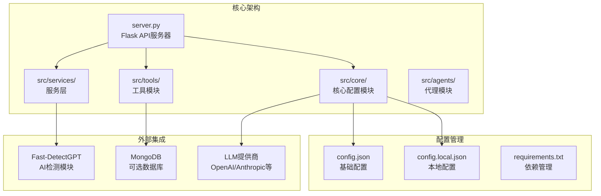
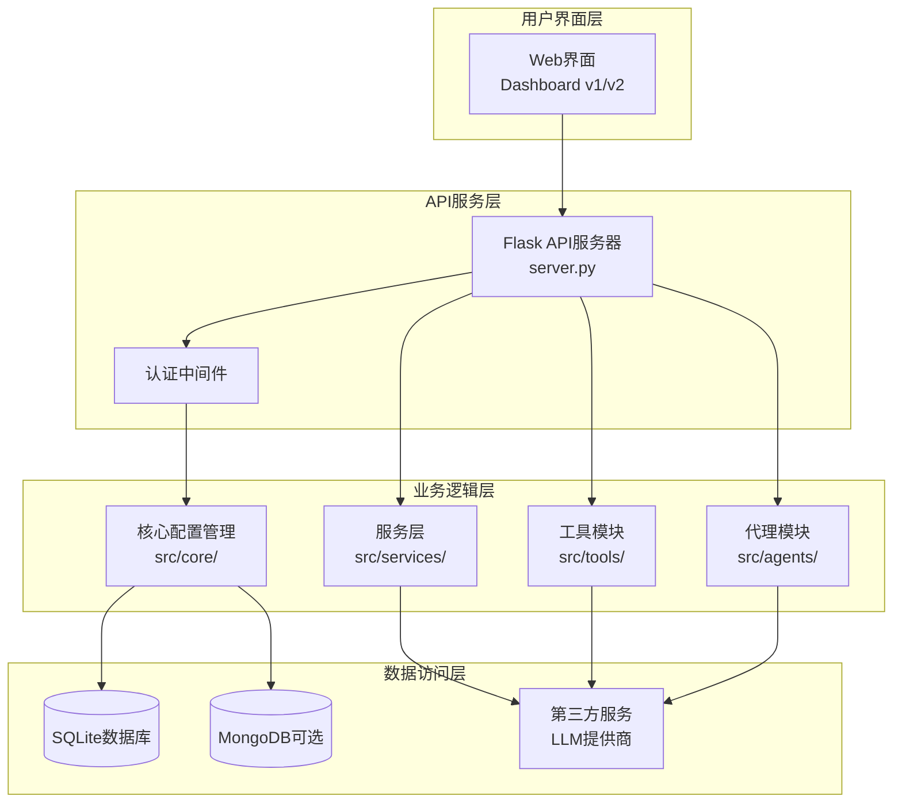
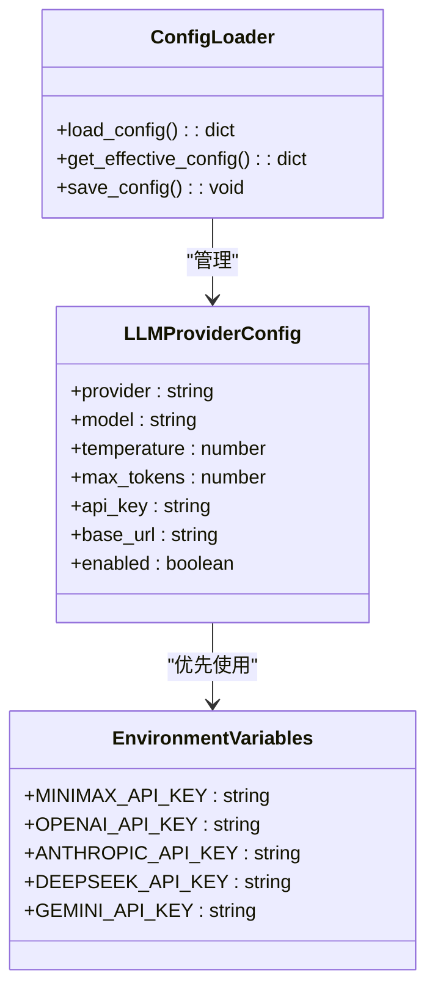
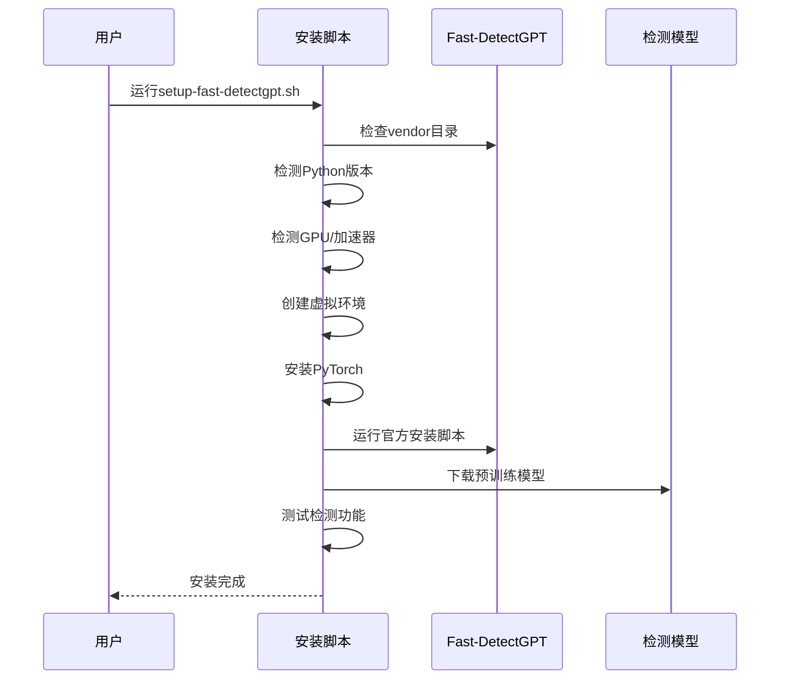
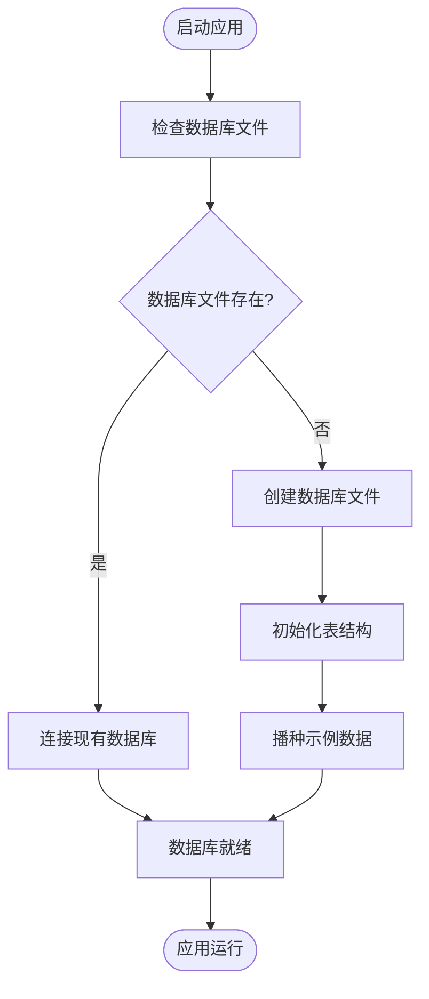
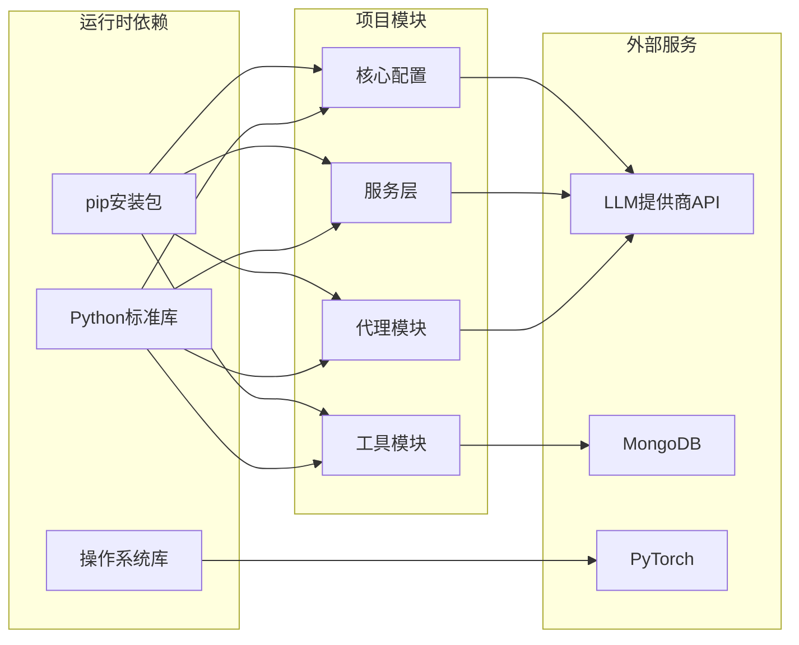

# 环境配置

<cite>
**本文档引用的文件**
- [requirements.txt](file://requirements.txt)
- [requirements-dev.txt](file://requirements-dev.txt)
- [setup-fast-detectgpt.sh](file://setup-fast-detectgpt.sh)
- [config.json](file://config.json)
- [config.local.json](file://config.local.json)
- [src/core/config.py](file://src/core/config.py)
- [src/services/ai_detector.py](file://src/services/ai_detector.py)
- [src/core/database.py](file://src/core/database.py)
- [server.py](file://server.py)
- [README.md](file://README.md)
</cite>

## 目录
1. [简介](#简介)
2. [项目结构](#项目结构)
3. [核心组件](#核心组件)
4. [架构概览](#架构概览)
5. [详细组件分析](#详细组件分析)
6. [依赖分析](#依赖分析)
7. [性能考虑](#性能考虑)
8. [故障排除指南](#故障排除指南)
9. [结论](#结论)
10. [附录](#附录)

## 简介

paperwriterAI 是一个基于大型语言模型的全自动学术论文生成系统，专注于量化金融和金融科技领域。本指南将详细介绍环境配置的各个方面，包括Python版本要求、依赖包安装、LLM提供商配置、AI检测模块Fast-DetectGPT的安装配置、数据库连接配置以及Docker容器化部署方案。

## 项目结构

该项目采用模块化的架构设计，主要包含以下核心组件：



**图表来源**
- [server.py:1-800](file://server.py#L1-L800)
- [src/core/config.py:1-563](file://src/core/config.py#L1-L563)
- [config.json:1-65](file://config.json#L1-L65)

**章节来源**
- [README.md:420-500](file://README.md#L420-L500)
- [server.py:1-800](file://server.py#L1-L800)

## 核心组件

### Python版本要求

项目要求Python版本为3.9及以上，推荐使用Python 3.12+以获得最佳兼容性和性能表现。

### 依赖包管理

项目使用pip进行依赖管理，主要依赖分为以下几类：

1. **LLM提供商依赖**：OpenAI、Anthropic等API客户端
2. **数据处理依赖**：pandas、numpy、matplotlib等科学计算库
3. **数据库依赖**：PyMongo（可选）
4. **AI检测依赖**：Transformers、PyTorch等
5. **开发工具依赖**：Playwright等

**章节来源**
- [requirements.txt:1-39](file://requirements.txt#L1-L39)
- [requirements-dev.txt:1-2](file://requirements-dev.txt#L1-L2)

## 架构概览

系统采用分层架构设计，包含以下主要层次：



**图表来源**
- [server.py:1-800](file://server.py#L1-L800)
- [src/core/config.py:1-563](file://src/core/config.py#L1-L563)
- [src/services/ai_detector.py:1-358](file://src/services/ai_detector.py#L1-L358)

## 详细组件分析

### LLM提供商配置

系统支持多种LLM提供商，包括OpenAI、Anthropic、MiniMax、DeepSeek等。配置采用分层结构，支持环境变量覆盖。

#### 配置结构



**图表来源**
- [src/core/config.py:206-251](file://src/core/config.py#L206-L251)
- [src/core/config.py:447-460](file://src/core/config.py#L447-L460)

#### 环境变量映射

| LLM提供商 | 环境变量名 | 用途 |
|-----------|------------|------|
| MiniMax | MINIMAX_API_KEY | 主要LLM提供商 |
| OpenAI | OPENAI_API_KEY | GPT系列模型 |
| Anthropic | ANTHROPIC_API_KEY | Claude系列模型 |
| DeepSeek | DEEPSEEK_API_KEY | DeepSeek系列模型 |
| Gemini | GOOGLE_API_KEY | Google Gemini模型 |

**章节来源**
- [src/core/config.py:447-460](file://src/core/config.py#L447-L460)
- [config.json:1-65](file://config.json#L1-L65)

### Fast-DetectGPT AI检测模块

Fast-DetectGPT是一个基于ICLR 2024论文的AI痕迹检测工具，提供本地模型检测能力。

#### 安装配置流程



**图表来源**
- [setup-fast-detectgpt.sh:1-149](file://setup-fast-detectgpt.sh#L1-L149)

#### 支持的检测模型

| 模型名称 | 推荐用途 | 硬件要求 |
|----------|----------|----------|
| gpt-neo-2.7B | 基础检测，CPU可用 | CPU |
| gpt-j-6B | 中等精度，推荐GPU | NVIDIA GPU |
| Llama3-8B | 高精度检测，需要GPU | NVIDIA A100 80GB |
| Llama3-8B-Instruct | 指令微调版本 | NVIDIA A100 80GB |

**章节来源**
- [setup-fast-detectgpt.sh:8-13](file://setup-fast-detectgpt.sh#L8-L13)
- [src/services/ai_detector.py:1-358](file://src/services/ai_detector.py#L1-L358)

### 数据库连接配置

系统支持两种数据库配置：SQLite（默认）和MongoDB（可选）。

#### SQLite配置



**图表来源**
- [src/core/database.py:15-189](file://src/core/database.py#L15-L189)

#### MongoDB配置

MongoDB作为可选的语义索引存储，支持论文的高级检索功能。

**章节来源**
- [src/core/database.py:1-278](file://src/core/database.py#L1-L278)
- [config.json:44-49](file://config.json#L44-L49)

### 环境变量设置

系统采用环境变量驱动的配置方式，支持灵活的部署场景。

#### 必需环境变量

```bash
# LLM提供商API密钥
export MINIMAX_API_KEY="你的MiniMax API密钥"
export OPENAI_API_KEY="你的OpenAI API密钥"
export ANTHROPIC_API_KEY="你的Anthropic API密钥"

# LLM基础URL（可选）
export LLM_BASE_URL="自定义LLM端点"

# LLM请求超时（可选）
export LLM_REQUEST_TIMEOUT_S="600"
```

#### 可选环境变量

```bash
# 调试服务器配置
export DEBUG_SERVER_URL="调试服务器地址"
export DEBUG_SESSION_ID="调试会话ID"

# 数据库配置
export MONGODB_URI="mongodb://localhost:27017"
export MONGODB_DB="quant_db"
```

**章节来源**
- [server.py:356-358](file://server.py#L356-L358)
- [config.json:44-49](file://config.json#L44-L49)

## 依赖分析

### 核心依赖关系



**图表来源**
- [requirements.txt:1-39](file://requirements.txt#L1-L39)
- [src/core/config.py:1-563](file://src/core/config.py#L1-L563)

### 依赖版本兼容性

| 依赖包 | 最低版本 | 推荐版本 | 用途 |
|--------|----------|----------|------|
| Python | 3.9 | 3.12+ | 运行时环境 |
| openai | 1.0.0 | 最新稳定版 | OpenAI API客户端 |
| anthropic | 0.20.0 | 最新稳定版 | Anthropic API客户端 |
| transformers | 4.35.0 | 最新稳定版 | 模型加载和推理 |
| torch | 2.0.0 | 最新稳定版 | PyTorch框架 |
| pymongo | 4.5.0 | 最新稳定版 | MongoDB客户端 |

**章节来源**
- [requirements.txt:1-39](file://requirements.txt#L1-L39)

## 性能考虑

### 内存和存储优化

1. **模型缓存管理**：Fast-DetectGPT模型默认下载到系统缓存目录
2. **数据库索引优化**：SQLite数据库建立适当的索引提高查询性能
3. **批量处理**：支持批量论文分析和处理减少API调用开销

### 并发处理

系统支持多线程和异步处理，特别是在论文生成和质量检测环节。

## 故障排除指南

### 常见问题及解决方案

#### 1. LLM API连接失败

**症状**：调用LLM API时出现连接错误

**解决方案**：
- 检查API密钥是否正确设置
- 验证网络连接和防火墙设置
- 确认API端点URL正确性

#### 2. Fast-DetectGPT安装失败

**症状**：安装脚本执行过程中报错

**解决方案**：
- 确保有足够的磁盘空间（约10GB）
- 检查Python版本是否满足要求
- 验证GPU驱动和CUDA版本兼容性

#### 3. 数据库连接问题

**症状**：应用启动时报数据库连接错误

**解决方案**：
- 检查SQLite数据库文件权限
- 验证MongoDB服务状态
- 确认连接字符串格式正确

#### 4. 环境变量未生效

**症状**：配置文件中的设置被忽略

**解决方案**：
- 确认环境变量在应用启动前已设置
- 检查shell配置文件（.bashrc、.zshrc等）
- 验证环境变量名称拼写正确

**章节来源**
- [server.py:241-277](file://server.py#L241-L277)
- [setup-fast-detectgpt.sh:30-36](file://setup-fast-detectgpt.sh#L30-L36)

## 结论

paperwriterAI提供了完整的环境配置方案，支持多种部署场景和配置方式。通过合理的依赖管理和配置优化，可以确保系统的稳定运行和最佳性能。建议在生产环境中使用独立的虚拟环境，合理配置资源限制，并定期更新依赖包以获得最新的安全补丁和功能改进。

## 附录

### Docker容器化部署

虽然项目未提供官方Docker镜像，但可以基于requirements.txt创建自定义Dockerfile：

```dockerfile
FROM python:3.12-slim

WORKDIR /app
COPY requirements.txt .
RUN pip install --no-cache-dir -r requirements.txt

COPY . .

EXPOSE 8080

CMD ["python", "server.py"]
```

### 开发环境设置

1. 创建虚拟环境：`python -m venv venv`
2. 激活环境：`source venv/bin/activate`
3. 安装依赖：`pip install -r requirements.txt`
4. 设置环境变量
5. 运行应用：`python server.py`

### 生产环境最佳实践

1. 使用独立的配置文件（config.local.json）
2. 配置适当的日志级别和轮转策略
3. 设置监控和告警机制
4. 定期备份数据库和重要配置
5. 实施安全的API密钥管理策略