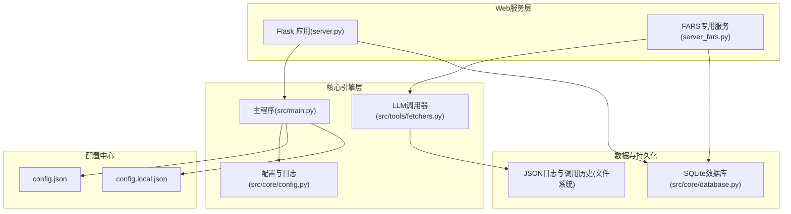
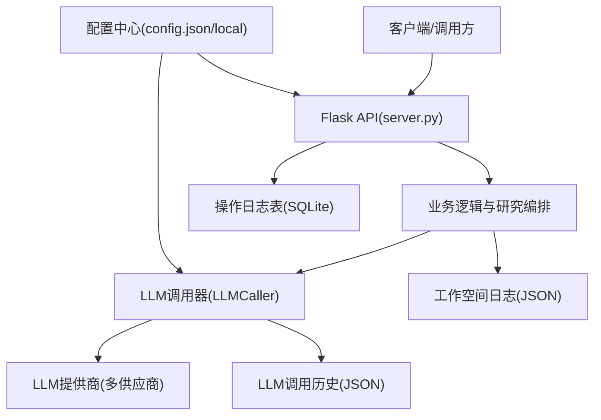
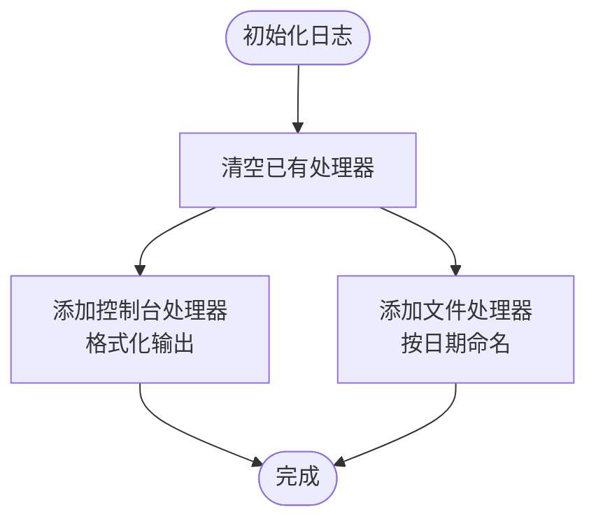
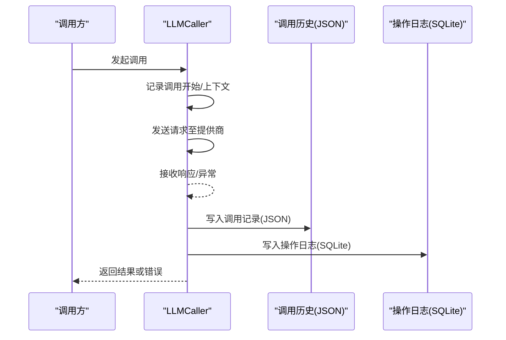
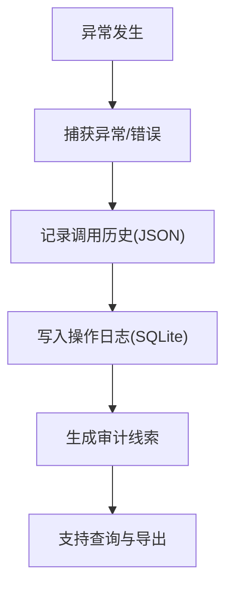
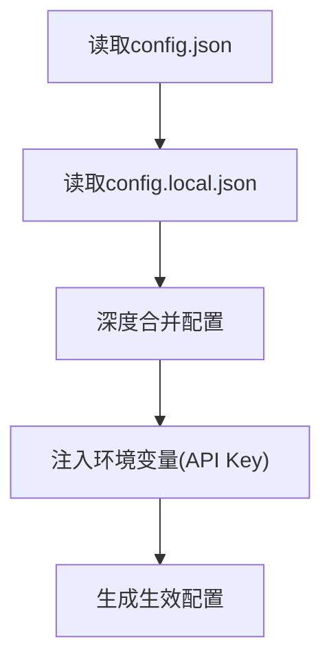
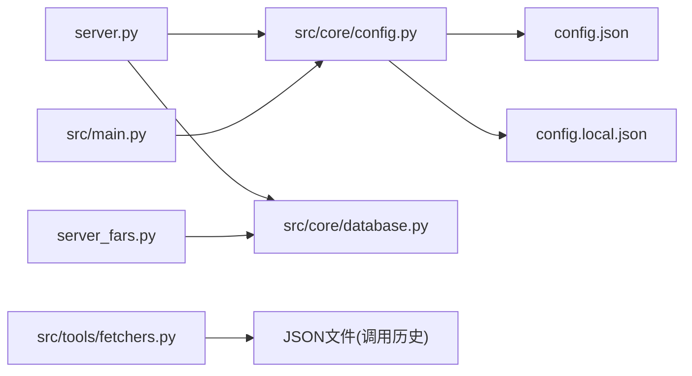

# 监控与日志

<cite>
**本文档引用的文件**
- [server.py](file://server.py)
- [server_fars.py](file://server_fars.py)
- [src/main.py](file://src/main.py)
- [src/core/config.py](file://src/core/config.py)
- [src/core/database.py](file://src/core/database.py)
- [src/tools/fetchers.py](file://src/tools/fetchers.py)
- [config.json](file://config.json)
- [config.local.json](file://config.local.json)
</cite>

## 目录
1. [简介](#简介)
2. [项目结构](#项目结构)
3. [核心组件](#核心组件)
4. [架构总览](#架构总览)
5. [详细组件分析](#详细组件分析)
6. [依赖关系分析](#依赖关系分析)
7. [性能考虑](#性能考虑)
8. [故障排查指南](#故障排查指南)
9. [结论](#结论)
10. [附录](#附录)

## 简介
本文件面向paperwriterAI项目，系统化梳理其监控与日志体系，覆盖日志配置与级别、性能监控指标、错误追踪机制、日志分析方法与工具、实时监控方案、告警与通知、日志轮转与存储策略，以及生产环境最佳实践。文档基于仓库现有实现进行归纳总结，并提供可操作的改进建议。

## 项目结构
- Web服务层：提供REST API与前端静态资源托管，负责业务编排与外部交互。
- 核心引擎层：包含工作流控制、研究任务调度、LLM调用封装与日志记录。
- 数据与持久化：SQLite数据库用于结构化数据与操作日志，JSON文件用于非结构化日志与LLM调用历史。
- 配置中心：集中管理LLM提供商、模型参数、数据源开关等。

图表来源
- [server.py:75-76](file://server.py#L75-L76)
- [server_fars.py:13-14](file://server_fars.py#L13-L14)
- [src/main.py:22-26](file://src/main.py#L22-L26)
- [src/core/config.py:62-95](file://src/core/config.py#L62-L95)
- [src/core/database.py:15-21](file://src/core/database.py#L15-L21)
- [src/tools/fetchers.py:324-390](file://src/tools/fetchers.py#L324-L390)

章节来源
- [server.py:75-76](file://server.py#L75-L76)
- [server_fars.py:13-14](file://server_fars.py#L13-L14)
- [src/main.py:22-26](file://src/main.py#L22-L26)
- [src/core/config.py:62-95](file://src/core/config.py#L62-L95)
- [src/core/database.py:15-21](file://src/core/database.py#L15-L21)
- [src/tools/fetchers.py:324-390](file://src/tools/fetchers.py#L324-L390)

## 核心组件
- 日志系统
  - 控制台与文件双通道，统一格式化输出，便于开发调试与生产归档。
  - 工作空间日志：按步骤记录工作流关键节点，辅助审计与回溯。
- 性能监控
  - LLM调用埋点：记录调用次数、Token用量、错误计数、延迟等，支持按阶段聚合。
  - 运行时度量：结合研究活动与阶段，统计阅读/分析/写作耗时等。
- 错误追踪
  - LLM调用历史：结构化记录请求/响应、Token用量、延迟、错误信息，支持查询与导出。
  - 操作日志表：记录Agent操作、输入输出、状态、耗时与错误，便于审计。
- 配置与环境
  - 通过config.json与config.local.json合并配置，支持环境变量注入API密钥。

章节来源
- [src/core/config.py:62-95](file://src/core/config.py#L62-L95)
- [src/core/config.py:368-384](file://src/core/config.py#L368-L384)
- [src/tools/fetchers.py:324-390](file://src/tools/fetchers.py#L324-L390)
- [src/core/database.py:150-163](file://src/core/database.py#L150-L163)
- [config.json:1-65](file://config.json#L1-L65)
- [config.local.json:1-40](file://config.local.json#L1-L40)

## 架构总览
下图展示监控与日志在系统中的位置与交互：

图表来源
- [server.py:75-76](file://server.py#L75-L76)
- [src/tools/fetchers.py:290-390](file://src/tools/fetchers.py#L290-L390)
- [src/core/database.py:150-163](file://src/core/database.py#L150-L163)
- [config.json:1-65](file://config.json#L1-L65)
- [config.local.json:1-40](file://config.local.json#L1-L40)

## 详细组件分析

### 日志系统与配置
- 控制台与文件日志
  - 控制台输出：简洁格式，适合开发调试。
  - 文件输出：按日期时间命名，便于归档与轮转。
- 工作流步骤日志
  - 在工作流关键节点记录步骤名称、状态、时间戳与细节，形成可追溯的审计线索。
- 日志级别
  - 默认INFO级别，便于生产环境输出必要信息；可通过配置调整。

图表来源
- [src/core/config.py:62-95](file://src/core/config.py#L62-L95)

章节来源
- [src/core/config.py:62-95](file://src/core/config.py#L62-L95)
- [src/core/config.py:368-384](file://src/core/config.py#L368-L384)

### LLM调用监控与埋点
- 调用历史记录
  - 结构化记录：调用ID、运行ID、研究ID、Agent/方法名、提供商/模型、Prompt/Completion、Token用量、延迟、状态、错误信息与时间戳。
  - 存储策略：JSON文件滚动保留上限，同时维护内存历史。
- Token与错误统计
  - 通过阶段维度聚合调用次数、错误次数、Prompt/Completion/Total Token估算，支持运行指标刷新。
- LLM进行中跟踪
  - 记录进行中的请求，心跳更新耗时，便于实时观测长尾与阻塞。

图表来源
- [src/tools/fetchers.py:324-390](file://src/tools/fetchers.py#L324-L390)
- [src/core/database.py:150-163](file://src/core/database.py#L150-L163)

章节来源
- [src/tools/fetchers.py:324-390](file://src/tools/fetchers.py#L324-L390)
- [src/core/database.py:150-163](file://src/core/database.py#L150-L163)

### 错误追踪与调试
- LLM调用历史
  - 保存完整的请求/响应、Token用量、延迟、错误消息与堆栈细节，便于离线分析。
- 操作日志表
  - 记录Agent操作、输入输出、状态、耗时与错误，支持按Agent/时间/状态过滤查询。
- 工作流步骤日志
  - 在关键节点记录状态与细节，定位失败环节。

图表来源
- [src/tools/fetchers.py:324-390](file://src/tools/fetchers.py#L324-L390)
- [src/core/database.py:150-163](file://src/core/database.py#L150-L163)

章节来源
- [src/tools/fetchers.py:324-390](file://src/tools/fetchers.py#L324-L390)
- [src/core/database.py:150-163](file://src/core/database.py#L150-L163)

### 配置与环境注入
- 配置合并策略
  - config.json为基础配置，config.local.json为本地覆盖；最终生效配置由加载函数合并。
- 环境变量注入
  - LLM提供商API Key可通过环境变量注入，优先级高于配置文件。
- LLM可用性检测
  - 在调用前校验提供商与密钥，避免无效请求。

图表来源
- [src/core/config.py:462-484](file://src/core/config.py#L462-L484)
- [src/core/config.py:487-508](file://src/core/config.py#L487-L508)

章节来源
- [config.json:1-65](file://config.json#L1-L65)
- [config.local.json:1-40](file://config.local.json#L1-L40)
- [src/core/config.py:462-484](file://src/core/config.py#L462-L484)
- [src/core/config.py:487-508](file://src/core/config.py#L487-L508)

## 依赖关系分析
- 组件耦合
  - Web服务依赖配置中心与数据库；核心引擎依赖日志系统与LLM调用器；LLM调用器依赖配置中心与文件系统。
- 关键依赖链
  - server.py → src/core/config.py → config.json/local
  - server_fars.py → src/core/database.py → SQLite
  - src/main.py → src/core/config.py → 日志系统
  - src/tools/fetchers.py → JSON文件 → LLM调用历史

图表来源
- [server.py:75-76](file://server.py#L75-L76)
- [server_fars.py:13-14](file://server_fars.py#L13-L14)
- [src/main.py:22-26](file://src/main.py#L22-L26)
- [src/core/config.py:62-95](file://src/core/config.py#L62-L95)
- [src/core/database.py:15-21](file://src/core/database.py#L15-L21)
- [src/tools/fetchers.py:355-372](file://src/tools/fetchers.py#L355-L372)
- [config.json:1-65](file://config.json#L1-L65)
- [config.local.json:1-40](file://config.local.json#L1-L40)

章节来源
- [server.py:75-76](file://server.py#L75-L76)
- [server_fars.py:13-14](file://server_fars.py#L13-L14)
- [src/main.py:22-26](file://src/main.py#L22-L26)
- [src/core/config.py:62-95](file://src/core/config.py#L62-L95)
- [src/core/database.py:15-21](file://src/core/database.py#L15-L21)
- [src/tools/fetchers.py:355-372](file://src/tools/fetchers.py#L355-L372)
- [config.json:1-65](file://config.json#L1-L65)
- [config.local.json:1-40](file://config.local.json#L1-L40)

## 性能考虑
- API响应时间
  - 通过LLM调用历史记录延迟(ms)，结合状态统计，评估平均/分位延迟。
- 内存使用
  - LLM调用器内存历史上限控制（最多1000条），避免长期运行内存膨胀。
- CPU占用
  - 通过工作流步骤日志与阶段耗时统计，识别高开销阶段（如写作、实验）。
- LLM成本与效率
  - 统计Token用量与错误率，结合阶段聚合，评估不同阶段的成本与稳定性。

章节来源
- [src/tools/fetchers.py:368-371](file://src/tools/fetchers.py#L368-L371)
- [src/core/config.py:368-384](file://src/core/config.py#L368-L384)

## 故障排查指南
- 快速定位
  - 查询LLM调用历史：按Agent/方法/状态/研究ID过滤，查看错误消息与堆栈。
  - 查询操作日志：按Agent/时间/状态过滤，确认执行路径与耗时。
- 常见问题
  - API Key缺失：检查config.local.json与环境变量注入。
  - 请求超时：关注LLM进行中跟踪与阶段耗时统计。
  - JSON写入失败：检查磁盘权限与容量，确认文件路径存在。

章节来源
- [src/tools/fetchers.py:324-390](file://src/tools/fetchers.py#L324-L390)
- [src/core/database.py:150-163](file://src/core/database.py#L150-L163)
- [config.local.json:1-40](file://config.local.json#L1-L40)

## 结论
paperwriterAI已在日志、LLM调用监控与操作审计方面建立了基础能力，能够满足日常开发与生产运维需求。建议在生产环境中进一步引入标准化的指标采集与可视化面板、完善的日志轮转与归档策略、以及基于阈值的自动化告警，以提升可观测性与可维护性。

## 附录

### 日志配置与级别
- 控制台与文件双通道，统一格式化输出。
- 工作流步骤日志按节点记录，便于审计。
- 日志级别默认INFO，可在部署时调整。

章节来源
- [src/core/config.py:62-95](file://src/core/config.py#L62-L95)
- [src/core/config.py:368-384](file://src/core/config.py#L368-L384)

### 性能监控指标清单
- API响应时间：基于LLM调用历史延迟(ms)统计。
- 内存使用：LLM调用器内存历史上限控制。
- CPU占用：工作流阶段耗时统计。
- LLM成本：阶段Token用量与错误率聚合。

章节来源
- [src/tools/fetchers.py:368-371](file://src/tools/fetchers.py#L368-L371)
- [src/core/config.py:368-384](file://src/core/config.py#L368-L384)

### 错误追踪机制
- LLM调用历史：结构化记录请求/响应、Token用量、延迟、错误信息。
- 操作日志表：记录Agent操作、输入输出、状态、耗时与错误。
- 工作流步骤日志：关键节点状态与细节。

章节来源
- [src/tools/fetchers.py:324-390](file://src/tools/fetchers.py#L324-L390)
- [src/core/database.py:150-163](file://src/core/database.py#L150-L163)
- [src/core/config.py:368-384](file://src/core/config.py#L368-L384)

### 日志分析方法与工具推荐
- 分析方法
  - 时间序列：按时间窗口统计调用次数、错误率、延迟分布。
  - 聚合分析：按Agent/方法/提供商/阶段聚合Token用量与耗时。
  - 根因分析：结合工作流步骤日志与调用历史，定位失败环节。
- 工具推荐
  - 日志收集：rsyslog/Fluent Bit
  - 存储与检索：ELK/Graylog/Loki
  - 可视化：Grafana/Prometheus
  - 报表：Kibana/QuickSight

### 实时监控方案
- 健康检查端点
  - 提供/扩展健康检查接口，返回服务状态、数据库连接、配置有效性。
- 指标采集
  - 通过LLM调用历史与操作日志表，定期导出指标到时序数据库。
- 可视化
  - 在Grafana中创建仪表板，展示调用成功率、延迟、错误率、Token用量趋势。

### 告警配置与通知机制
- 告警规则
  - 错误率超过阈值、延迟分位数上升、Token用量异常增长、数据库连接失败。
- 通知渠道
  - 邮件、Slack、PagerDuty等。

### 日志轮转与存储策略
- 轮转策略
  - 基于大小与时间的轮转，保留N天内的日志。
- 存储策略
  - 本地热数据+对象存储冷数据，压缩与索引优化检索。

### 生产环境监控最佳实践
- 分层监控：应用层、网络层、系统层、业务层。
- 金丝雀发布：灰度流量观察指标变化。
- 压力测试：模拟峰值负载下的延迟与错误率。
- 审计合规：保留必要的审计日志，满足合规要求。