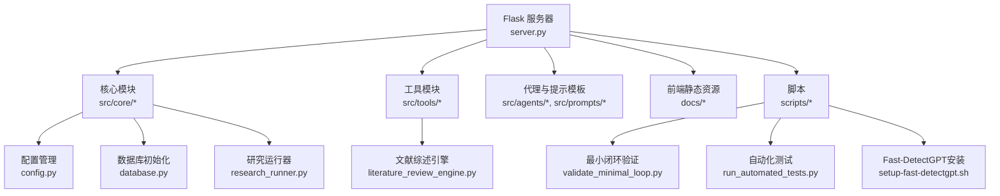
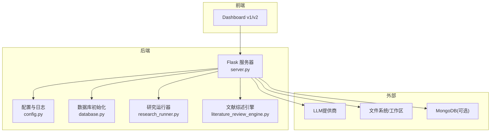
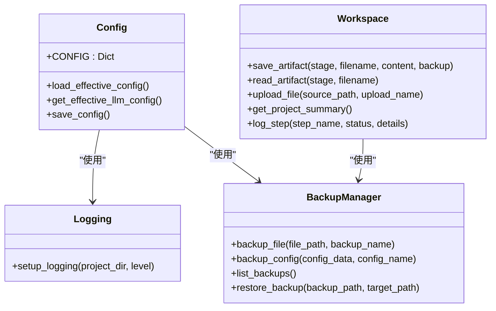
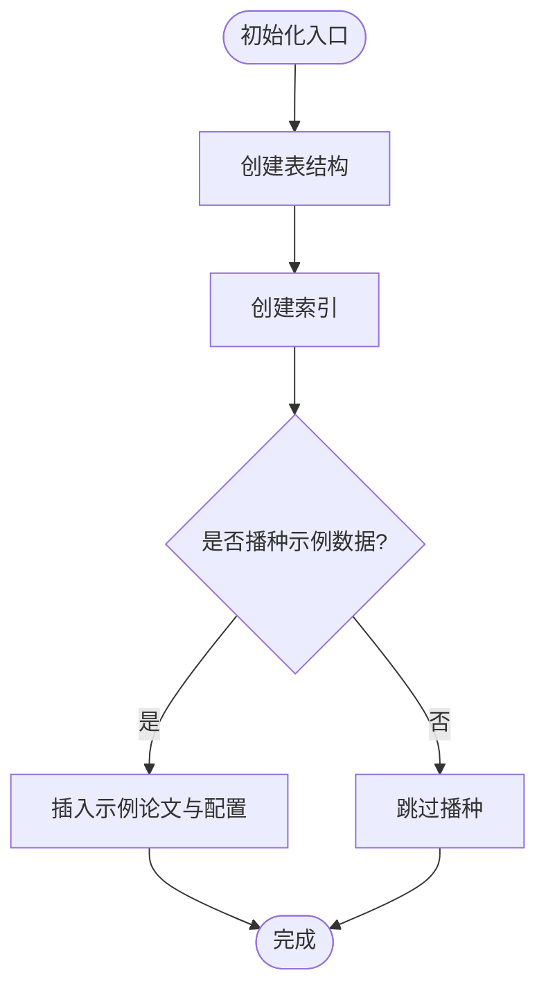
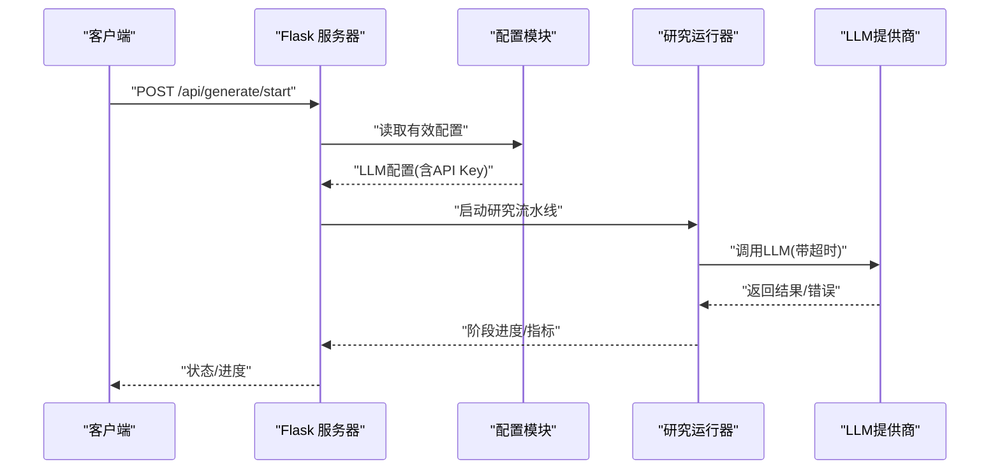
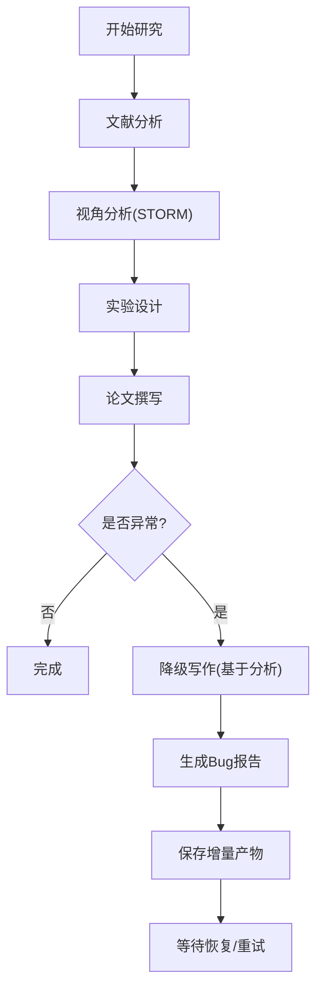
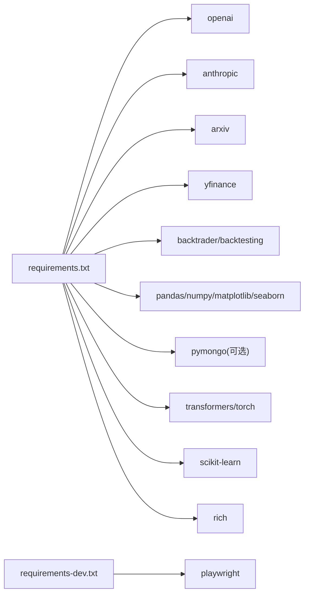

# 维护任务

<cite>
**本文引用的文件**   
- [config.py](file://src/core/config.py)
- [database.py](file://src/core/database.py)
- [server.py](file://server.py)
- [requirements.txt](file://requirements.txt)
- [requirements-dev.txt](file://requirements-dev.txt)
- [research_runner.py](file://src/core/research_runner.py)
- [literature_review_engine.py](file://src/tools/literature_review_engine.py)
- [README.md](file://README.md)
- [validate_minimal_loop.py](file://scripts/validate_minimal_loop.py)
- [run_automated_tests.py](file://scripts/run_automated_tests.py)
- [setup-fast-detectgpt.sh](file://setup-fast-detectgpt.sh)
- [debug-writing-stuck-078.md](file://debug-writing-stuck-078.md)
</cite>

## 目录
1. [简介](#简介)
2. [项目结构](#项目结构)
3. [核心组件](#核心组件)
4. [架构总览](#架构总览)
5. [详细组件分析](#详细组件分析)
6. [依赖分析](#依赖分析)
7. [性能考虑](#性能考虑)
8. [故障排查指南](#故障排查指南)
9. [结论](#结论)
10. [附录](#附录)

## 简介
本指南面向paperwriterAI的运维与维护人员，提供系统化的维护任务说明，涵盖数据清理、缓存与临时文件管理、配置更新流程（含新LLM提供商接入）、性能调优建议（数据库索引与查询优化、内存管理）、备份策略（数据、配置、代码）、容量规划方法（存储与并发用户估算）、安全维护（依赖更新、漏洞修复、访问控制）以及维护自动化脚本示例。内容基于仓库中的核心配置、数据库初始化、API服务器、测试与验证脚本等文件进行归纳与提炼。

## 项目结构
- 后端服务入口：Flask服务器负责对外API与工作流编排
- 核心模块：配置管理、数据库初始化、研究运行器、文献综述引擎等
- 工具与服务：回测引擎、质量流水线、LLM调用封装等
- 脚本：最小闭环验证、自动化测试、Fast-DetectGPT安装等

图表来源
- [server.py](file://server.py)
- [config.py](file://src/core/config.py)
- [database.py](file://src/core/database.py)
- [research_runner.py](file://src/core/research_runner.py)
- [literature_review_engine.py](file://src/tools/literature_review_engine.py)
- [validate_minimal_loop.py](file://scripts/validate_minimal_loop.py)
- [run_automated_tests.py](file://scripts/run_automated_tests.py)
- [setup-fast-detectgpt.sh](file://setup-fast-detectgpt.sh)

章节来源
- [README.md](file://README.md)
- [server.py](file://server.py)

## 核心组件
- 配置与日志：集中式配置加载、环境变量注入、日志与备份管理
- 数据库：SQLite初始化、表结构与索引、示例数据播种
- API服务器：配置热加载、LLM端点与密钥规范化、请求超时与降级
- 研究运行器：研究流水线推进、断点与续传、阶段指标统计
- 文献综述引擎：多视角生成、证据收集、大纲与章节生成
- 维护脚本：最小闭环验证、自动化API测试、Fast-DetectGPT安装

章节来源
- [config.py](file://src/core/config.py)
- [database.py](file://src/core/database.py)
- [server.py](file://server.py)
- [research_runner.py](file://src/core/research_runner.py)
- [literature_review_engine.py](file://src/tools/literature_review_engine.py)
- [validate_minimal_loop.py](file://scripts/validate_minimal_loop.py)
- [run_automated_tests.py](file://scripts/run_automated_tests.py)
- [setup-fast-detectgpt.sh](file://setup-fast-detectgpt.sh)

## 架构总览
系统采用“Flask API + 核心模块 + 工具模块”的分层架构，配合工作区与备份管理，实现研究流程的断点保护与可视化展示。

图表来源
- [server.py](file://server.py)
- [config.py](file://src/core/config.py)
- [database.py](file://src/core/database.py)
- [research_runner.py](file://src/core/research_runner.py)
- [literature_review_engine.py](file://src/tools/literature_review_engine.py)

## 详细组件分析

### 配置与日志、备份管理
- 配置加载与合并：支持基础配置与本地覆盖配置的深合并；LLM配置可从环境变量注入API Key；提供有效配置读取与LLM配置提取
- 日志系统：控制台与文件双通道，按项目根目录创建logs目录
- 备份管理：支持单文件备份、配置JSON备份、列出备份、恢复备份
- 目录结构：工作区、论文、报告、上传等目录自动创建

图表来源
- [config.py](file://src/core/config.py)

章节来源
- [config.py](file://src/core/config.py)

### 数据库初始化与索引
- SQLite数据库初始化：创建论文、因子、实验、报告、系统配置、操作日志等表
- 索引策略：为常用查询字段建立索引（如papers.status、alpha_factors.market_universe等）
- 示例数据播种：插入示例论文与系统配置项，便于演示与测试

图表来源
- [database.py](file://src/core/database.py)

章节来源
- [database.py](file://src/core/database.py)

### API服务器与配置热加载
- 配置热加载：监听配置文件变更，动态合并基础与本地配置
- LLM配置规范化：标准化端点、模型、API Key，支持多Key与端点列表
- 请求超时与降级：统一请求超时策略，写作阶段限制最长超时；提供降级写作与Bug报告生成
- LLM使用统计：按阶段累计调用次数、Token用量与错误数，支持快照与刷新

图表来源
- [server.py](file://server.py)
- [research_runner.py](file://src/core/research_runner.py)

章节来源
- [server.py](file://server.py)
- [research_runner.py](file://src/core/research_runner.py)

### 研究运行器与断点续传
- 研究流水线：从文献分析、视角生成、实验设计到论文撰写
- 断点保护：每步完成后持久化checkpoint.json，支持从断点增量恢复
- 指标统计：按阶段汇总耗时、Token用量、错误数等，支持实时展示
- 写作降级：在LLM异常时用已有分析结果继续生成，并生成Bug报告

图表来源
- [research_runner.py](file://src/core/research_runner.py)

章节来源
- [research_runner.py](file://src/core/research_runner.py)

### 文献综述引擎
- 多视角生成：生成研究视角、问题、证据、大纲与文献综述章节
- 证据收集：从LLM与已有论文中抽取证据
- 大纲与章节：生成结构化大纲与LaTeX章节内容
- Review-Revision循环：评审与修订，迭代至达标

章节来源
- [literature_review_engine.py](file://src/tools/literature_review_engine.py)

### 维护脚本与自动化
- 最小闭环验证：验证工作空间、数据库、配置、工具、模板与模拟流水线
- 自动化测试：启动服务器、等待健康、批量API测试、Playwright端到端测试
- Fast-DetectGPT安装：根据GPU类型选择PyTorch版本，下载模型并测试

章节来源
- [validate_minimal_loop.py](file://scripts/validate_minimal_loop.py)
- [run_automated_tests.py](file://scripts/run_automated_tests.py)
- [setup-fast-detectgpt.sh](file://setup-fast-detectgpt.sh)

## 依赖分析
- 运行时依赖：OpenAI、Anthropic、arxiv、yfinance、backtrader、pandas、matplotlib、transformers、torch、scikit-learn、rich等
- 开发依赖：Playwright（端到端测试）

图表来源
- [requirements.txt](file://requirements.txt)
- [requirements-dev.txt](file://requirements-dev.txt)

章节来源
- [requirements.txt](file://requirements.txt)
- [requirements-dev.txt](file://requirements-dev.txt)

## 性能考虑
- 数据库索引优化
  - 已创建常用字段索引（如papers.status、alpha_factors.market_universe等），建议结合慢查询分析持续优化
  - 对高频过滤与排序字段（如reports.status、operation_logs.created_at）保持索引有效性
- 查询优化
  - 使用参数化查询与事务批处理，减少往返次数
  - 对大数据量查询增加LIMIT与分页，避免一次性加载过多记录
- 内存管理
  - LLM调用时严格设置超时，避免长时间阻塞
  - 控制单次生成内容大小，必要时拆分为多步生成
  - 使用生成器与流式处理减少峰值内存占用
- 并发与限流
  - API层面设置合理的并发上限与队列长度
  - LLM提供商侧遵循配额与速率限制，必要时启用指数退避重试

## 故障排查指南
- 写作卡住（writing 0.78）
  - 可能原因：LLM请求阻塞、重试循环卡死、线程状态未回写、落盘阻塞、上游返回非JSON/网关504
  - 建议措施：增加请求超时与指数退避重试；将“论文撰写”提示词拆分为多步；失败时强制回写run状态与错误原因
- 配置未生效
  - 确认基础配置与本地覆盖配置合并逻辑；检查环境变量注入API Key
- 数据库异常
  - 检查表结构与索引是否完整；确认示例数据播种是否成功
- LLM调用失败
  - 校验端点、模型、API Key；检查网络连通性与防火墙；必要时启用降级写作

章节来源
- [debug-writing-stuck-078.md](file://debug-writing-stuck-078.md)
- [server.py](file://server.py)
- [config.py](file://src/core/config.py)
- [database.py](file://src/core/database.py)

## 结论
通过规范的配置管理、数据库索引与查询优化、内存与并发控制、完善的备份与容量规划、以及自动化脚本与监控手段，paperwriterAI能够稳定支撑论文生成与研究流程。建议将维护任务纳入例行工作流，结合自动化脚本与监控告警，持续提升系统可靠性与性能。

## 附录

### 定期维护任务清单
- 数据清理
  - 清理过期的论文、报告、上传文件与临时工件，保留必要的备份与审计日志
  - 定期压缩或归档历史研究产物，释放磁盘空间
- 缓存清理
  - 清理Fast-DetectGPT模型缓存与HuggingFace缓存（如~/.cache/huggingface）
  - 清理浏览器缓存与前端静态资源缓存
- 临时文件管理
  - 定期扫描并删除未使用的临时文件与中间产物
  - 监控临时目录大小，设置自动清理阈值

### 配置更新流程
- 新LLM提供商接入
  - 在配置中添加提供商定义与默认模型、base_url、上下文窗口等
  - 通过环境变量注入API Key，避免硬编码
  - 在API服务器中更新端点与模型列表，确保规范化与去重
- 模型更新与参数调整
  - 更新全局配置中的默认模型与温度、max_tokens等参数
  - 通过本地配置覆盖特定环境的差异化需求
  - 验证最小闭环与自动化测试，确保变更不影响核心流程

章节来源
- [config.py](file://src/core/config.py)
- [server.py](file://server.py)
- [validate_minimal_loop.py](file://scripts/validate_minimal_loop.py)
- [run_automated_tests.py](file://scripts/run_automated_tests.py)

### 备份策略
- 数据备份
  - 数据库：定期导出SQLite数据库或迁移至PostgreSQL/MySQL
  - 研究工件：备份工作区中的论文、报告、图表、日志与备份目录
- 配置备份
  - 备份config.json与config.local.json，使用备份管理器生成时间戳文件
- 代码备份
  - 使用Git标签与分支策略，定期打标签并推送远端
  - 备份vendor/fast-detect-gpt等子模块

章节来源
- [config.py](file://src/core/config.py)
- [database.py](file://src/core/database.py)

### 容量规划方法
- 存储空间评估
  - 估算每篇论文平均大小×论文数量×增长系数；考虑报告、图表、日志与备份倍数
  - 评估MongoDB索引与查询缓存的额外存储需求
- 并发用户数估算
  - 基于CPU/内存/网络带宽与LLM调用延迟，估算单机最大并发
  - 通过压力测试与监控指标（响应时间、错误率、队列长度）验证与调整

### 安全维护
- 依赖包更新
  - 定期更新requirements.txt与requirements-dev.txt，关注安全公告
  - 使用pip-audit或类似工具扫描已知漏洞
- 漏洞修复
  - 优先修复高危漏洞；对中低危漏洞制定修复计划
- 访问控制
  - 限制API访问IP白名单；启用HTTPS与强认证
  - 严格管理API Key与敏感配置，避免泄露

### 维护自动化脚本示例
- 最小闭环验证：验证工作空间、数据库、配置、工具、模板与模拟流水线
- 自动化测试：启动服务器、等待健康、批量API测试、Playwright端到端测试
- Fast-DetectGPT安装：根据GPU类型选择PyTorch版本，下载模型并测试

章节来源
- [validate_minimal_loop.py](file://scripts/validate_minimal_loop.py)
- [run_automated_tests.py](file://scripts/run_automated_tests.py)
- [setup-fast-detectgpt.sh](file://setup-fast-detectgpt.sh)