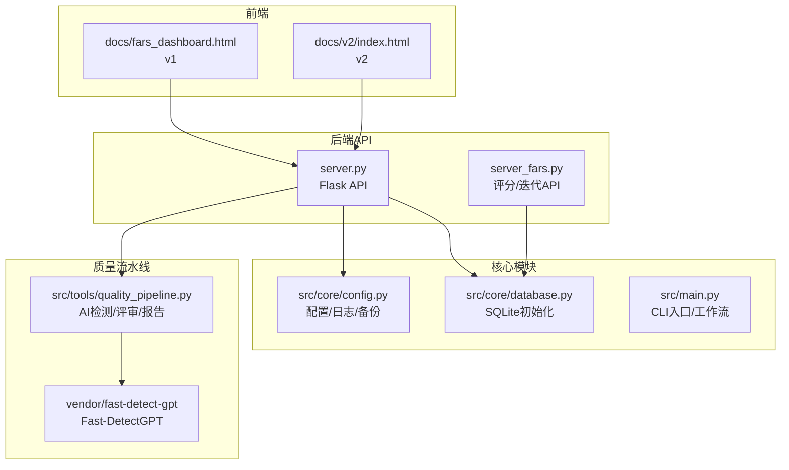
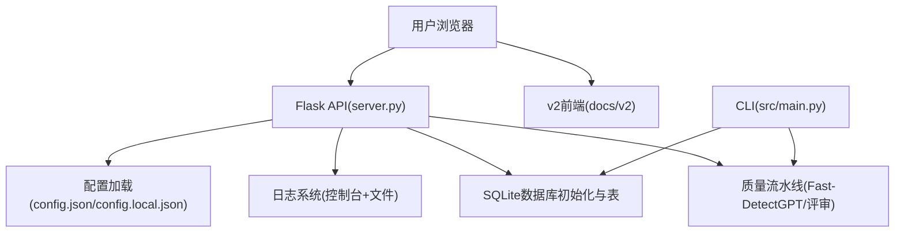
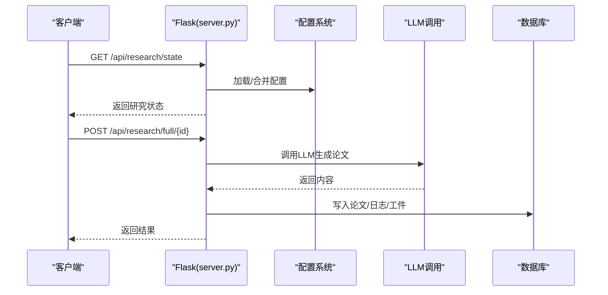
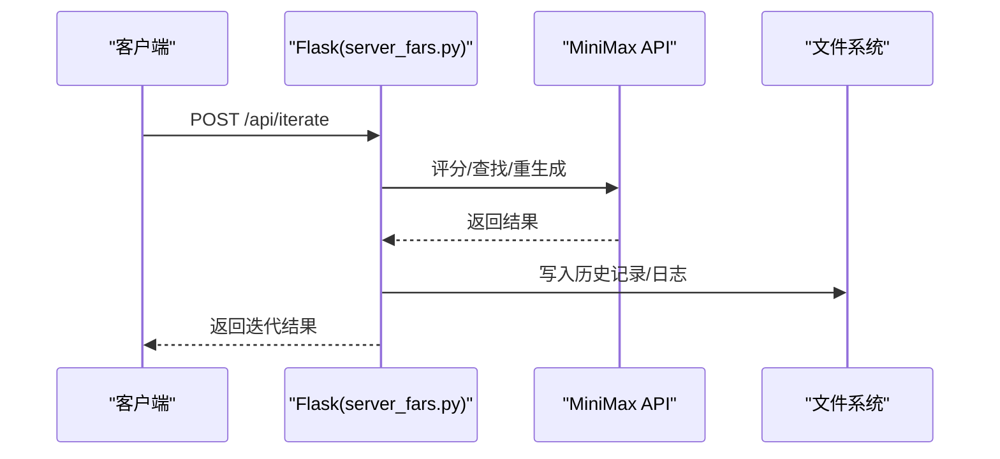
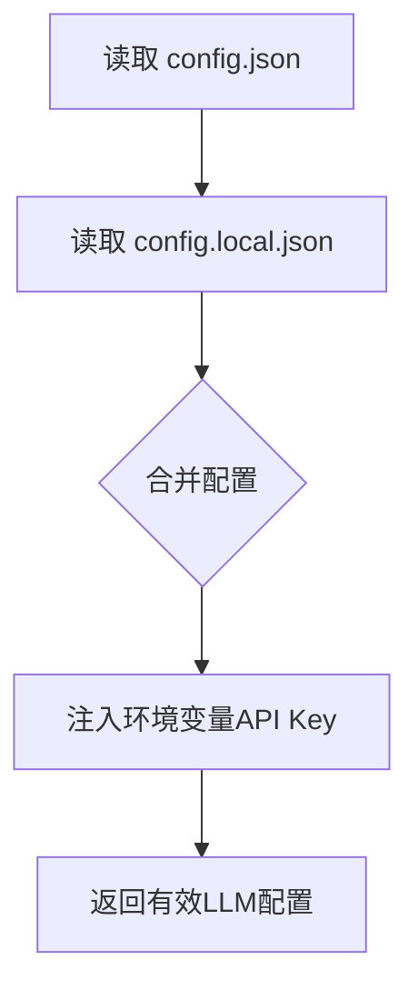
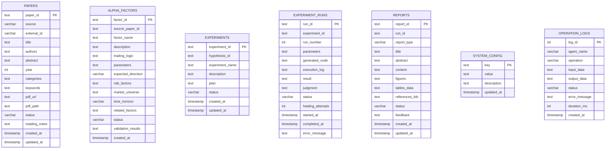
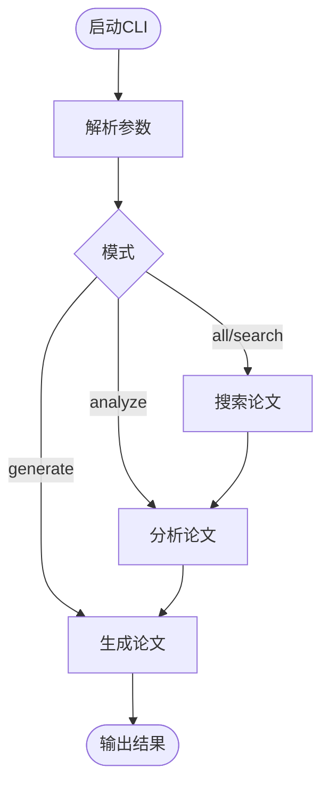
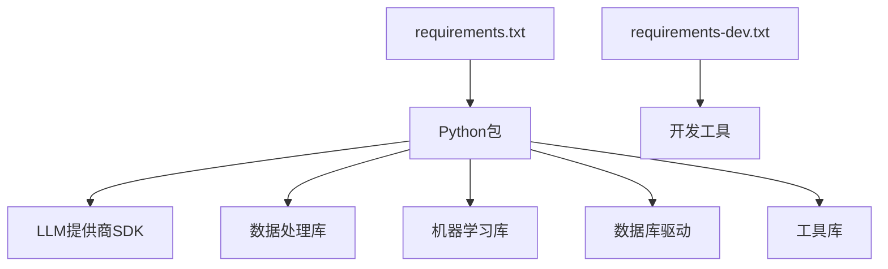

# 部署与运维

<cite>
**本文引用的文件**
- [requirements.txt](file://requirements.txt)
- [requirements-dev.txt](file://requirements-dev.txt)
- [server.py](file://server.py)
- [server_fars.py](file://server_fars.py)
- [src/main.py](file://src/main.py)
- [src/core/config.py](file://src/core/config.py)
- [src/core/database.py](file://src/core/database.py)
- [config.json](file://config.json)
- [config.local.json](file://config.local.json)
- [setup-fast-detectgpt.sh](file://setup-fast-detectgpt.sh)
- [README.md](file://README.md)
</cite>

## 目录
1. [简介](#简介)
2. [项目结构](#项目结构)
3. [核心组件](#核心组件)
4. [架构总览](#架构总览)
5. [详细组件分析](#详细组件分析)
6. [依赖分析](#依赖分析)
7. [性能考量](#性能考量)
8. [故障排除指南](#故障排除指南)
9. [结论](#结论)
10. [附录](#附录)

## 简介
本指南面向paperwriterAI项目的部署与运维团队，涵盖环境准备、依赖安装、配置与密钥管理、容器化部署、监控与日志、生产最佳实践、维护任务、故障排除、扩展性与高可用、运维自动化与监控仪表板、以及CI/CD与发布管理建议。文档基于仓库中的实际代码与配置文件进行分析，确保可操作性与可追溯性。

## 项目结构
项目采用“后端API + 前端仪表盘 + 核心研究引擎 + 质量流水线”的分层组织：
- 后端API：Flask服务器提供REST接口，承载研究流程、论文管理、质量控制等能力
- 前端仪表盘：v1与v2两个版本，通过静态资源提供可视化交互
- 核心研究与工具：agents、tools、prompts、core等模块
- 配置与数据库：全局配置、工作区、SQLite数据库初始化
- 质量流水线：Fast-DetectGPT检测、论文评审、综合报告

图表来源
- [server.py:75-76](file://server.py#L75-L76)
- [server_fars.py:13](file://server_fars.py#L13)
- [src/core/config.py:62-95](file://src/core/config.py#L62-L95)
- [src/core/database.py:15-21](file://src/core/database.py#L15-L21)
- [src/main.py:443-521](file://src/main.py#L443-L521)

章节来源
- [README.md:420-500](file://README.md#L420-L500)
- [README.md:504-541](file://README.md#L504-L541)

## 核心组件
- Flask API服务器：提供研究状态、论文管理、质量控制、分支管理等REST端点
- 配置与日志：统一读取config.json与config.local.json，支持环境变量注入API Key
- SQLite数据库：初始化表结构与索引，支持论文、因子、实验、报告、操作日志等
- 质量流水线：Fast-DetectGPT本地检测、论文评审与综合报告
- CLI入口：支持命令行模式运行工作流、测试LLM连接、上传论文等

章节来源
- [server.py:224-239](file://server.py#L224-L239)
- [src/core/config.py:462-508](file://src/core/config.py#L462-L508)
- [src/core/database.py:23-189](file://src/core/database.py#L23-L189)
- [setup-fast-detectgpt.sh:1-149](file://setup-fast-detectgpt.sh#L1-L149)
- [src/main.py:443-521](file://src/main.py#L443-L521)

## 架构总览
后端API通过Flask提供统一入口，前端v1/v2通过静态资源访问；核心模块负责配置、日志、备份与数据库初始化；质量流水线集成Fast-DetectGPT与论文评审；CLI入口支持离线工作流执行。

图表来源
- [server.py:75-76](file://server.py#L75-L76)
- [src/core/config.py:462-508](file://src/core/config.py#L462-L508)
- [src/core/database.py:23-189](file://src/core/database.py#L23-L189)
- [src/main.py:443-521](file://src/main.py#L443-L521)

## 详细组件分析

### Flask API服务器（server.py）
- 配置热加载：合并基础配置与本地配置，支持环境变量注入API Key
- LLM配置与调用：支持多Provider（OpenAI、Anthropic、Gemini、Custom），统一超时与心跳
- 研究状态与工件：提供研究状态查询、断点管理、论文与分支管理、LLM调用记录查询
- 调试与日志：内置调试上报、NDJSON调试日志、远程上报开关

图表来源
- [server.py:224-239](file://server.py#L224-L239)
- [server.py:653-800](file://server.py#L653-L800)
- [server.py:678-761](file://server.py#L678-L761)

章节来源
- [server.py:224-239](file://server.py#L224-L239)
- [server.py:653-800](file://server.py#L653-L800)
- [server.py:678-761](file://server.py#L678-L761)

### Flask评分/迭代API（server_fars.py）
- 评分、重生成、查找相关论文、完整迭代流程
- 历史记录与研究日志持久化
- LLM调用记录查询（通过SQLite）

图表来源
- [server_fars.py:511-593](file://server_fars.py#L511-L593)
- [server_fars.py:678-761](file://server_fars.py#L678-L761)

章节来源
- [server_fars.py:511-593](file://server_fars.py#L511-L593)
- [server_fars.py:678-761](file://server_fars.py#L678-L761)

### 配置与日志（src/core/config.py）
- 研究方向与Provider配置
- 日志系统：控制台与文件双通道
- 备份管理：文件与配置备份、恢复
- 配置合并：config.json与config.local.json深度合并，支持环境变量注入

图表来源
- [src/core/config.py:462-508](file://src/core/config.py#L462-L508)
- [src/core/config.py:62-95](file://src/core/config.py#L62-L95)
- [src/core/config.py:98-187](file://src/core/config.py#L98-L187)

章节来源
- [src/core/config.py:462-508](file://src/core/config.py#L462-L508)
- [src/core/config.py:62-95](file://src/core/config.py#L62-L95)
- [src/core/config.py:98-187](file://src/core/config.py#L98-L187)

### 数据库初始化（src/core/database.py）
- 表结构：papers、alpha_factors、experiments、experiment_runs、reports、system_config、operation_logs
- 索引：为常用查询字段建立索引
- 示例数据：播种示例论文与系统配置

图表来源
- [src/core/database.py:23-189](file://src/core/database.py#L23-L189)

章节来源
- [src/core/database.py:23-189](file://src/core/database.py#L23-L189)

### CLI入口（src/main.py）
- 支持方向选择、主题、模式、上传、测试LLM连接、搜索论文、查看状态
- 工作流：搜索论文→分析→生成论文
- 日志与备份：工作流步骤日志、备份管理

图表来源
- [src/main.py:443-521](file://src/main.py#L443-L521)
- [src/main.py:353-427](file://src/main.py#L353-L427)

章节来源
- [src/main.py:443-521](file://src/main.py#L443-L521)
- [src/main.py:353-427](file://src/main.py#L353-L427)

### 质量流水线与Fast-DetectGPT（setup-fast-detectgpt.sh）
- 安装脚本：自动检测GPU/加速器，安装PyTorch，下载模型，测试
- 本地检测：支持gpt-neo-2.7B、gpt-j-6B、Llama3-8B等模型
- 集成：通过Python模块调用检测函数

章节来源
- [setup-fast-detectgpt.sh:1-149](file://setup-fast-detectgpt.sh#L1-L149)

## 依赖分析
- Python运行时：Python 3.12+
- LLM提供商：OpenAI、Anthropic、Gemini、Custom
- 数据处理：pandas、numpy、matplotlib、seaborn
- 数据库：pymongo（可选）、SQLite
- 质量检测：transformers、torch、accelerate
- 开发工具：playwright（开发依赖）

图表来源
- [requirements.txt:1-39](file://requirements.txt#L1-L39)
- [requirements-dev.txt:1-2](file://requirements-dev.txt#L1-L2)

章节来源
- [requirements.txt:1-39](file://requirements.txt#L1-L39)
- [requirements-dev.txt:1-2](file://requirements-dev.txt#L1-L2)

## 性能考量
- LLM调用超时与心跳：统一请求超时、心跳上报、飞行中请求跟踪
- Token用量统计：按阶段汇总调用次数、错误数、Token估算
- 数据库索引：为高频查询字段建立索引，减少慢查询
- 日志与备份：控制台与文件双通道日志，避免日志风暴；备份策略降低数据丢失风险

章节来源
- [server.py:378-446](file://server.py#L378-L446)
- [server.py:448-546](file://server.py#L448-L546)
- [src/core/database.py:165-183](file://src/core/database.py#L165-L183)
- [src/core/config.py:62-95](file://src/core/config.py#L62-L95)

## 故障排除指南
- LLM连接失败：检查环境变量API Key、Provider配置、Base URL
- 请求超时：调整请求超时配置、检查网络与Provider限流
- 数据库异常：确认数据库路径、权限、表结构初始化
- 质量检测报错：确认Fast-DetectGPT安装、模型缓存、GPU/CPU可用性
- 日志定位：查看Flask日志文件与NDJSON调试日志

章节来源
- [server.py:295-305](file://server.py#L295-L305)
- [server.py:676-784](file://server.py#L676-L784)
- [src/core/database.py:15-21](file://src/core/database.py#L15-L21)
- [setup-fast-detectgpt.sh:83-127](file://setup-fast-detectgpt.sh#L83-L127)

## 结论
本指南提供了paperwriterAI从环境准备到生产运维的完整路径，结合代码中的配置、日志、数据库与API实现，给出了可落地的部署与运维建议。建议在生产环境中启用健康检查、完善的日志与监控、定期备份与容量规划，并通过CI/CD自动化发布流程保障稳定性。

## 附录

### 环境配置与依赖安装
- 安装Python与虚拟环境
- 安装生产依赖与开发依赖
- 配置API Key（通过环境变量注入）
- 初始化数据库与示例数据

章节来源
- [README.md:544-590](file://README.md#L544-L590)
- [requirements.txt:1-39](file://requirements.txt#L1-L39)
- [requirements-dev.txt:1-2](file://requirements-dev.txt#L1-L2)
- [src/core/database.py:259-274](file://src/core/database.py#L259-L274)

### 环境变量与配置
- LLM Provider API Key通过环境变量注入
- config.json与config.local.json合并，本地配置优先
- 支持自定义Base URL与模型参数

章节来源
- [README.md:553-568](file://README.md#L553-L568)
- [config.json:1-65](file://config.json#L1-L65)
- [config.local.json:1-36](file://config.local.json#L1-L36)
- [src/core/config.py:462-508](file://src/core/config.py#L462-L508)

### 监控与日志
- Flask日志：控制台与文件双通道
- 调试日志：NDJSON文件与远程上报
- LLM调用统计：按阶段汇总调用次数、错误数、Token用量
- 数据库操作日志：记录Agent操作、输入输出、状态与错误

章节来源
- [src/core/config.py:62-95](file://src/core/config.py#L62-L95)
- [server.py:160-193](file://server.py#L160-L193)
- [server.py:448-546](file://server.py#L448-L546)
- [src/core/database.py:150-163](file://src/core/database.py#L150-L163)

### 生产最佳实践
- 安全：API Key通过环境变量注入，不写入配置文件
- 备份：定期备份配置与工件，启用数据库与日志备份
- 性能：合理设置请求超时、启用索引、限制并发
- 可观测性：开启健康检查端点、收集LLM调用指标

章节来源
- [README.md:553-568](file://README.md#L553-L568)
- [src/core/config.py:98-187](file://src/core/config.py#L98-L187)
- [src/core/database.py:165-183](file://src/core/database.py#L165-L183)
- [server.py:698-698](file://server.py#L698-L698)

### 维护任务
- 定期更新：升级依赖、迁移数据库、更新模板
- 性能调优：分析慢查询、优化索引、调整LLM参数
- 容量规划：监控磁盘使用、日志轮转、备份空间

章节来源
- [src/core/database.py:192-256](file://src/core/database.py#L192-L256)
- [src/core/config.py:98-187](file://src/core/config.py#L98-L187)

### 故障排除清单
- LLM连接：检查API Key、Base URL、Provider可用性
- 数据库：确认路径、权限、表结构、索引
- 质量检测：确认模型下载、缓存路径、GPU/CPU可用
- 日志：定位Flask日志与NDJSON调试日志

章节来源
- [server.py:295-305](file://server.py#L295-L305)
- [src/core/database.py:15-21](file://src/core/database.py#L15-L21)
- [setup-fast-detectgpt.sh:83-127](file://setup-fast-detectgpt.sh#L83-L127)

### 扩展性与高可用
- 负载均衡：多实例部署，共享数据库与对象存储
- 高可用：数据库主从、日志与备份异地存放
- 横向扩展：将论文生成与质量检测拆分为独立服务

章节来源
- [README.md:504-541](file://README.md#L504-L541)
- [src/core/database.py:23-189](file://src/core/database.py#L23-L189)

### 运维自动化与监控仪表板
- 自动化：Shell脚本与CI/CD流水线自动化安装、部署、备份
- 仪表板：v2前端提供状态面板、日志面板、质量面板
- 指标采集：LLM调用次数、错误率、Token用量、数据库查询耗时

章节来源
- [README.md:504-541](file://README.md#L504-L541)
- [server.py:448-546](file://server.py#L448-L546)
- [src/core/database.py:150-163](file://src/core/database.py#L150-L163)

### CI/CD与发布管理
- 流水线：拉取代码、安装依赖、初始化数据库、运行测试、打包发布
- 发布：Docker镜像或裸机部署，配合健康检查与滚动更新

章节来源
- [README.md:544-590](file://README.md#L544-L590)