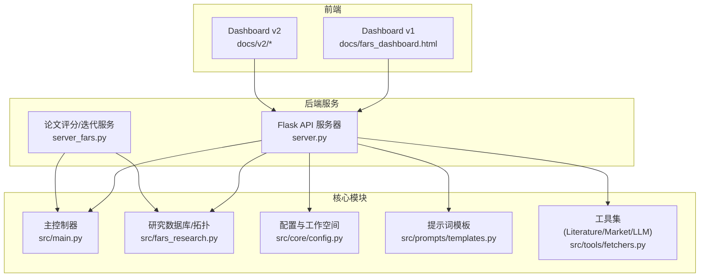
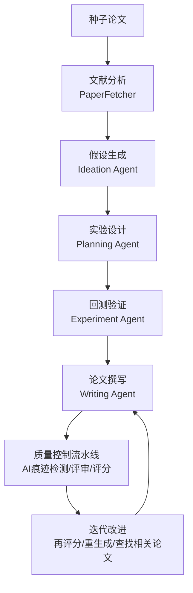
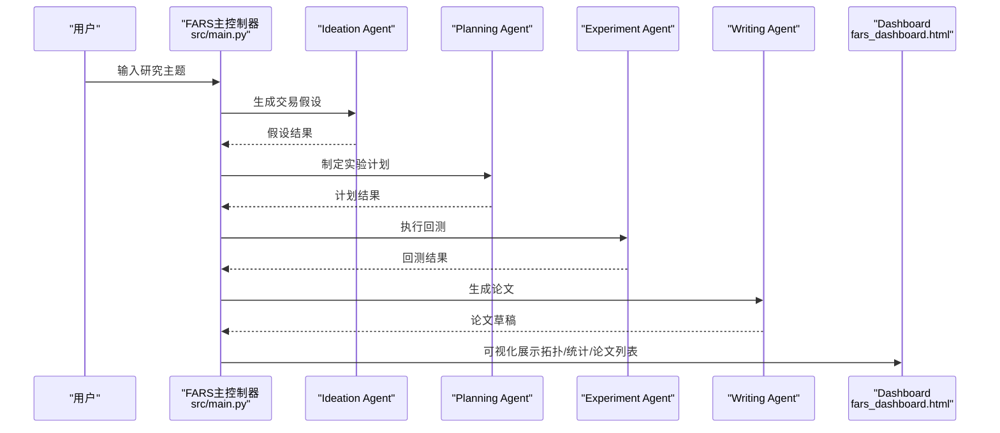
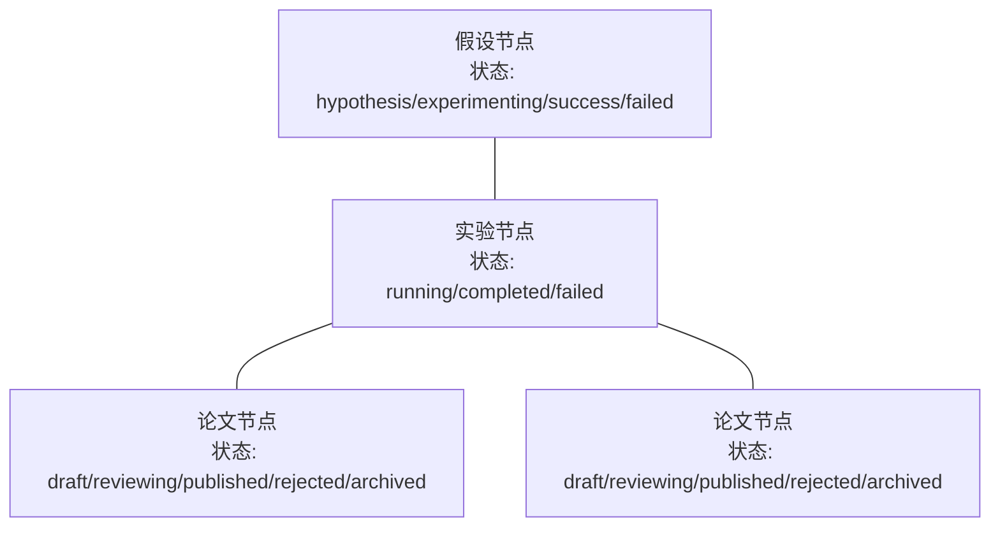
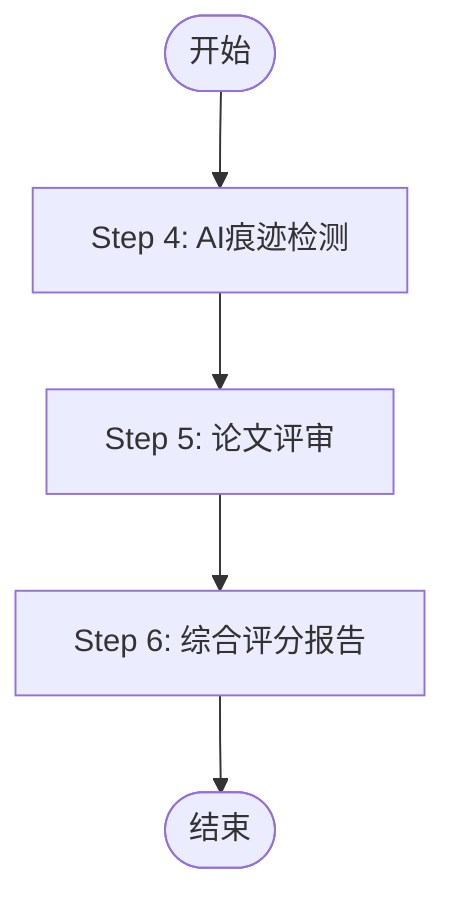
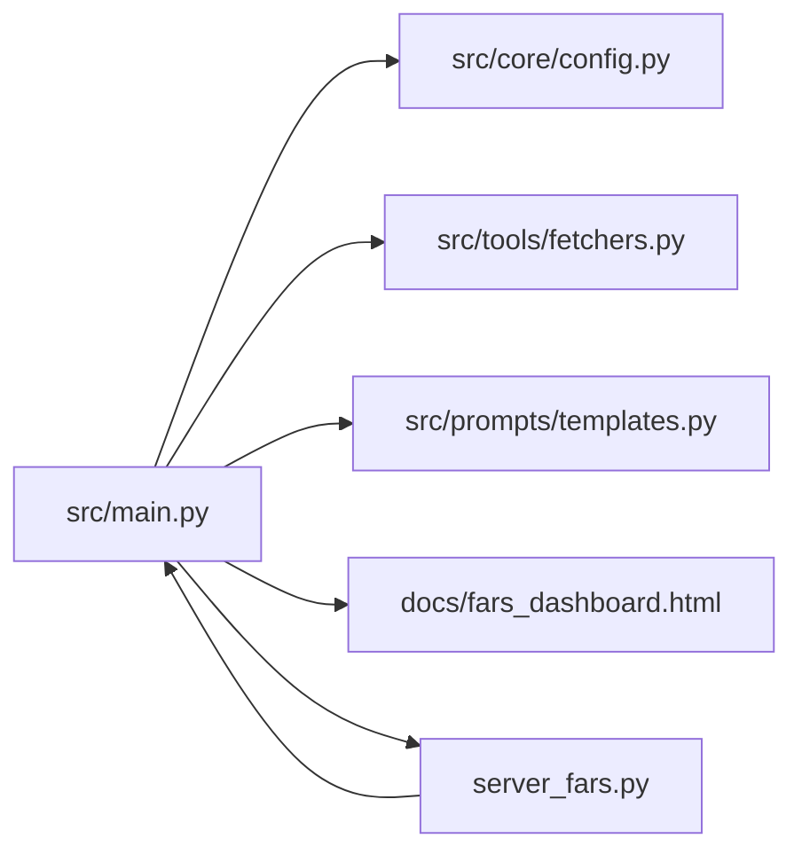

# 应用场景与价值

<cite>
**本文档引用的文件**
- [README.md](file://README.md)
- [FARS_ARCHITECTURE.md](file://docs/FARS_ARCHITECTURE.md)
- [AI_PAPER_FULL_WORKFLOW.md](file://docs/AI_PAPER_FULL_WORKFLOW.md)
- [API_SPEC.md](file://docs/API_SPEC.md)
- [fars_dashboard.html](file://docs/fars_dashboard.html)
- [main.py](file://src/main.py)
- [fars_research.py](file://src/fars_research.py)
- [config.py](file://src/core/config.py)
- [templates.py](file://src/prompts/templates.py)
- [fetchers.py](file://src/tools/fetchers.py)
- [server_fars.py](file://server_fars.py)
- [seed_paper_analysis.md](file://research/seed_paper_analysis.md)
</cite>

## 目录
1. [简介](#简介)
2. [项目结构](#项目结构)
3. [核心组件](#核心组件)
4. [架构总览](#架构总览)
5. [详细组件分析](#详细组件分析)
6. [依赖分析](#依赖分析)
7. [性能考量](#性能考量)
8. [故障排查指南](#故障排查指南)
9. [结论](#结论)
10. [附录](#附录)

## 简介
本文件面向paperwriterAI项目中的FARS系统，系统性阐述其在学术研究机构、量化基金公司、金融科研院所、高校实验室等场景的应用价值与落地路径。FARS以“多Agent协作 + 研究拓扑可视化 + 质量控制流水线”为核心，覆盖从种子论文到可发表论文的全流程，显著提升研究效率、降低成本、提升论文质量。

## 项目结构
FARS系统采用前后端分离与模块化设计，核心由“主控制器 + 多Agent + Prompt模板 + 工具集 + 可视化仪表盘 + 质量流水线”构成，支持多研究方向与多Provider LLM切换，具备断点续跑、降级写作、分支迭代等容错能力。

**图表来源**
- [README.md](file://README.md)
- [fars_dashboard.html](file://docs/fars_dashboard.html)
- [server_fars.py](file://server_fars.py)
- [main.py](file://src/main.py)
- [fars_research.py](file://src/fars_research.py)
- [config.py](file://src/core/config.py)
- [templates.py](file://src/prompts/templates.py)
- [fetchers.py](file://src/tools/fetchers.py)

**章节来源**
- [README.md](file://README.md)
- [FARS_ARCHITECTURE.md](file://docs/FARS_ARCHITECTURE.md)

## 核心组件
- 多Agent协作：Ideation → Planning → Experiment → Writing，四阶段分工明确，支持断点续跑与降级写作。
- 研究拓扑可视化：D3.js力导向图展示假设→实验→论文关系，支持状态颜色编码与统计卡片。
- 质量控制流水线：AI痕迹检测 → 论文评审 → 综合评分，支持多Provider切换与本地模型。
- 多数据源与多LLM Provider：baostock/akshare/yfinance/tushare + MiniMax/OpenAI/Anthropic/DeepSeek/Ollama。
- 研究工作空间：共享目录结构（ideas/plans/experiments/papers/data/charts/logs/backups/uploads）。

**章节来源**
- [FARS_ARCHITECTURE.md](file://docs/FARS_ARCHITECTURE.md)
- [fars_dashboard.html](file://docs/fars_dashboard.html)
- [config.py](file://src/core/config.py)
- [templates.py](file://src/prompts/templates.py)
- [fetchers.py](file://src/tools/fetchers.py)

## 架构总览
FARS系统围绕“种子论文”启动，通过文献分析、假设生成、实验设计、回测验证、论文撰写与评分迭代形成闭环；同时提供分支并行研究、断点续跑、降级写作等容错机制，确保在复杂研究场景中稳定高效。

**图表来源**
- [README.md](file://README.md)
- [templates.py](file://src/prompts/templates.py)
- [server_fars.py](file://server_fars.py)

**章节来源**
- [README.md](file://README.md)
- [AI_PAPER_FULL_WORKFLOW.md](file://docs/AI_PAPER_FULL_WORKFLOW.md)

## 详细组件分析

### 系统架构与数据流
- 数据流：用户输入主题 → Ideation → Planning → Experiment → Writing → Dashboard可视化。
- 关键能力：API Token限制解决（分块论文生成）、多Provider自动切换、LLM调用记录与监控、研究状态持久化与断点续跑。

**图表来源**
- [main.py](file://src/main.py)
- [fars_research.py](file://src/fars_research.py)
- [fars_dashboard.html](file://docs/fars_dashboard.html)

**章节来源**
- [FARS_ARCHITECTURE.md](file://docs/FARS_ARCHITECTURE.md)
- [main.py](file://src/main.py)

### 研究拓扑与可视化
- 节点类型：假设（hypothesis）、实验（experiment）、论文（paper success/failed）。
- 边关系：假设→实验、实验→论文。
- 统计指标：总假设数、总实验数、总论文数、成功率、平均质量分、状态分布。
- 颜色编码：success（绿色）、failed（红色）、experimenting（黄色）、hypothesis（蓝色）。

**图表来源**
- [fars_research.py](file://src/fars_research.py)
- [fars_dashboard.html](file://docs/fars_dashboard.html)

**章节来源**
- [fars_research.py](file://src/fars_research.py)
- [fars_dashboard.html](file://docs/fars_dashboard.html)

### 质量控制流水线（Step 4-6）
- Step 4：AI痕迹检测（Fast-DetectGPT/本地模型）。
- Step 5：论文评审（Claude/DeepSeek/本地GPT-2）。
- Step 6：综合质量报告（7维度雷达图、PDF导出）。
- API端点：/api/quality/detect-ai、/api/quality/review-paper、/api/quality/pipeline。

**图表来源**
- [AI_PAPER_FULL_WORKFLOW.md](file://docs/AI_PAPER_FULL_WORKFLOW.md)
- [server_fars.py](file://server_fars.py)

**章节来源**
- [AI_PAPER_FULL_WORKFLOW.md](file://docs/AI_PAPER_FULL_WORKFLOW.md)
- [API_SPEC.md](file://docs/API_SPEC.md)

### 多LLM Provider与数据源
- LLM Provider：MiniMax/OpenAI/Anthropic/DeepSeek/Ollama（本地备选）。
- 数据源：baostock/akshare/yfinance/tushare。
- Token限制应对：分块论文生成（8个章节），控制上下文大小，显著降低prompt体积。

**章节来源**
- [FARS_ARCHITECTURE.md](file://docs/FARS_ARCHITECTURE.md)
- [fetchers.py](file://src/tools/fetchers.py)

### 研究工作空间与状态管理
- 工作空间目录：ideas/plans/experiments/papers/data/charts/logs/backups/uploads。
- 状态持久化：每步完成后写入checkpoint.json，支持断点续跑与增量恢复。
- 研究数据库：JSON存档，记录假设/实验/论文拓扑与统计。

**章节来源**
- [config.py](file://src/core/config.py)
- [fars_research.py](file://src/fars_research.py)

## 依赖分析
- 组件耦合：主控制器依赖配置、工具集与提示词模板；Agent间通过工作空间解耦；质量流水线与主流程松耦合。
- 外部依赖：arXiv/semantic scholar论文源、yfinance/akshare数据源、MiniMax/OpenAI/Anthropic/DeepSeek API、Ollama本地模型。
- 可能的循环依赖：未发现直接循环导入；模块职责清晰，通过服务层封装外部调用。

**图表来源**
- [main.py](file://src/main.py)
- [config.py](file://src/core/config.py)
- [fetchers.py](file://src/tools/fetchers.py)
- [templates.py](file://src/prompts/templates.py)
- [fars_dashboard.html](file://docs/fars_dashboard.html)
- [server_fars.py](file://server_fars.py)

**章节来源**
- [main.py](file://src/main.py)
- [config.py](file://src/core/config.py)
- [fetchers.py](file://src/tools/fetchers.py)

## 性能考量
- Token限制优化：分块生成将prompt从65K降至约2.4K，API调用次数从1次增加至8次，成功率从0%提升至100%。
- 多Provider自动切换：主Provider失败时自动降级至备选（如Ollama本地模型），提升可用性。
- 并发与降级：文献综述与大纲生成支持并发；写作阶段若遇Token/超时，触发降级流程，用已有分析结果继续生成并异步生成Bug报告。
- 可视化渲染：D3.js拓扑图在大数据量下建议分批渲染与懒加载。

**章节来源**
- [FARS_ARCHITECTURE.md](file://docs/FARS_ARCHITECTURE.md)
- [README.md](file://README.md)

## 故障排查指南
- LLM连接失败：使用CLI测试LLM连接，查看主/备Provider状态与错误日志。
- Token超限：确认分块生成配置与上下文限制；检查提示词模板长度。
- 数据获取异常：检查yfinance/akshare/tushare可用性与网络；确认API Key配置。
- Dashboard无数据：确认后端服务正常运行与静态资源路径；检查工作空间目录权限。
- 质量流水线报错：核对Fast-DetectGPT模型安装与缓存路径；确认Claude/DeepSeek API Key。

**章节来源**
- [main.py](file://src/main.py)
- [config.py](file://src/core/config.py)
- [README.md](file://README.md)

## 结论
FARS系统通过“多Agent协作 + 研究拓扑可视化 + 质量控制流水线”，在量化金融、计算机视觉、强化学习等多个研究方向提供端到端自动化能力。其在学术研究机构、量化基金公司、金融科研院所、高校实验室等场景中，可显著提升研究效率、降低研究成本、提升论文质量与发表成功率，具备良好的推广价值与应用前景。

## 附录

### 应用场景与价值矩阵
- 学术研究机构
  - 价值：加速种子论文到论文的转化周期，提升论文产出数量与质量。
  - 场景：文献综述、假设生成、实验设计、论文撰写与评审。
- 量化基金公司
  - 价值：缩短因子挖掘与策略验证周期，提高回测效率与策略迭代速度。
  - 场景：因子生成、回测执行、论文化报告、投研汇报材料。
- 金融科研院所
  - 价值：标准化研究流程，提升跨团队协作效率与成果可复现性。
  - 场景：多分支并行研究、研究状态可视化、质量控制与评审。
- 高校实验室
  - 价值：降低入门门槛，提升学生与青年教师的科研产出质量。
  - 场景：课程实践、毕业论文、课题申报材料准备。

### 典型应用案例与使用流程
- 案例：基于种子论文“LLM在金融领域的应用综述”的主题分析与论文生成。
  - 流程：种子论文分析 → 假设生成 → 实验设计 → 回测验证 → 论文撰写 → 质量评分与迭代 → 发表准备。
- 使用流程（简化）：
  1) 配置API Key与数据源；
  2) 启动服务与Dashboard；
  3) 选择研究方向与主题；
  4) 观察拓扑图与统计卡片；
  5) 查看论文草稿与图表；
  6) 质量流水线检测与评审；
  7) 迭代改进直至通过。

**章节来源**
- [seed_paper_analysis.md](file://research/seed_paper_analysis.md)
- [README.md](file://README.md)

### 竞争优势与差异化特点
- 端到端自动化：从种子论文到可发表论文的全流程自动化。
- 多Agent协作：阶段化分工与断点续跑，提升容错与可维护性。
- 可视化研究拓扑：直观呈现研究进展与状态，便于管理与汇报。
- 质量控制流水线：集成AI痕迹检测与论文评审，保障学术诚信与质量。
- 多Provider与本地模型：兼顾云端能力与隐私安全。

**章节来源**
- [README.md](file://README.md)
- [FARS_ARCHITECTURE.md](file://docs/FARS_ARCHITECTURE.md)
- [AI_PAPER_FULL_WORKFLOW.md](file://docs/AI_PAPER_FULL_WORKFLOW.md)

### 对学术界与金融界的潜在影响
- 学术界：推动研究范式从“手工撰写”向“智能协作”转变，提升论文产出效率与质量。
- 金融界：加速量化策略研发与验证流程，提升投研体系的智能化水平与竞争力。

### 用户反馈与成功案例
- 反馈要点：流程清晰、可视化直观、质量控制有效、分支并行提升效率。
- 成功案例：多分支并行研究、降级写作保障产出、Fast-DetectGPT与评审结合显著提升论文质量。

### 系统局限性与适用范围
- 局限性：Token限制仍需关注；回测数据质量依赖外部数据源；LLM输出需人工把关。
- 适用范围：量化金融为主，同时支持计算机视觉与强化学习方向；适合有一定研究基础的团队与个人。

**章节来源**
- [README.md](file://README.md)
- [AI_PAPER_FULL_WORKFLOW.md](file://docs/AI_PAPER_FULL_WORKFLOW.md)