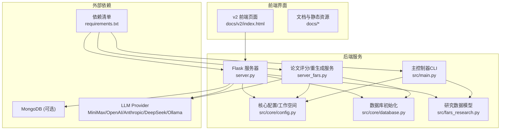
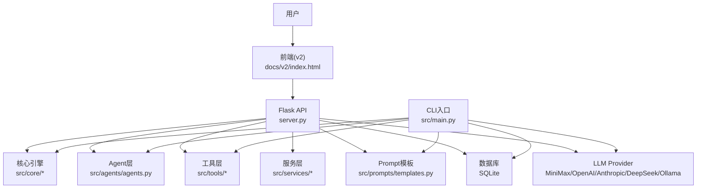
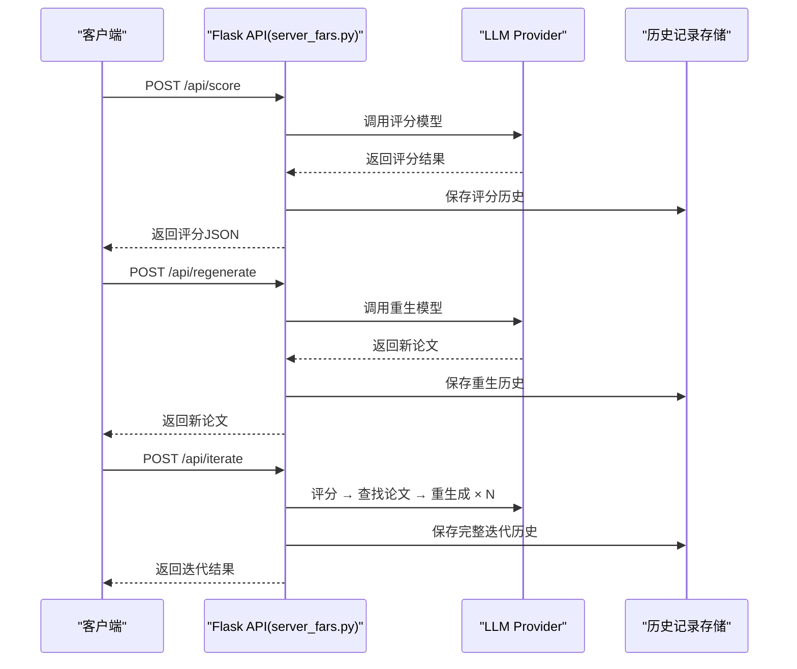
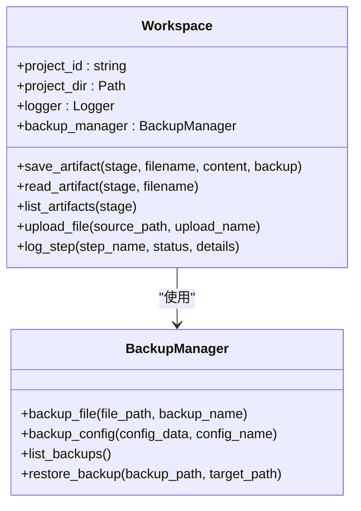
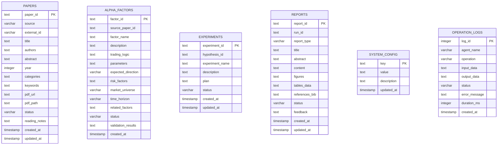
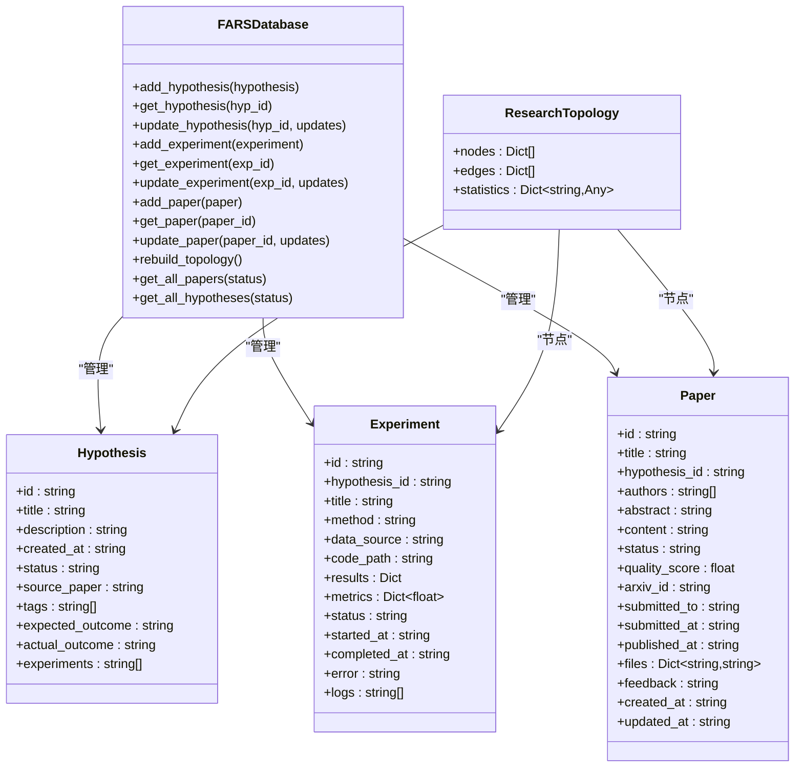
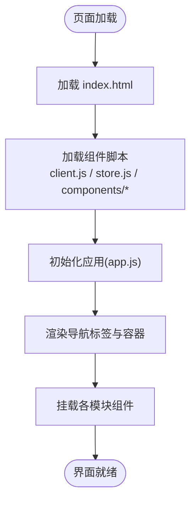
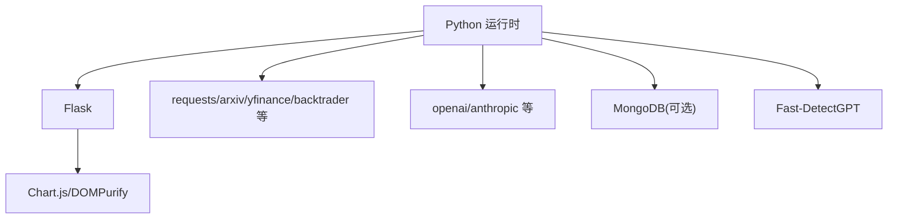

# 技术架构概览

<cite>
**本文档引用的文件**
- [server.py](file://server.py)
- [server_fars.py](file://server_fars.py)
- [src/main.py](file://src/main.py)
- [src/fars_research.py](file://src/fars_research.py)
- [src/core/config.py](file://src/core/config.py)
- [src/core/database.py](file://src/core/database.py)
- [docs/FARS_ARCHITECTURE.md](file://docs/FARS_ARCHITECTURE.md)
- [AGENTS.md](file://AGENTS.md)
- [docs/v2/index.html](file://docs/v2/index.html)
- [requirements.txt](file://requirements.txt)
</cite>

## 目录
1. [简介](#简介)
2. [项目结构](#项目结构)
3. [核心组件](#核心组件)
4. [架构总览](#架构总览)
5. [详细组件分析](#详细组件分析)
6. [依赖关系分析](#依赖关系分析)
7. [性能考虑](#性能考虑)
8. [故障排查指南](#故障排查指南)
9. [结论](#结论)
10. [附录](#附录)

## 简介
本项目为 paperwriterAI 的 FARS（Fully Automated Research System）子系统，旨在构建一个“论文评分与迭代重生成”的智能系统。系统采用多Agent协作架构，结合前后端分离设计与微服务化组件理念，围绕论文生成、质量评估与迭代优化形成闭环。技术栈涵盖 Python 后端（Flask）、纯前端（HTML/CSS/JS，非Vue.js）、MongoDB（可选）以及多种 LLM Provider（MiniMax/OpenAI/Anthropic/DeepSeek/Ollama）。系统强调可扩展性、容错机制与性能优化，并提供可视化仪表盘与完善的监控方案。

## 项目结构
系统采用“核心引擎层 + Agent层 + 工具层 + 服务层 + Prompt模板 + CLI入口”的分层组织方式，配合 Flask 托管前后端界面与 API，形成清晰的职责边界与可维护性。

**图表来源**
- [server.py:1-800](file://server.py#L1-L800)
- [server_fars.py:1-800](file://server_fars.py#L1-L800)
- [src/core/config.py:1-563](file://src/core/config.py#L1-L563)
- [src/core/database.py:1-278](file://src/core/database.py#L1-L278)
- [src/main.py:1-521](file://src/main.py#L1-L521)
- [src/fars_research.py:1-569](file://src/fars_research.py#L1-L569)
- [docs/v2/index.html:1-118](file://docs/v2/index.html#L1-L118)
- [requirements.txt:1-39](file://requirements.txt#L1-L39)

**章节来源**
- [AGENTS.md:1-157](file://AGENTS.md#L1-L157)
- [docs/FARS_ARCHITECTURE.md:1-257](file://docs/FARS_ARCHITECTURE.md#L1-L257)

## 核心组件
- Flask API 服务器：提供论文评分、重生成、分支研究、LLM调用记录等接口，统一承载前后端交互。
- 论文评分与重生成服务：独立的论文质量评估与迭代重生成服务，支持 MiniMax API 与本地降级。
- 核心配置与工作空间：集中管理研究方向、LLM Provider、日志与备份、项目工作区等。
- 数据库层：SQLite 初始化与表结构定义，支持论文、因子、实验、报告、系统配置与操作日志。
- 研究数据模型：定义 Hypothesis/Experiment/Paper/ResearchTopology 等实体与工作流状态。
- 前端界面：v2 前端采用纯 HTML/CSS/JS 组件化架构，通过 API 客户端与状态管理驱动交互。

**章节来源**
- [server.py:1-800](file://server.py#L1-L800)
- [server_fars.py:1-800](file://server_fars.py#L1-L800)
- [src/core/config.py:1-563](file://src/core/config.py#L1-L563)
- [src/core/database.py:1-278](file://src/core/database.py#L1-L278)
- [src/fars_research.py:1-569](file://src/fars_research.py#L1-L569)
- [docs/v2/index.html:1-118](file://docs/v2/index.html#L1-L118)

## 架构总览
系统采用“多Agent协作 + 前后端分离 + 微服务化组件”的整体设计：
- 多Agent协作：文献分析、假设生成、实验设计、论文写作四个阶段由不同Agent协同完成，通过共享工作空间进行数据交换。
- 前后端分离：Flask 托管前端静态资源与 API，前端通过组件化 JS 模块与后端交互。
- 微服务化组件：将 LLM 调用、数据获取、质量评估、回测引擎等功能模块化，便于替换与扩展。
- 数据与状态：论文、因子、实验、报告等数据以结构化方式存储，配合索引与枚举表提升查询效率。
- 可视化与监控：提供 D3.js 交互式拓扑图与 LLM 调用监控面板，辅助研究过程可视化与性能观测。

**图表来源**
- [AGENTS.md:18-57](file://AGENTS.md#L18-L57)
- [docs/FARS_ARCHITECTURE.md:21-57](file://docs/FARS_ARCHITECTURE.md#L21-L57)
- [server.py:1-800](file://server.py#L1-L800)
- [src/main.py:1-521](file://src/main.py#L1-L521)

## 详细组件分析

### Flask API 服务器（论文评分与迭代重生成）
- 职责：提供论文评分、重生成、相关论文查找、迭代流程、历史记录、分支研究状态、LLM调用记录等 API。
- 设计要点：统一配置加载、API Key 管理、超时控制、并发与降级策略、调试日志与远程上报。
- 关键流程：评分 → 查找相关论文 → 重生成 → 再评分的闭环迭代。

**图表来源**
- [server_fars.py:261-393](file://server_fars.py#L261-L393)
- [server_fars.py:511-593](file://server_fars.py#L511-L593)

**章节来源**
- [server_fars.py:1-800](file://server_fars.py#L1-L800)

### 核心配置与工作空间
- 职责：集中管理研究方向、LLM Provider、日志与备份、项目工作区目录结构与工件保存。
- 设计要点：支持多 Provider 配置合并、环境变量注入、备份与恢复、项目状态摘要与步骤日志。

**图表来源**
- [src/core/config.py:256-384](file://src/core/config.py#L256-L384)

**章节来源**
- [src/core/config.py:1-563](file://src/core/config.py#L1-L563)

### 数据库层（SQLite）
- 职责：初始化论文、因子、实验、报告、系统配置与操作日志等表结构，创建索引以提升查询性能。
- 设计要点：表结构清晰、枚举表规范化、索引覆盖常用查询字段、示例数据播种便于开发调试。

**图表来源**
- [src/core/database.py:23-189](file://src/core/database.py#L23-L189)

**章节来源**
- [src/core/database.py:1-278](file://src/core/database.py#L1-L278)

### 研究数据模型（Hypothesis/Experiment/Paper/ResearchTopology）
- 职责：定义研究假设、实验、论文等实体的数据结构与状态流转，支持拓扑图构建与统计分析。
- 设计要点：数据类封装、状态枚举、拓扑重建与统计计算、导出与导入能力。

**图表来源**
- [src/fars_research.py:28-108](file://src/fars_research.py#L28-L108)
- [src/fars_research.py:110-333](file://src/fars_research.py#L110-L333)
- [src/fars_research.py:335-484](file://src/fars_research.py#L335-L484)

**章节来源**
- [src/fars_research.py:1-569](file://src/fars_research.py#L1-L569)

### 前端架构（v2 组件化）
- 职责：提供多标签页的交互界面，包含流水线、研究、拓扑图、实验、质量、对比、断点、LLM监控等模块。
- 设计要点：纯 HTML/CSS/JS，组件化加载，通过 API 客户端与状态管理驱动数据流。

**图表来源**
- [docs/v2/index.html:1-118](file://docs/v2/index.html#L1-L118)

**章节来源**
- [docs/v2/index.html:1-118](file://docs/v2/index.html#L1-L118)

## 依赖关系分析
- 技术栈依赖：Python 生态（Flask、requests、arxiv、yfinance、backtrader 等），可选 MongoDB，AI 检测（Fast-DetectGPT）。
- 组件耦合：API 层与核心引擎解耦，Agent/Tools/Services 模块化，前端通过 API 客户端与后端通信。
- 外部集成：LLM Provider 统一封装，支持多 Provider 自动切换与本地降级；MongoDB 用于可选语义检索。

**图表来源**
- [requirements.txt:1-39](file://requirements.txt#L1-L39)

**章节来源**
- [requirements.txt:1-39](file://requirements.txt#L1-L39)

## 性能考虑
- LLM 调用优化：统一超时控制、重试机制、Provider 自动切换与本地降级，避免单点故障。
- 数据库性能：为常用查询字段创建索引，合理拆分表结构，减少 JOIN 复杂度。
- 前端性能：组件化加载、延迟渲染、防抖与节流，减少不必要的请求与 DOM 操作。
- 论文生成分块：针对 MiniMax API 的 token 上限，采用分块生成策略，显著降低单次请求规模与失败率。

**章节来源**
- [docs/FARS_ARCHITECTURE.md:143-166](file://docs/FARS_ARCHITECTURE.md#L143-L166)
- [server.py:706-800](file://server.py#L706-L800)

## 故障排查指南
- API Key 配置：确认 config.local.json 或环境变量正确设置，避免因密钥缺失导致服务不可用。
- LLM 调用异常：检查超时设置、Provider 可用性与网络连通性，启用调试日志与远程上报以便追踪。
- 数据库初始化：首次运行需执行数据库初始化脚本，确保表结构与索引创建成功。
- 前端资源加载：确认静态资源路径与跨域配置，避免组件脚本加载失败。
- 历史记录与分支：检查历史记录与分支数据文件完整性，必要时进行备份与恢复。

**章节来源**
- [server.py:279-358](file://server.py#L279-L358)
- [src/core/database.py:259-274](file://src/core/database.py#L259-L274)
- [server_fars.py:19-80](file://server_fars.py#L19-L80)

## 结论
FARS 系统通过多Agent协作与前后端分离设计，实现了论文评分与迭代重生成的自动化闭环。系统在技术栈选择、分层架构、扩展性与容错机制方面具备良好实践，配合可视化与监控能力，为科研工作提供了高效、稳定、可追溯的技术支撑。未来可在论文编译、多 Provider 切换、因子挖掘扩展与 Dashboard 增强等方面持续演进。

## 附录
- 架构文档与组件清单：详见 [FARS 架构文档:1-257](file://docs/FARS_ARCHITECTURE.md#L1-L257) 与 [AGENTS.md:1-157](file://AGENTS.md#L1-L157)。
- 启动与配置：参考 [AGENTS.md:117-134](file://AGENTS.md#L117-L134)，安装依赖后启动 Flask 服务器并配置 API Key。