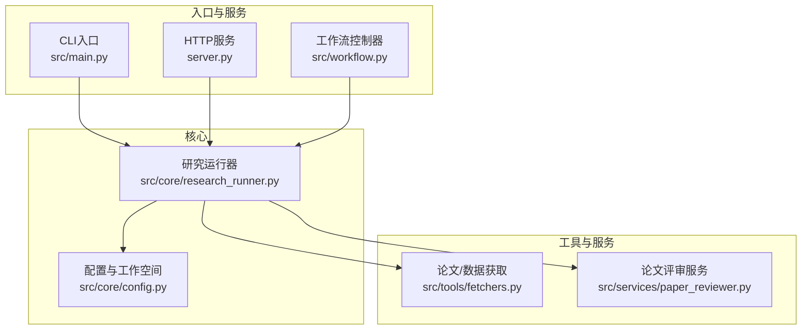
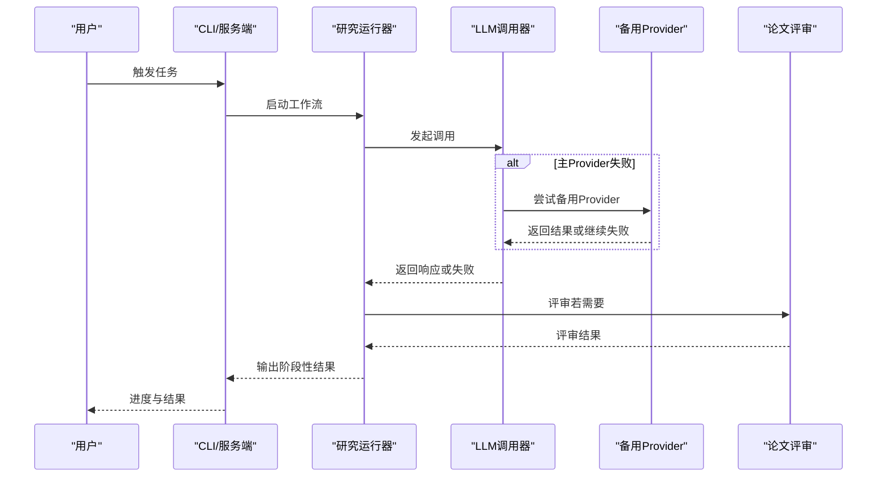
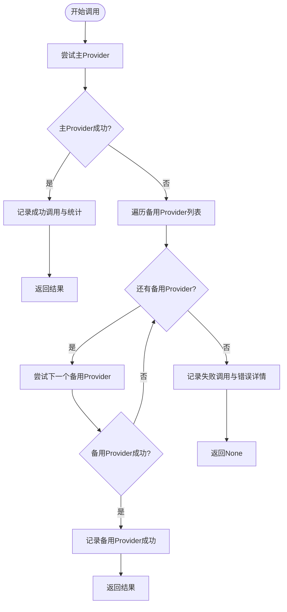
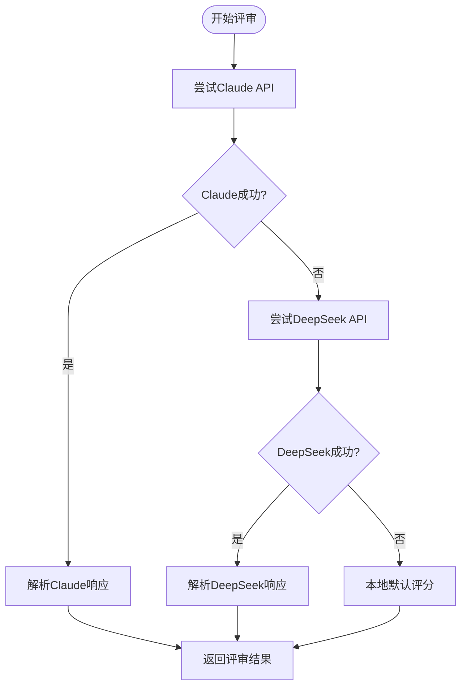
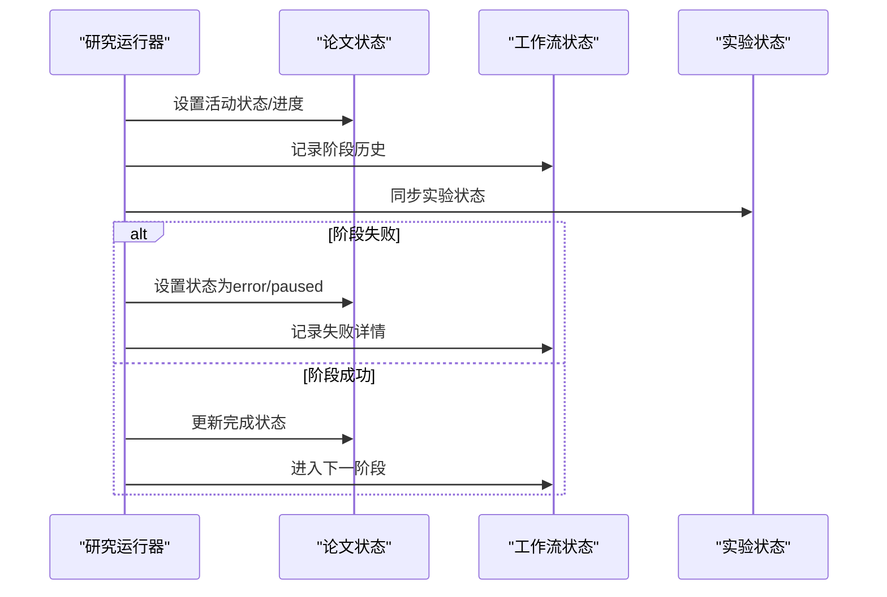
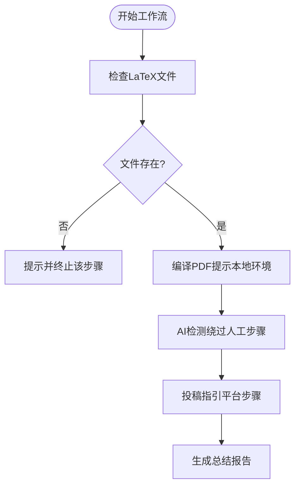
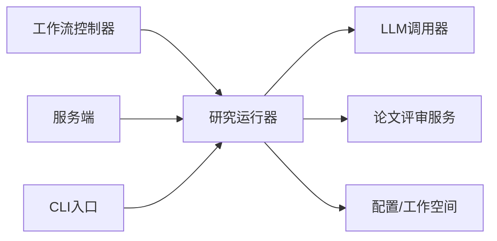

# 优雅降级策略

<cite>
**本文档引用的文件**
- [src/main.py](file://src/main.py)
- [src/tools/fetchers.py](file://src/tools/fetchers.py)
- [src/core/config.py](file://src/core/config.py)
- [src/services/paper_reviewer.py](file://src/services/paper_reviewer.py)
- [src/workflow.py](file://src/workflow.py)
- [server.py](file://server.py)
- [src/core/research_runner.py](file://src/core/research_runner.py)
</cite>

## 目录
1. [简介](#简介)
2. [项目结构](#项目结构)
3. [核心组件](#核心组件)
4. [架构总览](#架构总览)
5. [详细组件分析](#详细组件分析)
6. [依赖分析](#依赖分析)
7. [性能考量](#性能考量)
8. [故障排查指南](#故障排查指南)
9. [结论](#结论)
10. [附录](#附录)

## 简介
本文件系统化阐述 paperwriterAI 的“优雅降级”策略，聚焦在不同失败场景下的稳健性保障与用户体验优化。优雅降级的核心在于：在主链路失败时，系统能够自动切换到备选方案、简化处理流程、降低资源消耗，并持续提供可感知的进度反馈与透明的错误信息，确保用户始终处于可控且知情的状态。

## 项目结构
paperwriterAI 采用分层架构：CLI/服务端入口负责调度与状态管理；核心模块负责工作流编排与资源管理；工具模块提供外部数据与 LLM 调用能力；服务模块提供评审与质量评估；文档与前端提供可视化与交互。

图表来源
- [src/main.py:35-428](file://src/main.py#L35-L428)
- [server.py:1945-1999](file://server.py#L1945-L1999)
- [src/workflow.py:19-278](file://src/workflow.py#L19-L278)
- [src/core/research_runner.py:278-566](file://src/core/research_runner.py#L278-L566)
- [src/tools/fetchers.py:290-804](file://src/tools/fetchers.py#L290-L804)
- [src/services/paper_reviewer.py:1-473](file://src/services/paper_reviewer.py#L1-L473)
- [src/core/config.py:254-384](file://src/core/config.py#L254-L384)

章节来源
- [src/main.py:1-521](file://src/main.py#L1-L521)
- [src/workflow.py:1-286](file://src/workflow.py#L1-L286)
- [src/core/research_runner.py:1-1130](file://src/core/research_runner.py#L1-L1130)
- [src/tools/fetchers.py:1-899](file://src/tools/fetchers.py#L1-L899)
- [src/services/paper_reviewer.py:1-473](file://src/services/paper_reviewer.py#L1-L473)
- [src/core/config.py:1-563](file://src/core/config.py#L1-L563)
- [server.py:1-800](file://server.py#L1-L800)

## 核心组件
- LLM 调用器（优雅降级的关键）：支持主备多 Provider 切换、统计与日志记录、连接测试与错误回退。
- 研究运行器：按阶段推进工作流，具备门控与暂停/恢复机制，便于在失败时优雅终止或继续。
- 配置与工作空间：集中管理 LLM Provider、温度、上下文窗口、日志与备份，支撑降级策略的可配置性。
- 论文评审服务：多通道评审（Claude、DeepSeek、本地），在 API 不可用时自动回退至本地评分。
- 工作流控制器：面向最终产物的编译、AI检测绕过与投稿流程，提供明确的人机协作提示与手动步骤指引。

章节来源
- [src/tools/fetchers.py:290-804](file://src/tools/fetchers.py#L290-L804)
- [src/core/research_runner.py:278-566](file://src/core/research_runner.py#L278-L566)
- [src/core/config.py:204-251](file://src/core/config.py#L204-L251)
- [src/services/paper_reviewer.py:159-302](file://src/services/paper_reviewer.py#L159-L302)
- [src/workflow.py:19-278](file://src/workflow.py#L19-L278)

## 架构总览
优雅降级贯穿请求生命周期：从入口到 LLM 调用，再到评审与工作流执行。系统在每个关键节点设置“降级开关”，在失败时自动切换到备选路径，并通过日志、统计与 UI 反馈向用户传达状态。

图表来源
- [src/core/research_runner.py:642-796](file://src/core/research_runner.py#L642-L796)
- [src/tools/fetchers.py:391-449](file://src/tools/fetchers.py#L391-L449)
- [src/services/paper_reviewer.py:159-302](file://src/services/paper_reviewer.py#L159-L302)

## 详细组件分析

### LLM 调用器与多 Provider 降级
- 设计原则
  - 主备 Provider 列表可配置，按顺序尝试，失败即切。
  - 统一统计与日志记录，便于审计与监控。
  - 连接测试接口，便于诊断与自助排查。
- 关键实现要点
  - 主调用入口负责尝试主 Provider 并记录调用统计。
  - 若失败，遍历备用 Provider 列表逐一尝试，直至成功或穷尽。
  - 记录失败调用详情，包含错误消息与堆栈，便于后续分析。
  - 支持连接测试，返回成功/失败、Provider、Model 与错误信息。
- 降级决策
  - 依据调用是否返回有效内容决定是否切换。
  - 失败原因记录在案，供 UI 与日志展示。
- 用户体验
  - 在 CLI 或服务端显示“主Provider失败，尝试备用”的提示。
  - 保留原始调用日志以便回溯。

图表来源
- [src/tools/fetchers.py:391-449](file://src/tools/fetchers.py#L391-L449)
- [src/tools/fetchers.py:451-501](file://src/tools/fetchers.py#L451-L501)
- [src/tools/fetchers.py:806-823](file://src/tools/fetchers.py#L806-L823)

章节来源
- [src/tools/fetchers.py:290-804](file://src/tools/fetchers.py#L290-L804)
- [src/tools/fetchers.py:806-823](file://src/tools/fetchers.py#L806-L823)

### 论文评审服务的多通道降级
- 设计原则
  - 优先使用外部 API（Claude、DeepSeek），在不可用时回退至本地评分。
  - 本地评分基于内容特征进行粗略评估，保证基本可用性。
- 关键实现要点
  - 依次尝试 Claude、DeepSeek，成功则解析 JSON 返回。
  - 任一通道失败均记录错误并继续尝试下一通道。
  - 无外部通道可用时，执行本地评分逻辑，返回基础维度与建议。
- 降级决策
  - API 可用性由环境变量与请求响应判断。
  - 一旦某通道返回错误或解析失败，立即切换到下一通道。
- 用户体验
  - UI 显示评审来源（如 claude、deepseek、local）。
  - 提供雷达图与摘要，便于快速了解论文质量。

图表来源
- [src/services/paper_reviewer.py:159-302](file://src/services/paper_reviewer.py#L159-L302)
- [src/services/paper_reviewer.py:241-273](file://src/services/paper_reviewer.py#L241-L273)

章节来源
- [src/services/paper_reviewer.py:1-473](file://src/services/paper_reviewer.py#L1-L473)

### 研究运行器的阶段化降级
- 设计原则
  - 工作流按阶段推进，每个阶段完成后才进入下一阶段。
  - 门控机制在暂停、停止或错误时阻断后续阶段，避免无效消耗。
  - 支持“写作续传”，在失败后可恢复继续。
- 关键实现要点
  - 文献综述、假设生成、实验与写作等阶段分别记录时序与指标。
  - 在阶段转换时同步实验状态，更新进度与活动信息。
  - 失败时记录错误原因，设置状态为 error 或 paused。
- 降级决策
  - 阶段内失败：记录错误并终止当前阶段，保持已达成成果。
  - 阶段间失败：阻断后续阶段，等待用户干预或恢复。
- 用户体验
  - UI 展示阶段进度、耗时与指标，失败时给出明确提示。
  - 支持暂停与恢复，减少重复劳动。

图表来源
- [src/core/research_runner.py:165-177](file://src/core/research_runner.py#L165-L177)
- [src/core/research_runner.py:583-629](file://src/core/research_runner.py#L583-L629)
- [src/core/research_runner.py:642-796](file://src/core/research_runner.py#L642-L796)

章节来源
- [src/core/research_runner.py:278-566](file://src/core/research_runner.py#L278-L566)

### 工作流控制器的人机协作降级
- 设计原则
  - 编译 PDF 需要本地 TeX 环境，若缺失则提供替代方案与指导。
  - AI 检测绕过需人工操作，系统提供步骤清单与外部工具链接。
  - 投稿流程提供平台指引与模板，降低用户操作成本。
- 关键实现要点
  - 检查 LaTeX 文件是否存在，不存在则提示并终止该步骤。
  - 编译步骤保存编译信息，指导用户使用 Overleaf 或本地 TeX。
  - AI 检测绕过步骤生成人工操作指南与替代工具列表。
  - 投稿步骤生成平台登录、填写与附件清单，减少遗漏。
- 降级决策
  - 依赖缺失时，不强制阻塞，而是提供“手动所需”的明确指引。
  - 保存中间产物与说明文件，便于用户继续。
- 用户体验
  - 每一步骤输出清晰日志与下一步建议。
  - 生成总结报告，标注哪些步骤需要手动处理。

图表来源
- [src/workflow.py:38-96](file://src/workflow.py#L38-L96)
- [src/workflow.py:98-134](file://src/workflow.py#L98-L134)
- [src/workflow.py:136-162](file://src/workflow.py#L136-L162)
- [src/workflow.py:233-278](file://src/workflow.py#L233-L278)

章节来源
- [src/workflow.py:1-286](file://src/workflow.py#L1-L286)

### CLI/服务端入口的降级协调
- 设计原则
  - CLI 与服务端统一调用研究运行器，确保降级策略一致。
  - 服务端提供 LLM 配置与可用性检查，便于前端展示。
- 关键实现要点
  - CLI 解析参数并调用 FARS 主类，内部委托研究运行器执行。
  - 服务端提供 LLM 配置合并、可用性校验与使用统计。
- 降级决策
  - LLM 不可用时，服务端返回“未就绪”提示，CLI 亦可提前探测。
- 用户体验
  - 命令行与 Web 界面一致的错误提示与建议。

章节来源
- [src/main.py:443-521](file://src/main.py#L443-L521)
- [server.py:773-800](file://server.py#L773-L800)
- [server.py:392-425](file://server.py#L392-L425)

## 依赖分析
- 组件耦合
  - 研究运行器依赖 LLM 调用器与评审服务，形成“调用-评审-产出”的闭环。
  - 工作流控制器独立于 LLM，仅依赖研究运行器的阶段性产物。
  - 配置模块为全局提供 Provider、模型与日志配置，影响降级行为。
- 外部依赖
  - LLM Provider（OpenAI、Anthropic、DeepSeek、MiniMax、Ollama）。
  - 第三方 API（Claude、DeepSeek）与本地模型（Ollama）。
  - 文件系统与日志系统，用于持久化中间产物与调用记录。

图表来源
- [src/core/research_runner.py:278-566](file://src/core/research_runner.py#L278-L566)
- [src/tools/fetchers.py:290-804](file://src/tools/fetchers.py#L290-L804)
- [src/services/paper_reviewer.py:1-473](file://src/services/paper_reviewer.py#L1-L473)
- [src/core/config.py:254-384](file://src/core/config.py#L254-L384)
- [src/workflow.py:19-278](file://src/workflow.py#L19-L278)
- [server.py:1945-1999](file://server.py#L1945-L1999)
- [src/main.py:35-428](file://src/main.py#L35-L428)

章节来源
- [src/core/research_runner.py:1-1130](file://src/core/research_runner.py#L1-L1130)
- [src/tools/fetchers.py:1-899](file://src/tools/fetchers.py#L1-L899)
- [src/services/paper_reviewer.py:1-473](file://src/services/paper_reviewer.py#L1-L473)
- [src/core/config.py:1-563](file://src/core/config.py#L1-L563)
- [src/workflow.py:1-286](file://src/workflow.py#L1-L286)
- [server.py:1-800](file://server.py#L1-L800)
- [src/main.py:1-521](file://src/main.py#L1-L521)

## 性能考量
- 上下文窗口与 Token 估算
  - LLM 调用器在调用前估算 Prompt/Completion Token，避免超出 Provider 上下文限制。
  - 服务端提供 Token 统计与使用缓冲，便于长期运行的资源控制。
- 超时与重试
  - LLM 请求统一超时设置，避免长时间阻塞。
  - 备用 Provider 切换应尽快完成，减少用户等待。
- I/O 与磁盘
  - 工作流编译依赖本地 TeX 环境，系统提供替代方案与提示，避免阻塞。
  - 日志与调用记录写入文件，注意磁盘空间与轮转策略。

## 故障排查指南
- LLM 调用失败
  - 使用连接测试接口检查主/备用 Provider 可用性。
  - 查看调用日志文件，定位错误原因（认证、网络、配额等）。
  - 调整温度、最大 Token 或切换模型/Provider。
- API 限制
  - 服务端提供 LLM 配置合并与可用性检查，确认 API Key 与配额。
  - 在评审服务中，若外部 API 不可用，系统会自动回退至本地评分。
- 网络问题
  - 通过备用 Provider 切换与本地模型（Ollama）缓解网络不稳定。
  - 服务端心跳与飞行中记录可用于诊断长连接问题。
- 计算资源不足
  - 适当降低 max_tokens 与温度，缩短 Prompt。
  - 使用本地模型（Ollama）在本地资源受限时继续工作。
  - 工作流编译步骤提示用户使用云端平台（如 Overleaf）以减轻本地负担。

章节来源
- [src/tools/fetchers.py:806-823](file://src/tools/fetchers.py#L806-L823)
- [src/services/paper_reviewer.py:159-302](file://src/services/paper_reviewer.py#L159-L302)
- [server.py:498-566](file://server.py#L498-L566)

## 结论
paperwriterAI 的优雅降级策略通过“主备 Provider 切换、多通道评审回退、阶段化门控与人机协作指引”四大支柱，实现了在复杂失败场景下的稳健运行与良好用户体验。系统不仅能在技术层面自动切换与简化流程，还在流程层面提供透明的进度反馈与明确的人工介入点，确保用户始终掌控研究进程。

## 附录
- 监控与日志集成
  - LLM 调用器记录每次调用的 Provider、模型、Token、延迟与状态，便于审计与告警。
  - 服务端维护 LLM 使用统计与飞行中记录，支持实时监控与异常检测。
  - 工作流控制器记录阶段历史与实验状态，便于回溯与复盘。

章节来源
- [src/tools/fetchers.py:324-390](file://src/tools/fetchers.py#L324-L390)
- [server.py:498-666](file://server.py#L498-L666)
- [src/core/research_runner.py:165-177](file://src/core/research_runner.py#L165-L177)