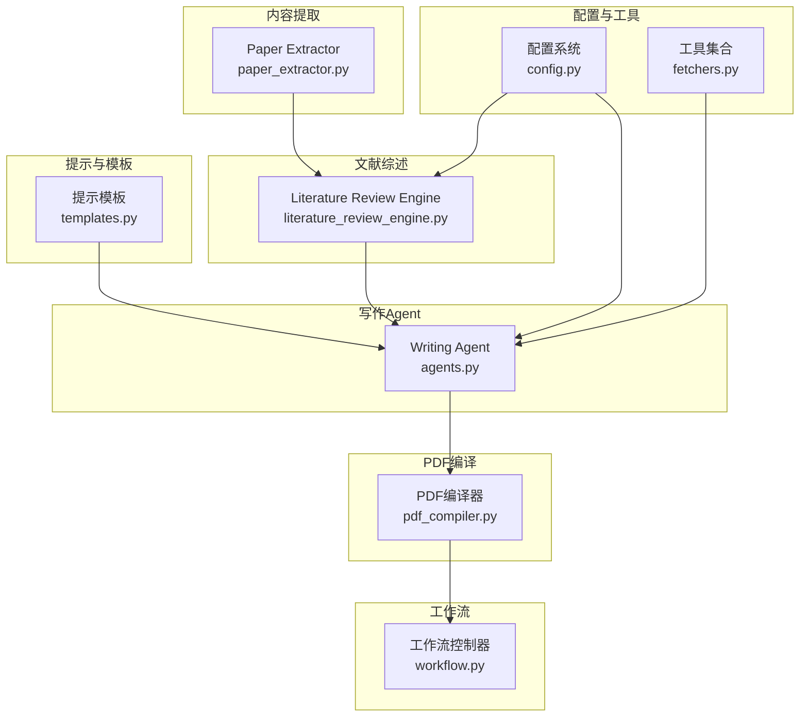
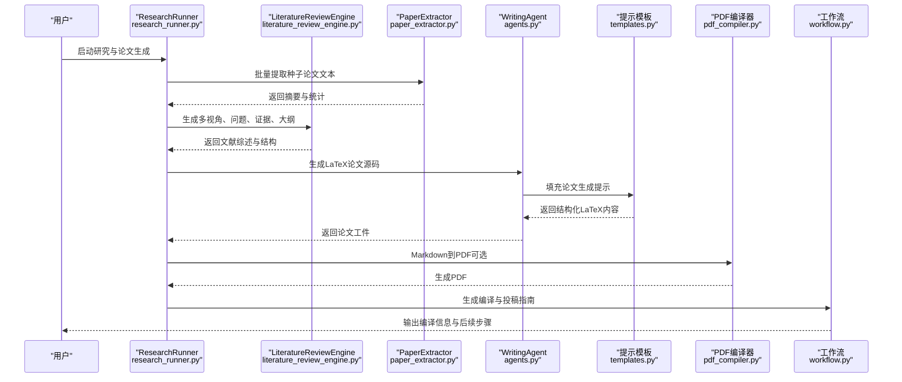
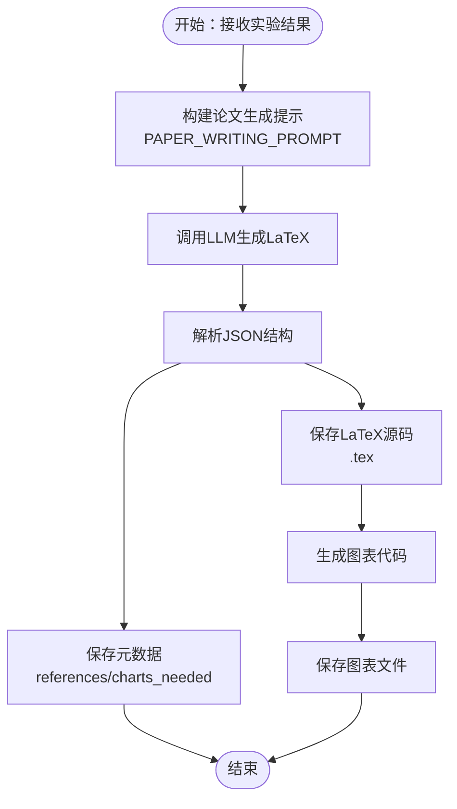
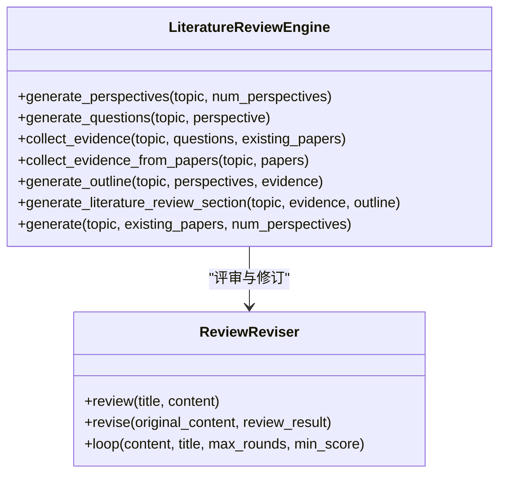
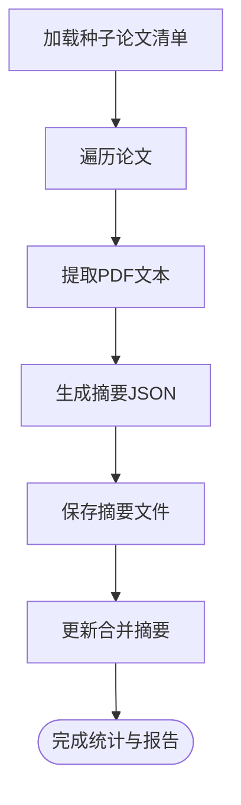
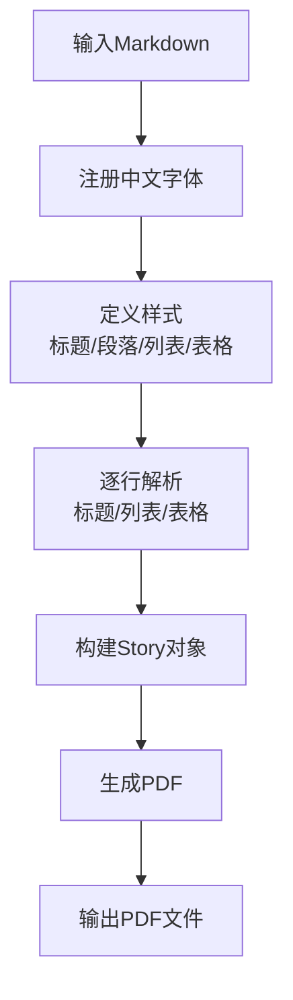
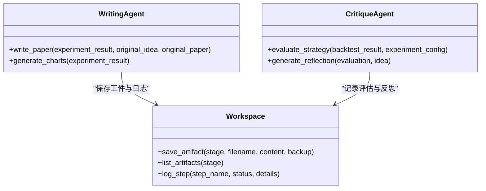
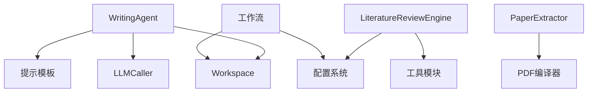

# 全文输出功能

<cite>
**本文档引用的文件**
- [src/core/pdf_compiler.py](file://src/core/pdf_compiler.py)
- [src/core/paper_extractor.py](file://src/core/paper_extractor.py)
- [src/prompts/templates.py](file://src/prompts/templates.py)
- [src/tools/literature_review_engine.py](file://src/tools/literature_review_engine.py)
- [src/core/research_runner.py](file://src/core/research_runner.py)
- [src/agents/agents.py](file://src/agents/agents.py)
- [src/tools/fetchers.py](file://src/tools/fetchers.py)
- [src/core/config.py](file://src/core/config.py)
- [src/main.py](file://src/main.py)
- [src/workflow.py](file://src/workflow.py)
- [server.py](file://server.py)
</cite>

## 目录
1. [简介](#简介)
2. [项目结构](#项目结构)
3. [核心组件](#核心组件)
4. [架构总览](#架构总览)
5. [详细组件分析](#详细组件分析)
6. [依赖关系分析](#依赖关系分析)
7. [性能考虑](#性能考虑)
8. [故障排除指南](#故障排除指南)
9. [结论](#结论)

## 简介
本文件面向paperwriterAI项目的“全文输出功能”，系统阐述从论文生成到PDF编译、格式化输出的完整流程。重点包括：
- 论文模板系统与内容渲染引擎
- 图表生成与引用处理
- 学术论文标准格式实现（如ICML风格）
- 目录、索引、参考文献等专业功能
- 与写作Agent的集成与输出质量控制
- 模板扩展、样式定制、批量处理等高级功能

## 项目结构
paperwriterAI采用分层架构，核心围绕“提示模板”“Agent工作流”“工具模块”“配置与持久化”展开。全文输出功能主要由以下模块协同完成：
- 提示模板与论文生成：Writing Agent负责生成LaTeX论文源码
- 文献综述与结构化内容：Literature Review Engine提供STORM风格的综述生成
- 论文内容提取与分析：Paper Extractor负责种子论文的文本提取与分析
- PDF输出与编译：Markdown到PDF的编译器（ReportLab）以及LaTeX编译流程
- 配置与工作区：Workspace统一管理工件存储、备份与日志

**图表来源**
- [src/prompts/templates.py:357-389](file://src/prompts/templates.py#L357-L389)
- [src/agents/agents.py:499-651](file://src/agents/agents.py#L499-L651)
- [src/tools/literature_review_engine.py:18-631](file://src/tools/literature_review_engine.py#L18-L631)
- [src/core/paper_extractor.py:53-398](file://src/core/paper_extractor.py#L53-L398)
- [src/core/pdf_compiler.py:11-175](file://src/core/pdf_compiler.py#L11-L175)
- [src/workflow.py:19-286](file://src/workflow.py#L19-L286)
- [src/core/config.py:254-425](file://src/core/config.py#L254-L425)
- [src/tools/fetchers.py:20-163](file://src/tools/fetchers.py#L20-L163)

**章节来源**
- [src/prompts/templates.py:1-758](file://src/prompts/templates.py#L1-L758)
- [src/agents/agents.py:1-738](file://src/agents/agents.py#L1-L738)
- [src/tools/literature_review_engine.py:1-850](file://src/tools/literature_review_engine.py#L1-L850)
- [src/core/paper_extractor.py:1-398](file://src/core/paper_extractor.py#L1-L398)
- [src/core/pdf_compiler.py:1-175](file://src/core/pdf_compiler.py#L1-L175)
- [src/workflow.py:1-286](file://src/workflow.py#L1-L286)
- [src/core/config.py:1-563](file://src/core/config.py#L1-L563)
- [src/tools/fetchers.py:1-899](file://src/tools/fetchers.py#L1-L899)

## 核心组件
- 提示模板与论文生成
  - Writing Agent使用PAPER_WRITING_PROMPT生成LaTeX论文源码，包含标题、摘要、引言、方法论、实证结果、结论、参考文献等章节。
  - 模板还要求生成图表清单，便于后续图表生成与插入。
- 文献综述引擎
  - Literature Review Engine实现STORM风格的多视角生成、问题生成、证据收集、大纲生成与文献综述章节生成。
  - 支持Review-Revision循环，持续优化论文质量。
- 论文内容提取与分析
  - Paper Extractor从PDF中提取文本，生成摘要与统计信息，支持批量处理与去重。
  - 提供种子论文分析报告的重建能力。
- PDF编译与输出
  - Markdown到PDF：使用ReportLab注册中文字体、自定义样式，解析Markdown标题、列表、表格，生成PDF。
  - LaTeX编译：提供工作流脚本，指导用户使用pdflatex/xelatex或Overleaf完成LaTeX到PDF的编译。
- 配置与工作区
  - Workspace统一管理项目目录、工件保存、备份与日志。
  - 配置系统支持多Provider LLM切换、研究方向、评估阈值等。

**章节来源**
- [src/agents/agents.py:499-651](file://src/agents/agents.py#L499-L651)
- [src/prompts/templates.py:357-389](file://src/prompts/templates.py#L357-L389)
- [src/tools/literature_review_engine.py:18-631](file://src/tools/literature_review_engine.py#L18-L631)
- [src/core/paper_extractor.py:53-398](file://src/core/paper_extractor.py#L53-L398)
- [src/core/pdf_compiler.py:11-175](file://src/core/pdf_compiler.py#L11-L175)
- [src/workflow.py:38-96](file://src/workflow.py#L38-L96)
- [src/core/config.py:254-425](file://src/core/config.py#L254-L425)

## 架构总览
全文输出功能的端到端流程如下：

**图表来源**
- [src/core/research_runner.py:642-800](file://src/core/research_runner.py#L642-L800)
- [src/tools/literature_review_engine.py:557-631](file://src/tools/literature_review_engine.py#L557-L631)
- [src/core/paper_extractor.py:149-223](file://src/core/paper_extractor.py#L149-L223)
- [src/agents/agents.py:499-581](file://src/agents/agents.py#L499-L581)
- [src/prompts/templates.py:357-389](file://src/prompts/templates.py#L357-L389)
- [src/core/pdf_compiler.py:11-175](file://src/core/pdf_compiler.py#L11-L175)
- [src/workflow.py:38-96](file://src/workflow.py#L38-L96)

## 详细组件分析

### 论文模板系统与内容渲染引擎
- 模板定义
  - PAPER_WRITING_PROMPT要求输出包含标题、摘要、引言、方法论、实证结果、结论、参考文献的完整LaTeX源码，并要求提供图表清单。
  - 模板还要求即使实验数据不完美也要如实报告，体现学术诚信。
- 内容渲染
  - Writing Agent接收实验结果与原始论文信息，调用LLM生成结构化JSON，其中包含tex_content、references、charts_needed等字段。
  - Workspace将生成的LaTeX源码保存为.tex文件，并保存元数据（包含参考文献与图表清单）。
- 图表生成
  - Writing Agent提供图表代码生成逻辑，使用matplotlib生成权益曲线、回撤、收益分布等图表，并保存到charts目录。

**图表来源**
- [src/prompts/templates.py:357-389](file://src/prompts/templates.py#L357-L389)
- [src/agents/agents.py:517-651](file://src/agents/agents.py#L517-L651)

**章节来源**
- [src/prompts/templates.py:357-389](file://src/prompts/templates.py#L357-L389)
- [src/agents/agents.py:499-651](file://src/agents/agents.py#L499-L651)

### 文献综述与结构化内容生成
- 多视角生成与问题引导
  - 生成研究视角（方法论、应用、评估、比较、局限性视角），并为每个视角生成若干深度研究问题。
- 证据收集与综述章节
  - 从问题出发收集证据，支持从已有论文中提取证据，最终生成文献综述章节的LaTeX源码。
- Review-Revision循环
  - 通过评审维度（学术严谨性、创新性、完整性、可读性、引用质量）对论文进行评审，并根据建议修订论文内容。

**图表来源**
- [src/tools/literature_review_engine.py:18-631](file://src/tools/literature_review_engine.py#L18-L631)
- [src/tools/literature_review_engine.py:635-800](file://src/tools/literature_review_engine.py#L635-L800)

**章节来源**
- [src/tools/literature_review_engine.py:128-631](file://src/tools/literature_review_engine.py#L128-L631)
- [src/tools/literature_review_engine.py:635-800](file://src/tools/literature_review_engine.py#L635-L800)

### 论文内容提取与分析
- 文本提取
  - 从PDF中提取文本，限制最大页数，避免性能问题；支持错误处理与统计信息返回。
- 批量处理与去重
  - 支持对种子论文库进行批量提取，自动去重并保存到combined_summaries。
- 分析报告
  - 生成种子论文分析报告，包含主题抽取、研究空白、潜在创新点等。

**图表来源**
- [src/core/paper_extractor.py:149-223](file://src/core/paper_extractor.py#L149-L223)
- [src/core/paper_extractor.py:23-46](file://src/core/paper_extractor.py#L23-L46)

**章节来源**
- [src/core/paper_extractor.py:53-398](file://src/core/paper_extractor.py#L53-L398)

### PDF编译与格式化输出
- Markdown到PDF
  - 使用ReportLab注册中文字体（STSong-Light），自定义标题、段落、列表、表格样式，解析Markdown语法（标题、粗体、斜体、列表、表格），生成PDF。
- LaTeX编译
  - 工作流脚本提供LaTeX编译指导，支持pdflatex或xelatex，或使用Overleaf在线编译。
  - 生成编译信息与AI检测绕过、投稿平台指南，便于用户完成最终输出。

**图表来源**
- [src/core/pdf_compiler.py:11-175](file://src/core/pdf_compiler.py#L11-L175)

**章节来源**
- [src/core/pdf_compiler.py:11-175](file://src/core/pdf_compiler.py#L11-L175)
- [src/workflow.py:57-96](file://src/workflow.py#L57-L96)

### 引用处理与参考文献
- 引用生成
  - Writing Agent在生成LaTeX时返回references列表，供论文模板使用。
- 引用整合
  - 文献综述引擎在生成综述章节时，按要求使用引用标注格式（如[1]、[2]）进行引用整合。
- 参考文献格式
  - 模板要求输出参考文献列表，便于后续插入到LaTeX文档中。

**章节来源**
- [src/agents/agents.py:517-581](file://src/agents/agents.py#L517-L581)
- [src/tools/literature_review_engine.py:456-553](file://src/tools/literature_review_engine.py#L456-L553)

### 目录、索引与章节结构
- 目录与章节
  - 模板要求生成标准章节（标题、摘要、引言、方法论、实证结果、结论、参考文献），便于LaTeX自动生成目录。
- 索引
  - 当前实现聚焦于章节结构与参考文献，索引功能可通过LaTeX宏包扩展实现（需在模板中补充）。

**章节来源**
- [src/prompts/templates.py:372-389](file://src/prompts/templates.py#L372-L389)

### 与写作Agent的集成与输出质量控制
- Agent职责划分
  - Ideation Agent：论文搜索与假设生成
  - Planning Agent：实验计划制定
  - Experiment Agent：代码生成、执行与调试
  - Writing Agent：论文撰写与LaTeX输出
- 质量控制
  - 通过Critique Agent评估策略性能，提供改进建议。
  - Literature Review Engine的Review-Revision循环持续优化论文质量。
  - Workspace记录步骤日志与备份，便于追踪与回溯。

**图表来源**
- [src/agents/agents.py:499-738](file://src/agents/agents.py#L499-L738)
- [src/core/config.py:254-425](file://src/core/config.py#L254-L425)

**章节来源**
- [src/agents/agents.py:499-738](file://src/agents/agents.py#L499-L738)
- [src/core/config.py:254-425](file://src/core/config.py#L254-L425)

### 模板扩展、样式定制与批量处理
- 模板扩展
  - 通过提示模板（如PAPER_WRITING_PROMPT）扩展论文结构与章节要求。
  - 可增加图表生成模板、公式渲染模板等。
- 样式定制
  - ReportLab样式定制（字体、字号、对齐、间距）支持中文显示与复杂排版。
  - LaTeX模板可通过cls与宏包定制（如elsarticle）实现ICML等会议格式。
- 批量处理
  - Paper Extractor支持批量提取与去重，提高处理效率。
  - ResearchRunner提供多阶段流水线，支持暂停与续传。

**章节来源**
- [src/core/pdf_compiler.py:24-90](file://src/core/pdf_compiler.py#L24-L90)
- [src/core/paper_extractor.py:149-223](file://src/core/paper_extractor.py#L149-L223)
- [src/core/research_runner.py:301-427](file://src/core/research_runner.py#L301-L427)

## 依赖关系分析
- 组件耦合
  - Writing Agent强依赖提示模板与Workspace；与LLM Caller交互频繁。
  - Literature Review Engine依赖配置系统与工具模块，提供结构化内容给Writing Agent。
  - Paper Extractor与PDF编译器相互独立，前者负责内容提取，后者负责格式化输出。
- 外部依赖
  - LLM Provider（OpenAI、MiniMax、Anthropic、DeepSeek、Ollama）通过统一接口调用。
  - LaTeX编译依赖pdflatex/xelatex或Overleaf服务。
  - ReportLab用于Markdown到PDF的转换。

**图表来源**
- [src/agents/agents.py:499-651](file://src/agents/agents.py#L499-L651)
- [src/tools/literature_review_engine.py:33-63](file://src/tools/literature_review_engine.py#L33-L63)
- [src/core/paper_extractor.py:1-398](file://src/core/paper_extractor.py#L1-L398)
- [src/core/pdf_compiler.py:1-175](file://src/core/pdf_compiler.py#L1-L175)
- [src/workflow.py:19-286](file://src/workflow.py#L19-L286)
- [src/core/config.py:254-425](file://src/core/config.py#L254-L425)
- [src/tools/fetchers.py:290-800](file://src/tools/fetchers.py#L290-L800)

**章节来源**
- [src/agents/agents.py:1-738](file://src/agents/agents.py#L1-L738)
- [src/tools/fetchers.py:290-800](file://src/tools/fetchers.py#L290-L800)
- [src/core/config.py:254-425](file://src/core/config.py#L254-L425)

## 性能考虑
- 文本提取性能
  - 限制最大页数（MAX_PAGES），避免长文档导致的性能问题。
  - 批量处理时加入延迟（sleep），防止IO过载。
- LLM调用性能
  - 统一超时设置（如600秒），支持多Provider自动切换与降级。
  - 记录LLM调用统计（prompt_tokens、completion_tokens、total_tokens），便于成本与性能监控。
- PDF编译性能
  - ReportLab样式与表格渲染应避免过大表格，减少内存占用。
  - LaTeX编译建议使用缓存与增量编译，减少重复编译时间。

## 故障排除指南
- LLM连接失败
  - 检查API密钥与Provider配置，必要时启用Ollama本地模型作为备选。
  - 查看LLM调用日志，定位错误原因。
- LaTeX编译失败
  - 确认pdflatex/xelatex可用，或使用Overleaf在线编译。
  - 检查LaTeX源码中的宏包与字体依赖。
- PDF生成异常
  - 确认中文字体注册与映射正确。
  - 检查Markdown到PDF解析逻辑（标题、列表、表格）是否匹配。
- 工作流中断
  - 使用ResearchRunner的暂停/续传机制，恢复当前运行状态。
  - 通过Workspace备份与日志回溯问题。

**章节来源**
- [src/tools/fetchers.py:391-449](file://src/tools/fetchers.py#L391-L449)
- [src/workflow.py:57-96](file://src/workflow.py#L57-L96)
- [src/core/pdf_compiler.py:11-175](file://src/core/pdf_compiler.py#L11-L175)
- [src/core/research_runner.py:301-427](file://src/core/research_runner.py#L301-L427)

## 结论
paperwriterAI的全文输出功能通过“提示模板+Agent工作流+工具模块+配置系统”的协同，实现了从种子论文分析、文献综述、论文生成到PDF/LaTeX输出的完整闭环。Writing Agent与Literature Review Engine分别承担内容生成与结构化组织的核心职责，Paper Extractor与PDF编译器提供基础能力保障，Workspace与配置系统确保可维护性与可扩展性。通过模板扩展、样式定制与批量处理，系统能够满足学术论文的标准化输出需求，并为后续的投稿与质量控制提供坚实基础。