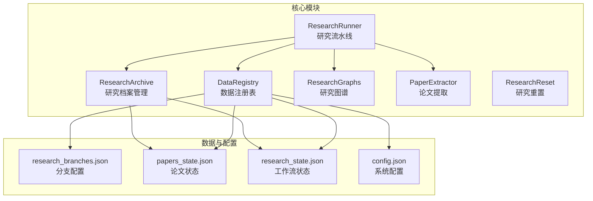
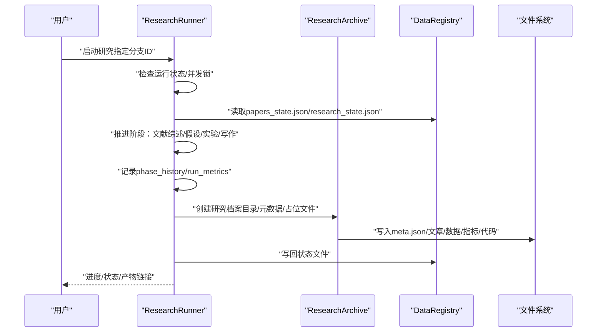
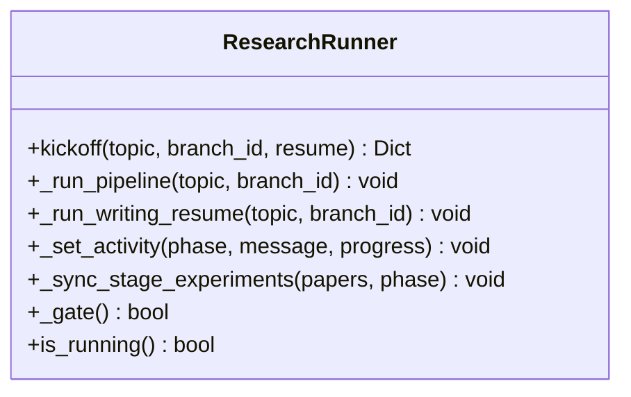
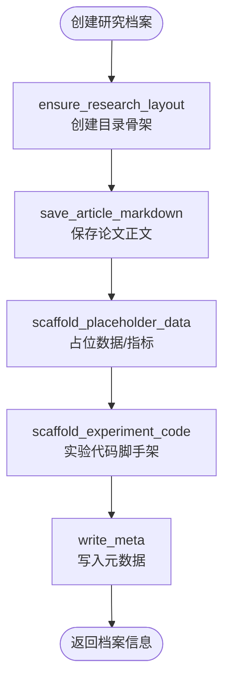
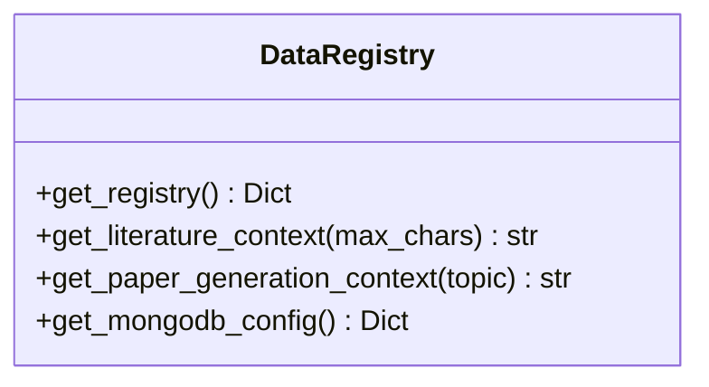
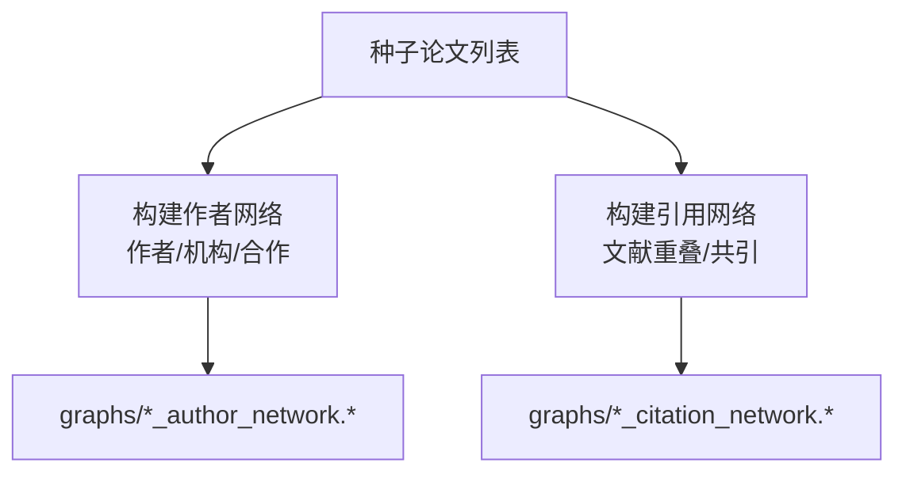
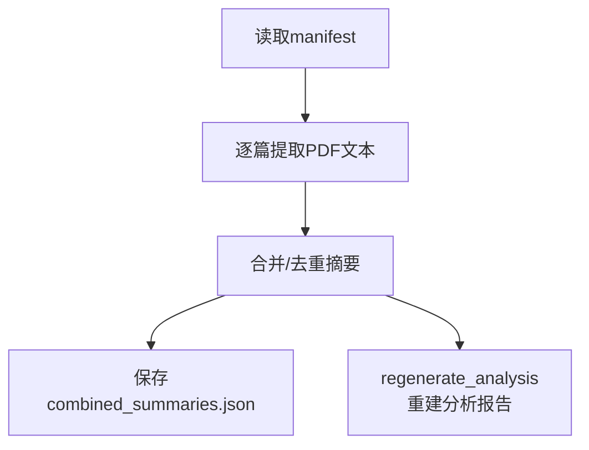
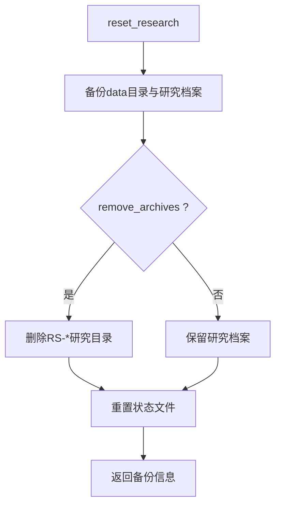
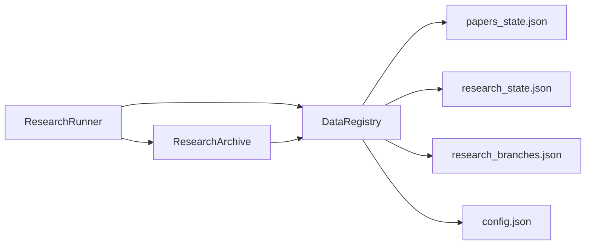

# 分支迭代管理

<cite>
**本文档引用的文件**
- [research_runner.py](file://src/core/research_runner.py)
- [research_archive.py](file://src/core/research_archive.py)
- [research_reset.py](file://src/core/research_reset.py)
- [data_registry.py](file://src/core/data_registry.py)
- [research_graphs.py](file://src/core/research_graphs.py)
- [paper_extractor.py](file://src/core/paper_extractor.py)
- [research_branches.json](file://data/research_branches.json)
- [papers_state.json](file://data/papers_state.json)
- [research_state.json](file://data/research_state.json)
- [config.json](file://config.json)
</cite>

## 目录
1. [简介](#简介)
2. [项目结构](#项目结构)
3. [核心组件](#核心组件)
4. [架构总览](#架构总览)
5. [详细组件分析](#详细组件分析)
6. [依赖关系分析](#依赖关系分析)
7. [性能考虑](#性能考虑)
8. [故障排除指南](#故障排除指南)
9. [结论](#结论)
10. [附录](#附录)

## 简介
本文件面向paperwriterAI项目的分支迭代管理功能，系统阐述研究分支的创建、管理与合并机制，解释版本控制策略、迭代历史记录与变更追踪，说明并行研究支持、快速回滚与实验对比等高级能力。文档基于仓库中的核心Python模块与数据文件，提供代码级实现路径与可视化图示，帮助开发者与研究者理解从种子文献到论文生成的完整流水线，以及如何在多分支并行研究中实现数据一致性、并发控制与存储优化。

## 项目结构
paperwriterAI采用模块化架构，核心研究流水线由Python模块与JSON状态文件协同驱动。前端侧通过文档与组件（如实验面板、论文对比、拓扑图等）参与研究过程的可视化与交互。数据层以JSON状态文件与研究档案目录为核心，确保研究状态可持久化、可回溯、可对比。

**图表来源**
- [research_runner.py:278-427](file://src/core/research_runner.py#L278-L427)
- [research_archive.py:296-335](file://src/core/research_archive.py#L296-L335)
- [data_registry.py:48-97](file://src/core/data_registry.py#L48-L97)
- [research_branches.json:1-28](file://data/research_branches.json#L1-L28)
- [papers_state.json:1-118](file://data/papers_state.json#L1-L118)
- [research_state.json:1-800](file://data/research_state.json#L1-L800)
- [config.json:1-65](file://config.json#L1-L65)

**章节来源**
- [research_runner.py:1-1130](file://src/core/research_runner.py#L1-L1130)
- [research_archive.py:1-438](file://src/core/research_archive.py#L1-L438)
- [data_registry.py:1-189](file://src/core/data_registry.py#L1-L189)
- [research_branches.json:1-28](file://data/research_branches.json#L1-L28)
- [papers_state.json:1-118](file://data/papers_state.json#L1-L118)
- [research_state.json:1-800](file://data/research_state.json#L1-L800)
- [config.json:1-65](file://config.json#L1-L65)

## 核心组件
- 研究流水线（ResearchRunner）：负责启动/续传研究、推进文献综述、假设生成、实验与写作阶段，维护运行状态与阶段历史。
- 研究档案（ResearchArchive）：负责研究档案目录结构、元数据写入、产物文件生成与占位数据/代码脚手架。
- 数据注册表（DataRegistry）：统一暴露数据路径、种子文献、工作流状态与研究档案清单，提供上下文拼装。
- 研究图谱（ResearchGraphs）：构建作者合作网络与引用关系网络，支撑研究导航与空白识别。
- 论文提取（PaperExtractor）：从PDF提取文本并生成摘要，支持去重与重建分析报告。
- 研究重置（ResearchReset）：提供从0开始的重置与备份能力，保护研究档案免误删。

**章节来源**
- [research_runner.py:278-427](file://src/core/research_runner.py#L278-L427)
- [research_archive.py:296-335](file://src/core/research_archive.py#L296-L335)
- [data_registry.py:48-97](file://src/core/data_registry.py#L48-L97)
- [research_graphs.py:16-264](file://src/core/research_graphs.py#L16-L264)
- [paper_extractor.py:149-223](file://src/core/paper_extractor.py#L149-L223)
- [research_reset.py:69-146](file://src/core/research_reset.py#L69-L146)

## 架构总览
研究分支管理贯穿“状态文件 + 档案目录 + 流水线执行”的闭环。分支通过research_branches.json标识，当前分支与分支ID在papers_state.json与research_state.json中体现。ResearchRunner在执行过程中写入phase_history与run_metrics，形成迭代历史与性能追踪；ResearchArchive负责将论文正文、实验数据、指标样本、代码脚本等产物落盘到统一目录结构。

**图表来源**
- [research_runner.py:301-427](file://src/core/research_runner.py#L301-L427)
- [research_archive.py:296-335](file://src/core/research_archive.py#L296-L335)
- [data_registry.py:48-97](file://src/core/data_registry.py#L48-L97)
- [papers_state.json:1-118](file://data/papers_state.json#L1-L118)
- [research_state.json:1-800](file://data/research_state.json#L1-L800)

## 详细组件分析

### 研究流水线（ResearchRunner）
- 并发控制：使用全局锁与运行标志，避免重复启动与竞态。
- 分支与运行：支持resume模式续传，记录branch_id与run_id，推进阶段并同步实验状态。
- 阶段历史：_record_phase与_merge_run_phase_metrics维护phase_history与run_metrics，支持迭代历史与性能追踪。
- 写作与产物：create_paper后写入generation_queue与experiments，产出论文与实验产物。

**图表来源**
- [research_runner.py:278-565](file://src/core/research_runner.py#L278-L565)

**章节来源**
- [research_runner.py:278-565](file://src/core/research_runner.py#L278-L565)

### 研究档案（ResearchArchive）
- 目录布局：统一以RS-YYYYMMDD-NNN命名的研究目录，包含article、data、metrics、code、logs、ideas、experiments、graphs等子目录。
- 元数据：write_meta写入research_id、paper_id、branch_id、title、topic、status、parent_research_id等。
- 产物生成：save_article_markdown/save_article_tex、scaffold_placeholder_data、scaffold_experiment_code。
- API映射：build_artifacts_record与artifacts_for_api生成供前端下载的URL路径。

**图表来源**
- [research_archive.py:107-172](file://src/core/research_archive.py#L107-L172)
- [research_archive.py:188-293](file://src/core/research_archive.py#L188-L293)
- [research_archive.py:309-335](file://src/core/research_archive.py#L309-L335)

**章节来源**
- [research_archive.py:107-172](file://src/core/research_archive.py#L107-L172)
- [research_archive.py:188-293](file://src/core/research_archive.py#L188-L293)
- [research_archive.py:309-335](file://src/core/research_archive.py#L309-L335)

### 数据注册表（DataRegistry）
- 路径与上下文：统一暴露data目录、研究档案、种子文献、工作流状态等路径；提供get_literature_context与get_paper_generation_context拼装上下文。
- 研究档案枚举：遍历RESEARCH_DIR下的meta.json，构建研究档案清单，供API与前端使用。

**图表来源**
- [data_registry.py:48-166](file://src/core/data_registry.py#L48-L166)

**章节来源**
- [data_registry.py:48-166](file://src/core/data_registry.py#L48-L166)

### 研究图谱（ResearchGraphs）
- 作者网络：从种子论文提取作者、机构、合作信息，构建作者-机构-论文-合作网络。
- 引用网络：基于论文标题与关键词的重叠计算引用耦合与共引关系，输出AI论文与参考文献的边集合。

**图表来源**
- [research_graphs.py:16-179](file://src/core/research_graphs.py#L16-L179)
- [research_graphs.py:188-263](file://src/core/research_graphs.py#L188-L263)

**章节来源**
- [research_graphs.py:16-179](file://src/core/research_graphs.py#L16-L179)
- [research_graphs.py:188-263](file://src/core/research_graphs.py#L188-L263)

### 论文提取（PaperExtractor）
- 文本提取：从PDF提取文本，返回结构化结果，支持错误处理与进度回调。
- 摘要管理：合并/去重保存combined_summaries.json，支持重建分析报告。
- 状态查询：get_library_status返回PDF/摘要状态，辅助研究准备。

**图表来源**
- [paper_extractor.py:149-223](file://src/core/paper_extractor.py#L149-L223)
- [paper_extractor.py:323-397](file://src/core/paper_extractor.py#L323-L397)

**章节来源**
- [paper_extractor.py:149-223](file://src/core/paper_extractor.py#L149-L223)
- [paper_extractor.py:323-397](file://src/core/paper_extractor.py#L323-L397)

### 研究重置（ResearchReset）
- 重置流程：备份data目录下papers_state.json、research_state.json、research_branches.json、研究档案等，可选删除研究档案，重置状态文件。
- 备份策略：按时间戳创建备份目录，避免误删研究档案。

**图表来源**
- [research_reset.py:69-146](file://src/core/research_reset.py#L69-L146)

**章节来源**
- [research_reset.py:69-146](file://src/core/research_reset.py#L69-L146)

## 依赖关系分析
- 状态文件依赖：papers_state.json与research_state.json承载当前分支、运行ID、阶段历史与指标；research_branches.json承载分支元信息与当前分支ID。
- 模块耦合：ResearchRunner依赖DataRegistry读取/写入状态，依赖ResearchArchive创建研究档案；ResearchArchive依赖DataRegistry获取MongoDB配置与种子文献路径。
- 前端集成：DataRegistry的get_registry与artifacts_for_api为前端提供路径与下载链接，实现研究产物的可视化与下载。

**图表来源**
- [research_runner.py:278-427](file://src/core/research_runner.py#L278-L427)
- [research_archive.py:296-335](file://src/core/research_archive.py#L296-L335)
- [data_registry.py:48-97](file://src/core/data_registry.py#L48-L97)
- [papers_state.json:1-118](file://data/papers_state.json#L1-L118)
- [research_state.json:1-800](file://data/research_state.json#L1-L800)
- [research_branches.json:1-28](file://data/research_branches.json#L1-L28)
- [config.json:1-65](file://config.json#L1-L65)

**章节来源**
- [data_registry.py:48-97](file://src/core/data_registry.py#L48-L97)
- [papers_state.json:1-118](file://data/papers_state.json#L1-L118)
- [research_state.json:1-800](file://data/research_state.json#L1-L800)
- [research_branches.json:1-28](file://data/research_branches.json#L1-L28)
- [config.json:1-65](file://config.json#L1-L65)

## 性能考虑
- 并发控制：全局锁与运行标志避免重复启动，减少状态竞争。
- I/O优化：PaperExtractor对IO进行节流（sleep），避免过载；ResearchArchive批量写入元数据与产物，减少文件系统压力。
- 存储优化：研究档案采用统一目录结构与相对路径映射，便于前端访问与备份迁移。
- 上下文拼装：DataRegistry缓存路径与清单，减少重复扫描与IO开销。

## 故障排除指南
- 研究卡住或重复启动：检查papers_state.json中的is_generating与is_paused标志，必要时调用ResearchReset进行重置与备份。
- 写作失败：查看phase_history中writing阶段的错误记录与失败原因，定位paper生成问题。
- 并发冲突：确认全局锁状态与ResearchRunner.is_running返回值，避免多实例同时写入状态文件。
- 档案丢失：通过ResearchReset的备份目录恢复，或检查DataRegistry的路径配置与权限。

**章节来源**
- [research_reset.py:69-146](file://src/core/research_reset.py#L69-L146)
- [research_runner.py:567-581](file://src/core/research_runner.py#L567-L581)
- [papers_state.json:1-118](file://data/papers_state.json#L1-L118)

## 结论
paperwriterAI的分支迭代管理以“状态文件 + 研究档案 + 流水线执行”为核心，通过ResearchRunner推进阶段与记录历史，通过ResearchArchive统一落盘产物，通过DataRegistry提供上下文与路径，辅以ResearchGraphs与PaperExtractor支撑研究导航与文献准备。该架构支持并行研究、快速回滚与实验对比，满足从种子文献到论文生成的全流程自动化与可追溯性需求。

## 附录
- 分支配置：research_branches.json包含分支列表、当前分支ID与分支元信息。
- 状态文件：papers_state.json与research_state.json记录当前分支、运行ID、阶段历史与指标。
- 配置文件：config.json提供LLM、数据源、回测框架与评估参数等系统配置。

**章节来源**
- [research_branches.json:1-28](file://data/research_branches.json#L1-L28)
- [papers_state.json:1-118](file://data/papers_state.json#L1-L118)
- [research_state.json:1-800](file://data/research_state.json#L1-L800)
- [config.json:1-65](file://config.json#L1-L65)