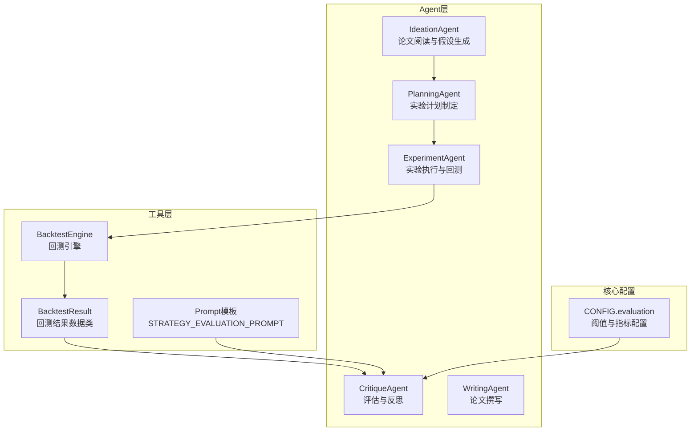
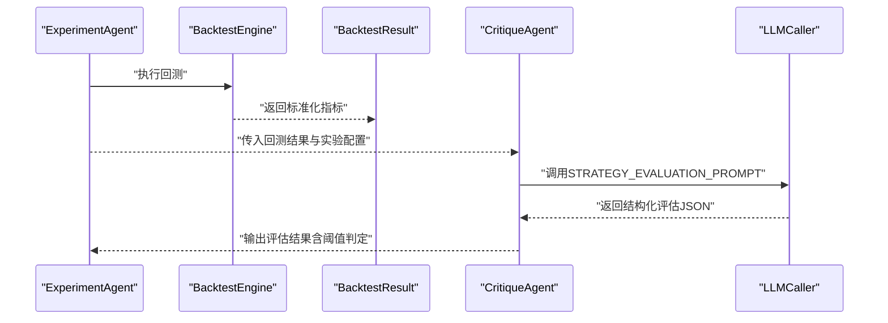
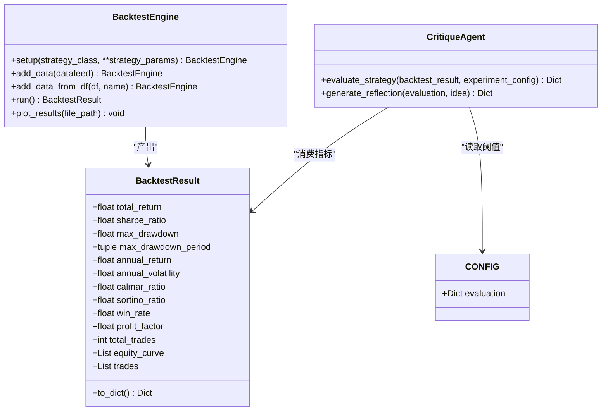
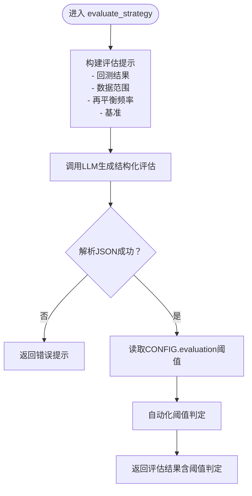
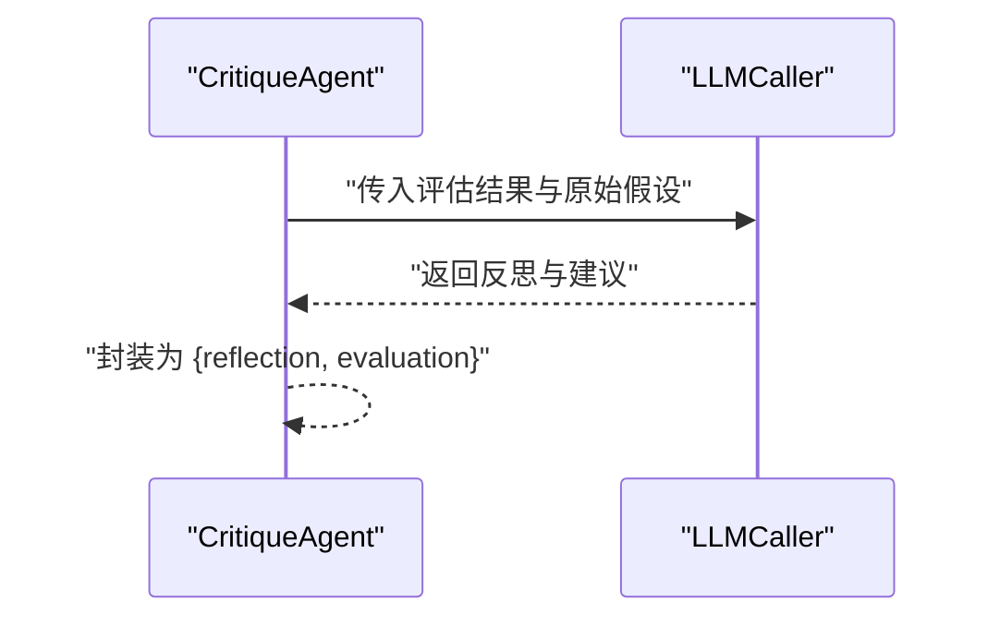
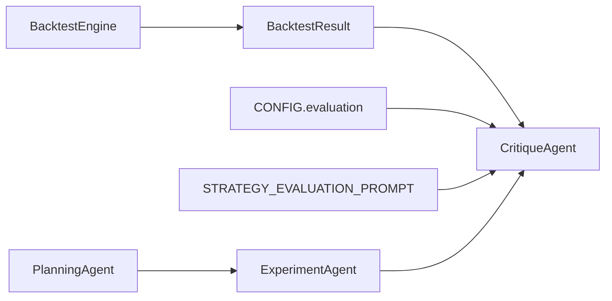
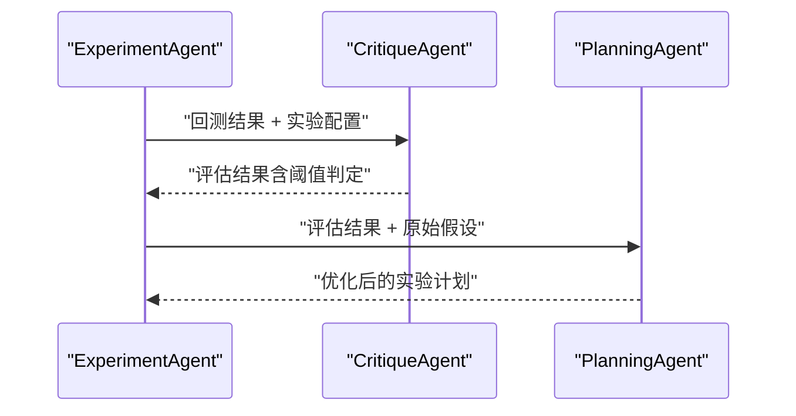

# Critique Agent（评估反思代理）

<cite>
**本文引用的文件**
- [src/agents/agents.py](file://src/agents/agents.py)
- [src/tools/backtest.py](file://src/tools/backtest.py)
- [src/core/config.py](file://src/core/config.py)
- [src/prompts/templates.py](file://src/prompts/templates.py)
- [src/agents/__init__.py](file://src/agents/__init__.py)
- [AGENTS.md](file://AGENTS.md)
</cite>

## 目录
1. [简介](#简介)
2. [项目结构](#项目结构)
3. [核心组件](#核心组件)
4. [架构总览](#架构总览)
5. [详细组件分析](#详细组件分析)
6. [依赖关系分析](#依赖关系分析)
7. [性能考量](#性能考量)
8. [故障排查指南](#故障排查指南)
9. [结论](#结论)
10. [附录](#附录)

## 简介
本文件聚焦于paperwriterAI项目中的Critique Agent（评估反思代理）。该Agent负责对策略进行全面评估与反思，核心职责包括：
- 策略评估：基于回测结果与实验配置，从收益能力、风险控制、风险调整收益、策略稳定性等多个维度进行综合评价，并给出可发表性判断。
- 性能分析：结合回测引擎输出的关键指标（如夏普比率、最大回撤、卡玛比率、索提诺比率、胜率、盈利因子等）进行量化分析。
- 反思建议生成：基于评估结果与原始假设，生成问题分析、改进建议与价值判断，帮助后续实验迭代。

## 项目结构
Critique Agent位于agents模块中，与Ideation、Planning、Experiment、Writing四大Agent共同构成系统的核心智能体层。其与回测引擎、配置系统、提示模板紧密耦合，形成“策略回测→评估→反思→迭代”的闭环。

**图表来源**
- [src/agents/agents.py:653-738](file://src/agents/agents.py#L653-L738)
- [src/tools/backtest.py:23-53](file://src/tools/backtest.py#L23-L53)
- [src/prompts/templates.py:392-468](file://src/prompts/templates.py#L392-L468)
- [src/core/config.py:408-412](file://src/core/config.py#L408-L412)

**章节来源**
- [AGENTS.md:37-56](file://AGENTS.md#L37-L56)
- [src/agents/__init__.py:6-12](file://src/agents/__init__.py#L6-L12)

## 核心组件
- CritiqueAgent：提供evaluate_strategy与generate_reflection两大方法，分别承担策略评估与反思建议生成。
- BacktestEngine与BacktestResult：提供标准化的回测执行与指标输出，为评估提供数据基础。
- CONFIG.evaluation：集中定义评估阈值（如最小夏普比率、最大回撤阈值、最小IC等），用于自动化判断。
- Prompt模板STRATEGY_EVALUATION_PROMPT：为LLM提供结构化评估框架，确保输出可比对、可解释。

**章节来源**
- [src/agents/agents.py:653-738](file://src/agents/agents.py#L653-L738)
- [src/tools/backtest.py:23-53](file://src/tools/backtest.py#L23-L53)
- [src/core/config.py:408-412](file://src/core/config.py#L408-L412)
- [src/prompts/templates.py:392-468](file://src/prompts/templates.py#L392-L468)

## 架构总览
Critique Agent在系统中的位置如下：
- 输入：回测结果（BacktestResult）、实验配置（包含数据范围、再平衡频率、基准等）。
- 处理：通过STRATEGY_EVALUATION_PROMPT驱动LLM生成结构化评估；同时读取CONFIG.evaluation阈值进行自动化判定。
- 输出：评估总结、详细指标打分、可发表性判断与改进建议。

**图表来源**
- [src/agents/agents.py:669-701](file://src/agents/agents.py#L669-L701)
- [src/tools/backtest.py:248-327](file://src/tools/backtest.py#L248-L327)
- [src/prompts/templates.py:392-468](file://src/prompts/templates.py#L392-L468)

## 详细组件分析

### CritiqueAgent类
- evaluate_strategy方法
  - 功能：接收回测结果与实验配置，构造评估提示，调用LLM生成结构化评估报告。
  - 关键输入：
    - backtest_result：回测引擎输出的标准化指标集合。
    - experiment_config：包含数据范围（起止日期）、再平衡频率、基准等。
  - 输出：包含总体评分、维度打分、可发表性判断与改进建议的JSON。
- generate_reflection方法
  - 功能：基于评估结果与原始假设，生成反思与改进建议，回答“为何表现好/差”、“假设是否正确”、“改进空间”、“是否值得进一步研究”等问题。
  - 关键输入：
    - evaluation：evaluate_strategy的输出。
    - idea：原始假设（来自Ideation/Planning阶段）。
  - 输出：包含反思文本与评估上下文的字典。

**图表来源**
- [src/agents/agents.py:653-738](file://src/agents/agents.py#L653-L738)
- [src/tools/backtest.py:23-53](file://src/tools/backtest.py#L23-L53)
- [src/tools/backtest.py:181-347](file://src/tools/backtest.py#L181-L347)
- [src/core/config.py:408-412](file://src/core/config.py#L408-L412)

**章节来源**
- [src/agents/agents.py:669-701](file://src/agents/agents.py#L669-L701)
- [src/agents/agents.py:703-738](file://src/agents/agents.py#L703-L738)

### 评估流程与阈值判定
- evaluate_strategy内部通过STRATEGY_EVALUATION_PROMPT将回测结果与实验配置注入提示，驱动LLM生成结构化评估。
- CONFIG.evaluation提供阈值，用于自动化判定（例如最小夏普比率、最大回撤阈值、最小IC等），为后续决策提供依据。

**图表来源**
- [src/agents/agents.py:669-701](file://src/agents/agents.py#L669-L701)
- [src/prompts/templates.py:392-468](file://src/prompts/templates.py#L392-L468)
- [src/core/config.py:408-412](file://src/core/config.py#L408-L412)

**章节来源**
- [src/agents/agents.py:669-701](file://src/agents/agents.py#L669-L701)
- [src/core/config.py:408-412](file://src/core/config.py#L408-L412)

### 反思生成流程
- generate_reflection接收评估结果与原始假设，通过定制提示引导LLM进行问题分析与改进建议生成。
- 输出包含反思文本与评估上下文，便于后续迭代与写作。

**图表来源**
- [src/agents/agents.py:703-738](file://src/agents/agents.py#L703-L738)

**章节来源**
- [src/agents/agents.py:703-738](file://src/agents/agents.py#L703-L738)

### 评估指标设计原则与阈值设置
- 夏普比率（Sharpe Ratio）：衡量单位风险所获得的超额回报。阈值通常设定为正且大于某个基准值（如1.5）。
- 最大回撤（Max Drawdown）：衡量从峰值到谷底的最大跌幅。阈值通常设定为负值上限（如-0.25），用于控制回撤风险。
- 信息系数（IC）：衡量预测值与未来收益的线性相关性。阈值通常设定为正且大于某个小值（如0.02）。
- 年化波动率、卡玛比率、索提诺比率：用于更全面地评估风险调整收益。
- 胜率、盈利因子、交易次数：用于评估策略稳定性与交易效率。

这些指标与阈值由CONFIG.evaluation集中管理，确保评估过程的一致性与可重复性。

**章节来源**
- [src/tools/backtest.py:26-53](file://src/tools/backtest.py#L26-L53)
- [src/tools/backtest.py:264-327](file://src/tools/backtest.py#L264-L327)
- [src/core/config.py:408-412](file://src/core/config.py#L408-L412)

## 依赖关系分析
- CritiqueAgent依赖BacktestResult提供的标准化指标，确保不同回测结果的可比性。
- 依赖CONFIG.evaluation中的阈值，实现自动化阈值判定。
- 依赖STRATEGY_EVALUATION_PROMPT，保证评估维度与输出格式一致。
- 与ExperimentAgent形成前后向依赖：前者消费后者回测产物，后者消费前者实验配置。

**图表来源**
- [src/agents/agents.py:653-738](file://src/agents/agents.py#L653-L738)
- [src/tools/backtest.py:23-53](file://src/tools/backtest.py#L23-L53)
- [src/core/config.py:408-412](file://src/core/config.py#L408-L412)
- [src/prompts/templates.py:392-468](file://src/prompts/templates.py#L392-L468)

**章节来源**
- [src/agents/agents.py:653-738](file://src/agents/agents.py#L653-L738)
- [src/tools/backtest.py:23-53](file://src/tools/backtest.py#L23-L53)
- [src/core/config.py:408-412](file://src/core/config.py#L408-L412)
- [src/prompts/templates.py:392-468](file://src/prompts/templates.py#L392-L468)

## 性能考量
- 指标计算复杂度：BacktestEngine在run阶段计算多项指标，涉及序列统计与分析器聚合，时间复杂度与数据长度近似线性相关。
- LLM调用成本：评估与反思均依赖LLM，需关注调用次数与上下文长度，建议在批量评估时合并提示或缓存中间结果。
- 阈值判定开销：自动化阈值判定逻辑简单，几乎无额外开销，但需确保CONFIG.evaluation配置准确。

## 故障排查指南
- 回测结果为空或格式异常
  - 现象：evaluate_strategy无法解析JSON或指标缺失。
  - 排查：确认BacktestEngine.run是否正常返回BacktestResult；检查实验配置的数据范围与再平衡频率是否合理。
- LLM解析失败
  - 现象：generate_reflection返回错误提示。
  - 排查：检查提示模板是否完整；确认LLM输出符合JSON格式；必要时增加后处理清洗。
- 阈值判定异常
  - 现象：自动化判定与预期不符。
  - 排查：核对CONFIG.evaluation中的阈值设置；确认指标单位与取值范围。

**章节来源**
- [src/agents/agents.py:669-701](file://src/agents/agents.py#L669-L701)
- [src/agents/agents.py:703-738](file://src/agents/agents.py#L703-L738)
- [src/core/config.py:408-412](file://src/core/config.py#L408-L412)

## 结论
Critique Agent通过标准化的评估流程与反思机制，将回测结果转化为可解释、可迭代的洞察，为后续实验与论文撰写提供坚实基础。其与回测引擎、配置系统、提示模板的协同，构成了paperwriterAI在量化研究方向上的关键评估闭环。

## 附录

### 评估与反思的完整流程示例（步骤说明）
- 步骤1：ExperimentAgent完成回测，输出BacktestResult。
- 步骤2：CritiqueAgent.evaluate_strategy接收回测结果与实验配置，生成结构化评估。
- 步骤3：CritiqueAgent.generate_reflection基于评估结果与原始假设，生成反思与改进建议。
- 步骤4：将评估与反思结果反馈至ExperimentAgent或PlanningAgent，指导下一阶段实验设计。

**图表来源**
- [src/agents/agents.py:669-738](file://src/agents/agents.py#L669-L738)