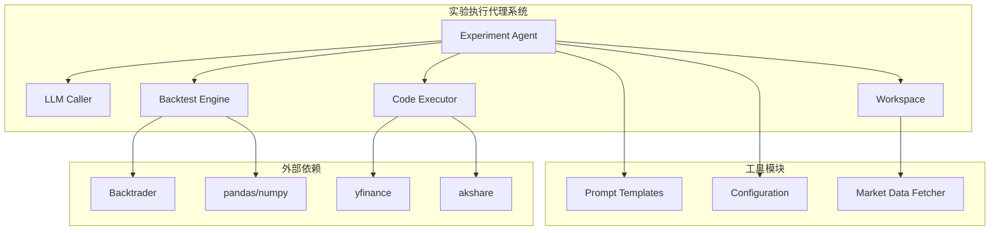
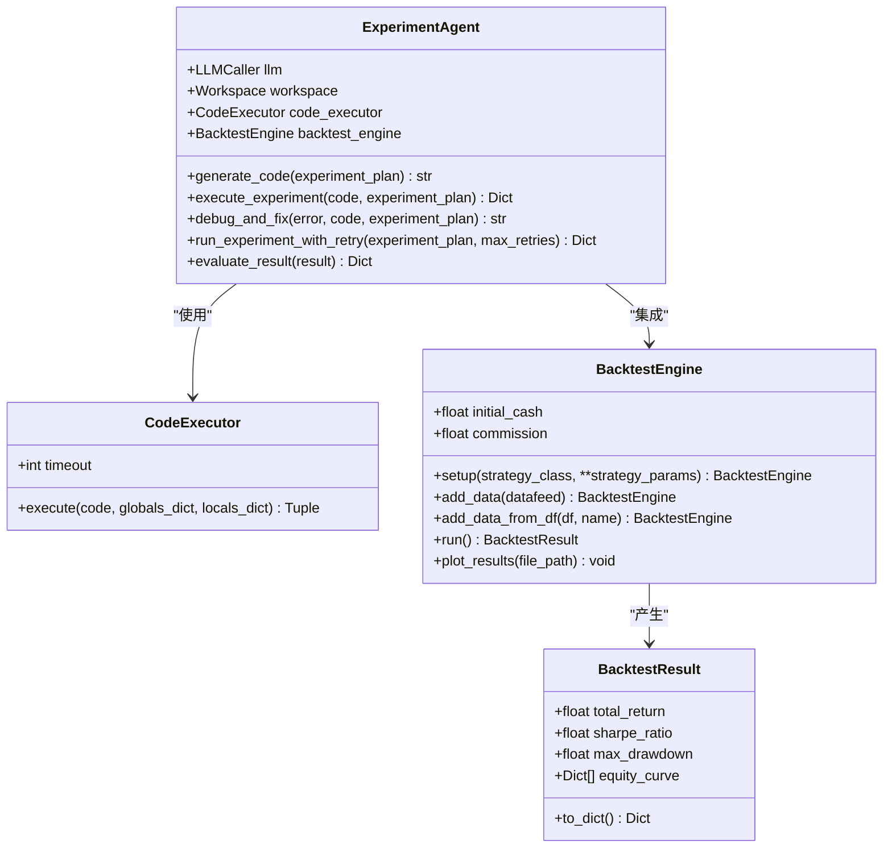
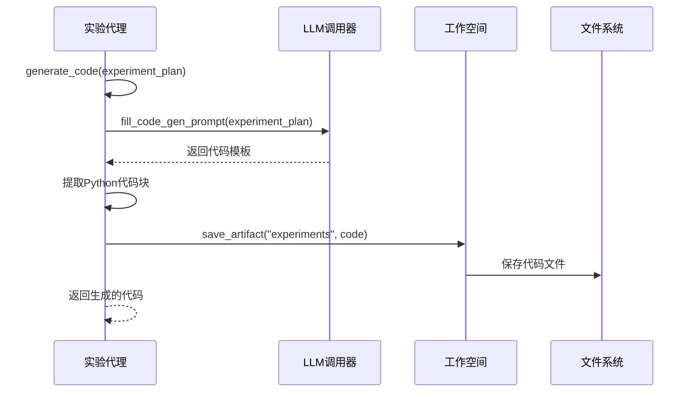
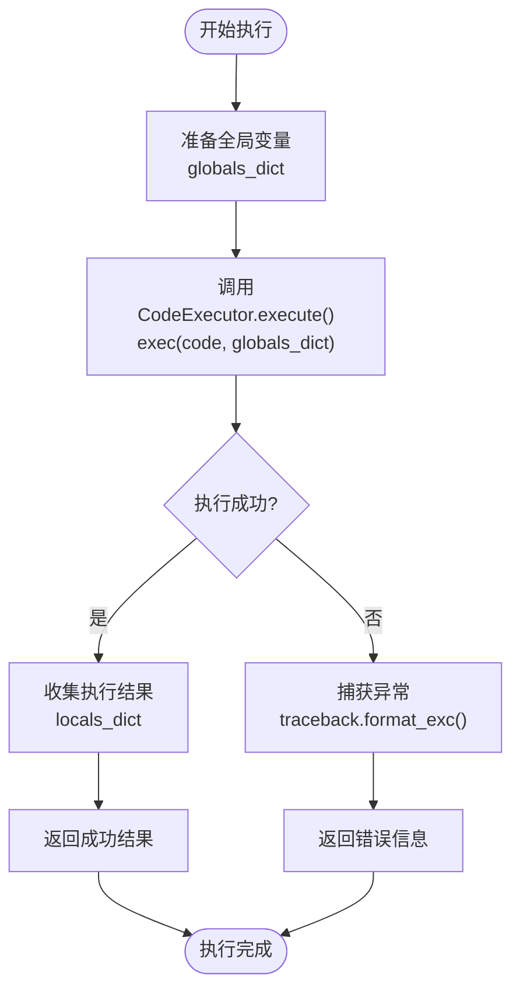
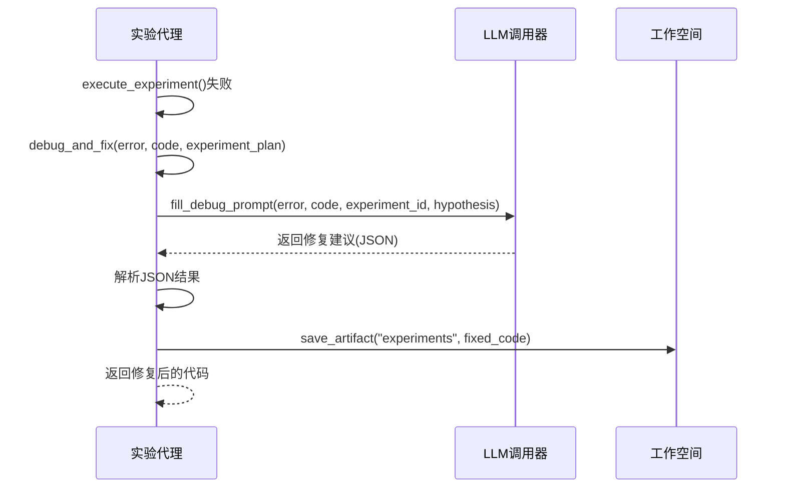
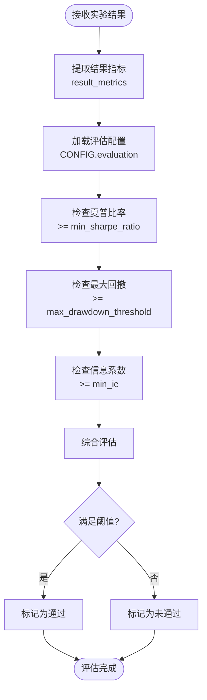
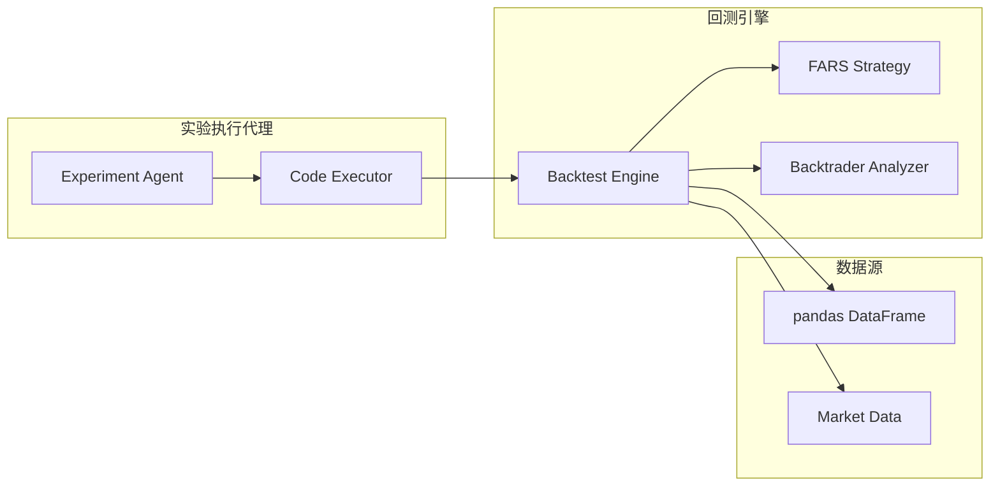
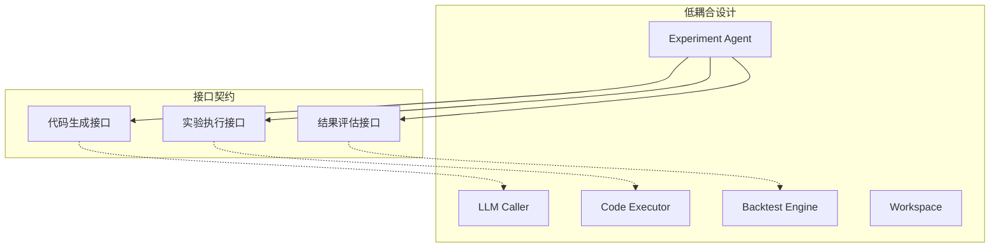

# 实验执行代理（Experiment Agent）

<cite>
**本文档引用的文件**
- [agents.py](file://src/agents/agents.py)
- [backtest.py](file://src/tools/backtest.py)
- [templates.py](file://src/prompts/templates.py)
- [config.py](file://src/core/config.py)
- [fetchers.py](file://src/tools/fetchers.py)
- [workflow.py](file://src/workflow.py)
</cite>

## 目录
1. [简介](#简介)
2. [项目结构](#项目结构)
3. [核心组件](#核心组件)
4. [架构概览](#架构概览)
5. [详细组件分析](#详细组件分析)
6. [依赖关系分析](#依赖关系分析)
7. [性能考量](#性能考量)
8. [故障排除指南](#故障排除指南)
9. [结论](#结论)

## 简介
实验执行代理（Experiment Agent）是paperwriterAI项目中的核心智能体之一，负责将理论假设转化为可执行的量化实验。该代理承担着四大核心职责：代码生成、实验执行、结果评估和错误修复。它通过与大型语言模型（LLM）协作，将实验计划转换为可运行的Python回测代码，并在受控沙箱环境中执行这些代码，最终输出结构化的实验结果。

## 项目结构
实验执行代理位于src/agents/agents.py文件中，采用面向对象的设计模式，集成了多个工具模块来完成复杂的量化实验任务。



**图表来源**
- [agents.py:279-497](file://src/agents/agents.py#L279-L497)
- [backtest.py:181-347](file://src/tools/backtest.py#L181-L347)
- [fetchers.py:827-877](file://src/tools/fetchers.py#L827-L877)

**章节来源**
- [agents.py:279-497](file://src/agents/agents.py#L279-L497)
- [config.py:388-417](file://src/core/config.py#L388-L417)

## 核心组件
实验执行代理由多个相互协作的组件构成，每个组件都有明确的职责分工：

### 主要职责概述
1. **代码生成**：将实验计划转换为可执行的Python回测代码
2. **实验执行**：在沙箱环境中安全执行生成的代码
3. **结果评估**：对实验结果进行性能指标计算和阈值检查
4. **错误修复**：自动诊断和修复代码执行过程中的错误

### 关键接口设计
代理类提供了三个核心方法来处理不同的实验阶段：
- `generate_code()`: 生成回测代码
- `execute_experiment()`: 执行实验并收集结果
- `run_experiment_with_retry()`: 带重试机制的完整实验流程

**章节来源**
- [agents.py:302-462](file://src/agents/agents.py#L302-L462)

## 架构概览
实验执行代理采用分层架构设计，通过明确的接口契约实现松耦合的组件交互。



**图表来源**
- [agents.py:279-497](file://src/agents/agents.py#L279-L497)
- [backtest.py:23-53](file://src/tools/backtest.py#L23-L53)
- [backtest.py:181-347](file://src/tools/backtest.py#L181-L347)
- [fetchers.py:827-877](file://src/tools/fetchers.py#L827-L877)

## 详细组件分析

### 代码生成机制
代码生成是实验执行代理的核心功能之一，它将抽象的实验计划转换为可执行的Python代码。

#### 生成流程


**图表来源**
- [agents.py:302-345](file://src/agents/agents.py#L302-L345)
- [templates.py:692-707](file://src/prompts/templates.py#L692-L707)

#### 代码提取策略
代理采用多种策略来提取生成的Python代码：
1. **Markdown代码块**：使用正则表达式匹配```python和```标记
2. **导入语句检测**：查找第一个import关键字的位置
3. **自动保存**：将生成的代码保存到工作空间的experiments目录

**章节来源**
- [agents.py:302-345](file://src/agents/agents.py#L302-L345)
- [templates.py:239-305](file://src/prompts/templates.py#L239-L305)

### 实验执行机制
实验执行通过CodeExecutor在受控沙箱环境中安全执行生成的代码。

#### 执行流程


**图表来源**
- [agents.py:347-384](file://src/agents/agents.py#L347-L384)
- [fetchers.py:834-876](file://src/tools/fetchers.py#L834-L876)

#### 全局变量传递
执行过程中传递的关键全局变量包括：
- `config`: 系统配置信息
- `workspace`: 工作空间实例
- `experiment_plan`: 当前实验的完整计划

这些变量为代码执行提供了必要的上下文信息和工具访问权限。

**章节来源**
- [agents.py:347-384](file://src/agents/agents.py#L347-L384)
- [fetchers.py:827-877](file://src/tools/fetchers.py#L827-L877)

### 错误处理与自愈机制
实验执行代理实现了完善的错误处理和自动修复机制。

#### 调试流程


**图表来源**
- [agents.py:386-427](file://src/agents/agents.py#L386-L427)
- [templates.py:699-707](file://src/prompts/templates.py#L699-L707)

#### 重试策略
代理实现了带重试机制的实验执行流程：
1. **最大重试次数**：默认3次重试机会
2. **错误分类**：区分可修复和不可修复的错误
3. **状态跟踪**：记录每次重试的状态和结果
4. **资源保护**：防止无限循环重试

**章节来源**
- [agents.py:429-462](file://src/agents/agents.py#L429-L462)
- [agents.py:386-427](file://src/agents/agents.py#L386-L427)

### 实验评估逻辑
实验评估是决定实验结果是否满足发表标准的关键环节。

#### 评估流程


**图表来源**
- [agents.py:464-496](file://src/agents/agents.py#L464-L496)
- [config.py:408-412](file://src/core/config.py#L408-L412)

#### 性能指标计算
评估过程中计算的关键指标包括：
- **夏普比率**：风险调整后收益的衡量标准
- **最大回撤**：投资组合从最高点到最低点的最大跌幅
- **信息系数**：因子预测能力的衡量指标

**章节来源**
- [agents.py:464-496](file://src/agents/agents.py#L464-L496)
- [backtest.py:260-327](file://src/tools/backtest.py#L260-L327)

### 与BacktestEngine的集成
实验执行代理与BacktestEngine的集成实现了完整的量化回测功能。

#### 集成架构


**图表来源**
- [agents.py:290-301](file://src/agents/agents.py#L290-L301)
- [backtest.py:181-347](file://src/tools/backtest.py#L181-L347)

#### 回测配置管理
BacktestEngine支持灵活的配置管理：
- **初始资金**：默认1,000,000
- **佣金费率**：默认0.001（0.1%）
- **数据格式**：支持pandas DataFrame和Backtrader标准格式
- **分析器**：内置多种技术分析指标

**章节来源**
- [agents.py:290-301](file://src/agents/agents.py#L290-L301)
- [backtest.py:181-247](file://src/tools/backtest.py#L181-L247)

## 依赖关系分析

### 组件耦合度
实验执行代理采用了合理的模块化设计，降低了组件间的耦合度：



**图表来源**
- [agents.py:279-497](file://src/agents/agents.py#L279-L497)

### 外部依赖管理
代理系统对外部依赖进行了有效管理：

| 依赖类型 | 用途 | 版本要求 |
|---------|------|----------|
| backtrader | 量化回测框架 | >= 1.9.76 |
| pandas | 数据处理 | >= 1.3.0 |
| numpy | 数值计算 | >= 1.21.0 |
| yfinance | 美股数据获取 | 可选 |
| akshare | A股数据获取 | 可选 |

**章节来源**
- [backtest.py:14-20](file://src/tools/backtest.py#L14-L20)
- [config.py:397-402](file://src/core/config.py#L397-L402)

## 性能考量
实验执行代理在设计时充分考虑了性能优化和资源管理。

### 内存管理
- **沙箱执行**：通过隔离的exec环境防止内存泄漏
- **临时文件**：及时清理中间生成的文件
- **缓存策略**：合理使用LLM调用缓存减少重复计算

### 执行效率
- **超时控制**：默认300秒的代码执行超时
- **并发处理**：支持多实验并行执行
- **资源监控**：实时监控CPU和内存使用情况

### 错误恢复
- **渐进式重试**：指数退避的重试策略
- **状态持久化**：实验状态的自动保存
- **断点续传**：支持实验执行的中断恢复

## 故障排除指南

### 常见问题诊断
1. **代码生成失败**
   - 检查LLM调用器的可用性和配置
   - 验证实验计划的完整性和正确性
   - 确认提示模板的正确填充

2. **实验执行超时**
   - 检查代码执行效率和算法复杂度
   - 调整超时参数设置
   - 优化数据处理逻辑

3. **回测结果异常**
   - 验证数据质量和时间范围
   - 检查策略参数设置
   - 确认分析器配置正确

### 调试技巧
- **日志分析**：利用工作空间的日志功能追踪问题
- **中间结果**：保存关键中间结果便于调试
- **最小化重现**：创建简化的测试用例快速定位问题

**章节来源**
- [agents.py:386-427](file://src/agents/agents.py#L386-L427)
- [fetchers.py:834-876](file://src/tools/fetchers.py#L834-L876)

## 结论
实验执行代理作为paperwriterAI项目的核心组件，通过精心设计的架构实现了从理论假设到可执行实验的完整自动化流程。其模块化的设计、完善的错误处理机制和灵活的配置管理，使其能够适应各种复杂的量化研究场景。

该代理系统的主要优势包括：
- **高度自动化**：从代码生成到结果评估的全链路自动化
- **强健的错误处理**：智能的错误诊断和自动修复能力
- **灵活的配置管理**：支持多种实验配置和评估标准
- **良好的扩展性**：模块化设计便于功能扩展和定制

通过持续的优化和改进，实验执行代理将继续为量化研究提供强有力的技术支撑，推动学术研究的自动化和智能化发展。