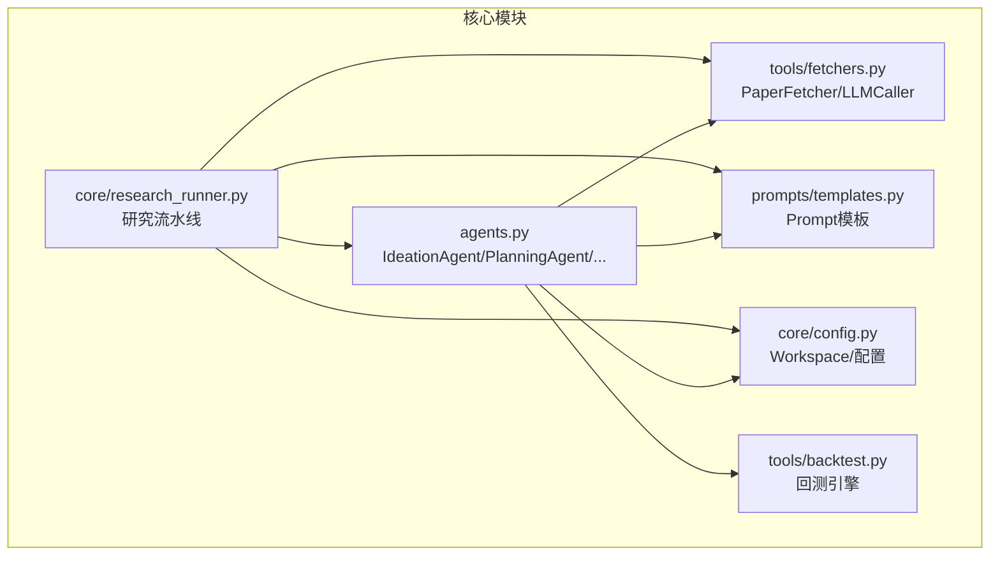
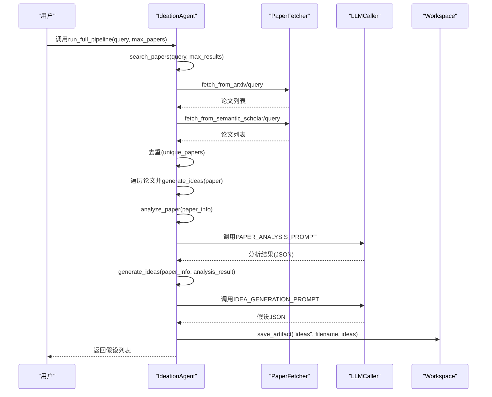
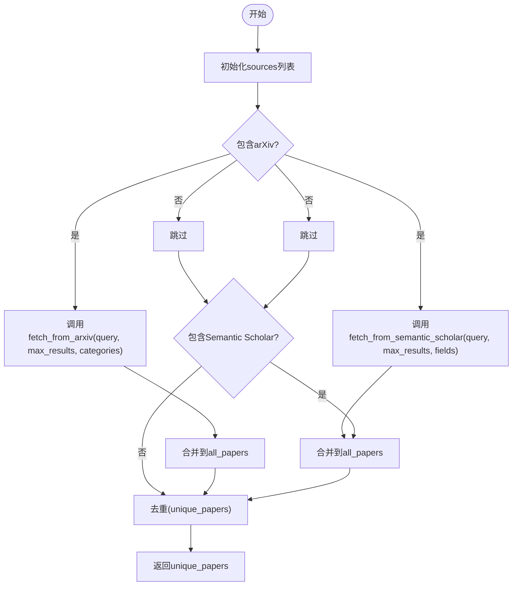
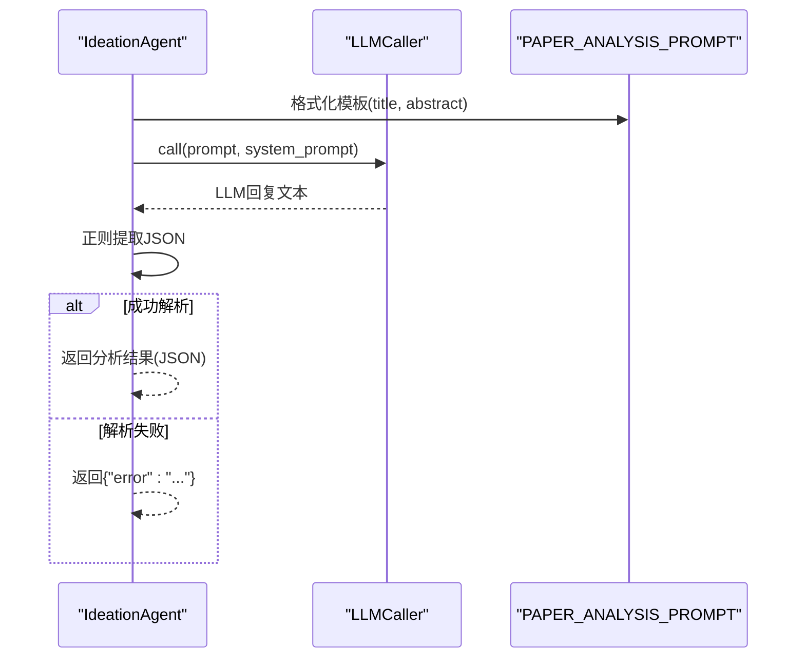
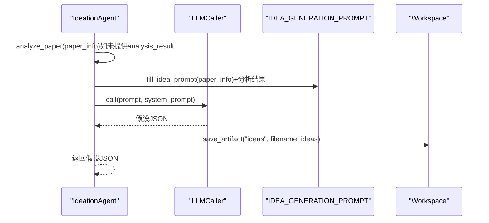
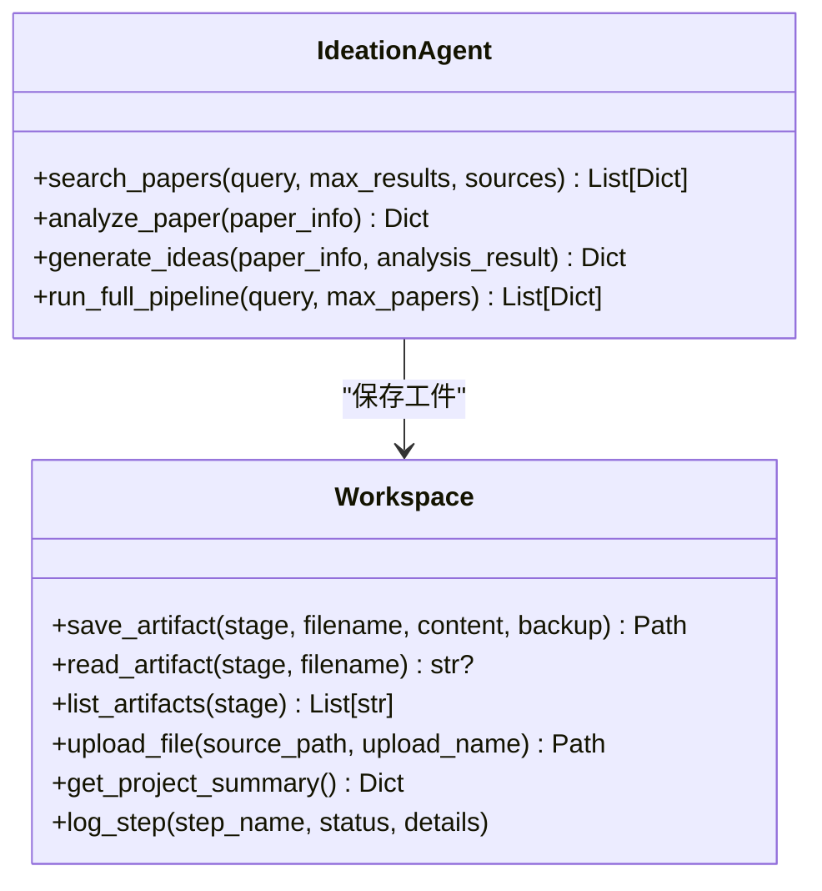
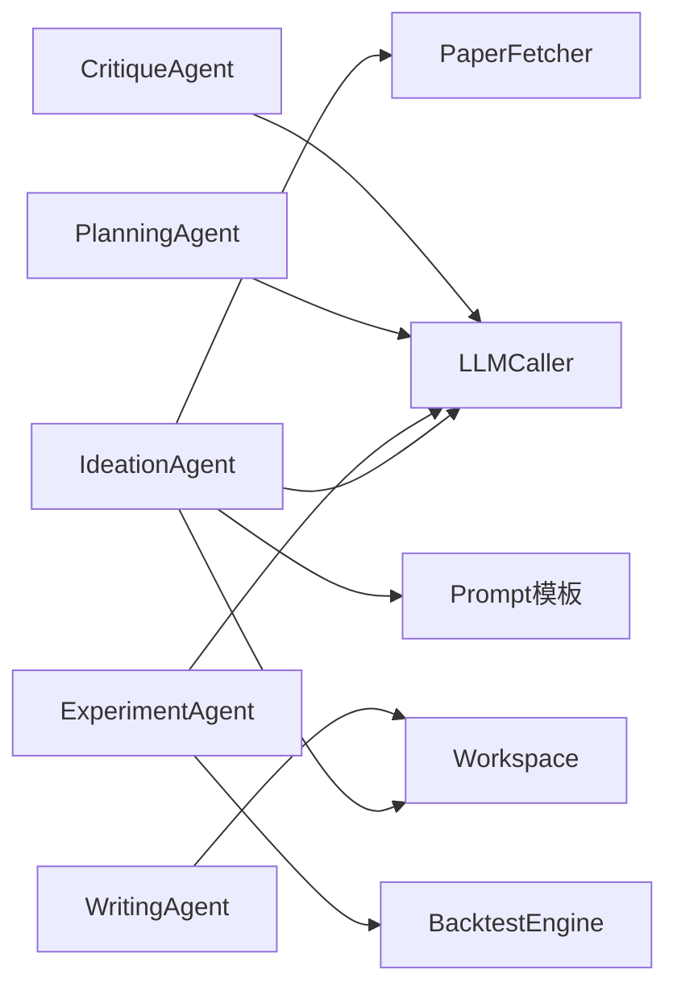

# Ideation Agent（假设生成代理）

<cite>
**本文档引用的文件**
- [agents.py](file://src/agents/agents.py)
- [fetchers.py](file://src/tools/fetchers.py)
- [templates.py](file://src/prompts/templates.py)
- [config.py](file://src/core/config.py)
- [backtest.py](file://src/tools/backtest.py)
- [research_runner.py](file://src/core/research_runner.py)
- [__init__.py](file://src/agents/__init__.py)
</cite>

## 目录
1. [简介](#简介)
2. [项目结构](#项目结构)
3. [核心组件](#核心组件)
4. [架构总览](#架构总览)
5. [详细组件分析](#详细组件分析)
6. [依赖关系分析](#依赖关系分析)
7. [性能考量](#性能考量)
8. [故障排查指南](#故障排查指南)
9. [结论](#结论)
10. [附录](#附录)

## 简介
本文件面向paperwriterAI项目的Ideation Agent（假设生成代理），系统性阐述其职责、工作机制与集成方式。Ideation Agent负责：
- 论文搜索：从arXiv与Semantic Scholar等数据源抓取相关论文，并进行去重
- 深度分析：对论文进行结构化分析，提取方法论、关键发现与可编程因子
- 假设生成：将论文中的可量化交易逻辑转化为结构化的假设JSON，包含数学公式、Python代码片段与预期指标
- 工件保存：将生成的假设、实验计划、回测代码与论文等产物保存至Workspace工作空间

此外，文档还展示了与Workspace的集成方式、artifact保存机制以及完整的调用流程（search_papers → analyze_paper → generate_ideas）。

## 项目结构
与Ideation Agent直接相关的模块与文件如下：
- 源码模块
  - agents/agents.py：包含IdeationAgent、PlanningAgent、ExperimentAgent、WritingAgent、CritiqueAgent
  - tools/fetchers.py：PaperFetcher、MarketDataFetcher、LLMCaller等工具
  - prompts/templates.py：各类Agent使用的Prompt模板
  - core/config.py：Workspace工作空间、全局配置、研究方向等
  - tools/backtest.py：回测引擎与策略基类
  - core/research_runner.py：研究流水线与阶段协调
  - agents/__init__.py：导出Agent类
- 目录结构
  - workspace/projects/<project_id>/ 下按阶段存放artifact（ideas、plans、experiments、papers、data、charts、logs、backups、uploads）

**图表来源**
- [agents.py:23-194](file://src/agents/agents.py#L23-L194)
- [fetchers.py:20-162](file://src/tools/fetchers.py#L20-L162)
- [templates.py:8-155](file://src/prompts/templates.py#L8-L155)
- [config.py:256-383](file://src/core/config.py#L256-L383)
- [backtest.py:181-347](file://src/tools/backtest.py#L181-L347)
- [research_runner.py:278-800](file://src/core/research_runner.py#L278-L800)

**章节来源**
- [agents.py:23-194](file://src/agents/agents.py#L23-L194)
- [fetchers.py:20-162](file://src/tools/fetchers.py#L20-L162)
- [templates.py:8-155](file://src/prompts/templates.py#L8-L155)
- [config.py:256-383](file://src/core/config.py#L256-L383)
- [backtest.py:181-347](file://src/tools/backtest.py#L181-L347)
- [research_runner.py:278-800](file://src/core/research_runner.py#L278-L800)

## 核心组件
- IdeationAgent
  - 职责：论文搜索、深度分析、假设生成、工件保存
  - 关键方法：search_papers、analyze_paper、generate_ideas、run_full_pipeline
- PaperFetcher
  - 职责：从arXiv与Semantic Scholar抓取论文，解析为结构化JSON
- LLMCaller
  - 职责：统一调用不同Provider（OpenAI、Anthropic、DeepSeek、MiniMax、Ollama）的LLM接口
- Workspace
  - 职责：项目级工作空间，提供save_artifact/read_artifact/list_artifacts等工件管理能力
- Prompt模板
  - 职责：为Ideation、Planning、Experiment、Writing等Agent提供结构化提示

**章节来源**
- [agents.py:23-194](file://src/agents/agents.py#L23-L194)
- [fetchers.py:20-162](file://src/tools/fetchers.py#L20-L162)
- [templates.py:8-155](file://src/prompts/templates.py#L8-L155)
- [config.py:256-383](file://src/core/config.py#L256-L383)

## 架构总览
Ideation Agent的完整工作流如下：
- 输入：用户提供的搜索关键词query
- 流程：
  1) 搜索论文：调用search_papers，从arXiv与Semantic Scholar抓取并去重
  2) 深度分析：调用analyze_paper，使用PAPER_ANALYSIS_PROMPT解析论文
  3) 假设生成：调用generate_ideas，使用IDEA_GENERATION_PROMPT生成结构化假设
  4) 工件保存：通过Workspace.save_artifact保存假设JSON
- 输出：假设JSON列表，包含paper_info与生成的ideas

**图表来源**
- [agents.py:42-85](file://src/agents/agents.py#L42-L85)
- [agents.py:87-117](file://src/agents/agents.py#L87-L117)
- [agents.py:118-162](file://src/agents/agents.py#L118-L162)
- [fetchers.py:27-120](file://src/tools/fetchers.py#L27-L120)
- [templates.py:88-155](file://src/prompts/templates.py#L88-L155)
- [templates.py:28-85](file://src/prompts/templates.py#L28-L85)
- [config.py:280-306](file://src/core/config.py#L280-L306)

**章节来源**
- [agents.py:164-194](file://src/agents/agents.py#L164-L194)
- [agents.py:42-85](file://src/agents/agents.py#L42-L85)
- [agents.py:87-117](file://src/agents/agents.py#L87-L117)
- [agents.py:118-162](file://src/agents/agents.py#L118-L162)
- [fetchers.py:27-120](file://src/tools/fetchers.py#L27-L120)
- [templates.py:88-155](file://src/prompts/templates.py#L88-L155)
- [templates.py:28-85](file://src/prompts/templates.py#L28-L85)
- [config.py:280-306](file://src/core/config.py#L280-L306)

## 详细组件分析

### 论文搜索机制（search_papers）
- 数据源集成
  - arXiv：使用arxiv库，支持分类过滤（如q-fin.PM、cs.LG等），返回title、authors、abstract、arxiv_id、published、updated、categories、pdf_url等字段
  - Semantic Scholar：调用Graph API，支持fields定制（如title、authors、abstract、year、openAccessPdf、citationCount等）
- 去重策略
  - 基于arxiv_id；若无arxiv_id则基于title前缀（截断50字符）进行去重
- 结果合并
  - 将两个数据源的结果合并后去重，返回unique_papers

**图表来源**
- [agents.py:42-85](file://src/agents/agents.py#L42-L85)
- [fetchers.py:27-120](file://src/tools/fetchers.py#L27-L120)

**章节来源**
- [agents.py:42-85](file://src/agents/agents.py#L42-L85)
- [fetchers.py:27-120](file://src/tools/fetchers.py#L27-L120)

### 论文深度分析（analyze_paper）
- 提示模板：使用PAPER_ANALYSIS_PROMPT，输入论文title与abstract
- LLM调用：通过LLMCaller.call(system_prompt=SCIENTIFIC_AGENT_SYSTEM_PROMPT, prompt=...)
- JSON提取：使用正则匹配最外层大括号内的JSON字符串并解析
- 错误处理：解析失败时返回{"error": "..."}，避免中断后续流程

**图表来源**
- [agents.py:87-117](file://src/agents/agents.py#L87-L117)
- [templates.py:88-155](file://src/prompts/templates.py#L88-L155)
- [config.py:8-23](file://src/core/config.py#L8-L23)

**章节来源**
- [agents.py:87-117](file://src/agents/agents.py#L87-L117)
- [templates.py:88-155](file://src/prompts/templates.py#L88-L155)
- [config.py:8-23](file://src/core/config.py#L8-L23)

### 假设生成流程（generate_ideas）
- 输入：paper_info（论文基本信息）与可选analysis_result（已有分析结果）
- 流程：
  - 若analysis_result缺失，则先调用analyze_paper进行分析
  - 使用fill_idea_prompt填充IDEA_GENERATION_PROMPT，附加已有分析结果（若有）
  - LLM调用生成结构化假设JSON
  - 保存到Workspace（stage="ideas"），文件名包含arxiv_id与时间戳
- 输出：假设JSON；保存失败时返回{"error": "..."}

**图表来源**
- [agents.py:118-162](file://src/agents/agents.py#L118-L162)
- [templates.py:28-85](file://src/prompts/templates.py#L28-L85)
- [config.py:280-306](file://src/core/config.py#L280-L306)

**章节来源**
- [agents.py:118-162](file://src/agents/agents.py#L118-L162)
- [templates.py:28-85](file://src/prompts/templates.py#L28-L85)
- [config.py:280-306](file://src/core/config.py#L280-L306)

### 与Workspace的集成与artifact保存机制
- Workspace.save_artifact(stage, filename, content, backup=True)
  - stage：工件所属阶段（如ideas、plans、experiments、papers、data、charts、logs、backups、uploads）
  - filename：文件名（自动包含时间戳）
  - content：字符串或字典（字典会被序列化为JSON）
  - backup：若同名文件存在，先备份
- IdeationAgent在生成假设后调用save_artifact("ideas", ...)保存假设JSON
- 其他Agent也有类似的保存机制（如ExperimentAgent保存代码、WritingAgent保存论文等）

**图表来源**
- [config.py:256-383](file://src/core/config.py#L256-L383)
- [agents.py:118-162](file://src/agents/agents.py#L118-L162)

**章节来源**
- [config.py:256-383](file://src/core/config.py#L256-L383)
- [agents.py:118-162](file://src/agents/agents.py#L118-L162)

### 与Research Runner的集成
- ResearchRunner协调四个Agent的流水线，Ideation Agent负责“文献综述→假设生成”阶段
- ResearchRunner维护phase_history、run_metrics等运行时状态，Ideation Agent的产出作为阶段工件存入Workspace
- ResearchRunner的_run_pipeline中包含Literature Review与Hypothesis阶段，Ideation Agent的工作与之对应

**章节来源**
- [research_runner.py:642-800](file://src/core/research_runner.py#L642-L800)

## 依赖关系分析
- 组件耦合
  - IdeationAgent依赖PaperFetcher（数据源）、LLMCaller（推理）、Workspace（工件存储）、Prompt模板（结构化提示）
  - 低耦合高内聚：各模块职责清晰，通过统一的LLMCaller与Workspace接口交互
- 外部依赖
  - arxiv库（arXiv搜索）
  - requests库（Semantic Scholar API）
  - backtrader（回测引擎，由ExperimentAgent使用）
- 潜在循环依赖
  - 未见循环依赖；各Agent通过Workspace间接通信，避免直接相互依赖

**图表来源**
- [agents.py:23-194](file://src/agents/agents.py#L23-L194)
- [fetchers.py:20-162](file://src/tools/fetchers.py#L20-L162)
- [templates.py:8-155](file://src/prompts/templates.py#L8-L155)
- [config.py:256-383](file://src/core/config.py#L256-L383)
- [backtest.py:181-347](file://src/tools/backtest.py#L181-L347)

**章节来源**
- [agents.py:23-194](file://src/agents/agents.py#L23-L194)
- [fetchers.py:20-162](file://src/tools/fetchers.py#L20-L162)
- [templates.py:8-155](file://src/prompts/templates.py#L8-L155)
- [config.py:256-383](file://src/core/config.py#L256-L383)
- [backtest.py:181-347](file://src/tools/backtest.py#L181-L347)

## 性能考量
- 搜索性能
  - arXiv与Semantic Scholar均为远程API，受网络与限速影响；建议合理设置max_results与并发
  - 去重采用集合判重，时间复杂度近似O(n)，空间复杂度O(n)
- LLM调用成本
  - Prompt模板较大，tokens消耗较高；可通过减少字段或缩短摘要降低开销
  - LLMCaller支持多Provider自动切换，失败时自动降级
- 工件保存
  - Workspace.save_artifact在覆盖写入时会备份旧文件，注意磁盘空间与IO开销

[本节为通用指导，无需特定文件引用]

## 故障排查指南
- 论文搜索失败
  - 检查arXiv与Semantic Scholar API可用性；确认网络与超时设置
  - 确认categories与fields参数合法
- LLM解析失败
  - analyze_paper/generate_ideas返回{"error": "..."}时，检查LLMCaller调用是否成功、Prompt模板是否完整
  - 确认SCIENTIFIC_AGENT_SYSTEM_PROMPT与模板格式一致
- 工件保存失败
  - 检查Workspace.save_artifact调用参数（stage、filename、content）
  - 确认项目目录权限与磁盘空间

**章节来源**
- [agents.py:87-117](file://src/agents/agents.py#L87-L117)
- [agents.py:118-162](file://src/agents/agents.py#L118-L162)
- [config.py:280-306](file://src/core/config.py#L280-L306)

## 结论
Ideation Agent通过统一的搜索、分析与假设生成流程，将学术论文转化为可执行的量化交易假设，并以结构化JSON形式沉淀到Workspace。其设计遵循低耦合、高内聚原则，便于与Research Runner及其他Agent协同工作。建议在生产环境中关注LLM调用成本、数据源稳定性与工件存储策略，以获得更好的可维护性与可扩展性。

[本节为总结，无需特定文件引用]

## 附录
- 关键方法与文件映射
  - search_papers → [agents.py:42-85](file://src/agents/agents.py#L42-L85)
  - analyze_paper → [agents.py:87-117](file://src/agents/agents.py#L87-L117)
  - generate_ideas → [agents.py:118-162](file://src/agents/agents.py#L118-L162)
  - run_full_pipeline → [agents.py:164-194](file://src/agents/agents.py#L164-L194)
  - PaperFetcher → [fetchers.py:20-162](file://src/tools/fetchers.py#L20-L162)
  - LLMCaller → [fetchers.py:290-800](file://src/tools/fetchers.py#L290-L800)
  - Prompt模板 → [templates.py:8-155](file://src/prompts/templates.py#L8-L155)
  - Workspace → [config.py:256-383](file://src/core/config.py#L256-L383)
  - BacktestEngine → [backtest.py:181-347](file://src/tools/backtest.py#L181-L347)
  - ResearchRunner → [research_runner.py:278-800](file://src/core/research_runner.py#L278-L800)

[本节为补充说明，无需特定文件引用]