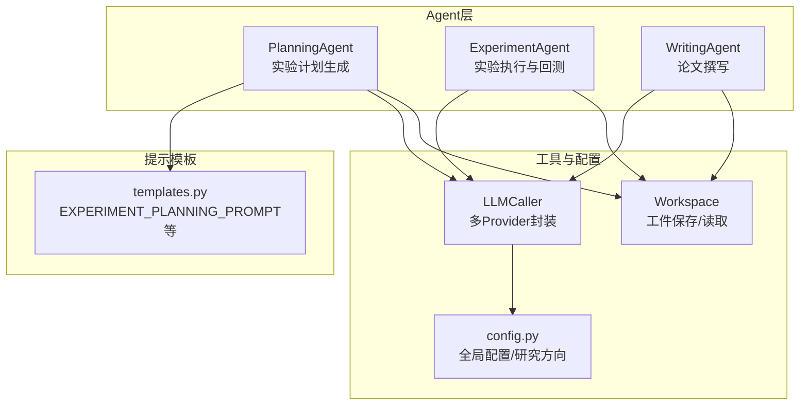
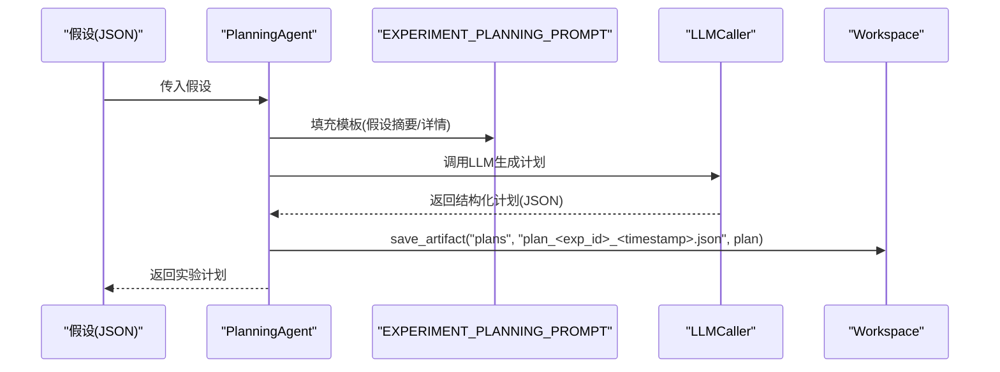
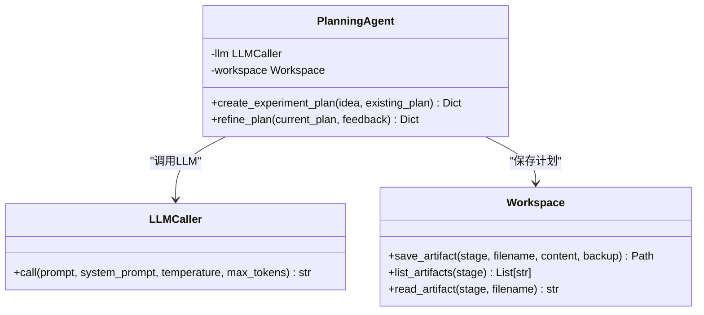
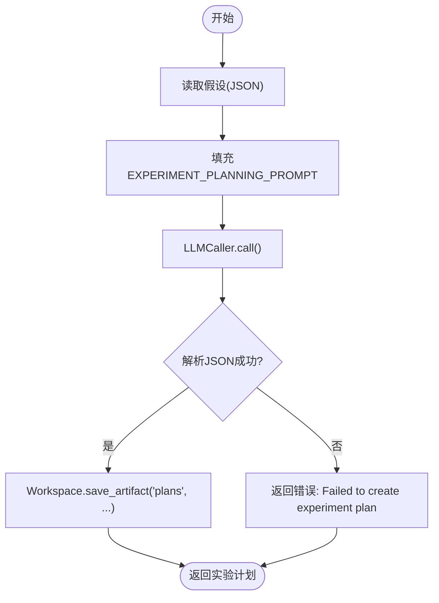
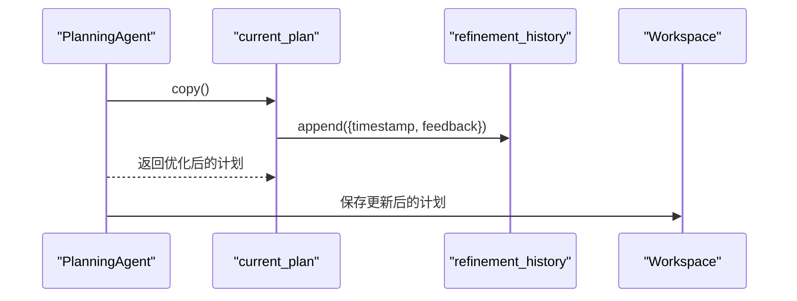
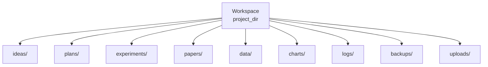
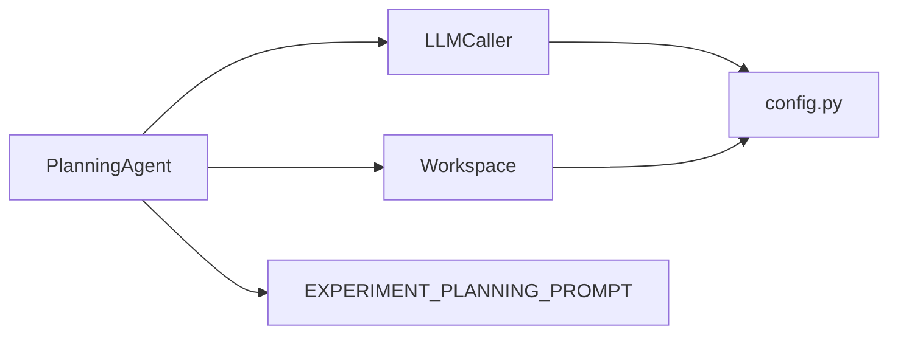

# Planning Agent（实验规划代理）

<cite>
**本文引用的文件**
- [src/agents/agents.py](file://src/agents/agents.py)
- [src/prompts/templates.py](file://src/prompts/templates.py)
- [src/core/config.py](file://src/core/config.py)
- [src/tools/fetchers.py](file://src/tools/fetchers.py)
- [AGENTS.md](file://AGENTS.md)
- [scripts/paper_submission_workflow.py](file://scripts/paper_submission_workflow.py)
</cite>

## 目录
1. [简介](#简介)
2. [项目结构](#项目结构)
3. [核心组件](#核心组件)
4. [架构总览](#架构总览)
5. [详细组件分析](#详细组件分析)
6. [依赖关系分析](#依赖关系分析)
7. [性能考量](#性能考量)
8. [故障排查指南](#故障排查指南)
9. [结论](#结论)
10. [附录](#附录)

## 简介
本文聚焦于paperwriterAI项目中的Planning Agent（实验规划代理）。该Agent的核心职责包括：
- 将假设转化为详细的实验计划
- 设计对照实验与评估指标
- 生成实验ID并结构化存储
- 提供实验优化与反馈机制
- 与Workspace工作空间集成，规范保存格式与命名规则

本文将从系统架构、数据结构、处理逻辑、提示模板使用、实验ID生成、历史记录管理、与Workspace的集成等方面进行深入解读，并给出方法调用序列图与数据流图，帮助读者快速掌握Planning Agent的工作原理与最佳实践。

## 项目结构
- 核心Agent实现位于[src/agents/agents.py](file://src/agents/agents.py)，其中包含PlanningAgent、ExperimentAgent、WritingAgent等。
- 提示模板集中于[src/prompts/templates.py](file://src/prompts/templates.py)，为各Agent提供标准化的Prompt。
- 工作空间与配置由[src/core/config.py](file://src/core/config.py)提供，包含Workspace类、全局配置、研究方向等。
- LLM调用封装在[src/tools/fetchers.py](file://src/tools/fetchers.py)中，统一提供LLMCaller。
- 项目文档与架构说明见[AGENTS.md](file://AGENTS.md)。

**图表来源**
- [src/agents/agents.py](file://src/agents/agents.py)
- [src/prompts/templates.py](file://src/prompts/templates.py)
- [src/core/config.py](file://src/core/config.py)
- [src/tools/fetchers.py](file://src/tools/fetchers.py)

**章节来源**
- [AGENTS.md](file://AGENTS.md)
- [src/agents/agents.py](file://src/agents/agents.py)
- [src/prompts/templates.py](file://src/prompts/templates.py)
- [src/core/config.py](file://src/core/config.py)
- [src/tools/fetchers.py](file://src/tools/fetchers.py)

## 核心组件
- PlanningAgent：负责将假设转化为结构化的实验计划，生成实验ID，保存到Workspace，并提供基础的优化接口。
- 提示模板：EXPERIMENT_PLANNING_PROMPT定义了实验计划的结构化输出格式，确保Plan具备统一字段。
- Workspace：提供save_artifact接口，按阶段目录保存实验计划文件，支持备份与命名规则。
- LLMCaller：封装多Provider调用，统一调用接口，便于替换与降级。

**章节来源**
- [src/agents/agents.py](file://src/agents/agents.py)
- [src/prompts/templates.py](file://src/prompts/templates.py)
- [src/core/config.py](file://src/core/config.py)
- [src/tools/fetchers.py](file://src/tools/fetchers.py)

## 架构总览
Planning Agent在系统中的位置如下：
- 输入：来自Ideation Agent的假设（JSON结构）
- 处理：使用EXPERIMENT_PLANNING_PROMPT生成结构化实验计划
- 输出：保存到Workspace/plans目录，文件名包含实验ID与时间戳
- 优化：提供refine_plan接口，记录反馈与历史

**图表来源**
- [src/agents/agents.py](file://src/agents/agents.py)
- [src/prompts/templates.py](file://src/prompts/templates.py)
- [src/core/config.py](file://src/core/config.py)
- [src/tools/fetchers.py](file://src/tools/fetchers.py)

## 详细组件分析

### PlanningAgent类与职责
- 职责
  - 将假设转化为详细的实验计划
  - 设计对照实验与评估指标
  - 生成实验ID并结构化存储
  - 提供基础的优化接口（refine_plan）
- 关键方法
  - create_experiment_plan(idea, existing_plan=None)：生成实验计划
  - refine_plan(current_plan, feedback)：基于反馈优化计划并记录历史

**图表来源**
- [src/agents/agents.py](file://src/agents/agents.py)
- [src/tools/fetchers.py](file://src/tools/fetchers.py)
- [src/core/config.py](file://src/core/config.py)

**章节来源**
- [src/agents/agents.py](file://src/agents/agents.py)

### 实验计划创建机制
- 提示模板使用
  - 使用EXPERIMENT_PLANNING_PROMPT，传入假设摘要与详情
  - 模板定义了实验目标、数据配置、回测配置、评估指标、步骤、备选策略与风险缓解等字段
- 实验ID生成
  - 从生成的计划中读取experiment_id字段
  - 若缺失，模板中应提供默认值；若存在，PlanningAgent会据此命名文件
- 计划结构化存储
  - 保存到Workspace的“plans”目录
  - 文件名格式：plan_<experiment_id>_<YYYYMMDD_HHMMSS>.json
  - Workspace内部会进行备份与日志记录

**图表来源**
- [src/agents/agents.py](file://src/agents/agents.py)
- [src/prompts/templates.py](file://src/prompts/templates.py)
- [src/core/config.py](file://src/core/config.py)

**章节来源**
- [src/agents/agents.py](file://src/agents/agents.py)
- [src/prompts/templates.py](file://src/prompts/templates.py)
- [src/core/config.py](file://src/core/config.py)

### 实验优化与反馈机制
- refine_plan(current_plan, feedback)
  - 复制当前计划，新增refinement_history数组
  - 记录timestamp与feedback，便于后续追踪优化轨迹
- 历史记录管理
  - 通过Workspace保存计划文件时自带备份，refinement_history提供轻量级历史
  - 建议在上层流程中结合Workspace.list_artifacts与read_artifact进行历史回溯

**图表来源**
- [src/agents/agents.py](file://src/agents/agents.py)
- [src/core/config.py](file://src/core/config.py)

**章节来源**
- [src/agents/agents.py](file://src/agents/agents.py)
- [src/core/config.py](file://src/core/config.py)

### 与Workspace的集成
- 目录结构
  - Workspace初始化时创建“ideas”、“plans”、“experiments”、“papers”等子目录
- 保存格式与命名规则
  - plans目录：plan_<experiment_id>_<YYYYMMDD_HHMMSS>.json
  - 保存内容为JSON字符串（Workspace内部会将dict转为JSON）
- 备份与日志
  - save_artifact支持备份旧文件，避免覆盖
  - 内部记录步骤日志，便于审计与恢复

**图表来源**
- [src/core/config.py](file://src/core/config.py)

**章节来源**
- [src/core/config.py](file://src/core/config.py)

### 实验计划的数据结构设计与字段含义
- 字段来源与模板
  - 字段由EXPERIMENT_PLANNING_PROMPT定义，确保Plan具备统一结构
- 关键字段说明（基于模板）
  - experiment_id：实验唯一标识
  - hypothesis：研究假设描述
  - objectives：实验目标列表
  - data_config：数据配置（symbols、start_date、end_date、frequency）
  - backtest_config：回测配置（framework、initial_cash、commission、rebalance_frequency）
  - evaluation_metrics：评估指标（min_sharpe_ratio、max_drawdown_threshold、min_ic）
  - steps：实验步骤列表（step_id、description、code_template、expected_output）
  - alternative_strategies：备选策略
  - risk_mitigation：风险缓解措施
- 字段复杂度与性能
  - Plan为JSON结构，读写复杂度O(n)（n为字段数量），通常较小，性能开销可忽略
  - 建议在上层流程中对Plan进行schema校验，确保字段完整性

**章节来源**
- [src/prompts/templates.py](file://src/prompts/templates.py)
- [src/agents/agents.py](file://src/agents/agents.py)

### 代码示例与使用说明
- create_experiment_plan方法使用要点
  - 输入：假设（JSON），可选existing_plan
  - 输出：实验计划（JSON），并保存到Workspace/plans
  - 示例路径：[src/agents/agents.py](file://src/agents/agents.py)
- refine_plan方法使用要点
  - 输入：current_plan（当前计划）、feedback（反馈/历史）
  - 输出：优化后的计划（含refinement_history）
  - 示例路径：[src/agents/agents.py](file://src/agents/agents.py)
- 与Workspace的交互
  - 保存路径：Workspace.save_artifact("plans", "plan_<experiment_id>_<timestamp>.json", plan)
  - 示例路径：[src/agents/agents.py](file://src/agents/agents.py)
- 与提示模板的交互
  - 使用EXPERIMENT_PLANNING_PROMPT填充模板，再调用LLM生成
  - 示例路径：[src/prompts/templates.py](file://src/prompts/templates.py)

**章节来源**
- [src/agents/agents.py](file://src/agents/agents.py)
- [src/prompts/templates.py](file://src/prompts/templates.py)
- [src/core/config.py](file://src/core/config.py)

## 依赖关系分析
- PlanningAgent依赖
  - LLMCaller：统一LLM调用，支持多Provider与降级
  - Workspace：工件保存与备份
  - 提示模板：EXPERIMENT_PLANNING_PROMPT
- 外部依赖
  - 提示模板定义了Plan的字段结构，是PlanningAgent输出稳定性的关键
  - Workspace目录结构与命名规则保证了Plan的可追溯性与可维护性

**图表来源**
- [src/agents/agents.py](file://src/agents/agents.py)
- [src/prompts/templates.py](file://src/prompts/templates.py)
- [src/core/config.py](file://src/core/config.py)
- [src/tools/fetchers.py](file://src/tools/fetchers.py)

**章节来源**
- [src/agents/agents.py](file://src/agents/agents.py)
- [src/prompts/templates.py](file://src/prompts/templates.py)
- [src/core/config.py](file://src/core/config.py)
- [src/tools/fetchers.py](file://src/tools/fetchers.py)

## 性能考量
- LLM调用成本
  - PlanningAgent依赖LLM生成Plan，建议控制Prompt长度与max_tokens，避免超限
  - 可通过提示模板的字段裁剪与分步生成减少上下文开销
- 文件IO与备份
  - Workspace.save_artifact会进行备份，频繁保存可能带来IO压力
  - 建议在批量处理时合并保存，或在上层流程中进行去重与缓存
- Plan体积
  - Plan为JSON结构，字段较少，通常不影响性能
  - 若未来扩展大量步骤或图表描述，需关注序列化与存储成本

[本节为通用指导，无需特定文件引用]

## 故障排查指南
- LLM调用失败
  - 检查LLMCaller配置与Provider可用性
  - 查看Workspace日志与备份，确认是否发生异常
  - 参考：[src/tools/fetchers.py](file://src/tools/fetchers.py)、[src/core/config.py](file://src/core/config.py)
- JSON解析失败
  - 检查提示模板输出是否符合JSON格式
  - 参考：[src/prompts/templates.py](file://src/prompts/templates.py)
- 文件保存失败
  - 确认Workspace目录权限与磁盘空间
  - 参考：[src/core/config.py](file://src/core/config.py)
- 实验ID缺失
  - 确保提示模板中提供experiment_id字段
  - 参考：[src/prompts/templates.py](file://src/prompts/templates.py)

**章节来源**
- [src/tools/fetchers.py](file://src/tools/fetchers.py)
- [src/core/config.py](file://src/core/config.py)
- [src/prompts/templates.py](file://src/prompts/templates.py)

## 结论
Planning Agent通过标准化的提示模板与Workspace集成，实现了从假设到实验计划的自动化生成与结构化存储。其核心优势在于：
- 统一的Plan字段结构，便于后续实验执行与评估
- 与Workspace的无缝集成，保障可追溯性与可维护性
- 简洁的优化接口，支持基于反馈的历史记录管理

在实际使用中，建议：
- 严格遵循提示模板字段，确保Plan完整性
- 合理控制LLM调用成本，避免超限
- 利用Workspace备份与日志，建立完善的审计机制

[本节为总结性内容，无需特定文件引用]

## 附录
- 相关文件与路径
  - PlanningAgent实现：[src/agents/agents.py](file://src/agents/agents.py)
  - 提示模板（实验计划）：[src/prompts/templates.py](file://src/prompts/templates.py)
  - 工作空间与配置：[src/core/config.py](file://src/core/config.py)
  - LLM调用封装：[src/tools/fetchers.py](file://src/tools/fetchers.py)
  - 项目架构说明：[AGENTS.md](file://AGENTS.md)
  - 论文生成工作流（参考）：[scripts/paper_submission_workflow.py](file://scripts/paper_submission_workflow.py)

[本节为补充材料，无需特定文件引用]