# Writing Agent（论文撰写代理）

<cite>
**本文档引用的文件**
- [src/agents/agents.py](file://src/agents/agents.py)
- [src/prompts/templates.py](file://src/prompts/templates.py)
- [src/core/config.py](file://src/core/config.py)
- [src/tools/fetchers.py](file://src/tools/fetchers.py)
- [src/tools/backtest.py](file://src/tools/backtest.py)
- [src/core/paper_extractor.py](file://src/core/paper_extractor.py)
- [README.md](file://README.md)
- [AGENTS.md](file://AGENTS.md)
</cite>

## 目录
1. [简介](#简介)
2. [项目结构](#项目结构)
3. [核心组件](#核心组件)
4. [架构概览](#架构概览)
5. [详细组件分析](#详细组件分析)
6. [依赖关系分析](#依赖关系分析)
7. [性能考虑](#性能考虑)
8. [故障排除指南](#故障排除指南)
9. [结论](#结论)

## 简介

Writing Agent是paperwriterAI项目中的核心组件之一，负责根据实验结果自动生成完整的学术论文。该代理具有以下核心职责：

- **论文生成**：基于实验结果和原始论文参考，生成完整的LaTeX论文源码
- **LaTeX格式化**：确保生成的论文符合学术标准格式
- **图表自动化**：自动生成图表和表格，支持matplotlib集成
- **元数据管理**：维护论文的元数据信息和版本控制

Writing Agent采用多代理协作架构，与Ideation Agent、Planning Agent、Experiment Agent形成完整的论文生成流水线。

## 项目结构

paperwriterAI项目采用模块化设计，核心目录结构如下：

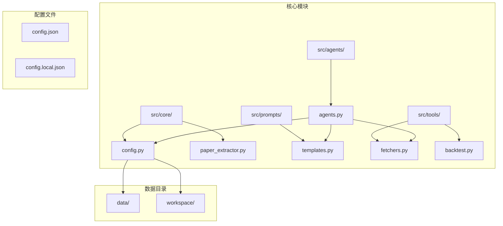

**图表来源**
- [src/agents/agents.py:1-738](file://src/agents/agents.py#L1-L738)
- [src/core/config.py:1-563](file://src/core/config.py#L1-L563)

**章节来源**
- [README.md:420-500](file://README.md#L420-L500)
- [AGENTS.md:18-57](file://AGENTS.md#L18-L57)

## 核心组件

### Writing Agent类结构

Writing Agent采用面向对象设计，包含以下关键组件：

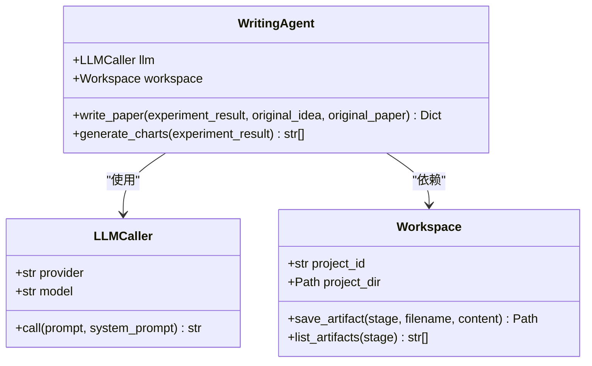

**图表来源**
- [src/agents/agents.py:499-651](file://src/agents/agents.py#L499-L651)
- [src/tools/fetchers.py:290-800](file://src/tools/fetchers.py#L290-L800)
- [src/core/config.py:254-384](file://src/core/config.py#L254-L384)

### 论文撰写流程

Writing Agent遵循严格的论文生成流程：

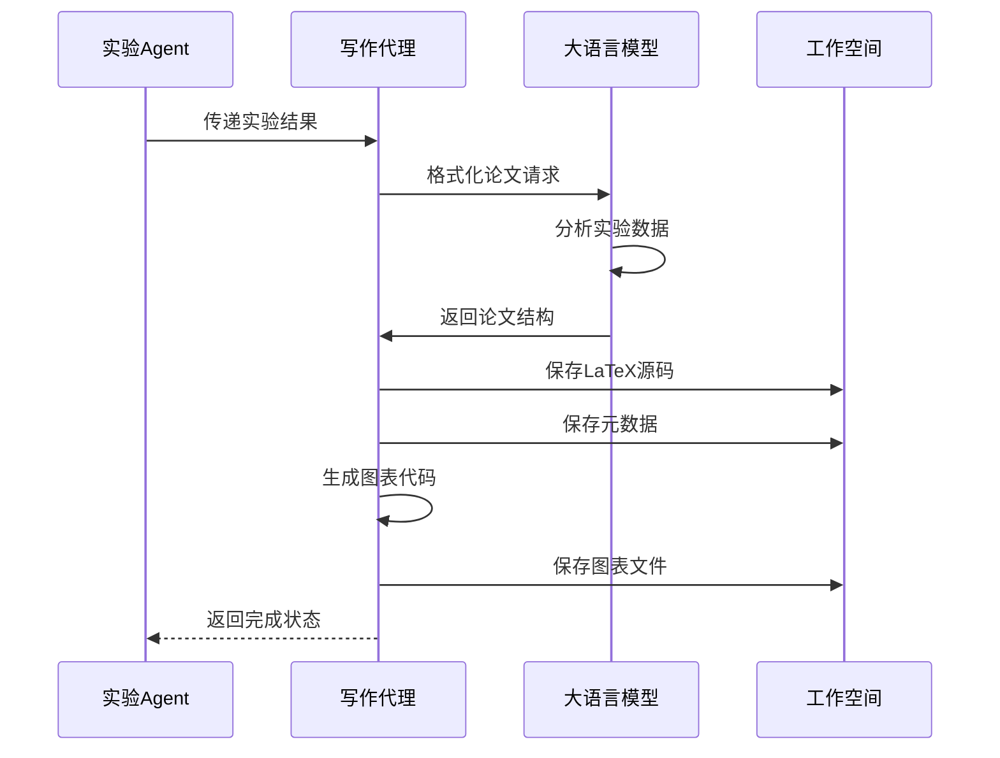

**图表来源**
- [src/agents/agents.py:517-580](file://src/agents/agents.py#L517-L580)
- [src/agents/agents.py:582-650](file://src/agents/agents.py#L582-L650)

**章节来源**
- [src/agents/agents.py:499-651](file://src/agents/agents.py#L499-L651)

## 架构概览

### 系统架构

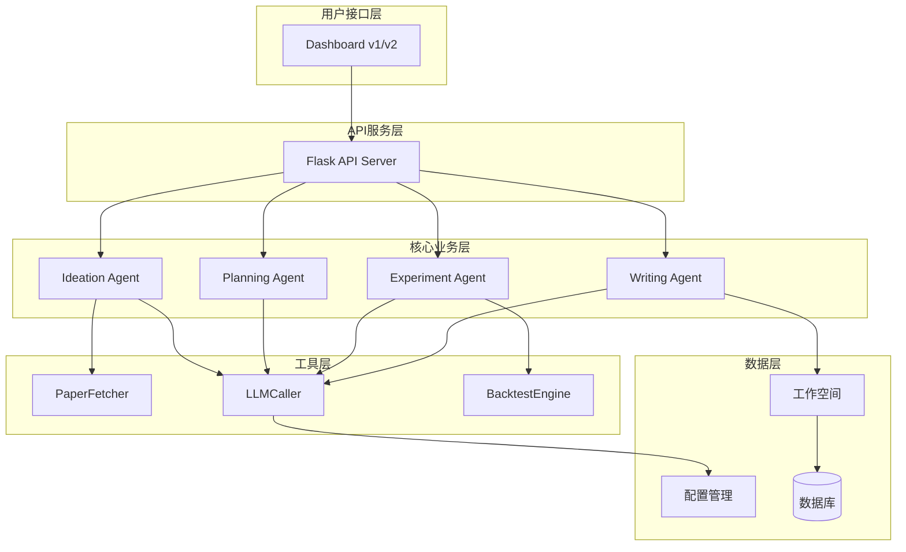

**图表来源**
- [README.md:50-88](file://README.md#L50-L88)
- [AGENTS.md:18-57](file://AGENTS.md#L18-L57)

### 数据流架构

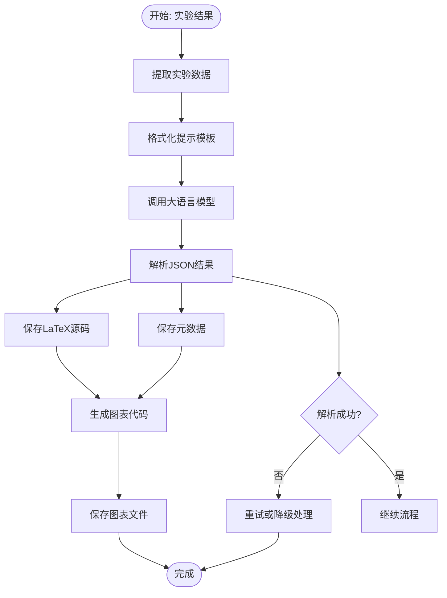

**图表来源**
- [src/agents/agents.py:517-580](file://src/agents/agents.py#L517-L580)
- [src/agents/agents.py:582-650](file://src/agents/agents.py#L582-L650)

**章节来源**
- [src/agents/agents.py:517-650](file://src/agents/agents.py#L517-L650)

## 详细组件分析

### write_paper方法实现

write_paper方法是Writing Agent的核心功能，负责将实验结果转换为完整的学术论文：

#### 方法签名和参数

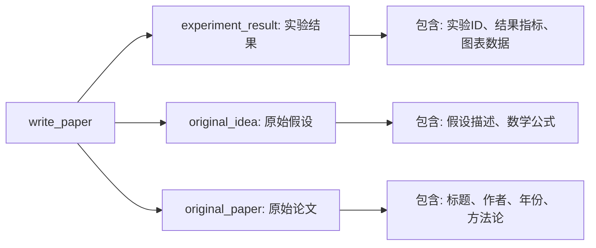

**图表来源**
- [src/agents/agents.py:517-544](file://src/agents/agents.py#L517-L544)

#### 论文生成流程

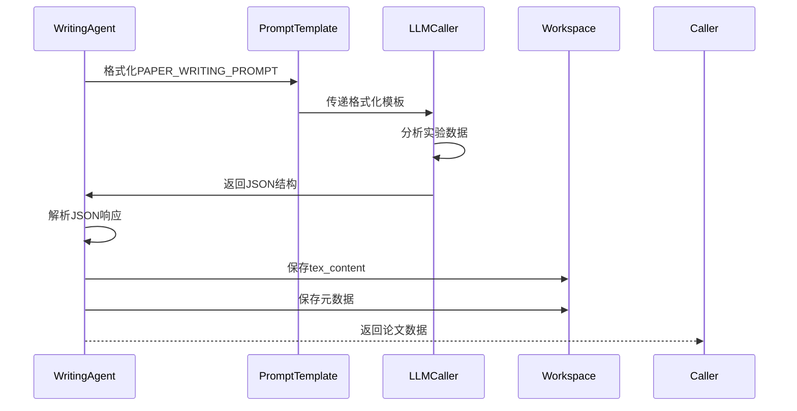

**图表来源**
- [src/agents/agents.py:517-580](file://src/agents/agents.py#L517-L580)
- [src/prompts/templates.py:355-389](file://src/prompts/templates.py#L355-L389)

#### LaTeX生成机制

Writing Agent使用预定义的LaTeX模板生成符合学术标准的论文格式：

**章节来源**
- [src/agents/agents.py:517-580](file://src/agents/agents.py#L517-L580)

### generate_charts方法实现

generate_charts方法负责自动生成论文所需的图表：

#### 图表生成流程

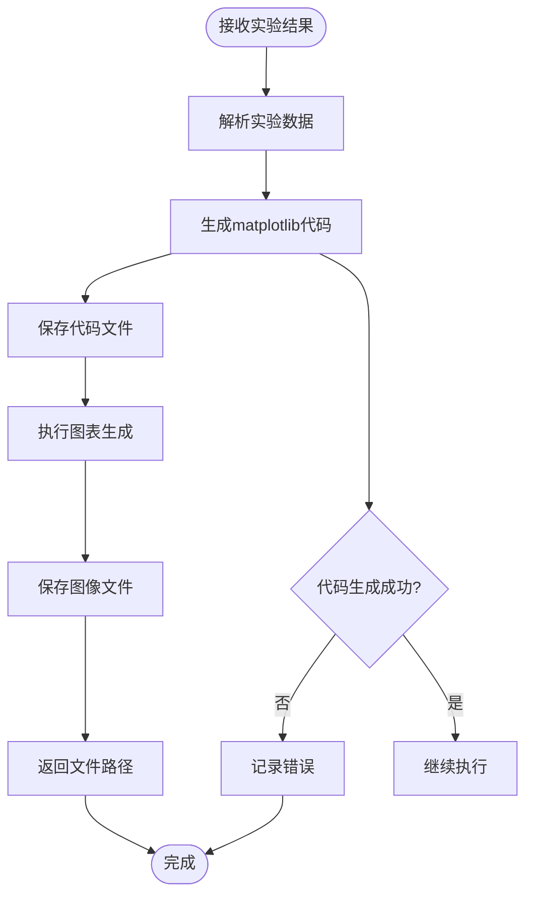

**图表来源**
- [src/agents/agents.py:582-650](file://src/agents/agents.py#L582-L650)

#### 图表类型和内容

根据实验结果，Writing Agent自动生成以下类型的图表：

| 图表类型 | 数据内容 | 生成目的 |
|---------|---------|---------|
| 权益曲线图 | equity_curve时间序列 | 展示投资组合价值变化 |
| 回撤图 | drawdown计算结果 | 分析最大回撤情况 |
| 指标柱状图 | 关键指标(Sharpe、IC、最大回撤) | 比较策略性能 |

**章节来源**
- [src/agents/agents.py:582-650](file://src/agents/agents.py#L582-L650)

### 提示模板系统

Writing Agent使用精心设计的提示模板确保论文质量：

#### 模板结构

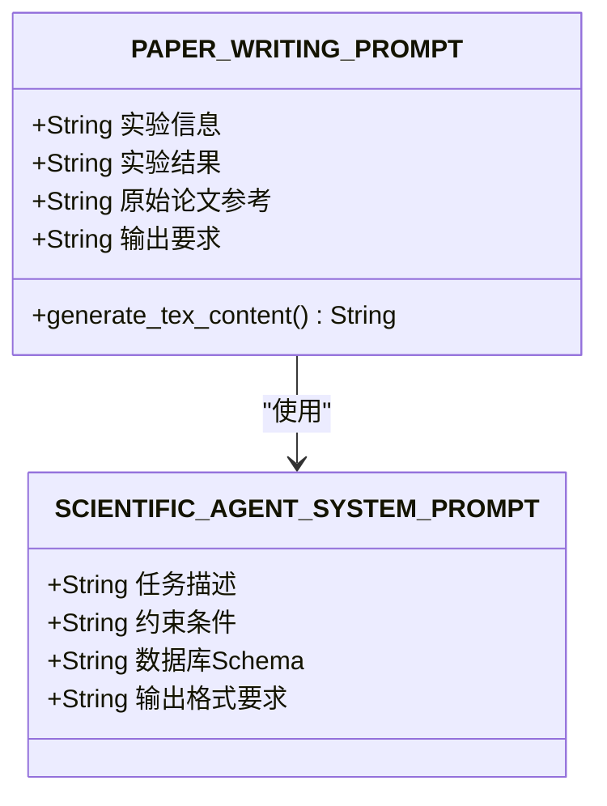

**图表来源**
- [src/prompts/templates.py:355-389](file://src/prompts/templates.py#L355-L389)
- [src/prompts/templates.py:8-23](file://src/prompts/templates.py#L8-L23)

#### 学术写作规范

提示模板确保生成的论文符合以下学术规范：

**章节来源**
- [src/prompts/templates.py:355-389](file://src/prompts/templates.py#L355-L389)

### 与Workspace的集成

Writing Agent与Workspace的集成实现了完整的论文文件管理：

#### 文件命名规范

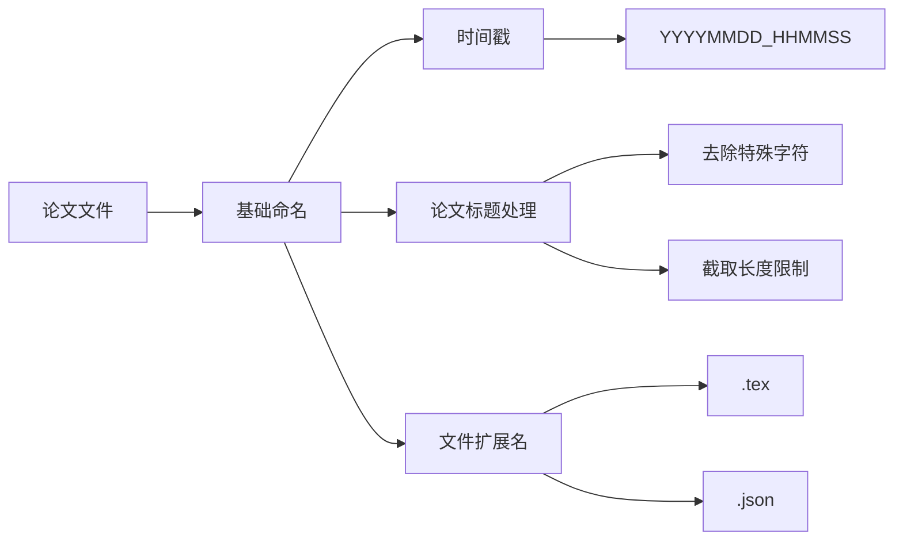

**图表来源**
- [src/agents/agents.py:554-574](file://src/agents/agents.py#L554-L574)

#### 目录结构设计

Workspace为每个项目创建独立的工作空间：

| 目录 | 用途 | 包含文件 |
|------|------|---------|
| ideas/ | 假设文件 | ideas_*.json |
| plans/ | 实验计划 | plan_*.json |
| experiments/ | 实验代码和结果 | code_*.py, charts/ |
| papers/ | 论文文件 | paper_*.tex, paper_meta_*.json |
| charts/ | 图表文件 | *.png |
| logs/ | 日志文件 | step_*.json |
| backups/ | 备份文件 | 备份版本 |

**章节来源**
- [src/core/config.py:274-279](file://src/core/config.py#L274-L279)
- [src/agents/agents.py:554-574](file://src/agents/agents.py#L554-L574)

### 版本管理机制

Writing Agent实现了完善的版本控制和备份机制：

#### 备份策略

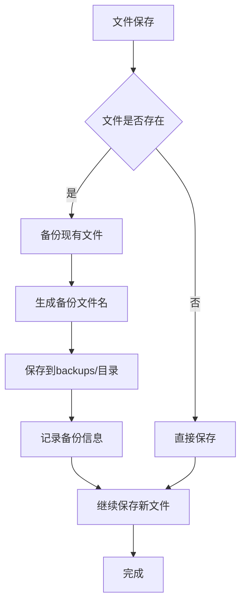

**图表来源**
- [src/core/config.py:296-299](file://src/core/config.py#L296-L299)

**章节来源**
- [src/core/config.py:98-187](file://src/core/config.py#L98-L187)

## 依赖关系分析

### 核心依赖关系

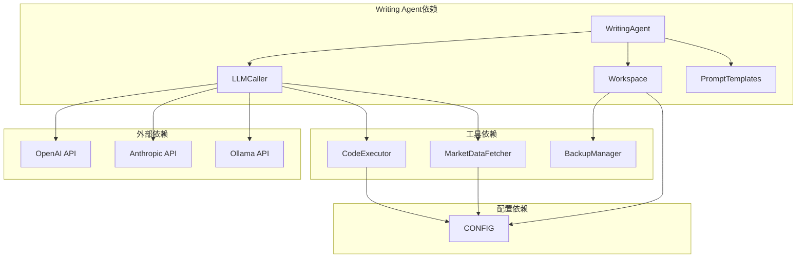

**图表来源**
- [src/agents/agents.py:12-20](file://src/agents/agents.py#L12-L20)
- [src/core/config.py:388-417](file://src/core/config.py#L388-L417)

### 数据流依赖

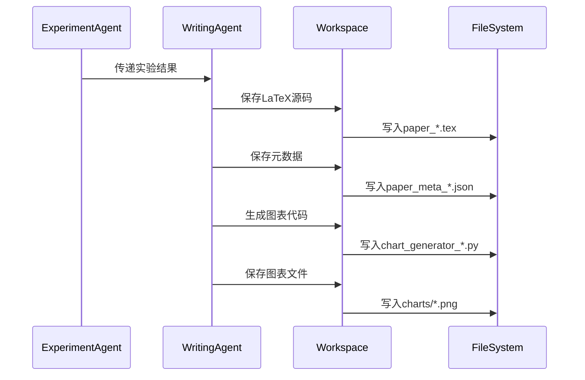

**图表来源**
- [src/agents/agents.py:554-650](file://src/agents/agents.py#L554-L650)

**章节来源**
- [src/agents/agents.py:12-20](file://src/agents/agents.py#L12-L20)

## 性能考虑

### 并发处理

Writing Agent支持多线程并发处理，提高系统吞吐量：

- **异步图表生成**：图表生成过程独立于论文生成
- **并行文件保存**：多个文件同时保存到工作空间
- **缓存机制**：重复使用的提示模板和配置进行缓存

### 内存管理

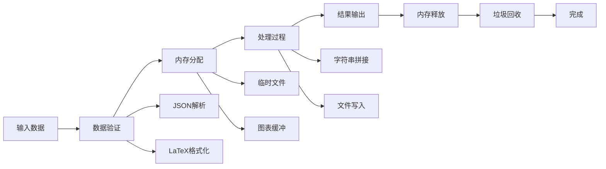

### 错误处理策略

- **降级机制**：当某些功能失败时，系统自动降级到可用状态
- **重试机制**：对于临时性错误提供自动重试
- **回滚机制**：失败时自动回滚到上一个稳定状态

## 故障排除指南

### 常见问题及解决方案

#### 论文生成失败

**问题症状**：write_paper方法返回错误信息

**可能原因**：
- LLM调用失败
- JSON解析错误
- 文件保存权限问题

**解决方案**：
1. 检查LLM API连接状态
2. 验证实验结果格式
3. 确认工作空间权限

#### 图表生成异常

**问题症状**：generate_charts方法无法生成图表

**可能原因**：
- matplotlib安装问题
- 数据格式不正确
- 图像文件权限问题

**解决方案**：
1. 确认matplotlib正确安装
2. 验证实验数据格式
3. 检查charts目录权限

#### 文件保存失败

**问题症状**：论文或图表文件无法保存

**可能原因**：
- 磁盘空间不足
- 目录权限问题
- 文件名冲突

**解决方案**：
1. 检查磁盘空间
2. 确认目录写权限
3. 使用唯一文件名

**章节来源**
- [src/agents/agents.py:517-650](file://src/agents/agents.py#L517-L650)

## 结论

Writing Agent作为paperwriterAI项目的核心组件，实现了从实验结果到完整学术论文的自动化生成。通过精心设计的提示模板、严格的学术规范遵循、完善的文件管理和版本控制机制，Writing Agent能够高效地生成符合学术标准的论文。

### 主要优势

1. **自动化程度高**：从实验结果到论文发布的完整自动化
2. **格式标准化**：确保生成的论文符合学术标准
3. **图表自动化**：自动生成图表和表格，提高效率
4. **版本控制**：完善的备份和版本管理机制
5. **错误处理**：健壮的错误处理和降级机制

### 技术特色

- **多代理协作**：与其它Agent形成完整的论文生成流水线
- **灵活的提示模板**：支持不同格式和要求的论文生成
- **强大的数据处理**：能够处理各种类型的实验结果
- **完善的监控**：提供详细的日志和状态跟踪

Writing Agent为量化金融研究提供了高效的论文生成解决方案，大大提高了研究效率和论文质量的一致性。