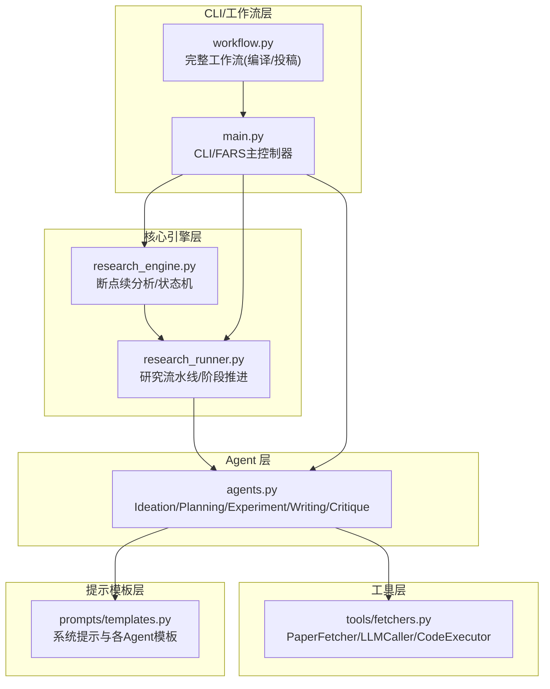
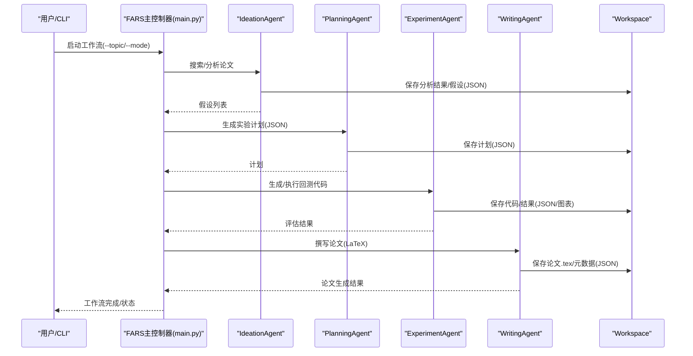
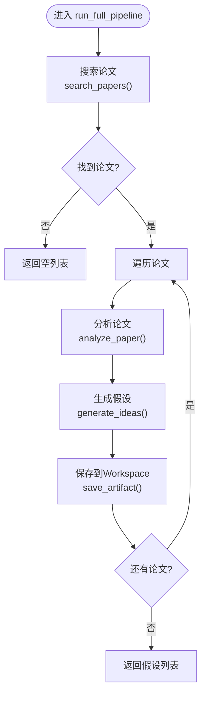
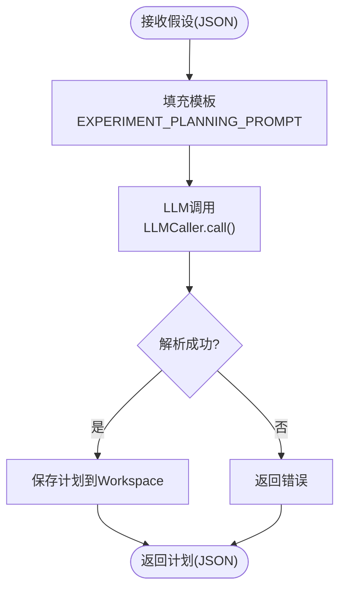
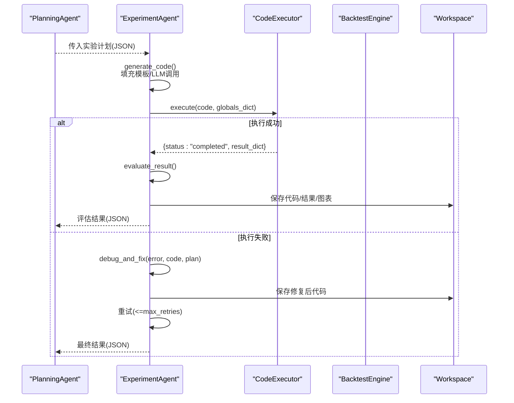
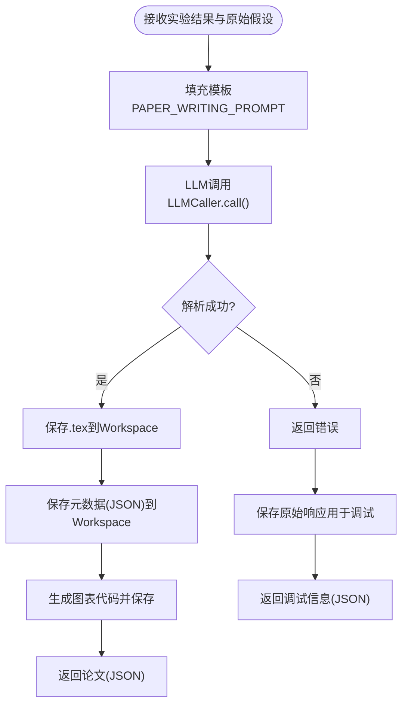
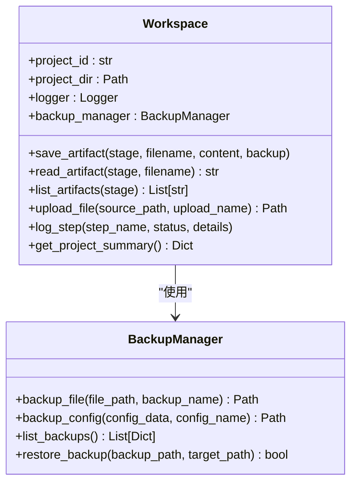
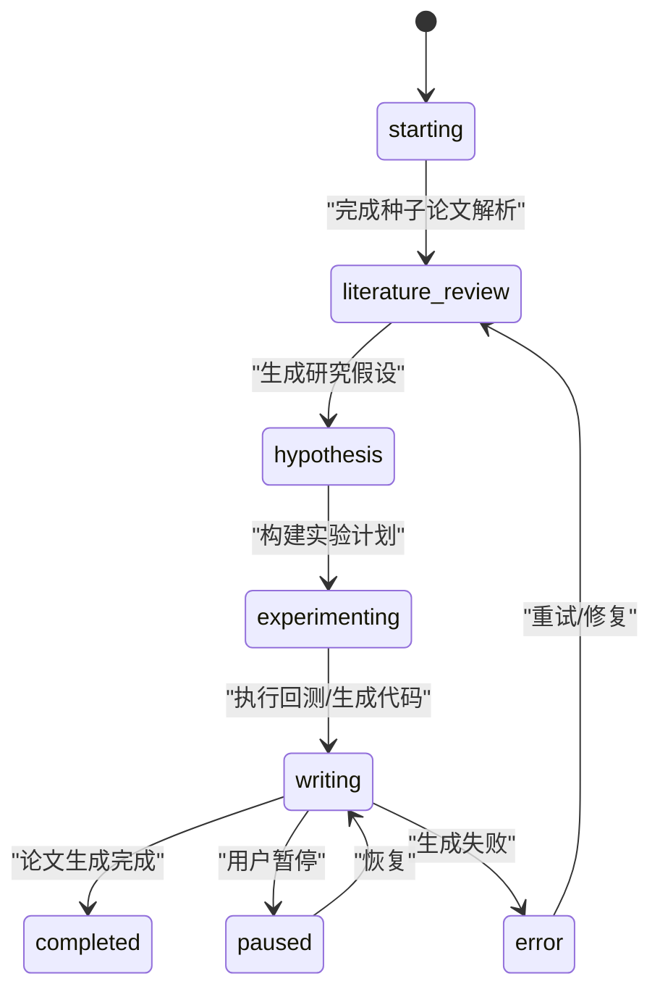
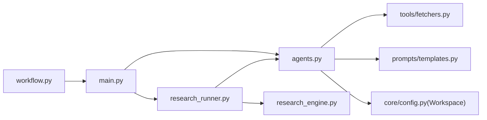

# 多代理协作系统

<cite>
**本文档引用的文件**
- [src/agents/agents.py](file://src/agents/agents.py)
- [src/core/config.py](file://src/core/config.py)
- [src/tools/fetchers.py](file://src/tools/fetchers.py)
- [src/prompts/templates.py](file://src/prompts/templates.py)
- [src/core/research_engine.py](file://src/core/research_engine.py)
- [src/core/research_runner.py](file://src/core/research_runner.py)
- [src/main.py](file://src/main.py)
- [src/workflow.py](file://src/workflow.py)
- [AGENTS.md](file://AGENTS.md)
- [docs/AI_PAPER_FULL_WORKFLOW.md](file://docs/AI_PAPER_FULL_WORKFLOW.md)
</cite>

## 目录
1. [简介](#简介)
2. [项目结构](#项目结构)
3. [核心组件](#核心组件)
4. [架构总览](#架构总览)
5. [详细组件分析](#详细组件分析)
6. [依赖关系分析](#依赖关系分析)
7. [性能考量](#性能考量)
8. [故障排查指南](#故障排查指南)
9. [结论](#结论)
10. [附录](#附录)

## 简介
本文件系统化阐述 paperwriterAI 项目中的多代理协作体系，重点聚焦四个核心 Agent（Ideation、Planning、Experiment、Writing）的职责边界、接口定义、状态管理与协作机制。文档还解释了 Agent 间的通信协议、数据流转模式、任务分配策略，以及通过 Workspace 实现的共享状态管理。同时给出错误处理、异常恢复、性能优化等关键技术点，帮助读者快速理解并高效使用该系统。

## 项目结构
项目采用分层架构：核心引擎层（研究流程、断点续分析）、Agent 层（四代理合一）、工具层（论文抓取、回测、LLM 调用）、服务层（AI 检测、评审）、提示模板层（Prompt 模板）、CLI/工作流层（主程序与完整工作流）。其中，Agent 层集中于单一文件，便于统一管理与协作。

**图表来源**
- [src/core/research_engine.py:1-120](file://src/core/research_engine.py#L1-L120)
- [src/core/research_runner.py:278-428](file://src/core/research_runner.py#L278-L428)
- [src/agents/agents.py:23-738](file://src/agents/agents.py#L23-L738)
- [src/tools/fetchers.py:20-800](file://src/tools/fetchers.py#L20-L800)
- [src/prompts/templates.py:1-758](file://src/prompts/templates.py#L1-L758)
- [src/main.py:35-521](file://src/main.py#L35-L521)
- [src/workflow.py:19-286](file://src/workflow.py#L19-L286)

**章节来源**
- [AGENTS.md:18-57](file://AGENTS.md#L18-L57)
- [src/main.py:35-100](file://src/main.py#L35-L100)

## 核心组件
- Workspace 共享工作空间：统一的工件存储、日志记录、备份管理与项目状态摘要，贯穿四代理协作全程。
- LLMCaller 统一大模型调用：支持多 Provider 自动切换、调用统计与日志记录，保证 Agent 的 LLM 交互一致性。
- PaperFetcher/MarketDataFetcher：论文与市场数据获取，为 Ideation 与 Experiment 提供输入。
- CodeExecutor/BacktestEngine：沙箱执行与回测引擎，支撑 Experiment 的代码生成与执行。
- Prompt 模板：为四代理提供标准化提示，确保输出结构化与可解析。

**章节来源**
- [src/core/config.py:254-384](file://src/core/config.py#L254-L384)
- [src/tools/fetchers.py:290-800](file://src/tools/fetchers.py#L290-L800)
- [src/prompts/templates.py:1-758](file://src/prompts/templates.py#L1-L758)

## 架构总览
四代理协作遵循“论文→假设→实验→论文”的闭环流程。每个代理负责特定阶段的任务，通过 Workspace 共享中间产物（JSON/代码/图表/日志），并通过 LLM 模板驱动结构化输出。研究流水线（research_runner）与断点续分析（research_engine）提供后台推进与容错能力，确保长流程稳定运行。

**图表来源**
- [src/main.py:353-427](file://src/main.py#L353-L427)
- [src/agents/agents.py:23-738](file://src/agents/agents.py#L23-L738)
- [src/core/config.py:254-384](file://src/core/config.py#L254-L384)

## 详细组件分析

### Ideation Agent（假设生成）
- 职责边界
  - 论文搜索与去重（arXiv/Semantic Scholar）
  - 论文深度分析（方法论/关键发现/因子提取）
  - 假设生成（结构化JSON，含数学公式、Python代码片段、预期指标）
- 接口定义
  - search_papers(query, max_results, sources) → 论文列表
  - analyze_paper(paper_info) → 分析结果(JSON)
  - generate_ideas(paper_info, analysis_result=None) → 假设(JSON)
  - run_full_pipeline(query, max_papers) → 假设列表
- 状态管理
  - 通过 Workspace.save_artifact 将分析结果与假设持久化，命名包含时间戳与论文ID，便于溯源与复用。
- 错误处理
  - JSON 解析失败时返回错误信息；无论文时返回空列表。
- 性能优化
  - 并行搜索不同数据源；对重复论文进行去重；限制最大结果数。

**图表来源**
- [src/agents/agents.py:42-194](file://src/agents/agents.py#L42-L194)

**章节来源**
- [src/agents/agents.py:23-194](file://src/agents/agents.py#L23-L194)
- [src/prompts/templates.py:28-85](file://src/prompts/templates.py#L28-L85)
- [src/tools/fetchers.py:27-121](file://src/tools/fetchers.py#L27-L121)

### Planning Agent（实验计划制定）
- 职责边界
  - 将假设转化为详细实验计划（目标、数据配置、回测配置、评估指标、步骤清单）
  - 支持基于反馈的计划优化（refinement_history）
- 接口定义
  - create_experiment_plan(idea, existing_plan=None) → 计划(JSON)
  - refine_plan(current_plan, feedback) → 优化后的计划
- 状态管理
  - 通过 Workspace.save_artifact 保存计划，便于后续 ExperimentAgent 使用。
- 错误处理
  - JSON 解析失败时返回错误信息。
- 性能优化
  - 模板化提示，减少重复构造成本；必要时复用已有计划。

**图表来源**
- [src/agents/agents.py:215-276](file://src/agents/agents.py#L215-L276)
- [src/prompts/templates.py:160-234](file://src/prompts/templates.py#L160-L234)

**章节来源**
- [src/agents/agents.py:197-276](file://src/agents/agents.py#L197-L276)
- [src/prompts/templates.py:158-234](file://src/prompts/templates.py#L158-L234)

### Experiment Agent（实验执行与回测）
- 职责边界
  - 代码生成（根据实验计划生成可执行Python代码）
  - 沙箱执行（CodeExecutor + BacktestEngine）
  - 错误自愈（调试与修复，支持重试）
  - 结果评估（阈值判断：夏普比率、最大回撤、IC）
- 接口定义
  - generate_code(experiment_plan) → Python代码
  - execute_experiment(code, experiment_plan) → 执行结果
  - debug_and_fix(error, code, experiment_plan) → 修复后的代码
  - run_experiment_with_retry(experiment_plan, max_retries) → 评估结果
  - evaluate_result(result) → 评估结果
- 状态管理
  - 通过 Workspace.save_artifact 保存代码、修复后代码、图表与回测结果。
- 错误处理
  - 执行失败时触发调试与修复；超过最大重试次数后返回失败。
- 性能优化
  - 仅在失败时进行调试修复；评估阈值可配置；回测参数可复用。

**图表来源**
- [src/agents/agents.py:302-496](file://src/agents/agents.py#L302-L496)
- [src/tools/fetchers.py:777-800](file://src/tools/fetchers.py#L777-L800)

**章节来源**
- [src/agents/agents.py:279-496](file://src/agents/agents.py#L279-L496)
- [src/prompts/templates.py:239-352](file://src/prompts/templates.py#L239-L352)

### Writing Agent（论文撰写）
- 职责边界
  - 基于实验结果撰写学术论文（LaTeX 源码）
  - 自动生成图表与元数据
  - 输出可提交的论文草稿
- 接口定义
  - write_paper(experiment_result, original_idea, original_paper=None) → 论文(JSON，含tex_content与references)
  - generate_charts(experiment_result) → 图表文件路径列表
- 状态管理
  - 通过 Workspace.save_artifact 保存.tex与元数据(JSON)，命名包含标题与时间戳。
- 错误处理
  - JSON 解析失败时返回错误信息；必要时保存原始响应用于调试。
- 性能优化
  - 模板化提示，减少重复构造；图表生成代码可复用。

**图表来源**
- [src/agents/agents.py:517-580](file://src/agents/agents.py#L517-L580)
- [src/prompts/templates.py:357-389](file://src/prompts/templates.py#L357-L389)

**章节来源**
- [src/agents/agents.py:499-580](file://src/agents/agents.py#L499-L580)
- [src/prompts/templates.py:355-389](file://src/prompts/templates.py#L355-L389)

### Workspace（共享状态管理）
- 职责边界
  - 项目级工作空间：独立目录、阶段化子目录（ideas/plans/experiments/papers/data/charts/logs/backups/uploads）
  - 工件持久化：save_artifact(stage, filename, content, backup)
  - 日志与备份：log_step(step_name, status, details)、BackupManager
  - 项目摘要：get_project_summary()
- 接口定义
  - save_artifact(stage, filename, content, backup=True)
  - read_artifact(stage, filename)
  - list_artifacts(stage)
  - upload_file(source_path, upload_name=None)
  - log_step(step_name, status, details)
  - get_project_summary()
- 错误处理
  - 文件不存在时返回 None；备份失败记录日志。
- 性能优化
  - 目录提前创建；同名文件自动备份；MD5 防重写入（研究引擎中体现）。

**图表来源**
- [src/core/config.py:254-384](file://src/core/config.py#L254-L384)

**章节来源**
- [src/core/config.py:254-384](file://src/core/config.py#L254-L384)

### LLMCaller（统一LLM调用）
- 职责边界
  - 支持多 Provider（OpenAI/Anthropic/DeepSeek/MiniMax/Ollama）
  - 主备自动切换、调用统计与日志记录（llm_call_logs.json）
  - 统一温度与max_tokens参数
- 接口定义
  - call(prompt, system_prompt, temperature, max_tokens) → 文本
- 错误处理
  - 主Provider失败时依次尝试备选；记录失败调用详情。
- 性能优化
  - 限制历史记录数量；按需记录调用统计。

**章节来源**
- [src/tools/fetchers.py:290-800](file://src/tools/fetchers.py#L290-L800)

### 研究流水线与断点续分析
- 研究流水线（ResearchRunner）
  - 阶段推进：starting → literature_review → hypothesis → experimenting → writing → completed/paused/error
  - 后台线程推进，支持暂停/恢复/错误恢复
  - 阶段指标合并与日志记录
- 断点续分析（ResearchEngine）
  - StepStatus/Pending/Running/Done/Failed/Skipped
  - ResearchCheckpoint：持久化步骤状态、错误计数、Bug报告
  - 写作降级：卡顿时并发写作并生成Bug报告
  - 作者/引用关系网络：构建作者-论文-引用关系图

**图表来源**
- [src/core/research_runner.py:567-629](file://src/core/research_runner.py#L567-L629)
- [src/core/research_engine.py:55-148](file://src/core/research_engine.py#L55-L148)

**章节来源**
- [src/core/research_runner.py:278-800](file://src/core/research_runner.py#L278-L800)
- [src/core/research_engine.py:1-200](file://src/core/research_engine.py#L1-L200)

## 依赖关系分析
- Agent 依赖 LLMCaller 与 Prompt 模板，确保输出结构化与可解析
- Experiment Agent 依赖 CodeExecutor 与 BacktestEngine，实现代码生成与回测
- Workspace 为所有 Agent 提供统一的工件存储与日志记录
- ResearchRunner/ResearchEngine 为 Agent 提供后台推进与断点续分析能力

**图表来源**
- [src/agents/agents.py:12-21](file://src/agents/agents.py#L12-L21)
- [src/tools/fetchers.py:290-800](file://src/tools/fetchers.py#L290-L800)
- [src/prompts/templates.py:1-758](file://src/prompts/templates.py#L1-L758)
- [src/core/config.py:254-384](file://src/core/config.py#L254-L384)
- [src/core/research_runner.py:278-428](file://src/core/research_runner.py#L278-L428)
- [src/core/research_engine.py:1-120](file://src/core/research_engine.py#L1-L120)
- [src/main.py:35-100](file://src/main.py#L35-L100)
- [src/workflow.py:19-80](file://src/workflow.py#L19-L80)

**章节来源**
- [src/agents/agents.py:12-21](file://src/agents/agents.py#L12-L21)
- [src/tools/fetchers.py:290-800](file://src/tools/fetchers.py#L290-L800)
- [src/prompts/templates.py:1-758](file://src/prompts/templates.py#L1-L758)
- [src/core/config.py:254-384](file://src/core/config.py#L254-L384)
- [src/core/research_runner.py:278-428](file://src/core/research_runner.py#L278-L428)
- [src/core/research_engine.py:1-120](file://src/core/research_engine.py#L1-L120)
- [src/main.py:35-100](file://src/main.py#L35-L100)
- [src/workflow.py:19-80](file://src/workflow.py#L19-L80)

## 性能考量
- LLM 调用
  - 统一超时与重试机制，避免卡死；按需降低 max_tokens 以控制上下文窗口
  - 记录调用统计，便于性能监控与成本控制
- 代码执行
  - 沙箱执行与严格错误处理，避免破坏性操作
  - 回测参数可配置，减少不必要的重复计算
- 文件与日志
  - Workspace 自动备份同名文件，避免覆盖丢失
  - 研究引擎断点续分析，减少重复工作
- 并发与降级
  - 研究流水线后台推进，支持暂停/恢复
  - 写作降级：卡顿时并发写作并生成Bug报告，保证主流程不阻塞

[本节为通用指导，无需特定文件引用]

## 故障排查指南
- LLM 连接失败
  - 使用 FARS.test_llm_connection() 测试主/备 Provider
  - 检查 API Key 与环境变量配置
- 论文生成失败
  - 检查 Workspace 中保存的调试文件（原始响应）
  - 确认 Prompt 长度与上下文窗口限制
- 回测执行失败
  - 查看 ExperimentAgent 的错误信息与修复记录
  - 检查数据源可用性（yfinance/akshare/MongoDB）
- 断点续分析
  - 检查 checkpoint.json 与各步骤输出路径
  - 使用 _save_bug_report 生成 Bug 报告，定位失败步骤

**章节来源**
- [src/main.py:88-100](file://src/main.py#L88-L100)
- [src/agents/agents.py:386-462](file://src/agents/agents.py#L386-L462)
- [src/core/research_engine.py:391-428](file://src/core/research_engine.py#L391-L428)

## 结论
paperwriterAI 的多代理协作系统通过标准化的 Prompt 模板、统一的 LLM 调用与共享的 Workspace，实现了从论文到假设、从计划到回测、从代码到论文的自动化闭环。配合研究流水线与断点续分析机制，系统具备良好的容错性与可维护性。通过合理的错误处理、异常恢复与性能优化策略，能够稳定支撑长周期研究与论文生成任务。

[本节为总结性内容，无需特定文件引用]

## 附录
- 完整工作流（编译→AI检测→投稿）
  - 通过 workflow.py 提供的步骤：检查LaTeX→编译PDF→AI检测绕过→paperreview投稿→ICML邮箱投稿
  - 各步骤生成对应的配置与指南文件，便于用户操作

**章节来源**
- [src/workflow.py:38-214](file://src/workflow.py#L38-L214)
- [docs/AI_PAPER_FULL_WORKFLOW.md:1-301](file://docs/AI_PAPER_FULL_WORKFLOW.md#L1-L301)