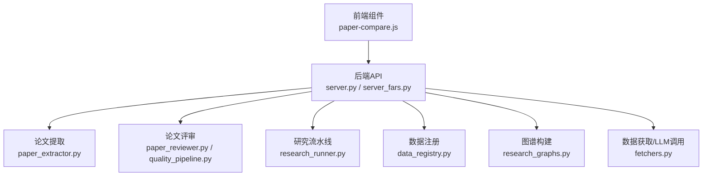
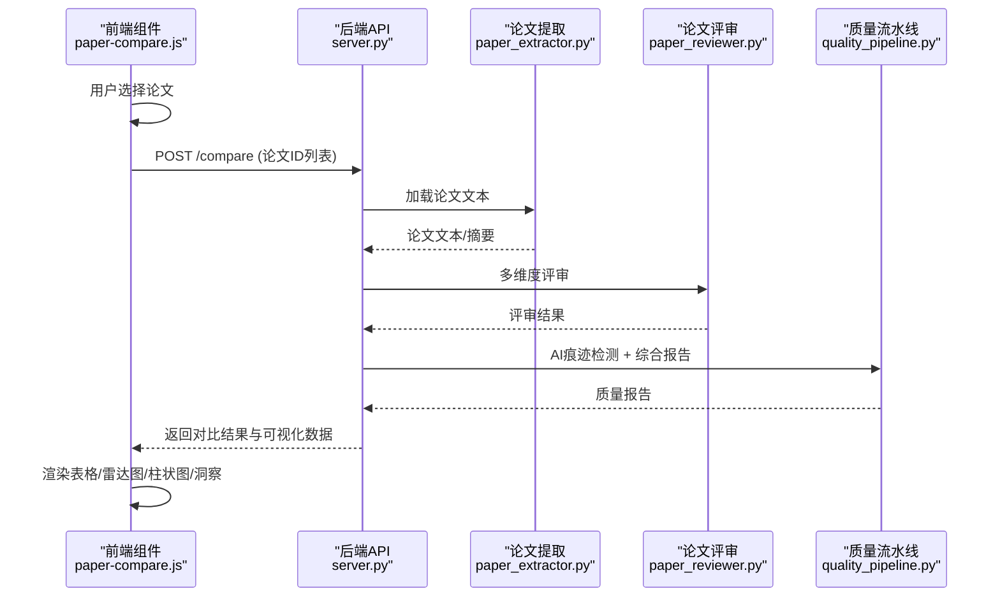
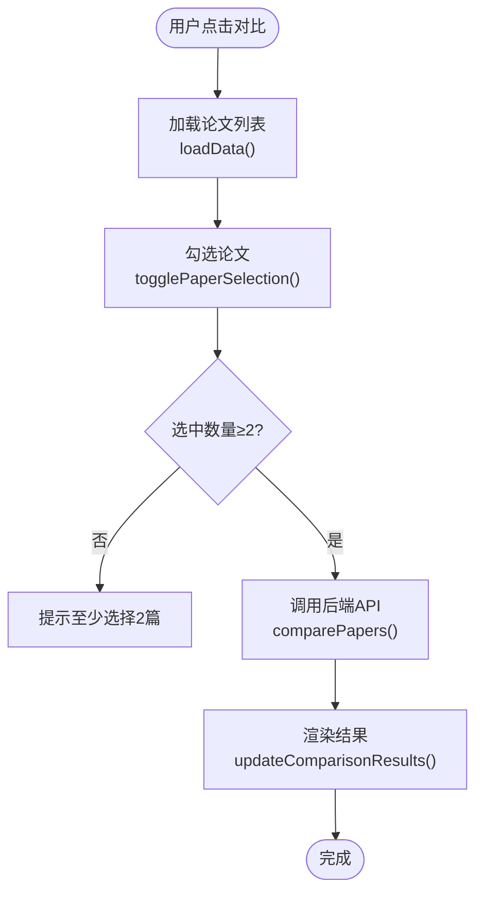
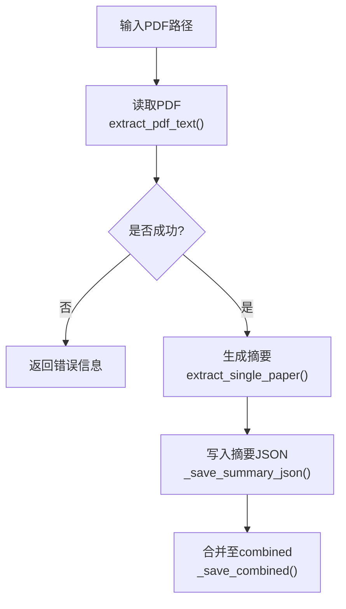
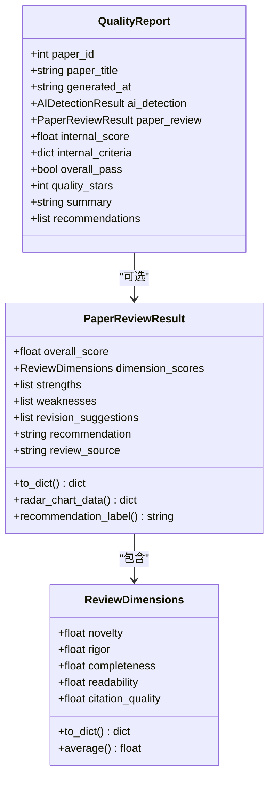
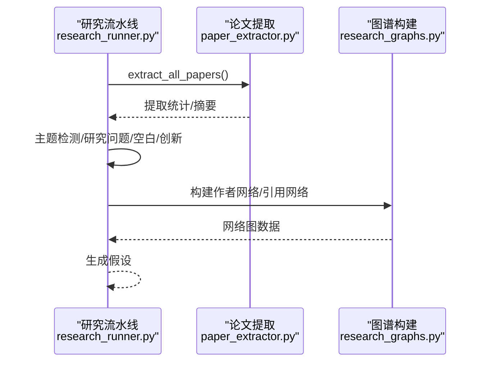
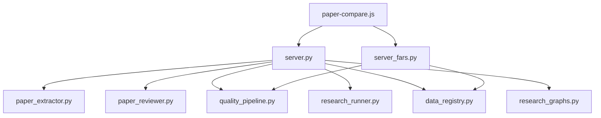

# 多论文比对分析

<cite>
**本文档引用的文件**
- [paper-compare.js](file://docs/v2/components/paper-compare.js)
- [paper_extractor.py](file://src/core/paper_extractor.py)
- [paper_reviewer.py](file://src/services/paper_reviewer.py)
- [quality_pipeline.py](file://src/tools/quality_pipeline.py)
- [research_runner.py](file://src/core/research_runner.py)
- [data_registry.py](file://src/core/data_registry.py)
- [research_graphs.py](file://src/core/research_graphs.py)
- [server.py](file://server.py)
- [server_fars.py](file://server_fars.py)
- [fetchers.py](file://src/tools/fetchers.py)
</cite>

## 目录
1. [简介](#简介)
2. [项目结构](#项目结构)
3. [核心组件](#核心组件)
4. [架构总览](#架构总览)
5. [详细组件分析](#详细组件分析)
6. [依赖关系分析](#依赖关系分析)
7. [性能考量](#性能考量)
8. [故障排除指南](#故障排除指南)
9. [结论](#结论)

## 简介
本文件面向paperwriterAI项目的“多论文比对分析”功能，系统阐述其多篇论文同时分析的实现机制、比较维度、分析算法，并说明论文相似性计算、差异检测、共同特征提取等核心技术。文档还涵盖不同格式论文数据的处理、标准化流程、结果可视化展示，以及与假设生成模块的集成方式。文中提供代码实现示例的文件路径与行号，便于读者定位具体实现。

## 项目结构
paperwriterAI采用前后端分离架构，前端通过Vue组件负责用户交互与可视化，后端通过Flask提供REST API，核心分析逻辑由Python模块实现。多论文比对分析涉及以下关键模块：
- 前端组件：docs/v2/components/paper-compare.js
- 论文提取与预处理：src/core/paper_extractor.py
- 论文评审与质量评估：src/services/paper_reviewer.py、src/tools/quality_pipeline.py
- 研究流水线与假设生成：src/core/research_runner.py
- 数据注册与上下文：src/core/data_registry.py、src/core/research_graphs.py
- 服务器端API：server.py、server_fars.py
- 数据获取与LLM调用：src/tools/fetchers.py

**图表来源**
- [paper-compare.js:1-316](file://docs/v2/components/paper-compare.js#L1-L316)
- [server.py:1-800](file://server.py#L1-L800)
- [server_fars.py:1-800](file://server_fars.py#L1-L800)
- [paper_extractor.py:1-398](file://src/core/paper_extractor.py#L1-L398)
- [paper_reviewer.py:1-473](file://src/services/paper_reviewer.py#L1-L473)
- [quality_pipeline.py:1-807](file://src/tools/quality_pipeline.py#L1-L807)
- [research_runner.py:1-800](file://src/core/research_runner.py#L1-L800)
- [data_registry.py:1-189](file://src/core/data_registry.py#L1-L189)
- [research_graphs.py:1-264](file://src/core/research_graphs.py#L1-L264)
- [fetchers.py:1-899](file://src/tools/fetchers.py#L1-L899)

**章节来源**
- [paper-compare.js:1-316](file://docs/v2/components/paper-compare.js#L1-L316)
- [server.py:1-800](file://server.py#L1-L800)
- [server_fars.py:1-800](file://server_fars.py#L1-L800)

## 核心组件
- 前端多论文比对组件：负责论文选择、触发比对分析、展示对比结果与可视化。
- 论文提取器：从PDF提取文本，生成摘要，支持去重与合并。
- 论文评审服务：提供多维度评审（创新性、严谨性、完整性、可读性、引用质量等）。
- 质量流水线：集成AI痕迹检测（Fast-DetectGPT）、论文评审与综合报告生成。
- 研究流水线：驱动文献综述、假设生成、实验与论文写作的闭环。
- 数据注册与上下文：提供种子论文、工作流分析、MongoDB配置等上下文。
- 图谱构建：作者合作网络与引用关系网络，辅助主题与研究空白分析。
- 数据获取与LLM调用：论文抓取、市场数据获取、多Provider LLM调用。

**章节来源**
- [paper-compare.js:1-316](file://docs/v2/components/paper-compare.js#L1-L316)
- [paper_extractor.py:1-398](file://src/core/paper_extractor.py#L1-L398)
- [paper_reviewer.py:1-473](file://src/services/paper_reviewer.py#L1-L473)
- [quality_pipeline.py:1-807](file://src/tools/quality_pipeline.py#L1-L807)
- [research_runner.py:1-800](file://src/core/research_runner.py#L1-L800)
- [data_registry.py:1-189](file://src/core/data_registry.py#L1-L189)
- [research_graphs.py:1-264](file://src/core/research_graphs.py#L1-L264)
- [fetchers.py:1-899](file://src/tools/fetchers.py#L1-L899)

## 架构总览
多论文比对分析的端到端流程如下：
1. 前端组件加载论文列表，用户选择2-4篇论文。
2. 前端调用后端API触发比对分析。
3. 后端加载论文文本，调用评审与质量评估模块。
4. 生成综合报告与可视化数据。
5. 前端渲染结果表格、雷达图、柱状图与洞察。

**图表来源**
- [paper-compare.js:143-164](file://docs/v2/components/paper-compare.js#L143-L164)
- [server.py:1-800](file://server.py#L1-L800)
- [paper_extractor.py:281-320](file://src/core/paper_extractor.py#L281-L320)
- [paper_reviewer.py:159-302](file://src/services/paper_reviewer.py#L159-L302)
- [quality_pipeline.py:748-807](file://src/tools/quality_pipeline.py#L748-L807)

## 详细组件分析

### 前端多论文比对组件
- 功能职责：加载论文列表、选择论文、触发比对分析、展示结果与可视化。
- 关键流程：
  - 初始化与渲染：render()构建页面结构，绑定事件监听。
  - 加载数据：loadData()通过API获取论文列表并更新状态。
  - 选择与计数：togglePaperSelection()维护选中论文列表，更新计数与按钮状态。
  - 触发分析：runComparison()调用comparePapers()，等待后端返回结果。
  - 结果展示：updateComparisonResults()渲染综合评分、维度表格、雷达图占位、柱状图占位与对比洞察。

**图表来源**
- [paper-compare.js:18-74](file://docs/v2/components/paper-compare.js#L18-L74)
- [paper-compare.js:120-141](file://docs/v2/components/paper-compare.js#L120-L141)
- [paper-compare.js:143-164](file://docs/v2/components/paper-compare.js#L143-L164)
- [paper-compare.js:166-262](file://docs/v2/components/paper-compare.js#L166-L262)

**章节来源**
- [paper-compare.js:1-316](file://docs/v2/components/paper-compare.js#L1-L316)

### 论文提取与标准化
- PDF文本提取：extract_pdf_text()读取PDF前N页，拼接文本并统计字符数。
- 单篇摘要生成：extract_single_paper()封装arXiv ID、页数、字符数、首段预览与文本预览。
- 合并与去重：_save_combined()与_load_combined()维护combined_summaries.json，避免重复。
- 文本获取：get_all_paper_texts()返回所有论文的结构化文本，供评审与分析使用。

**图表来源**
- [paper_extractor.py:53-79](file://src/core/paper_extractor.py#L53-L79)
- [paper_extractor.py:81-96](file://src/core/paper_extractor.py#L81-L96)
- [paper_extractor.py:149-223](file://src/core/paper_extractor.py#L149-L223)
- [paper_extractor.py:301-320](file://src/core/paper_extractor.py#L301-L320)

**章节来源**
- [paper_extractor.py:1-398](file://src/core/paper_extractor.py#L1-L398)

### 论文评审与质量评估
- 多维度评审：paper_reviewer.py提供本地评审与外部API评审，维度包括创新性、严谨性、完整性、可读性、引用质量，并生成雷达图数据。
- 质量流水线：quality_pipeline.py集成AI痕迹检测（Fast-DetectGPT）、论文评审与综合报告生成，支持远程API与本地降级方案。

**图表来源**
- [paper_reviewer.py:34-112](file://src/services/paper_reviewer.py#L34-L112)
- [paper_reviewer.py:159-302](file://src/services/paper_reviewer.py#L159-L302)
- [quality_pipeline.py:26-81](file://src/tools/quality_pipeline.py#L26-L81)

**章节来源**
- [paper_reviewer.py:1-473](file://src/services/paper_reviewer.py#L1-L473)
- [quality_pipeline.py:1-807](file://src/tools/quality_pipeline.py#L1-L807)

### 研究流水线与假设生成
- 文献综述：research_runner.py调用paper_extractor.py提取文本，生成主题、研究问题、研究空白与潜在创新。
- 假设生成：基于文献综述结果与种子论文主题，生成可验证假设。
- 图谱构建：research_graphs.py构建作者合作网络与引用关系网络，辅助主题与空白识别。

**图表来源**
- [research_runner.py:69-162](file://src/core/research_runner.py#L69-L162)
- [research_runner.py:195-236](file://src/core/research_runner.py#L195-L236)
- [research_graphs.py:16-179](file://src/core/research_graphs.py#L16-L179)
- [research_graphs.py:188-263](file://src/core/research_graphs.py#L188-L263)

**章节来源**
- [research_runner.py:1-800](file://src/core/research_runner.py#L1-L800)
- [research_graphs.py:1-264](file://src/core/research_graphs.py#L1-L264)

### 数据注册与上下文
- data_registry.py提供数据目录清单、MongoDB配置、文献上下文与论文生成上下文，支撑前后端数据访问与提示工程。

**章节来源**
- [data_registry.py:1-189](file://src/core/data_registry.py#L1-L189)

### 服务器端API与集成
- server.py提供论文相关API（如评分、迭代重生成、图谱构建等），并与前端组件通过HTTP通信。
- server_fars.py提供论文评分、重生成、相关论文查找与迭代流程API，支持历史记录与分支管理。

**章节来源**
- [server.py:1-800](file://server.py#L1-L800)
- [server_fars.py:1-800](file://server_fars.py#L1-L800)

## 依赖关系分析
多论文比对分析的关键依赖关系如下：
- 前端组件依赖后端API返回的结构化结果。
- 后端API依赖论文提取器、评审服务与质量流水线。
- 研究流水线依赖论文提取器与图谱构建模块。
- 数据注册模块为前后端提供统一的数据与上下文。

**图表来源**
- [paper-compare.js:1-316](file://docs/v2/components/paper-compare.js#L1-L316)
- [server.py:1-800](file://server.py#L1-L800)
- [server_fars.py:1-800](file://server_fars.py#L1-L800)
- [paper_extractor.py:1-398](file://src/core/paper_extractor.py#L1-L398)
- [paper_reviewer.py:1-473](file://src/services/paper_reviewer.py#L1-L473)
- [quality_pipeline.py:1-807](file://src/tools/quality_pipeline.py#L1-L807)
- [research_runner.py:1-800](file://src/core/research_runner.py#L1-L800)
- [data_registry.py:1-189](file://src/core/data_registry.py#L1-L189)
- [research_graphs.py:1-264](file://src/core/research_graphs.py#L1-L264)

**章节来源**
- [paper-compare.js:1-316](file://docs/v2/components/paper-compare.js#L1-L316)
- [server.py:1-800](file://server.py#L1-L800)
- [server_fars.py:1-800](file://server_fars.py#L1-L800)

## 性能考量
- I/O与并发
  - 论文提取：每次提取后延时以防止IO过载，建议在批量处理时增加队列与限速。
  - PDF读取：限制最大页数（MAX_PAGES），避免大文件导致内存与CPU压力。
- 内存管理
  - 文本截断：get_all_paper_texts()与get_paper_text()提供字符数上限，避免内存溢出。
  - 合并摘要：_save_combined()一次性写入，减少频繁IO。
- 并行处理
  - 建议使用线程池或进程池对独立论文的评审与检测进行并行化，注意LLM调用的速率限制与配额。
- LLM调用优化
  - fetchers.py的LLMCaller支持多Provider自动切换与统计记录，便于监控与优化。
  - quality_pipeline.py的PaperReviewer支持降级方案，保障在API不可用时的可用性。
- 可视化与前端渲染
  - 前端组件按需渲染图表占位，完成后端异步填充，避免阻塞主线程。

**章节来源**
- [paper_extractor.py:19-206](file://src/core/paper_extractor.py#L19-L206)
- [paper_extractor.py:281-320](file://src/core/paper_extractor.py#L281-L320)
- [paper_reviewer.py:159-302](file://src/services/paper_reviewer.py#L159-L302)
- [quality_pipeline.py:748-807](file://src/tools/quality_pipeline.py#L748-L807)
- [fetchers.py:290-899](file://src/tools/fetchers.py#L290-L899)

## 故障排除指南
- 前端交互
  - 若“对比分析失败”，前端会弹出toast提示，检查后端API返回与网络连接。
  - 若论文列表为空，确认后端已正确加载种子论文清单。
- 后端API
  - server.py与server_fars.py提供历史记录与LLM调用记录查询，可用于定位问题。
  - 若LLM调用失败，检查API Key与Provider配置，必要时启用降级方案。
- 论文提取
  - PDF读取异常时，检查文件路径与权限；确认pdfplumber安装与版本兼容。
- 评审与检测
  - 若评审结果为空，检查Anthropic API Key或DeepSeek API Key配置。
  - Fast-DetectGPT本地模型未安装时，将自动降级为统计检测方案。

**章节来源**
- [paper-compare.js:149-164](file://docs/v2/components/paper-compare.js#L149-L164)
- [server.py:1-800](file://server.py#L1-L800)
- [server_fars.py:1-800](file://server_fars.py#L1-L800)
- [paper_extractor.py:53-79](file://src/core/paper_extractor.py#L53-L79)
- [paper_reviewer.py:167-180](file://src/services/paper_reviewer.py#L167-L180)
- [quality_pipeline.py:166-167](file://src/tools/quality_pipeline.py#L166-L167)

## 结论
paperwriterAI的多论文比对分析通过前后端协作，实现了从论文加载、特征提取、评审与质量评估到结果可视化的完整流程。系统具备良好的扩展性与容错能力，能够处理不同格式的论文数据并提供多维度的对比洞察。结合研究流水线与图谱构建，项目形成了从文献综述到假设生成再到论文写作的闭环，为高质量论文产出提供了有力支撑。