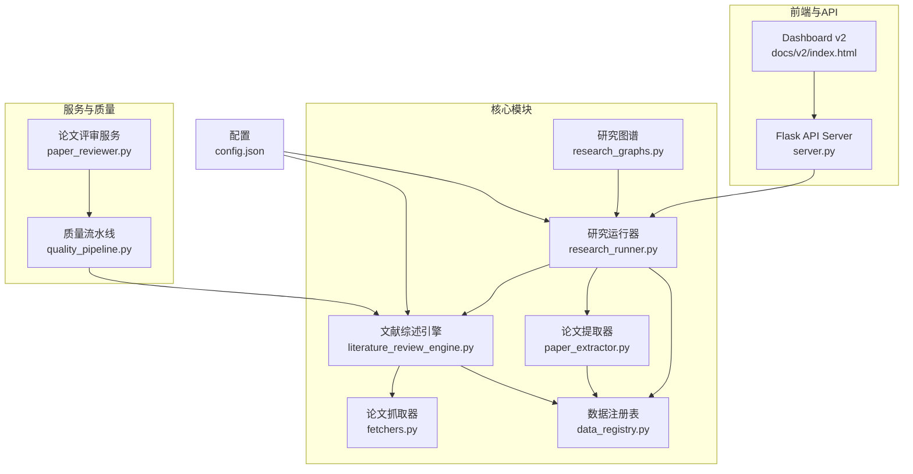
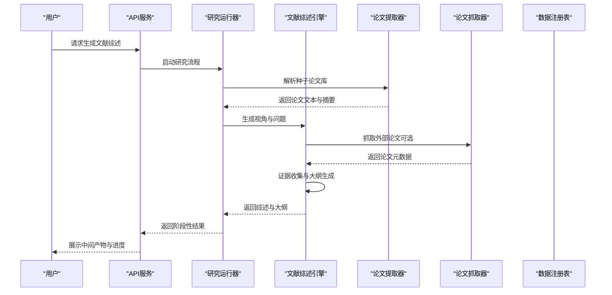
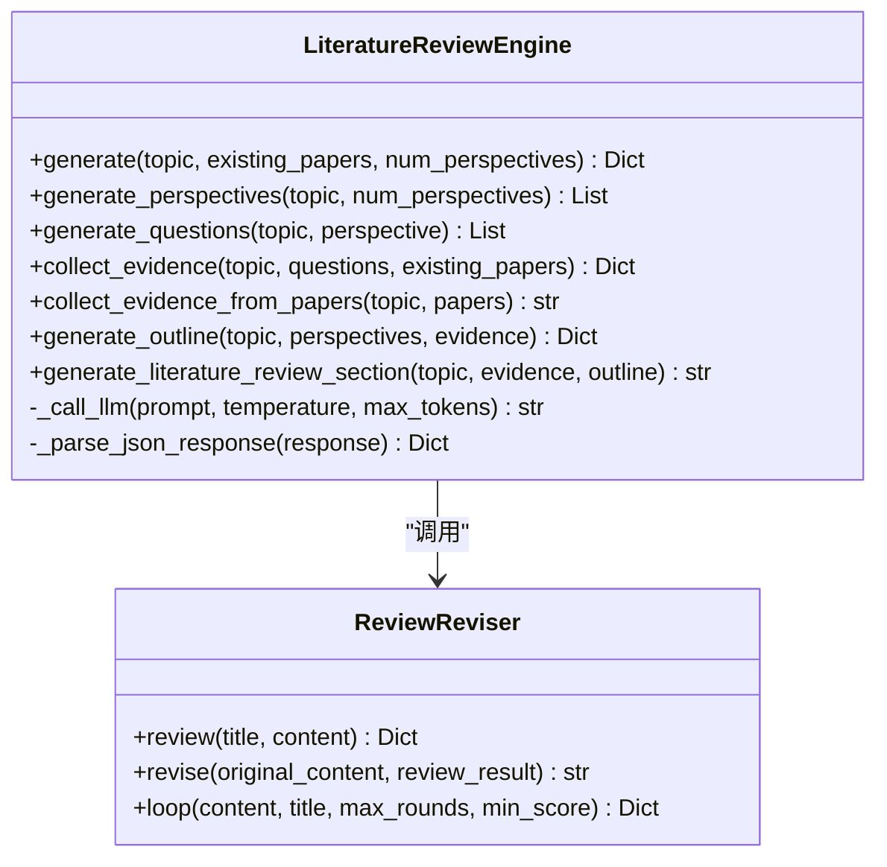
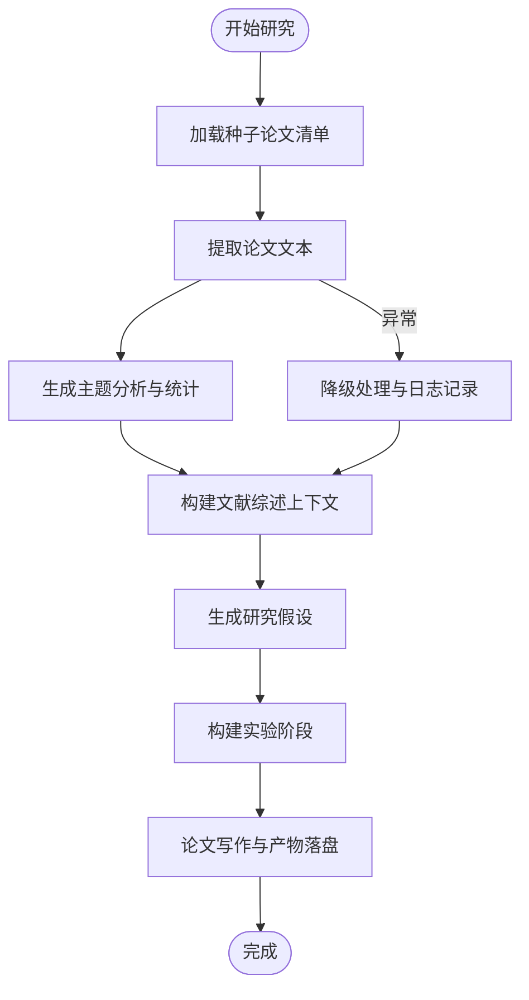
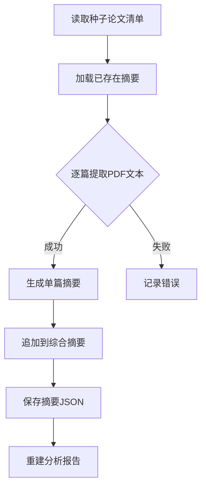
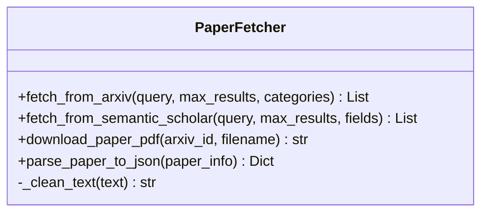
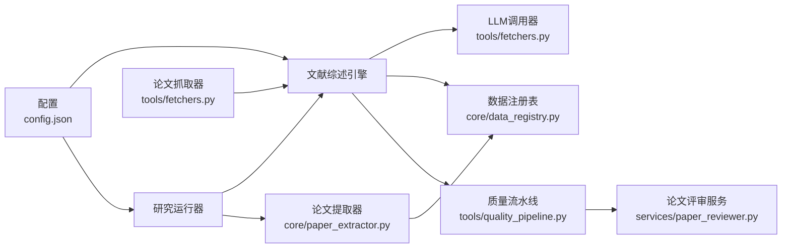

# 文献综述引擎

<cite>
**本文档引用的文件**
- [literature_review_engine.py](file://src/tools/literature_review_engine.py)
- [research_runner.py](file://src/core/research_runner.py)
- [paper_extractor.py](file://src/core/paper_extractor.py)
- [fetchers.py](file://src/tools/fetchers.py)
- [data_registry.py](file://src/core/data_registry.py)
- [research_graphs.py](file://src/core/research_graphs.py)
- [paper_reviewer.py](file://src/services/paper_reviewer.py)
- [quality_pipeline.py](file://src/tools/quality_pipeline.py)
- [README.md](file://README.md)
- [config.json](file://config.json)
- [FARS_LITERATURE_REVIEW_PLAN.md](file://docs/FARS_LITERATURE_REVIEW_PLAN.md)
</cite>

## 目录
1. [简介](#简介)
2. [项目结构](#项目结构)
3. [核心组件](#核心组件)
4. [架构总览](#架构总览)
5. [详细组件分析](#详细组件分析)
6. [依赖关系分析](#依赖关系分析)
7. [性能考虑](#性能考虑)
8. [故障排除指南](#故障排除指南)
9. [结论](#结论)
10. [附录](#附录)

## 简介
本文件面向paperwriterAI项目的文献综述引擎，系统性阐述STORM风格文献综述的实现原理、技术架构与工作流程。引擎融合多视角生成、深度问题提问、证据收集、大纲生成与写作阶段，并集成IDEA生成模块与论文质量流水线，实现从种子论文到完整学术论文的自动化生成与迭代优化。

## 项目结构
项目采用模块化分层架构，核心模块包括：
- 文献综述引擎：src/tools/literature_review_engine.py
- 研究运行器：src/core/research_runner.py
- 论文提取与分析：src/core/paper_extractor.py
- 论文抓取与数据源：src/tools/fetchers.py
- 数据注册表与上下文：src/core/data_registry.py
- 图谱构建：src/core/research_graphs.py
- 论文评审服务：src/services/paper_reviewer.py
- 质量流水线：src/tools/quality_pipeline.py
- 配置与文档：config.json、docs/FARS_LITERATURE_REVIEW_PLAN.md、README.md

**图表来源**
- [research_runner.py:278-800](file://src/core/research_runner.py#L278-L800)
- [literature_review_engine.py:18-631](file://src/tools/literature_review_engine.py#L18-L631)
- [paper_extractor.py:1-398](file://src/core/paper_extractor.py#L1-L398)
- [fetchers.py:20-163](file://src/tools/fetchers.py#L20-L163)
- [data_registry.py:48-189](file://src/core/data_registry.py#L48-L189)
- [research_graphs.py:16-264](file://src/core/research_graphs.py#L16-L264)
- [paper_reviewer.py:1-473](file://src/services/paper_reviewer.py#L1-L473)
- [quality_pipeline.py:1-807](file://src/tools/quality_pipeline.py#L1-L807)
- [config.json:1-65](file://config.json#L1-L65)

**章节来源**
- [README.md:420-500](file://README.md#L420-L500)
- [config.json:1-65](file://config.json#L1-L65)

## 核心组件
- 文献综述引擎（STORM风格）：实现多视角生成、问题提问、证据收集、大纲生成与写作阶段，支持Review-Revision循环。
- 研究运行器：协调种子论文分析、假设生成、实验阶段与写作阶段，提供断点续传与状态管理。
- 论文提取器：从PDF提取文本、摘要与分析报告，支持去重与容错。
- 论文抓取器：多源论文抓取（arXiv、Semantic Scholar），支持PDF下载与结构化解析。
- 数据注册表：统一数据路径、MongoDB配置与上下文拼接，供生成流程使用。
- 研究图谱：构建作者网络与引用关系网络，辅助主题聚类与空白识别。
- 论文评审服务：多维度论文评审，支持Claude API与本地评分。
- 质量流水线：集成AI痕迹检测（Fast-DetectGPT）、论文评审与综合报告生成。

**章节来源**
- [literature_review_engine.py:18-631](file://src/tools/literature_review_engine.py#L18-L631)
- [research_runner.py:278-800](file://src/core/research_runner.py#L278-L800)
- [paper_extractor.py:1-398](file://src/core/paper_extractor.py#L1-L398)
- [fetchers.py:20-163](file://src/tools/fetchers.py#L20-L163)
- [data_registry.py:48-189](file://src/core/data_registry.py#L48-L189)
- [research_graphs.py:16-264](file://src/core/research_graphs.py#L16-L264)
- [paper_reviewer.py:1-473](file://src/services/paper_reviewer.py#L1-L473)
- [quality_pipeline.py:1-807](file://src/tools/quality_pipeline.py#L1-L807)

## 架构总览
文献综述引擎采用“调研阶段（Pre-writing）+写作阶段（Writing）”的双阶段设计，结合IDEA生成模块与质量流水线，形成闭环的自动化研究与论文生成体系。

**图表来源**
- [research_runner.py:642-800](file://src/core/research_runner.py#L642-L800)
- [literature_review_engine.py:557-631](file://src/tools/literature_review_engine.py#L557-L631)
- [paper_extractor.py:149-223](file://src/core/paper_extractor.py#L149-L223)
- [fetchers.py:27-121](file://src/tools/fetchers.py#L27-L121)
- [data_registry.py:100-166](file://src/core/data_registry.py#L100-L166)

## 详细组件分析

### 文献综述引擎（STORM风格）
- 多视角生成：从方法论、应用场景、评估方法、比较视角与局限性视角生成研究问题。
- 深度问题提问：为每个视角生成5-8个深度研究问题，涵盖背景、比较、因果与评估类型。
- 证据收集：对问题进行回答并提供证据，支持从已有论文中综合生成综述性回答。
- 大纲生成：基于视角与证据生成论文大纲，包含摘要、引言、文献综述、方法论、实验、结果、讨论与结论。
- 写作阶段：生成文献综述章节（LaTeX格式），支持引用标注与结构化组织。
- Review-Revision循环：评审论文质量并根据建议修订，最多4轮循环直至达标。

**图表来源**
- [literature_review_engine.py:18-631](file://src/tools/literature_review_engine.py#L18-L631)
- [literature_review_engine.py:636-800](file://src/tools/literature_review_engine.py#L636-L800)

**章节来源**
- [literature_review_engine.py:128-631](file://src/tools/literature_review_engine.py#L128-L631)
- [FARS_LITERATURE_REVIEW_PLAN.md:156-380](file://docs/FARS_LITERATURE_REVIEW_PLAN.md#L156-L380)

### 研究运行器
- 种子论文分析：提取论文文本、生成主题分析、统计阅读与分析耗时。
- 假设生成：基于文献空白与潜在创新点生成研究假设。
- 实验阶段：构建实验流程（文献综述与假设→引用/作者图谱→写作与产物落盘）。
- 断点续传：提供状态机与检查点，支持从断点恢复与增量处理。

**图表来源**
- [research_runner.py:69-162](file://src/core/research_runner.py#L69-L162)
- [research_runner.py:195-236](file://src/core/research_runner.py#L195-L236)
- [research_runner.py:239-275](file://src/core/research_runner.py#L239-L275)

**章节来源**
- [research_runner.py:69-162](file://src/core/research_runner.py#L69-L162)
- [research_runner.py:195-275](file://src/core/research_runner.py#L195-L275)

### 论文提取器
- PDF文本提取：限制最大页数，平衡信息量与速度。
- 摘要生成：保存单篇摘要JSON，支持去重与容错。
- 综合摘要：合并所有摘要，修复旧记录缺失arxiv_id问题。
- 分析报告：重建seed_paper_analysis.md，包含论文概览与主题分类汇总。

**图表来源**
- [paper_extractor.py:149-223](file://src/core/paper_extractor.py#L149-L223)
- [paper_extractor.py:323-398](file://src/core/paper_extractor.py#L323-L398)

**章节来源**
- [paper_extractor.py:53-96](file://src/core/paper_extractor.py#L53-L96)
- [paper_extractor.py:149-223](file://src/core/paper_extractor.py#L149-L223)
- [paper_extractor.py:323-398](file://src/core/paper_extractor.py#L323-L398)

### 论文抓取器
- 多源抓取：支持arXiv与Semantic Scholar，返回结构化论文信息。
- PDF下载：根据arxiv_id下载PDF至本地目录。
- 文本清洗：清理摘要与标题中的特殊字符，统一格式。

**图表来源**
- [fetchers.py:20-163](file://src/tools/fetchers.py#L20-L163)

**章节来源**
- [fetchers.py:27-121](file://src/tools/fetchers.py#L27-L121)
- [fetchers.py:140-162](file://src/tools/fetchers.py#L140-L162)

### 数据注册表与上下文
- 统一路径：提供data、research、seed_papers等目录路径。
- MongoDB配置：读取URI、数据库与集合名称。
- 文献上下文拼接：汇总种子论文摘要、主题、研究问题、空白与创新点，供论文生成prompt使用。

**章节来源**
- [data_registry.py:48-189](file://src/core/data_registry.py#L48-L189)

### 研究图谱
- 作者网络：从种子论文作者列表与PDF首页提取机构信息，构建作者-机构-论文-合作网络。
- 引用网络：基于标题与关键贡献的词元重叠，构建参考文献耦合与AI论文引用关系图。

**章节来源**
- [research_graphs.py:16-179](file://src/core/research_graphs.py#L16-L179)
- [research_graphs.py:188-263](file://src/core/research_graphs.py#L188-L263)

### 论文评审服务
- 多维评审：支持Claude API与本地评分，维度包括创新性、严谨性、完整性、可读性与引用质量。
- 分章节评审：按章节长度分段评审，输出雷达图数据与综合摘要。
- 降级方案：无API Key时基于内容特征进行默认评分。

**章节来源**
- [paper_reviewer.py:1-473](file://src/services/paper_reviewer.py#L1-L473)

### 质量流水线
- AI痕迹检测：Fast-DetectGPT本地模型（gpt-neo-2.7B等），支持远程API与统计降级。
- 论文评审：Claude API或本地模拟，输出结构化评审报告与修改建议。
- 综合报告：生成7维度雷达图数据与PDF导出。

**章节来源**
- [quality_pipeline.py:87-435](file://src/tools/quality_pipeline.py#L87-L435)
- [quality_pipeline.py:441-603](file://src/tools/quality_pipeline.py#L441-L603)
- [quality_pipeline.py:609-742](file://src/tools/quality_pipeline.py#L609-L742)

## 依赖关系分析
- 文献综述引擎依赖数据注册表与LLM调用器，通过配置文件选择provider与模型。
- 研究运行器协调论文提取器与文献综述引擎，提供断点与状态管理。
- 论文抓取器为引擎提供外部论文数据，支持结构化解析与下载。
- 质量流水线与论文评审服务为生成的论文提供质量保障与可视化报告。

**图表来源**
- [literature_review_engine.py:33-63](file://src/tools/literature_review_engine.py#L33-L63)
- [fetchers.py:290-450](file://src/tools/fetchers.py#L290-L450)
- [data_registry.py:48-97](file://src/core/data_registry.py#L48-L97)
- [research_runner.py:278-427](file://src/core/research_runner.py#L278-L427)
- [paper_extractor.py:149-223](file://src/core/paper_extractor.py#L149-L223)
- [quality_pipeline.py:748-807](file://src/tools/quality_pipeline.py#L748-L807)
- [paper_reviewer.py:159-180](file://src/services/paper_reviewer.py#L159-L180)
- [config.json:1-65](file://config.json#L1-L65)

**章节来源**
- [literature_review_engine.py:33-63](file://src/tools/literature_review_engine.py#L33-L63)
- [fetchers.py:290-450](file://src/tools/fetchers.py#L290-L450)
- [data_registry.py:48-97](file://src/core/data_registry.py#L48-L97)
- [research_runner.py:278-427](file://src/core/research_runner.py#L278-L427)
- [paper_extractor.py:149-223](file://src/core/paper_extractor.py#L149-L223)
- [quality_pipeline.py:748-807](file://src/tools/quality_pipeline.py#L748-L807)
- [paper_reviewer.py:159-180](file://src/services/paper_reviewer.py#L159-L180)
- [config.json:1-65](file://config.json#L1-L65)

## 性能考虑
- 并发与限流：文献综述引擎在证据收集阶段可并发处理问题，避免阻塞；论文提取器对IO进行限速，防止过载。
- 模型选择与降级：引擎支持多Provider自动切换与降级响应，确保在API不可用时仍能生成基础结果。
- 数据去重与缓存：论文提取器对摘要进行去重与合并，减少重复处理；质量流水线对模型缓存进行检查，避免重复下载。
- 断点与增量：研究运行器提供断点续传与增量处理，避免重复计算，提升大规模论文数据处理效率。

**章节来源**
- [literature_review_engine.py:274-318](file://src/tools/literature_review_engine.py#L274-L318)
- [paper_extractor.py:149-223](file://src/core/paper_extractor.py#L149-L223)
- [quality_pipeline.py:118-144](file://src/tools/quality_pipeline.py#L118-L144)

## 故障排除指南
- API不可用：引擎在调用LLM失败时返回降级响应，确保流程继续进行；检查配置文件中的API Key与Base URL。
- PDF提取失败：确认PDF路径存在且可读；检查页面数量限制与编码问题。
- 评审服务异常：Claude API Key缺失时自动降级为本地评分；检查网络连接与API配额。
- 质量流水线失败：Fast-DetectGPT模型未安装时使用统计降级；确保模型缓存存在或启用远程API。

**章节来源**
- [literature_review_engine.py:78-94](file://src/tools/literature_review_engine.py#L78-L94)
- [paper_extractor.py:53-78](file://src/core/paper_extractor.py#L53-L78)
- [paper_reviewer.py:167-180](file://src/services/paper_reviewer.py#L167-L180)
- [quality_pipeline.py:166-164](file://src/tools/quality_pipeline.py#L166-L164)

## 结论
paperwriterAI的文献综述引擎通过STORM风格的多视角调研与GPT Researcher的Review-Revision循环，实现了从种子论文到完整学术论文的自动化生成与迭代优化。配合研究运行器的状态管理、论文提取器的数据处理、论文抓取器的多源数据接入以及质量流水线的综合保障，形成了高效、可靠、可扩展的文献综述与论文生成体系。

## 附录
- API参考：详见README.md中的API参考章节，涵盖研究流程、断点与恢复、论文分析、作者网络、文献综述与质量流水线等端点。
- 配置说明：config.json定义了LLM Provider、数据源与回测评估参数，影响引擎与运行器的行为。

**章节来源**
- [README.md:592-700](file://README.md#L592-L700)
- [config.json:1-65](file://config.json#L1-L65)