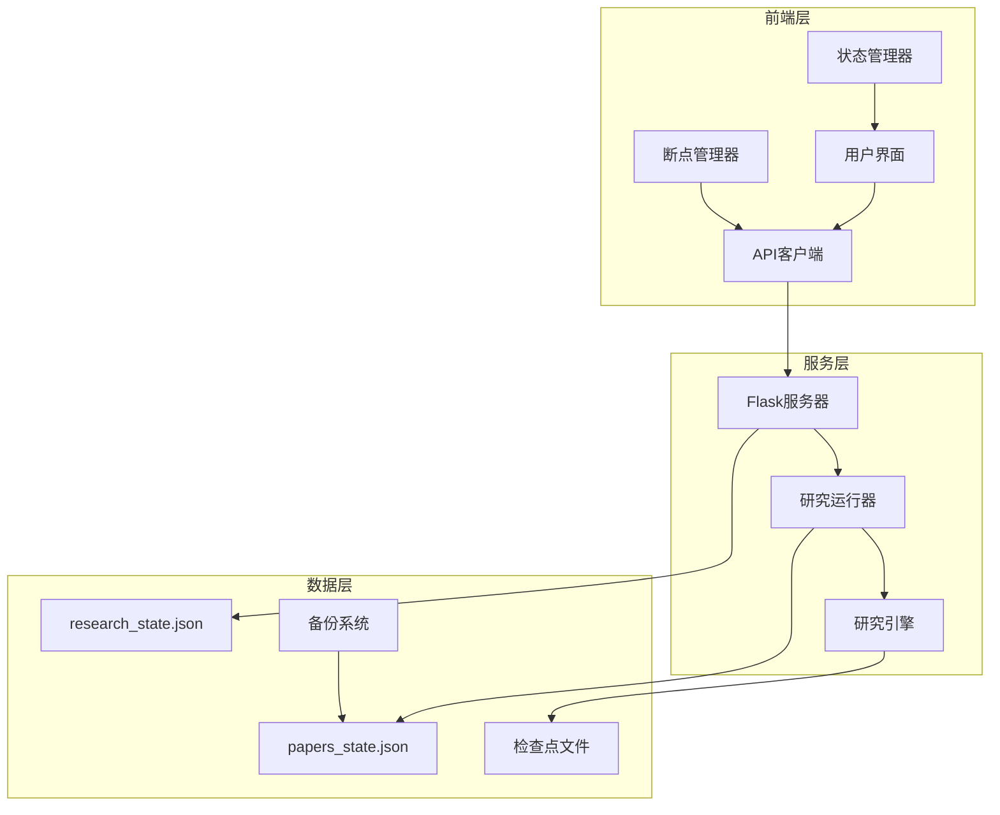
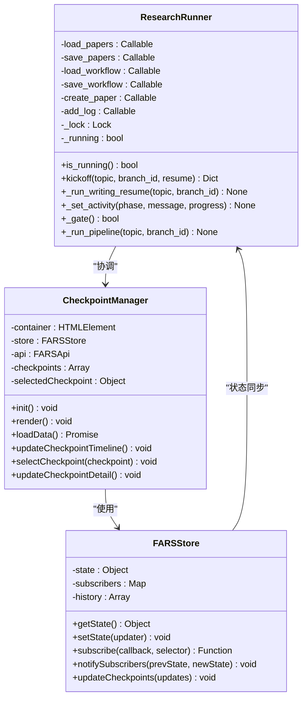
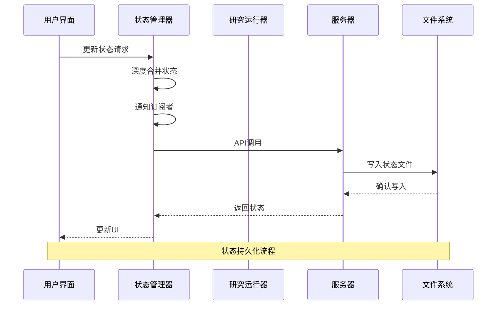
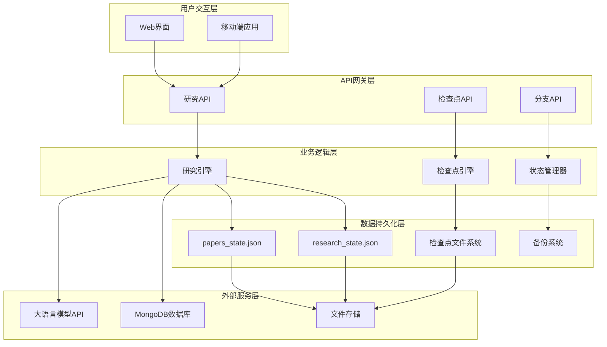
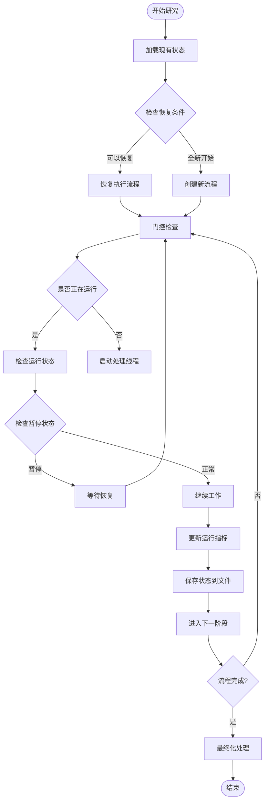
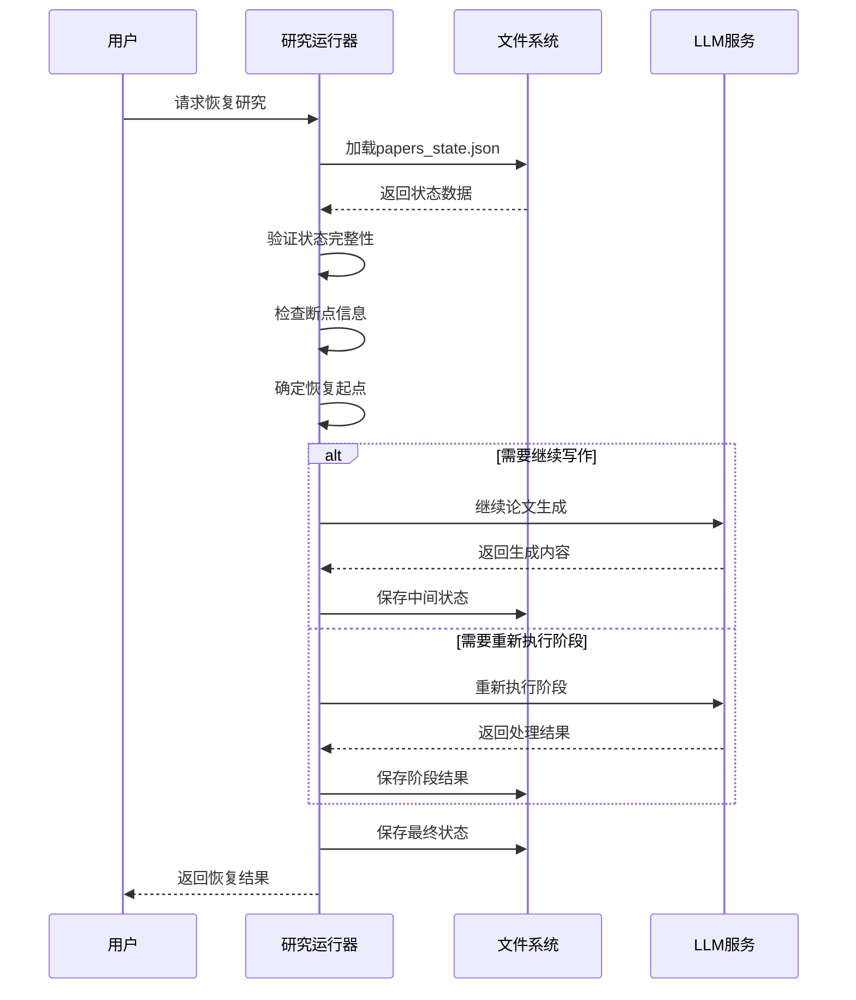
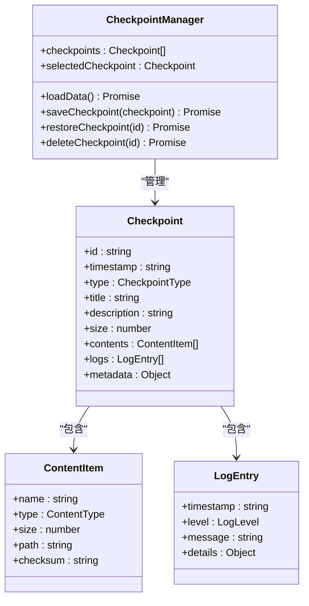
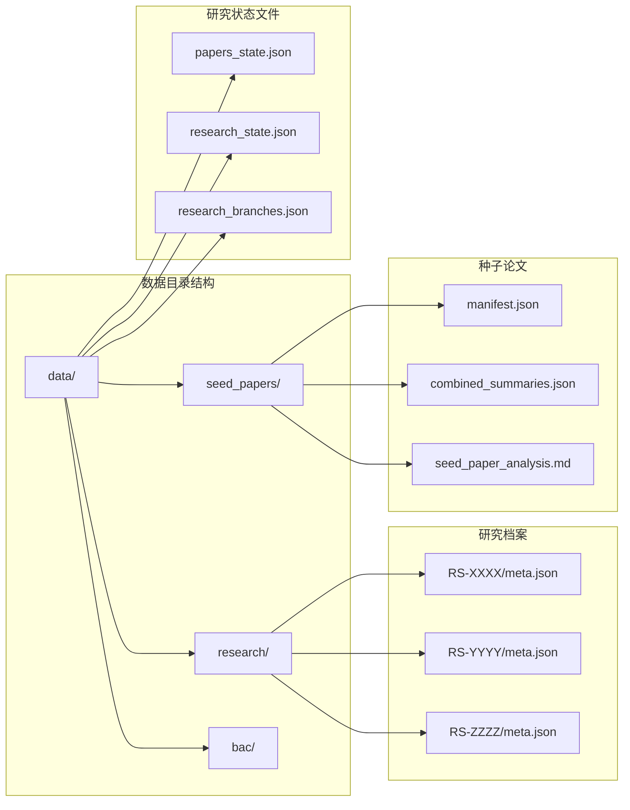
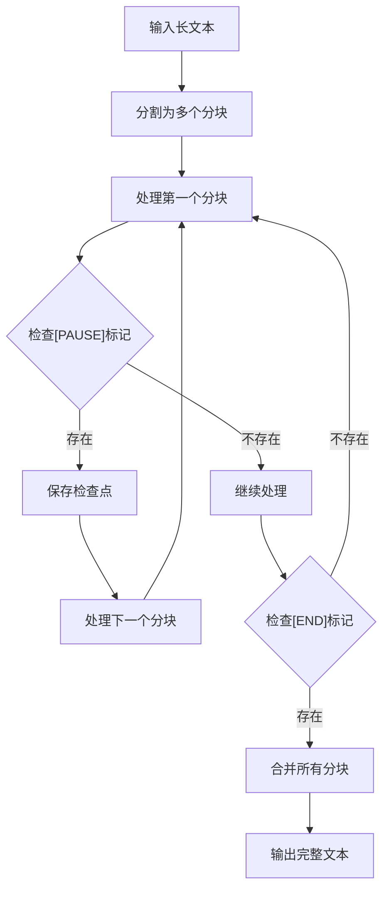
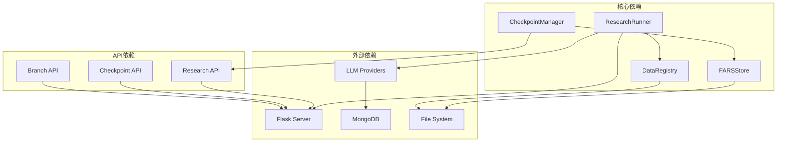

# 断点续分析机制

<cite>
**本文档引用的文件**
- [research_runner.py](file://src/core/research_runner.py)
- [research_reset.py](file://src/core/research_reset.py)
- [data_registry.py](file://src/core/data_registry.py)
- [checkpoint-manager.js](file://docs/v2/components/checkpoint-manager.js)
- [store.js](file://docs/v2/state/store.js)
- [client.js](file://docs/v2/api/client.js)
- [chunked_generation.py](file://scripts/chunked_generation.py)
- [server.py](file://server.py)
- [workflow.py](file://src/workflow.py)
</cite>

## 目录
1. [简介](#简介)
2. [项目结构](#项目结构)
3. [核心组件](#核心组件)
4. [架构概览](#架构概览)
5. [详细组件分析](#详细组件分析)
6. [依赖关系分析](#依赖关系分析)
7. [性能考虑](#性能考虑)
8. [故障排除指南](#故障排除指南)
9. [结论](#结论)

## 简介

paperwriterAI项目的断点续分析机制是一个多层次、分布式的系统，旨在确保长时间运行的研究任务能够在面对网络中断、系统崩溃等异常情况时能够可靠地恢复执行。该机制通过状态持久化、检查点管理和智能恢复算法，实现了从种子文献分析到论文生成的完整研究流程的连续性和可靠性。

该系统的核心设计理念是"状态即契约"——任何中间状态都必须被持久化，任何中断都必须能够被检测和恢复。通过将研究流程分解为可检查点化的阶段，系统能够在任意节点发生故障时，只重新执行必要的后续步骤，而不是完全重新开始整个流程。

## 项目结构

paperwriterAI项目采用模块化设计，断点续分析机制分布在多个层次：

**图表来源**
- [server.py:75-80](file://server.py#L75-L80)
- [research_runner.py:278-295](file://src/core/research_runner.py#L278-L295)
- [data_registry.py:11-22](file://src/core/data_registry.py#L11-L22)

项目结构特点：
- **分层架构**：前端、服务端、数据层清晰分离
- **模块化设计**：每个组件职责明确，便于独立维护
- **持久化优先**：所有状态变更都持久化到文件系统
- **异步处理**：使用线程池处理长时间运行的任务

**章节来源**
- [server.py:75-80](file://server.py#L75-L80)
- [research_runner.py:278-295](file://src/core/research_runner.py#L278-L295)
- [data_registry.py:11-22](file://src/core/data_registry.py#L11-L22)

## 核心组件

### 研究运行器 (ResearchRunner)

研究运行器是断点续分析机制的核心组件，负责协调整个研究流程的状态管理和恢复逻辑。

**图表来源**
- [research_runner.py:278-581](file://src/core/research_runner.py#L278-L581)
- [checkpoint-manager.js:6-297](file://docs/v2/components/checkpoint-manager.js#L6-L297)
- [store.js:6-368](file://docs/v2/state/store.js#L6-L368)

### 状态管理系统

状态管理系统提供了集中化的状态存储和订阅机制，确保所有组件都能及时获取最新的状态信息。

**图表来源**
- [store.js:86-132](file://docs/v2/state/store.js#L86-L132)
- [research_runner.py:567-581](file://src/core/research_runner.py#L567-L581)

### 检查点管理器

检查点管理器负责管理研究过程中的各个检查点，提供可视化界面和恢复功能。

**章节来源**
- [research_runner.py:278-581](file://src/core/research_runner.py#L278-L581)
- [checkpoint-manager.js:6-297](file://docs/v2/components/checkpoint-manager.js#L6-L297)
- [store.js:6-368](file://docs/v2/state/store.js#L6-L368)

## 架构概览

paperwriterAI的断点续分析机制采用了多层次的架构设计，确保了系统的可靠性和可维护性：

**图表来源**
- [server.py:75-80](file://server.py#L75-L80)
- [client.js:6-53](file://docs/v2/api/client.js#L6-L53)
- [data_registry.py:48-97](file://src/core/data_registry.py#L48-L97)

该架构的关键特性包括：

1. **分层解耦**：每层都有明确的职责边界
2. **状态持久化**：所有关键状态都持久化存储
3. **异步处理**：长时间运行的任务通过异步方式处理
4. **监控告警**：内置的监控和日志系统
5. **备份恢复**：完整的备份和恢复机制

## 详细组件分析

### 研究运行器详细分析

研究运行器是断点续分析机制的核心，它实现了完整的状态管理、检查点保存和恢复逻辑。

#### 状态管理机制

研究运行器通过以下机制确保状态的完整性和一致性：

**图表来源**
- [research_runner.py:301-427](file://src/core/research_runner.py#L301-L427)
- [research_runner.py:642-800](file://src/core/research_runner.py#L642-L800)

#### 恢复算法实现

研究运行器实现了智能的恢复算法，能够处理各种异常情况：

**图表来源**
- [research_runner.py:429-566](file://src/core/research_runner.py#L429-L566)
- [research_runner.py:430-565](file://src/core/research_runner.py#L430-L565)

#### 并发安全机制

为了确保多线程环境下的数据一致性，研究运行器采用了多种并发安全机制：

**章节来源**
- [research_runner.py:278-581](file://src/core/research_runner.py#L278-L581)

### 检查点管理系统

检查点管理系统提供了完整的检查点生命周期管理，包括创建、存储、检索和恢复功能。

#### 检查点数据结构

检查点系统采用标准化的数据结构来存储状态信息：

**图表来源**
- [checkpoint-manager.js:202-233](file://docs/v2/components/checkpoint-manager.js#L202-L233)
- [checkpoint-manager.js:235-244](file://docs/v2/components/checkpoint-manager.js#L235-L244)

#### 检查点存储策略

检查点系统采用了多层存储策略来确保数据的安全性和可访问性：

**章节来源**
- [checkpoint-manager.js:6-297](file://docs/v2/components/checkpoint-manager.js#L6-L297)

### 状态持久化机制

状态持久化是断点续分析机制的基础，确保了系统状态的可靠存储和快速恢复。

#### 文件系统架构

系统采用文件系统作为主要的持久化存储，通过精心设计的文件结构来组织状态数据：

**图表来源**
- [data_registry.py:11-22](file://src/core/data_registry.py#L11-L22)

#### 状态同步机制

为了确保前后端状态的一致性，系统实现了双向状态同步机制：

**章节来源**
- [data_registry.py:48-97](file://src/core/data_registry.py#L48-L97)

### LLM分块生成机制

对于长文本生成任务，系统实现了专门的分块生成和检查点机制，确保大模型输出的可靠性和可恢复性。

#### 分块生成算法

分块生成机制通过将长文本分解为可管理的块来处理大模型输出截断问题：

**图表来源**
- [chunked_generation.py:230-362](file://scripts/chunked_generation.py#L230-L362)

#### 检查点管理策略

分块生成系统实现了精细的检查点管理策略：

**章节来源**
- [chunked_generation.py:27-63](file://scripts/chunked_generation.py#L27-L63)
- [chunked_generation.py:180-204](file://scripts/chunked_generation.py#L180-L204)

## 依赖关系分析

断点续分析机制涉及多个组件之间的复杂依赖关系，这些关系通过精心设计的接口和协议来管理。

**图表来源**
- [server.py:59-64](file://server.py#L59-L64)
- [client.js:6-53](file://docs/v2/api/client.js#L6-L53)
- [data_registry.py:48-97](file://src/core/data_registry.py#L48-L97)

### 组件耦合度分析

系统采用了松耦合的设计原则，通过接口抽象和依赖注入来降低组件间的耦合度：

**章节来源**
- [server.py:59-64](file://server.py#L59-L64)
- [client.js:6-53](file://docs/v2/api/client.js#L6-L53)
- [data_registry.py:48-97](file://src/core/data_registry.py#L48-L97)

## 性能考虑

断点续分析机制在设计时充分考虑了性能优化，通过多种策略来提高系统的响应速度和资源利用率。

### 内存管理策略

系统采用了多种内存管理策略来优化内存使用：

1. **增量状态更新**：只更新发生变化的部分状态
2. **延迟加载**：大型数据结构按需加载
3. **缓存机制**：频繁访问的数据缓存到内存
4. **垃圾回收**：及时释放不再使用的对象

### 并发性能优化

为了提高并发处理能力，系统实现了以下优化措施：

1. **线程池管理**：合理配置线程池大小
2. **锁粒度优化**：最小化锁的持有时间
3. **异步I/O**：非阻塞的文件操作
4. **批量处理**：合并小的操作请求

### 存储性能优化

存储系统采用了多种优化策略来提高I/O性能：

1. **文件系统优化**：合理的文件组织结构
2. **索引机制**：关键数据建立索引
3. **压缩存储**：对静态数据进行压缩
4. **缓存策略**：热点数据缓存到内存

## 故障排除指南

断点续分析机制包含了完善的故障检测和恢复能力，以下是常见问题的诊断和解决方法：

### 状态不一致问题

当系统出现状态不一致时，可以按照以下步骤进行排查：

1. **检查状态文件完整性**
   - 验证JSON格式正确性
   - 检查必需字段是否存在
   - 确认数据类型正确

2. **分析日志信息**
   - 查看最近的错误日志
   - 检查异常堆栈信息
   - 分析错误发生的时间点

3. **手动修复状态**
   - 备份当前状态文件
   - 手动修正损坏的数据
   - 验证修复后的状态

### 恢复失败问题

当恢复操作失败时，可以采取以下措施：

1. **检查检查点完整性**
   - 验证检查点文件存在性
   - 检查检查点文件完整性
   - 确认检查点时间戳有效性

2. **清理临时状态**
   - 删除不完整的中间状态
   - 清理过期的检查点
   - 重建必要的目录结构

3. **重新启动服务**
   - 重启Flask服务器
   - 重新加载配置文件
   - 重新初始化组件

### 性能问题诊断

当系统性能下降时，可以通过以下方式进行诊断：

1. **监控系统资源**
   - 检查CPU使用率
   - 监控内存占用
   - 分析磁盘I/O性能

2. **分析慢查询**
   - 查看数据库查询日志
   - 分析文件系统操作
   - 监控网络请求

3. **优化配置参数**
   - 调整线程池大小
   - 优化缓存设置
   - 调整超时参数

**章节来源**
- [research_reset.py:69-147](file://src/core/research_reset.py#L69-L147)
- [server.py:1857-1917](file://server.py#L1857-L1917)

## 结论

paperwriterAI项目的断点续分析机制通过多层次的设计和实现，为长时间运行的研究任务提供了可靠的保障。该机制的核心优势包括：

1. **完整的状态管理**：从种子文献分析到论文生成的全流程状态持久化
2. **智能恢复算法**：能够自动检测和恢复各种异常情况
3. **灵活的检查点策略**：支持手动和自动检查点管理
4. **强大的并发支持**：通过多线程和异步处理提高效率
5. **完善的监控体系**：内置的日志和监控功能

该机制不仅提高了系统的可靠性，还为用户提供了更好的使用体验。通过断点续分析，用户可以放心地进行长时间的研究任务，而不必担心意外中断导致的损失。

未来的发展方向包括进一步优化性能、增强自动化程度、扩展支持更多的研究场景，以及提供更加友好的用户界面。随着技术的不断进步，断点续分析机制将继续演进，为学术研究提供更好的技术支持。