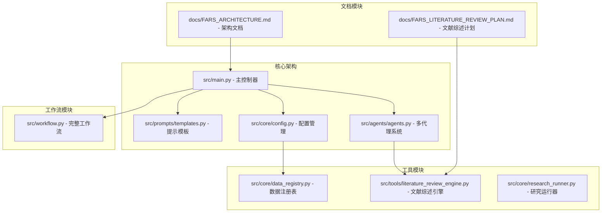
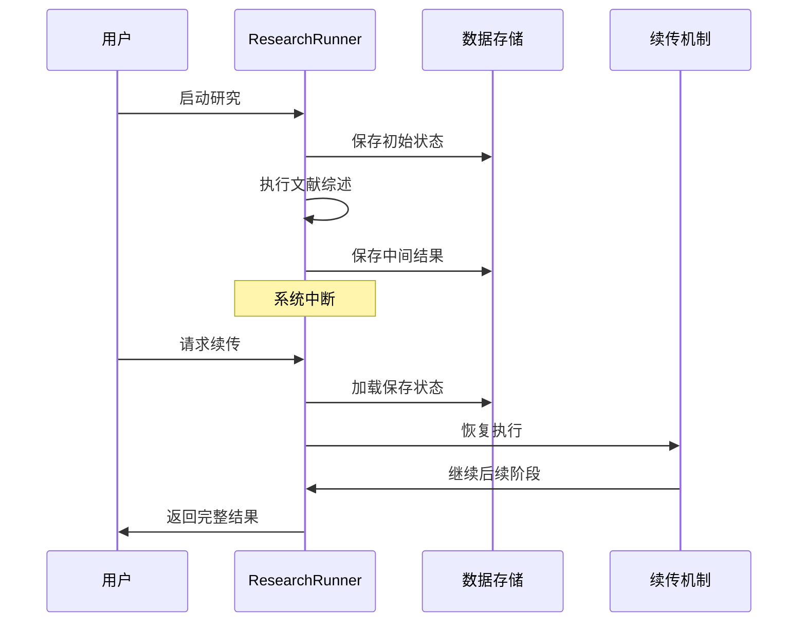
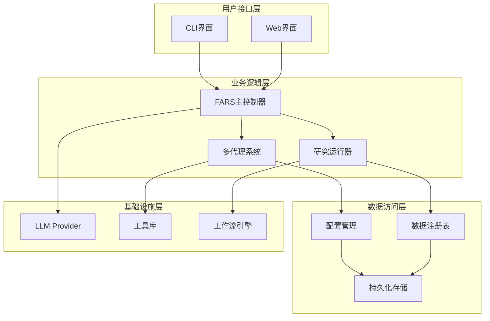
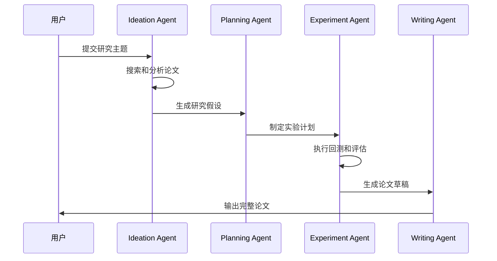
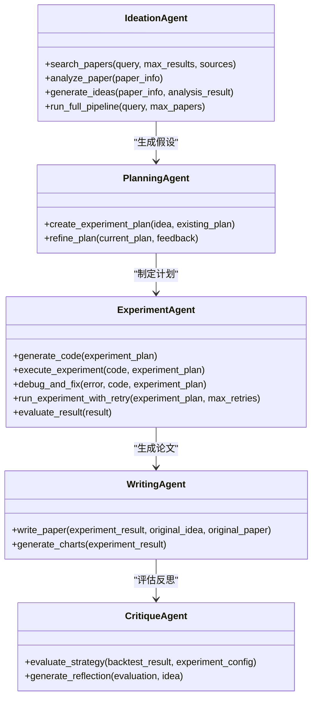
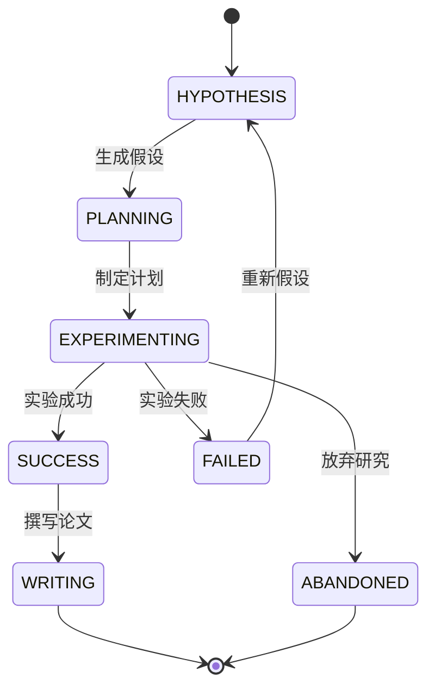
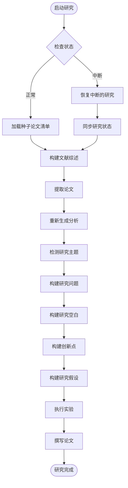
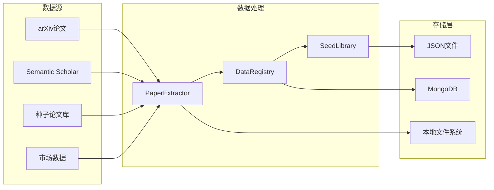
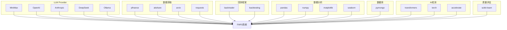
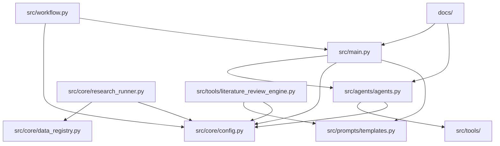

# 核心特性说明

<cite>
**本文档引用的文件**
- [src/agents/agents.py](file://src/agents/agents.py)
- [src/core/config.py](file://src/core/config.py)
- [src/prompts/templates.py](file://src/prompts/templates.py)
- [src/tools/literature_review_engine.py](file://src/tools/literature_review_engine.py)
- [src/core/data_registry.py](file://src/core/data_registry.py)
- [src/core/research_runner.py](file://src/core/research_runner.py)
- [src/main.py](file://src/main.py)
- [src/workflow.py](file://src/workflow.py)
- [docs/FARS_ARCHITECTURE.md](file://docs/FARS_ARCHITECTURE.md)
- [docs/FARS_LITERATURE_REVIEW_PLAN.md](file://docs/FARS_LITERATURE_REVIEW_PLAN.md)
- [requirements.txt](file://requirements.txt)
</cite>

## 目录
1. [简介](#简介)
2. [项目结构](#项目结构)
3. [核心组件](#核心组件)
4. [架构概览](#架构概览)
5. [详细组件分析](#详细组件分析)
6. [依赖关系分析](#依赖关系分析)
7. [性能考虑](#性能考虑)
8. [故障排除指南](#故障排除指南)
9. [结论](#结论)
10. [附录](#附录)

## 简介

FARS（Fully Automated Research System）是一个全自动的量化研究系统，旨在让大型语言模型扮演量化研究员的角色，自主完成从论文阅读、假设生成、实验验证到论文撰写的完整研究流程。该系统采用多代理协作架构，通过四个核心Agent分工合作，实现了真正的自动化研究。

## 项目结构

FARS系统采用模块化设计，主要分为以下几个核心模块：

**图表来源**
- [src/main.py:1-521](file://src/main.py#L1-L521)
- [src/agents/agents.py:1-738](file://src/agents/agents.py#L1-L738)
- [src/core/config.py:1-563](file://src/core/config.py#L1-L563)

**章节来源**
- [src/main.py:1-521](file://src/main.py#L1-L521)
- [docs/FARS_ARCHITECTURE.md:1-257](file://docs/FARS_ARCHITECTURE.md#L1-L257)

## 核心组件

### 多代理协作系统

FARS系统的核心是四代理协作架构，每个Agent都有明确的专业职责：

#### Ideation Agent（假设生成代理）
负责从学术论文中提取可量化的交易逻辑，生成结构化的研究假设。该代理能够：
- 搜索和分析多源论文
- 提取可编程的因子表达式
- 生成数学公式和Python代码片段
- 评估假设的创新性和可行性

#### Planning Agent（实验规划代理）
将抽象的研究假设转化为详细的实验计划，包括：
- 定义实验目标和成功标准
- 设计对照实验和数据需求
- 规划实验步骤和风险控制
- 生成可执行的实验方案

#### Experiment Agent（实验执行代理）
负责实际的策略回测和实验执行：
- 生成完整的回测代码
- 执行实验并收集结果
- 进行错误诊断和代码修复
- 评估策略性能并输出指标

#### Writing Agent（论文撰写代理）
将实验结果整理为可发表的学术论文：
- 生成LaTeX格式的完整论文
- 自动生成图表和可视化
- 整合参考文献和引用格式
- 输出符合会议/期刊要求的格式

**章节来源**
- [src/agents/agents.py:23-738](file://src/agents/agents.py#L23-L738)

### 断点续分析机制

系统实现了完整的断点续分析功能，确保研究过程的连续性和可靠性：

**图表来源**
- [src/core/research_runner.py:301-565](file://src/core/research_runner.py#L301-L565)

### 优雅降级策略

系统具备完善的降级机制，能够在各种异常情况下保持服务可用：

#### LLM Provider降级
- 支持多种LLM Provider自动切换
- 当主Provider不可用时自动切换到备用Provider
- 支持本地Ollama模型作为最后备用方案

#### API Token限制处理
- 采用分块论文生成机制
- 将长论文分解为8个独立章节
- 每章节独立生成，控制prompt大小在限制范围内

#### 错误处理机制
- 实验失败时自动重试和修复
- 代码调试和错误诊断
- 状态监控和异常恢复

**章节来源**
- [src/core/config.py:204-251](file://src/core/config.py#L204-L251)
- [docs/FARS_ARCHITECTURE.md:83-107](file://docs/FARS_ARCHITECTURE.md#L83-L107)

### 文献综述引擎

系统集成了STORM风格的文献综述引擎，提供深度的学术调研能力：

#### 多视角生成机制
- 从方法论、应用、评估、比较、局限性等多个角度分析主题
- 生成5-8个深度研究问题
- 每个视角包含核心研究问题、方法论和潜在贡献

#### 并行证据收集
- 支持并行处理多个研究问题
- 最大并发数可配置（默认5个）
- 异步收集和整合证据

#### Review-Revision循环
- 评审论文质量并提出修改意见
- 根据评审意见修订论文内容
- 最多4轮循环直到达标

**章节来源**
- [src/tools/literature_review_engine.py:18-800](file://src/tools/literature_review_engine.py#L18-L800)
- [docs/FARS_LITERATURE_REVIEW_PLAN.md:154-380](file://docs/FARS_LITERATURE_REVIEW_PLAN.md#L154-L380)

### 多论文比对分析

系统具备强大的论文比对和分析能力：

#### 种子论文分析
- 自动提取种子论文的核心发现
- 识别方法论和关键技术
- 生成主题词和研究空白分析

#### 研究主题识别
- 基于关键词模式识别研究主题
- 自动检测LLM、量化交易、多智能体等主题
- 生成主题分布和趋势分析

#### 创新点识别
- 分析现有文献的不足和空白
- 识别潜在的创新机会
- 生成可验证的研究假设

**章节来源**
- [src/core/research_runner.py:69-162](file://src/core/research_runner.py#L69-L162)
- [src/core/data_registry.py:100-166](file://src/core/data_registry.py#L100-L166)

### 分支迭代管理

系统支持分支迭代管理，允许并行探索不同的研究方向：

#### 分支创建和管理
- 支持多分支并行研究
- 每个分支独立的状态管理和数据隔离
- 分支间的知识共享和合并

#### 研究状态追踪
- 实时追踪每个研究阶段的状态
- 记录实验结果和失败原因
- 生成研究活动日志和统计信息

#### 迭代优化
- 基于失败经验生成新的假设
- 自动调整实验参数和策略
- 优化研究流程和资源配置

**章节来源**
- [src/core/research_runner.py:278-800](file://src/core/research_runner.py#L278-L800)

### 全文输出功能

系统提供完整的论文输出功能，支持多种格式和发布渠道：

#### LaTeX论文生成
- 生成符合学术标准的LaTeX源码
- 自动插入图表和参考文献
- 支持多种期刊/会议格式模板

#### PDF编译支持
- 集成PDF编译流程
- 支持Overleaf在线编译
- 本地MacTeX环境编译

#### 发布渠道集成
- paperreview.ai投稿支持
- 通过邮箱提交到ICML等会议
- AI检测绕过工具集成

**章节来源**
- [src/workflow.py:19-286](file://src/workflow.py#L19-L286)
- [docs/FARS_ARCHITECTURE.md:169-186](file://docs/FARS_ARCHITECTURE.md#L169-L186)

## 架构概览

FARS系统采用分层架构设计，确保了良好的可扩展性和维护性：

**图表来源**
- [src/main.py:35-521](file://src/main.py#L35-L521)
- [src/core/config.py:254-563](file://src/core/config.py#L254-L563)

## 详细组件分析

### 多代理协作架构

#### Agent交互流程

**图表来源**
- [src/agents/agents.py:23-738](file://src/agents/agents.py#L23-L738)

#### Agent类关系图

**图表来源**
- [src/agents/agents.py:23-738](file://src/agents/agents.py#L23-L738)

**章节来源**
- [src/agents/agents.py:23-738](file://src/agents/agents.py#L23-L738)

### 研究流程管理

#### 研究状态管理

**图表来源**
- [src/fars_research.py:28-46](file://src/fars_research.py#L28-L46)

#### 研究运行器架构

**图表来源**
- [src/core/research_runner.py:69-800](file://src/core/research_runner.py#L69-L800)

**章节来源**
- [src/core/research_runner.py:69-800](file://src/core/research_runner.py#L69-L800)

### 数据管理架构

#### 数据流架构

**图表来源**
- [src/core/data_registry.py:48-97](file://src/core/data_registry.py#L48-L97)

**章节来源**
- [src/core/data_registry.py:48-189](file://src/core/data_registry.py#L48-L189)

## 依赖关系分析

### 外部依赖关系

**图表来源**
- [requirements.txt:1-39](file://requirements.txt#L1-L39)

### 内部模块依赖

**图表来源**
- [src/main.py:22-31](file://src/main.py#L22-L31)
- [src/agents/agents.py:12-21](file://src/agents/agents.py#L12-L21)

**章节来源**
- [requirements.txt:1-39](file://requirements.txt#L1-L39)
- [src/main.py:22-31](file://src/main.py#L22-L31)

## 性能考虑

### 并发处理机制

系统采用异步和并行处理机制来提升性能：

#### 并行论文处理
- 支持多线程并行处理论文
- 异步证据收集机制
- 可配置的并发限制

#### 缓存机制
- LLM调用结果缓存
- 中间结果持久化
- 配置参数缓存

### 资源管理

#### 内存优化
- 分块处理大文件
- 流式数据处理
- 及时释放内存资源

#### 存储优化
- 增量更新机制
- 数据压缩存储
- 自动清理机制

## 故障排除指南

### 常见问题及解决方案

#### LLM Provider连接问题
- 检查API密钥配置
- 验证网络连接
- 尝试备用Provider

#### 论文生成失败
- 检查prompt大小限制
- 验证LLM响应格式
- 检查分块生成配置

#### 实验执行错误
- 检查数据源连接
- 验证回测代码
- 查看错误日志

#### 系统性能问题
- 调整并发参数
- 检查资源使用情况
- 优化配置参数

**章节来源**
- [src/core/config.py:98-187](file://src/core/config.py#L98-L187)
- [src/tools/literature_review_engine.py:89-94](file://src/tools/literature_review_engine.py#L89-L94)

## 结论

FARS系统通过其创新的多代理协作架构，实现了从论文阅读到论文发表的完全自动化研究流程。系统的核心优势包括：

1. **完整的自动化流程**：从假设生成到论文发布的端到端自动化
2. **强大的文献综述能力**：集成STORM风格的多视角调研机制
3. **可靠的断点续传**：确保研究过程的连续性和可靠性
4. **灵活的降级策略**：在各种异常情况下保持服务可用
5. **丰富的输出格式**：支持多种论文格式和发布渠道

相比传统的研究方式，FARS系统显著提升了研究效率和质量，为量化研究提供了全新的解决方案。

## 附录

### 使用示例

#### 基本使用流程
1. 启动FARS系统
2. 指定研究主题
3. 等待系统自动完成研究
4. 查看生成的论文

#### 高级配置
- 配置LLM Provider
- 设置研究方向
- 调整实验参数
- 监控研究进度

### 技术规格

#### 支持的研究方向
- 量化金融（主方向）
- 计算机视觉
- 强化学习

#### 支持的LLM Provider
- MiniMax
- OpenAI
- Anthropic
- DeepSeek
- Ollama（本地）

#### 输出格式
- LaTeX论文
- PDF文档
- Markdown草稿

**章节来源**
- [src/core/config.py:16-57](file://src/core/config.py#L16-L57)
- [docs/FARS_ARCHITECTURE.md:74-82](file://docs/FARS_ARCHITECTURE.md#L74-L82)