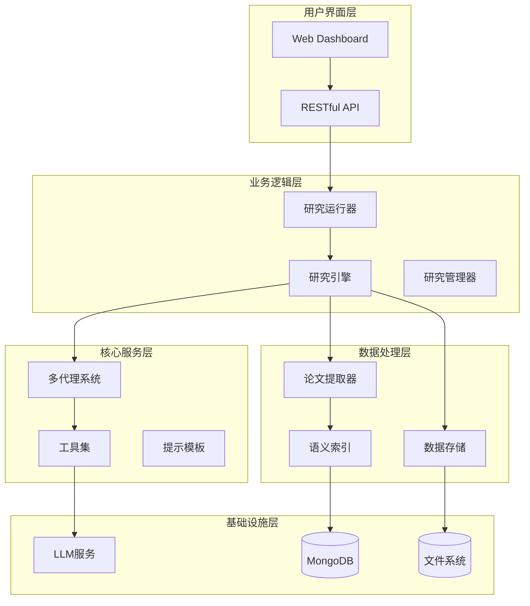
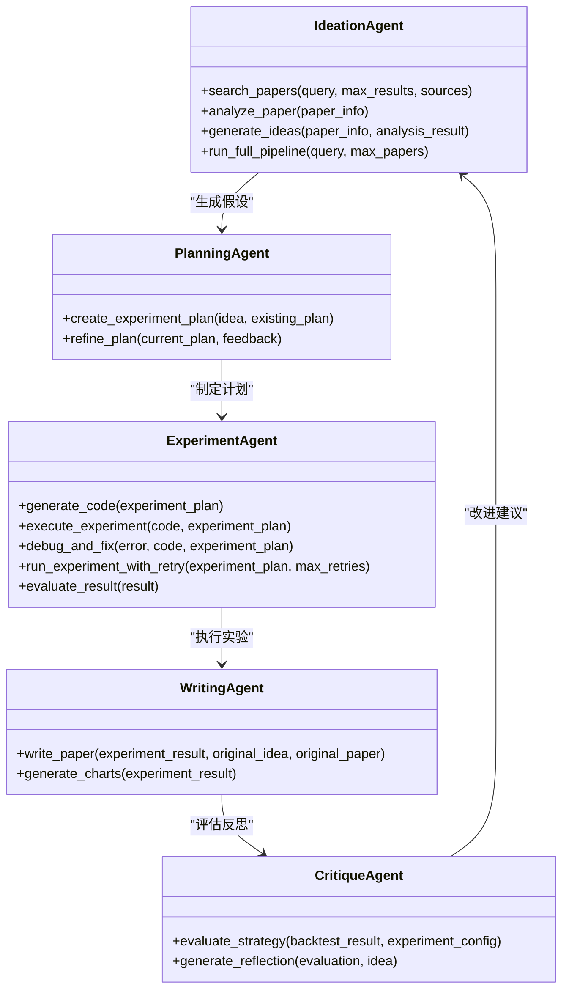
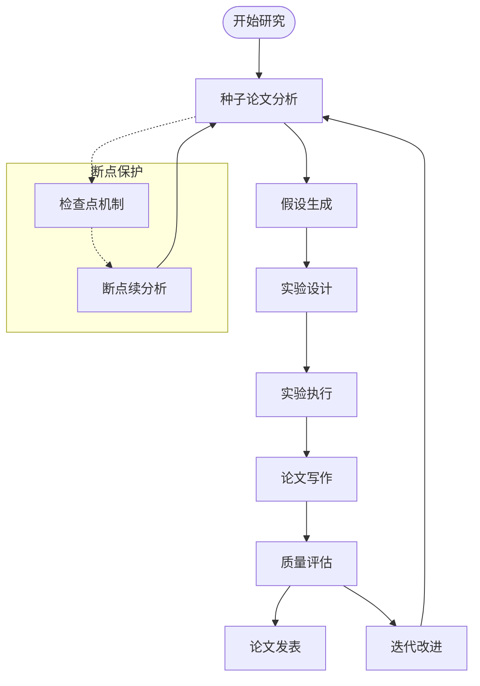
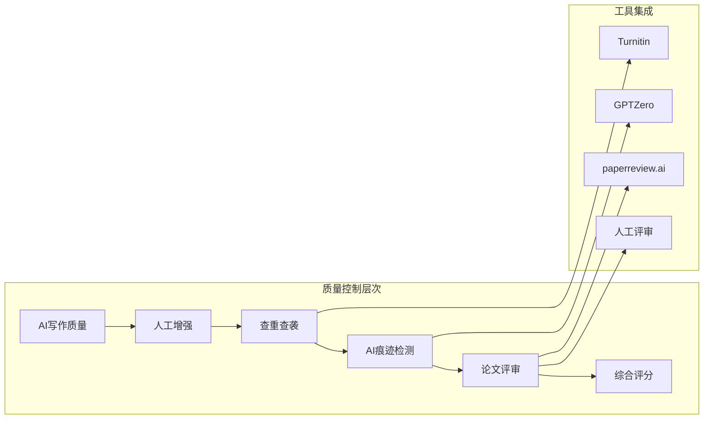

# 项目介绍与目标

<cite>
**本文档引用的文件**
- [README.md](file://README.md)
- [FARS_ARCHITECTURE.md](file://docs/FARS_ARCHITECTURE.md)
- [AI_PAPER_FULL_WORKFLOW.md](file://docs/AI_PAPER_FULL_WORKFLOW.md)
- [FARS_LITERATURE_REVIEW_PLAN.md](file://docs/FARS_LITERATURE_REVIEW_PLAN.md)
- [seed_paper_analysis.md](file://research/seed_paper_analysis.md)
- [main.py](file://src/main.py)
- [fars_research.py](file://src/fars_research.py)
- [research_engine.py](file://src/core/research_engine.py)
- [research_runner.py](file://src/core/research_runner.py)
- [agents.py](file://src/agents/agents.py)
</cite>

## 目录
1. [项目概述](#项目概述)
2. [核心使命与愿景](#核心使命与愿景)
3. [发展背景与问题定位](#发展背景与问题定位)
4. [系统架构概览](#系统架构概览)
5. [多代理协作机制](#多代理协作机制)
6. [从种子论文到学术论文的全流程](#从种子论文到学术论文的全流程)
7. [技术特色与创新点](#技术特色与创新点)
8. [应用价值与场景](#应用价值与场景)
9. [质量保障体系](#质量保障体系)
10. [未来发展目标](#未来发展目标)
11. [结语](#结语)

## 项目概述

FARS（Fully Automated Research System，完全自动化研究系统）是一个基于大型语言模型（LLM）的全自动学术论文生成系统，专注于量化交易与金融科技领域。该项目的核心目标是通过自动化研究流程，帮助量化金融研究人员从种子论文出发，自主完成文献分析、假设生成、实验设计、论文撰写等全流程，显著提升学术研究效率与产出质量。

FARS系统采用“多代理协作”的架构设计，将研究流程分解为四个核心阶段：理念生成（Ideation）、规划（Planning）、实验（Experiment）、写作（Writing）。每个阶段由专门的智能体负责，通过明确的职责分工和高效的协作机制，实现从理论假设到实证验证再到学术论文的完整闭环。

系统具备强大的断点续分析能力，能够在任何环节出现故障时自动保存进度，并支持从断点恢复继续执行。同时，系统还提供了优雅降级机制，在遇到API限制或网络异常等突发情况时，能够并发地继续写作并生成Bug报告，确保研究工作的连续性。

在数据处理方面，FARS支持多种数据源，包括arXiv、Semantic Scholar等学术资源，能够自动抓取和解析论文内容。系统还集成了多种市场数据获取工具，支持从baostock、akshare、yfinance、tushare等多个数据源获取金融数据，为量化策略的回测提供坚实的数据基础。

此外，FARS系统还提供了丰富的可视化界面，通过Dashboard展示研究进度、论文状态、实验结果等关键信息，帮助研究人员实时掌握项目进展并做出相应的调整。

**章节来源**
- [README.md:26-48](file://README.md#L26-L48)
- [README.md:50-122](file://README.md#L50-L122)

## 核心使命与愿景

### 核心使命

FARS的核心使命是"通过自动化研究流程帮助量化金融研究人员生成高质量学术论文"。这一使命体现在以下几个方面：

**提升研究效率**：传统的学术研究通常需要研究人员花费大量时间进行文献检索、数据分析、实验设计和论文撰写等工作。FARS通过自动化技术，将这些重复性劳动交给系统完成，让研究人员能够专注于更具创造性的研究工作。

**保证研究质量**：系统内置的质量保障体系确保每篇论文都经过严格的审查和评估，包括查重、AI痕迹检测、人工评审等多个环节，有效提升了论文的整体质量。

**加速学术产出**：通过并行处理和流水线化的作业流程，FARS能够显著缩短从想法到论文发表的时间周期，帮助研究人员更快地将研究成果推向学术界。

**降低研究门槛**：对于初学者或资源有限的研究团队，FARS提供了标准化的研究流程和工具支持，降低了量化金融研究的入门难度。

### 技术愿景

FARS的技术愿景是构建一个"完全自动化"的研究生态系统，实现以下目标：

**端到端自动化**：从种子论文的分析到最终论文的发表，整个流程都由系统自动完成，研究人员只需提供研究主题和基本配置即可。

**智能化决策**：系统能够根据研究进展自动调整策略，包括假设生成、实验设计、数据获取等方面的智能化决策。

**可扩展性架构**：系统采用模块化设计，支持新功能的快速集成和现有功能的持续优化。

**开放生态**：FARS致力于构建开放的研究平台，欢迎学术界和工业界的合作伙伴共同参与和贡献。

**章节来源**
- [README.md:28-47](file://README.md#L28-L47)
- [FARS_ARCHITECTURE.md:7-18](file://docs/FARS_ARCHITECTURE.md#L7-L18)

## 发展背景与问题定位

### 研究现状分析

在量化金融研究领域，研究人员面临着诸多挑战：

**文献处理效率低下**：研究人员需要花费大量时间浏览和分析大量的学术论文，但传统的手工处理方式效率极低，难以应对海量的学术信息。

**实验设计复杂**：量化策略的开发需要进行大量的回测和验证，传统的手工实验方式不仅耗时，而且容易出现人为错误。

**论文写作标准化不足**：学术论文的写作虽然有基本规范，但在实际操作中往往缺乏统一的标准和流程，导致论文质量参差不齐。

**质量控制机制缺失**：现有的研究工具大多只关注单一环节，缺乏从头到尾的质量控制机制，难以确保最终成果的可靠性。

### 技术发展机遇

随着大语言模型技术的快速发展，为解决上述问题提供了新的可能性：

**自然语言处理能力**：现代LLM具备强大的文本理解和生成能力，能够胜任复杂的学术研究任务。

**多模态信息处理**：除了文本信息外，LLM还能处理数值数据、图表等多种形式的信息，为量化研究提供更全面的支持。

**智能推理能力**：LLM具备一定的逻辑推理和问题解决能力，能够协助研究人员进行假设生成和实验设计。

**自动化执行能力**：通过与编程接口的结合，LLM能够直接生成和执行代码，实现从理论到实践的无缝衔接。

### 项目切入点

基于以上分析，FARS项目选择了以下切入点：

**种子论文驱动**：以高质量的种子论文为基础，通过系统化的分析和解读，生成具有创新性的研究假设。

**多视角调研**：借鉴STORM等先进系统的经验，采用多视角的调研方法，确保研究的全面性和深度。

**实验验证闭环**：将理论假设与实证验证相结合，通过回测和实验确保研究结论的可靠性。

**质量保障体系**：建立从AI写作到人工评审的完整质量控制流程，确保最终论文的质量。

**章节来源**
- [FARS_LITERATURE_REVIEW_PLAN.md:8-18](file://docs/FARS_LITERATURE_REVIEW_PLAN.md#L8-L18)
- [seed_paper_analysis.md:1-10](file://research/seed_paper_analysis.md#L1-L10)

## 系统架构概览

FARS系统采用分层架构设计，从底层的数据处理到顶层的应用界面，形成了完整的技术栈。

### 整体架构设计

**图表来源**
- [README.md:52-88](file://README.md#L52-L88)
- [FARS_ARCHITECTURE.md:23-57](file://docs/FARS_ARCHITECTURE.md#L23-L57)

### 核心组件关系

系统的核心组件包括研究引擎、多代理系统、工具集和数据处理模块。这些组件通过清晰的接口进行通信，实现了高度的模块化和可扩展性。

**研究引擎**负责协调各个组件的工作，管理研究流程的状态和进度。它实现了断点续分析、优雅降级等关键功能，确保研究过程的稳定性和可靠性。

**多代理系统**包含四个专门的智能体，每个智能体都有明确的职责分工。Ideation Agent负责从论文中提取有价值的信息并生成假设；Planning Agent将假设转化为详细的实验计划；Experiment Agent负责执行实验并进行结果评估；Writing Agent根据实验结果撰写学术论文。

**工具集**提供了各种实用的功能模块，包括论文抓取、数据获取、回测执行、质量检测等。这些工具通过统一的接口提供服务，简化了系统的集成和使用。

**数据处理模块**负责管理研究过程中产生的各种数据，包括论文文本、实验结果、中间产物等。系统采用了分布式存储和版本控制机制，确保数据的安全性和可追溯性。

**章节来源**
- [README.md:89-122](file://README.md#L89-L122)
- [FARS_ARCHITECTURE.md:191-216](file://docs/FARS_ARCHITECTURE.md#L191-L216)

## 多代理协作机制

FARS系统的核心创新在于其独特的多代理协作机制。通过将复杂的研究任务分解为四个相互独立又紧密协作的智能体，系统实现了高效而灵活的研究流程。

### 四个核心智能体

**图表来源**
- [agents.py:23-738](file://src/agents/agents.py#L23-L738)

### 智能体间的协作流程

每个智能体都有明确的职责边界，但它们之间通过标准化的接口进行通信，形成了高效的协作网络。

**Ideation Agent**负责从种子论文中提取有价值的信息。它能够自动搜索相关的学术论文，分析论文的方法论和贡献，并生成可量化的交易假设。这个阶段的关键在于如何从海量的学术信息中筛选出最有价值的内容。

**Planning Agent**将Ideation Agent生成的假设转化为详细的实验计划。它需要考虑实验的设计、数据需求、评估指标等多个方面，确保实验的科学性和可行性。

**Experiment Agent**负责执行实验并进行结果评估。它能够自动生成回测代码，执行实验并在出现错误时进行调试和修复。这个阶段是整个系统中最复杂的部分，因为它涉及到代码生成、执行环境管理、错误处理等多个技术层面。

**Writing Agent**根据实验结果撰写学术论文。它能够生成符合学术规范的论文内容，包括摘要、引言、方法论、实验结果、讨论和结论等各个部分。

**Critique Agent**提供评估和反思功能。它能够对策略性能进行客观评估，并提供改进建议，帮助研究人员不断优化研究方向。

### 协作机制的特点

**并行处理能力**：四个智能体可以并行工作，大大提高了研究效率。当一个智能体在处理复杂任务时，其他智能体可以同时进行相关工作。

**错误隔离机制**：每个智能体都有独立的错误处理机制，即使某个智能体出现问题，也不会影响其他智能体的正常工作。

**状态同步机制**：智能体之间通过共享的状态信息进行协调，确保整个系统的同步性和一致性。

**自适应调整**：系统能够根据研究进展自动调整智能体的工作重点和资源配置，实现最优的研究效果。

**章节来源**
- [agents.py:23-195](file://src/agents/agents.py#L23-L195)
- [agents.py:197-497](file://src/agents/agents.py#L197-L497)
- [agents.py:499-738](file://src/agents/agents.py#L499-L738)

## 从种子论文到学术论文的全流程

FARS系统实现了从种子论文到学术论文的完整自动化流程。这个流程包含了五个关键阶段，每个阶段都有明确的目标和产出。

### 五阶段研究流程

**图表来源**
- [README.md:125-238](file://README.md#L125-L238)

### 阶段一：种子论文分析

种子论文分析是整个研究流程的基础。系统会自动从arXiv、Semantic Scholar等学术资源中获取相关的种子论文，然后进行深度分析。

**分析内容包括**：
- 论文的核心贡献和创新点
- 使用的方法论和技术路线
- 实验结果和验证方法
- 论文的局限性和未来发展方向
- 与其他相关研究的关系

**产出结果**：
- 结构化的论文分析报告
- 关键信息的提取和整理
- 为后续假设生成提供基础

### 阶段二：假设生成

基于种子论文的分析结果，系统会生成具有创新性的研究假设。这个过程借鉴了STORM等先进系统的经验，采用多视角的分析方法。

**假设生成策略**：
- 从方法论视角分析现有技术的优缺点
- 从应用视角探讨技术的实际应用场景
- 从评估视角设计合理的验证方法
- 从比较视角分析与现有方法的差异
- 从局限性视角提出改进方向

**产出结果**：
- 多个具有可行性的研究假设
- 每个假设的详细描述和预期结果
- 假设之间的关联关系和优先级

### 阶段三：实验设计

实验设计阶段将抽象的假设转化为具体的实验计划。这个过程需要考虑实验的科学性、可行性和可重复性。

**设计要素**：
- 实验目标和假设验证方法
- 数据需求和获取途径
- 实验步骤和时间安排
- 评估指标和成功标准
- 风险控制和应急预案

**产出结果**：
- 详细的实验计划书
- 数据获取和处理方案
- 实验执行的具体步骤

### 阶段四：实验执行

实验执行阶段是整个流程中最复杂和关键的部分。系统能够自动生成回测代码，执行实验并在出现错误时进行调试和修复。

**执行过程**：
- 自动生成Python回测代码
- 在沙箱环境中执行实验
- 监控实验进度和结果
- 处理异常情况和错误
- 生成实验报告和分析结果

**质量控制**：
- 多轮实验验证
- 结果的统计检验
- 异常值和离群点检测
- 实验的可重复性验证

**产出结果**：
- 实验执行结果
- 性能指标和统计数据
- 实验过程的日志和记录

### 阶段五：论文写作

论文写作阶段根据实验结果生成符合学术规范的论文。系统能够自动生成论文的各个部分，包括摘要、引言、方法论、实验结果、讨论和结论等。

**写作特点**：
- 结构化的论文生成
- 符合目标期刊格式要求
- 自动化的图表生成
- 引用和参考文献的自动生成

**产出结果**：
- 完整的学术论文
- LaTeX源码和PDF格式
- 论文相关的补充材料

### 断点续分析机制

为了确保研究过程的稳定性和可靠性，FARS系统实现了完善的断点续分析机制。

**检查点机制**：
- 每个研究步骤完成后自动保存状态
- 支持从任意断点恢复继续执行
- 防止重复计算和状态冲突
- 记录详细的错误信息和处理过程

**优雅降级**：
- 当遇到API限制或网络异常时自动降级
- 并发继续写作并生成Bug报告
- 保持研究工作的连续性
- 最大化利用已有的分析结果

**章节来源**
- [README.md:127-238](file://README.md#L127-L238)
- [research_engine.py:55-190](file://src/core/research_engine.py#L55-L190)
- [research_engine.py:246-384](file://src/core/research_engine.py#L246-L384)

## 技术特色与创新点

FARS系统在技术实现上具有多项创新，这些创新使其在自动化研究领域具有独特的竞争优势。

### 1. 断点续分析引擎

FARS系统的核心技术创新之一是其断点续分析引擎。该引擎实现了完整的状态管理机制，确保研究过程的稳定性和可靠性。

**关键技术特性**：
- **细粒度状态管理**：每个研究步骤都有独立的状态记录，支持精确的断点定位
- **MD5防重机制**：通过计算文件内容的MD5值防止重复写入和状态冲突
- **并发安全性**：采用锁机制确保多线程环境下的数据一致性
- **自动恢复机制**：系统能够自动检测和恢复断点状态

**实现细节**：
系统为每个研究项目创建独立的工作空间，包含完整的检查点文件、分析结果、中间产物等。检查点文件采用JSON格式存储，包含详细的状态信息和元数据。

### 2. 优雅降级机制

在面对API限制、网络异常或其他突发情况时，FARS系统能够自动触发优雅降级机制，确保研究工作的连续性。

**降级策略**：
- **并发写作**：在分析卡顿时并发继续论文写作
- **Bug报告生成**：自动生成详细的错误报告和诊断信息
- **结果利用最大化**：充分利用已有的分析结果继续创作
- **状态记录**：完整记录降级过程和相关信息

**技术实现**：
系统通过异步任务管理和事件驱动机制实现优雅降级。当检测到异常情况时，系统会立即启动降级流程，同时保持正常的写作任务继续执行。

### 3. 多视角文献综述

FARS系统借鉴了STORM等先进系统的经验，实现了多视角的文献综述机制。这种方法能够从不同的学术角度全面分析研究主题。

**视角类型**：
- **方法论视角**：分析现有技术的方法和理论基础
- **应用视角**：探讨技术的实际应用场景和效果
- **评估视角**：设计合理的评估方法和验证标准
- **比较视角**：分析与现有方法的差异和优劣
- **局限性视角**：识别现有研究的不足和改进方向

**实现机制**：
系统通过并行处理多个视角的分析任务，大大提高了文献综述的效率和质量。每个视角都会生成相应的分析报告和问题列表。

### 4. 质量保障体系

FARS系统建立了完整的质量保障体系，从AI写作到人工评审形成了多层次的质量控制机制。

**质量控制层次**：
- **AI写作质量**：通过精心设计的提示模板和约束条件确保AI生成内容的质量
- **人工增强**：允许领域专家对AI生成的内容进行补充和完善
- **查重查袭**：使用多种工具进行学术诚信检查
- **AI痕迹检测**：识别AI生成文本的特征并进行相应的处理
- **论文评审**：通过专业的评审系统获取结构化的评审意见

**技术集成**：
系统集成了多种第三方质量检测工具，包括Turnitin、iThenticate、GPTZero等，为用户提供全面的质量保障服务。

### 5. 可视化研究界面

FARS系统提供了直观的可视化界面，帮助研究人员实时监控研究进度和质量。

**界面功能**：
- **研究总览**：显示所有研究项目的总体状态和统计数据
- **流水线视图**：展示研究流程的实时状态和进度
- **实验日志**：提供实验过程的详细记录和分析
- **质量分析**：展示质量检测的结果和改进建议
- **论文对比**：支持多篇论文的对比分析和评估

**技术实现**：
界面采用现代化的前端技术栈，包括HTML5、CSS3、JavaScript等，支持响应式设计和暗色主题。系统使用Chart.js进行数据可视化，SVG进行拓扑图绘制。

**章节来源**
- [README.md:241-382](file://README.md#L241-L382)
- [FARS_ARCHITECTURE.md:108-122](file://docs/FARS_ARCHITECTURE.md#L108-L122)
- [AI_PAPER_FULL_WORKFLOW.md:151-276](file://docs/AI_PAPER_FULL_WORKFLOW.md#L151-L276)

## 应用价值与场景

FARS系统在多个应用场景中都具有重要的价值，能够为不同类型的用户提供有效的支持。

### 学术研究场景

**博士生培养**：
- 为博士生提供标准化的研究流程指导
- 帮助学生快速掌握量化金融研究方法
- 提高论文写作质量和发表成功率

**青年教师支持**：
- 协助青年教师开展前沿研究项目
- 提供实验设计和数据分析的技术支持
- 加速学术成果的产出和转化

**独立研究者**：
- 为资源有限的研究者提供专业的研究工具
- 降低量化金融研究的入门门槛
- 提高个人研究的效率和质量

### 产业应用场景

**量化基金公司**：
- 加速量化策略的研发和验证过程
- 提高因子挖掘和模型构建的效率
- 降低研发成本和时间投入

**金融科技公司**：
- 支持算法交易系统的开发和优化
- 提供策略回测和性能评估的技术手段
- 加快产品从概念到市场的转化速度

**投资咨询公司**：
- 为投资决策提供数据驱动的分析支持
- 提高研究报告的质量和准确性
- 优化投资组合的构建和管理

### 教育培训场景

**课程教学**：
- 为量化金融课程提供实践案例和工具
- 帮助学生理解理论知识的实际应用
- 提供个性化的学习路径和指导

**职业培训**：
- 为企业员工提供专业技能的培训
- 帮助转行人员快速掌握量化技能
- 提供持续教育和技能更新的机会

### 技术创新场景

**算法研究**：
- 支持新型算法的开发和验证
- 提供实验环境和评估标准
- 促进学术界和工业界的合作

**开源社区**：
- 为开源项目提供技术支持和贡献
- 推动相关技术的发展和普及
- 建立开放的研究生态系统

**章节来源**
- [README.md:384-417](file://README.md#L384-L417)
- [FARS_LITERATURE_REVIEW_PLAN.md:154-200](file://docs/FARS_LITERATURE_REVIEW_PLAN.md#L154-L200)

## 质量保障体系

FARS系统建立了多层次的质量保障体系，确保从种子论文到最终发表的每个环节都能达到学术标准。

### 质量控制流程

**图表来源**
- [AI_PAPER_FULL_WORKFLOW.md:151-167](file://docs/AI_PAPER_FULL_WORKFLOW.md#L151-L167)

### AI写作质量控制

**提示模板设计**：
系统为每个写作任务都设计了专门的提示模板，确保AI生成的内容符合学术规范和要求。这些模板包含了详细的指令和约束条件，指导AI按照既定的格式和标准生成内容。

**内容结构化**：
通过结构化的提示设计，系统能够确保生成的论文具有完整的结构，包括摘要、引言、方法论、实验结果、讨论和结论等各个部分。

**学术规范遵循**：
系统在提示模板中嵌入了学术写作的基本规范，包括引用格式、术语使用、逻辑结构等方面的要求。

### 人工增强机制

**专家参与**：
系统允许领域专家对AI生成的内容进行补充和完善，确保论文的专业性和准确性。专家可以添加独特的数据集、实验结果和专业见解。

**知识补充**：
人工增强机制能够弥补AI在某些领域的知识不足，特别是在需要深度专业知识的领域。

**逻辑强化**：
专家可以强化论文的逻辑推演和论证链条，提高论文的说服力和学术价值。

### 查重查袭检测

**多工具集成**：
系统集成了多种查重工具，包括Turnitin、iThenticate、Copyscape等，为用户提供全面的学术诚信检查服务。

**检测范围**：
查重检测不仅包括文字内容的相似性检查，还包括数据、图表、公式等其他形式的相似性分析。

**报告生成**：
系统能够生成详细的查重报告，指出可能存在的问题并提供改进建议。

### AI痕迹检测

**检测算法**：
系统集成了多种AI痕迹检测工具，包括GPTZero、Originality.ai、Copyleaks等，能够识别AI生成文本的特征。

**检测原理**：
这些工具通过分析文本的统计特征、语法结构和词汇使用模式来判断文本的来源。

**风险评估**：
系统能够对检测结果进行风险评估，为用户提供相应的处理建议。

### 论文评审体系

**结构化评审**：
系统通过专业的评审工具获取结构化的评审意见，包括学术严谨性、创新性、完整性、可读性、引用质量等维度的评分。

**多轮评审**：
论文可以经过多轮评审和修订，逐步提高质量水平。

**专家网络**：
系统建立了广泛的专家网络，为不同领域的论文提供专业的评审服务。

### 综合评分报告

**7维雷达图**：
系统生成包含7个维度的综合评分报告，包括原创性、方法论、实验、写作、引用、AI痕迹、整体质量等。

**可视化展示**：
通过雷达图的形式直观展示论文在各个维度的表现，帮助用户快速了解论文的优势和不足。

**改进建议**：
基于评分结果，系统能够提供针对性的改进建议，帮助用户进一步提升论文质量。

**章节来源**
- [README.md:301-382](file://README.md#L301-L382)
- [AI_PAPER_FULL_WORKFLOW.md:229-276](file://docs/AI_PAPER_FULL_WORKFLOW.md#L229-L276)

## 未来发展目标

FARS系统制定了明确的未来发展目标，旨在构建更加完善和强大的自动化研究生态系统。

### 短期目标（6个月内）

**技术完善**：
- 优化多代理协作机制，提高系统的稳定性和效率
- 完善断点续分析功能，减少意外中断的影响
- 增强AI写作质量，提高论文的学术水平

**功能扩展**：
- 集成更多的数据源和工具，扩大系统的应用范围
- 支持更多的学术期刊和会议，提高论文发表的成功率
- 提供更丰富的可视化功能，改善用户体验

**生态建设**：
- 建立开发者社区，吸引更多技术人才参与
- 与学术机构和企业建立合作关系
- 推广FARS的理念和方法，扩大影响力

### 中期目标（1年内）

**平台化发展**：
- 构建开放的研究平台，支持第三方插件和扩展
- 建立标准化的API接口，方便集成到其他系统
- 提供云端服务，降低用户的使用门槛

**智能化升级**：
- 提升AI的推理和决策能力，实现更高级别的自动化
- 开发自适应学习机制，系统能够根据用户偏好调整策略
- 增强多模态处理能力，支持图像、视频等多媒体内容

**国际化拓展**：
- 支持更多的语言和文化背景
- 适配不同国家和地区的学术规范
- 建立全球化的研究网络

### 长期愿景（3-5年）

**完全自动化**：
- 实现从研究想法到学术发表的完全自动化
- 系统能够独立完成复杂的研究项目
- 无需人工干预即可产生高质量的学术成果

**生态主导地位**：
- 成为全球领先的自动化研究平台
- 建立完整的学术研究生态系统
- 推动整个学术界的研究范式变革

**技术突破**：
- 在人工智能和机器学习领域取得重大突破
- 开发全新的研究方法和工具
- 为人类知识的进步做出重要贡献

**社会影响**：
- 大幅提高学术研究的效率和质量
- 降低学术研究的成本和门槛
- 促进知识的传播和应用

**章节来源**
- [FARS_ARCHITECTURE.md:235-243](file://docs/FARS_ARCHITECTURE.md#L235-L243)
- [FARS_LITERATURE_REVIEW_PLAN.md:474-502](file://docs/FARS_LITERATURE_REVIEW_PLAN.md#L474-L502)

## 结语

FARS（Fully Automated Research System）项目代表了自动化研究领域的重要进展。通过将先进的大语言模型技术与严谨的学术研究方法相结合，FARS为量化金融研究人员提供了一个强大而可靠的自动化研究平台。

该项目的核心价值在于其能够显著提升研究效率、保证研究质量、加速学术产出，并降低研究门槛。通过多代理协作机制、断点续分析、优雅降级等技术创新，FARS实现了从种子论文到学术论文的完整自动化流程。

展望未来，FARS将继续在技术创新、功能完善、生态建设等方面努力，致力于成为全球领先的自动化研究平台。我们相信，随着技术的不断发展和完善，FARS将为推动量化金融研究的发展、促进学术交流与合作、加速知识的传播与应用做出更大的贡献。

无论您是初学者还是资深研究者，FARS都为您提供了一个可靠的技术支撑和创新平台。我们诚邀您加入这个激动人心的项目，共同探索自动化研究的无限可能。