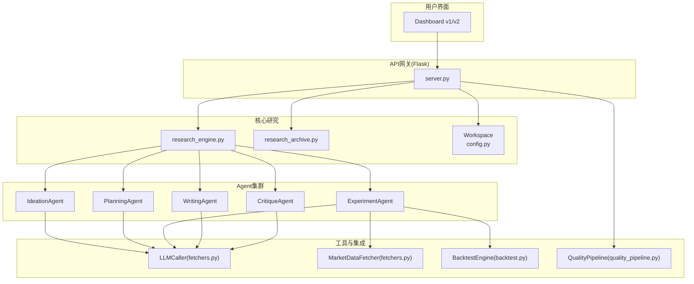
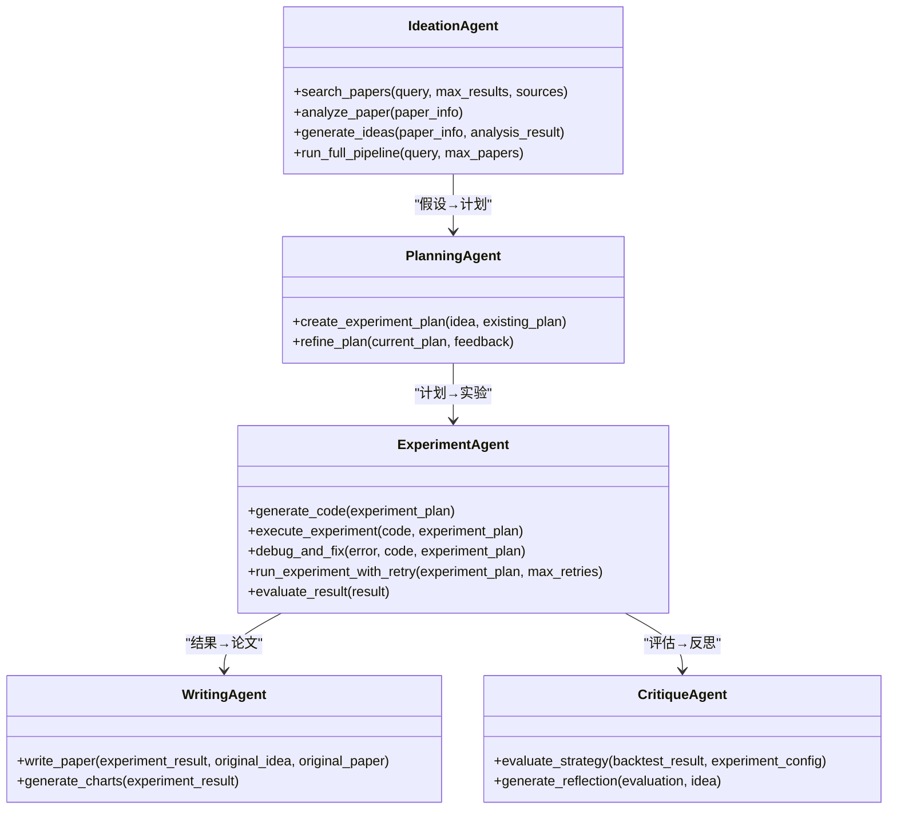
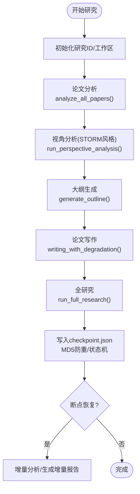
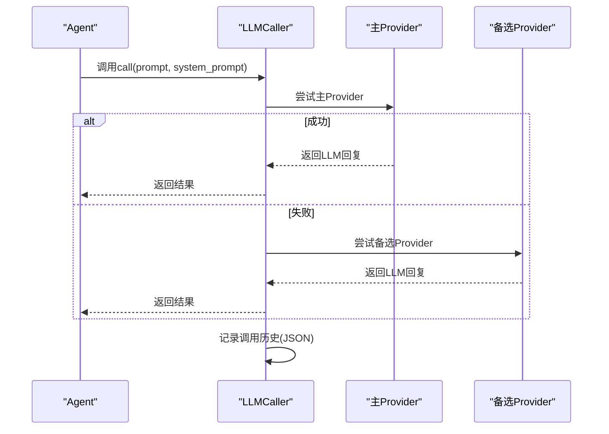
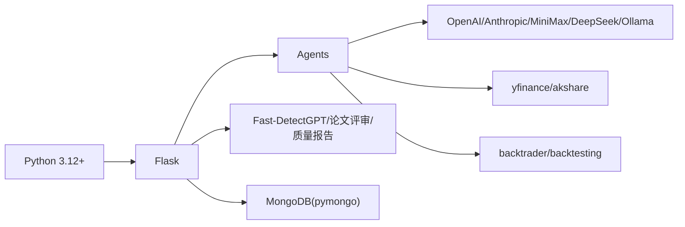

# 项目概述

<cite>
**本文引用的文件**
- [README.md](file://README.md)
- [FARS_ARCHITECTURE.md](file://docs/FARS_ARCHITECTURE.md)
- [AI_PAPER_FULL_WORKFLOW.md](file://docs/AI_PAPER_FULL_WORKFLOW.md)
- [server.py](file://server.py)
- [src/main.py](file://src/main.py)
- [src/fars_research.py](file://src/fars_research.py)
- [src/core/config.py](file://src/core/config.py)
- [src/tools/fetchers.py](file://src/tools/fetchers.py)
- [src/agents/agents.py](file://src/agents/agents.py)
- [src/prompts/templates.py](file://src/prompts/templates.py)
- [requirements.txt](file://requirements.txt)
</cite>

## 目录
1. [简介](#简介)
2. [项目结构](#项目结构)
3. [核心组件](#核心组件)
4. [架构总览](#架构总览)
5. [详细组件分析](#详细组件分析)
6. [依赖关系分析](#依赖关系分析)
7. [性能考量](#性能考量)
8. [故障排查指南](#故障排查指南)
9. [结论](#结论)
10. [附录](#附录)

## 简介
FARS（Fully Automated Research System，完全自动化研究系统）是一个基于大语言模型（LLM）的全自动学术论文生成系统，聚焦量化交易与金融科技领域。系统从“种子论文”出发，通过多代理协作、断点续分析、优雅降级、STORM风格文献综述与GPT Researcher风格Review-Revision循环，以及论文质量流水线，实现从“假设生成—实验设计—回测验证—论文撰写”的闭环自动化。

- 使命：让LLM扮演量化研究员，自动完成因子挖掘、策略回测、代码生成到报告撰写的全流程，加速高质量学术论文产出。
- 愿景：成为量化金融研究的“智能研究助手”，降低研究门槛，提升研究效率与质量。
- 核心价值主张：
  - 全流程自动化：从种子论文到可发表论文，减少人工干预。
  - 多Agent协作：Ideation/Planning/Experiment/Writing分工明确、协同高效。
  - 容错与断点：每步完成后持久化，支持从断点恢复与降级写作。
  - 质量保障：内置AI痕迹检测、论文评审与7维质量雷达图。
  - 可扩展：支持多LLM Provider、多数据源、多研究方向。

## 项目结构
项目采用模块化分层设计，前后端与核心业务逻辑清晰分离，便于维护与扩展。

```mermaid
graph TB
subgraph "前端"
UI["Dashboard v2<br/>HTML/CSS/JS 组件化"]
end
subgraph "后端"
API["Flask API 服务器<br/>server.py"]
subgraph "核心模块(src/core)"
CFG["config.py<br/>配置/工作空间/日志/备份"]
DATA["data_registry.py<br/>数据注册表"]
DB["database.py<br/>数据库接口"]
IDX["mongo_index.py<br/>MongoDB索引(可选)"]
SEED["seed_library.py<br/>种子论文库"]
EXTRACT["paper_extractor.py<br/>论文正文提取"]
PDF["pdf_compiler.py<br/>PDF编译器"]
RUNNER["research_runner.py<br/>研究运行器"]
ARCHIVE["research_archive.py<br/>研究存档"]
GRAPHS["research_graphs.py<br/>研究图谱"]
RESET["research_reset.py<br/>研究重置"]
ENGINE["research_engine.py<br/>研究引擎(断点/状态机)"]
end
subgraph "代理模块(src/agents)"
IDEATION["ideation.py"]
PLANNING["planning.py"]
EXPERIMENT["experiment.py"]
WRITING["writing.py"]
end
subgraph "工具模块(src/tools)"
FETCH["fetchers.py<br/>LLM/论文/数据/回测"]
QUALITY["quality_pipeline.py<br/>AI检测/论文评审/质量报告"]
BACKTEST["backtest.py"]
LIT["literature_review_engine.py"]
SUBMIT["paperreview_submitter.py"]
QPIPE["quality_pipeline.py"]
end
subgraph "提示模板(src/prompts)"
TPL["templates.py"]
end
end
subgraph "数据与文档"
DATA_DIR["data/"]
DOCS["docs/"]
VENDOR["vendor/fast-detect-gpt/"]
end
UI --> API
API --> CFG
API --> ENGINE
API --> ARCHIVE
API --> DATA
API --> DB
API --> IDX
API --> SEED
API --> EXTRACT
API --> PDF
API --> RUNNER
API --> IDEATION
API --> PLANNING
API --> EXPERIMENT
API --> WRITING
API --> FETCH
API --> QUALITY
API --> BACKTEST
API --> LIT
API --> SUBMIT
API --> QPIPE
API --> TPL
API --> DATA_DIR
API --> DOCS
API --> VENDOR
```

**图示来源**
- [server.py:1-200](file://server.py#L1-L200)
- [docs/FARS_ARCHITECTURE.md:21-57](file://docs/FARS_ARCHITECTURE.md#L21-L57)
- [src/core/config.py:254-384](file://src/core/config.py#L254-L384)

**章节来源**
- [README.md:420-500](file://README.md#L420-L500)
- [docs/FARS_ARCHITECTURE.md:188-216](file://docs/FARS_ARCHITECTURE.md#L188-L216)

## 核心组件
- 多代理协作系统
  - Ideation Agent：论文搜索与分析，生成可量化的交易假设。
  - Planning Agent：将假设转化为实验计划，设定评估指标与成功标准。
  - Experiment Agent：生成回测代码并在沙箱中执行，支持错误自愈与重试。
  - Writing Agent：根据实验结果撰写完整LaTeX论文，生成图表与元数据。
  - Critique Agent：评估策略质量，提供反思与改进建议。
- 研究引擎与断点机制
  - 研究引擎负责五阶段流程（论文分析/视角分析/大纲生成/写作/全研究），并以checkpoint.json实现每步持久化与断点续分析。
- LLM集成与多Provider支持
  - LLMCaller统一抽象，支持MiniMax/OpenAI/Anthropic/DeepSeek/Ollama自动切换与统计记录。
- 量化回测引擎
  - 支持backtrader/backtesting等框架，提供策略回测、指标计算与图表生成。
- 论文质量流水线
  - 集成Fast-DetectGPT（AI痕迹检测）、Claude/DeepSeek论文评审与7维质量雷达图，形成Step 4-6的完整质量控制。

**章节来源**
- [src/agents/agents.py:23-738](file://src/agents/agents.py#L23-L738)
- [src/core/config.py:204-251](file://src/core/config.py#L204-L251)
- [docs/FARS_ARCHITECTURE.md:63-106](file://docs/FARS_ARCHITECTURE.md#L63-L106)
- [docs/AI_PAPER_FULL_WORKFLOW.md:151-276](file://docs/AI_PAPER_FULL_WORKFLOW.md#L151-L276)

## 架构总览
FARS采用“前端仪表盘 + Flask API + 核心研究引擎 + 多Agent + LLM/数据/回测工具”的分层架构。前端提供v1/v2两种界面，后端通过REST API暴露研究状态、断点、论文分析、文献综述、质量检测与评审等功能；核心模块负责工作空间、配置、日志、备份与研究存档；Agent模块承担研究职责；工具模块提供LLM调用、数据获取、回测与质量控制。

**图示来源**
- [server.py:75-76](file://server.py#L75-L76)
- [src/agents/agents.py:23-738](file://src/agents/agents.py#L23-L738)
- [src/tools/fetchers.py:290-800](file://src/tools/fetchers.py#L290-L800)
- [docs/FARS_ARCHITECTURE.md:21-57](file://docs/FARS_ARCHITECTURE.md#L21-L57)

## 详细组件分析

### 多代理协作系统
- Ideation Agent
  - 职责：搜索arXiv/Semantic Scholar论文，分析方法论与贡献，生成可编程的交易假设。
  - 关键流程：search_papers → analyze_paper → generate_ideas → 保存到workspace。
- Planning Agent
  - 职责：将假设转化为实验计划，设计对照实验与评估指标。
  - 关键流程：create_experiment_plan → 保存计划到workspace。
- Experiment Agent
  - 职责：生成回测代码、执行实验、评估结果、错误自愈与重试。
  - 关键流程：generate_code → execute_experiment → evaluate_result → 保存结果。
- Writing Agent
  - 职责：根据实验结果撰写LaTeX论文，生成图表与元数据。
  - 关键流程：write_paper → 保存tex与meta → 生成图表。
- Critique Agent
  - 职责：评估策略性能，提供反思与改进建议。
  - 关键流程：evaluate_strategy → generate_reflection。

**图示来源**
- [src/agents/agents.py:23-738](file://src/agents/agents.py#L23-L738)

**章节来源**
- [src/agents/agents.py:23-738](file://src/agents/agents.py#L23-L738)

### 研究引擎与断点机制
- 研究引擎负责五阶段流程：论文分析、视角分析、大纲生成、写作、全研究。
- 每步完成后写入checkpoint.json，包含步骤状态、MD5防重、时间戳等。
- 支持从断点恢复，增量处理pending/failed步骤，生成增量报告。

**图示来源**
- [README.md:125-237](file://README.md#L125-L237)

**章节来源**
- [README.md:241-297](file://README.md#L241-L297)

### LLM集成与多Provider支持
- LLMCaller统一抽象，支持MiniMax/OpenAI/Anthropic/DeepSeek/Ollama自动切换与统计记录。
- 支持主Provider失败时自动切换备选（如Ollama本地模型），并记录调用历史。
- 提供LLM调用统计（prompt/completion/total tokens、延迟、状态）与错误追踪。

**图示来源**
- [src/tools/fetchers.py:290-450](file://src/tools/fetchers.py#L290-L450)

**章节来源**
- [src/tools/fetchers.py:290-800](file://src/tools/fetchers.py#L290-L800)

### 量化回测引擎
- 支持backtrader/backtesting等框架，提供策略回测、指标计算（总收益、夏普比率、最大回撤、年化收益、胜率、交易次数等）与图表生成。
- 代码生成与执行在沙箱环境中进行，具备错误处理与日志输出。

**章节来源**
- [src/agents/agents.py:279-497](file://src/agents/agents.py#L279-L497)

### 论文质量流水线
- Step 4：AI痕迹检测（Fast-DetectGPT，本地模型，gpt-neo-2.7B/gpt-j-6B/Llama3-8B）。
- Step 5：论文评审（Claude/API/本地GPT-2 fallback），5维度评分（可复现性、价值、原创性、清晰度、实用性）。
- Step 6：综合质量报告（7维雷达图、PDF导出、可分享报告）。
- Dashboard提供一键触发与可视化展示。

**章节来源**
- [docs/AI_PAPER_FULL_WORKFLOW.md:151-276](file://docs/AI_PAPER_FULL_WORKFLOW.md#L151-L276)
- [README.md:301-382](file://README.md#L301-L382)

### 前端仪表盘与API
- v1：单页面仪表盘，集成质量流水线按钮。
- v2：组件化前端，提供研究总览、流水线视图、实验日志、质量分析、论文对比等。
- API涵盖研究状态、断点与恢复、论文分析、作者网络、文献综述、论文管理、质量流水线、分支管理、种子论文、研究日志等。

**章节来源**
- [README.md:504-541](file://README.md#L504-L541)
- [README.md:592-700](file://README.md#L592-L700)

## 依赖关系分析
- 语言与框架
  - Python 3.12+，Flask提供REST API，前端使用HTML/CSS/JS与Chart.js。
- LLM Provider
  - openai、anthropic（用于论文质量评审与提示调用）。
- 数据与回测
  - yfinance、akshare（美股/A股数据）、backtrader/backtesting（回测框架）。
- AI检测与质量控制
  - transformers/torch/accelerate（Fast-DetectGPT本地推理）、scikit-learn（文本相似度）。
- 可选数据库
  - pymongo（MongoDB索引与查询）。

**图示来源**
- [requirements.txt:1-39](file://requirements.txt#L1-L39)

**章节来源**
- [requirements.txt:1-39](file://requirements.txt#L1-L39)

## 性能考量
- API Token限制解决：通过分块论文生成（ChunkedPaperGenerator）将长论文拆分为8个章节，控制每节prompt在180,000 tokens内，显著降低失败率。
- 多Provider自动切换：主Provider失败时自动切换备选（如Ollama本地模型），提升可用性与鲁棒性。
- 断点续分析：每步完成后持久化，避免重算，支持增量处理与并行分支。
- 质量流水线：Step 4-6串联执行，支持并行检测与评审，提高整体效率。

**章节来源**
- [docs/FARS_ARCHITECTURE.md:83-107](file://docs/FARS_ARCHITECTURE.md#L83-L107)
- [docs/FARS_ARCHITECTURE.md:143-167](file://docs/FARS_ARCHITECTURE.md#L143-L167)
- [README.md:185-217](file://README.md#L185-L217)

## 故障排查指南
- LLM连接测试
  - 使用CLI测试LLM连接，若失败则检查环境变量与API Key配置。
- 断点与恢复
  - 检查checkpoint.json状态与MD5，确认pending/failed步骤并增量恢复。
- 降级写作
  - Token限制或超时时触发降级流程，使用已完成分析继续写作并生成Bug报告。
- 本地模型
  - 若使用Ollama本地模型，确保端口与模型可用，必要时调整base_url。
- 质量检测
  - Fast-DetectGPT模型首次安装需约10GB磁盘空间，可通过安装脚本自动配置。

**章节来源**
- [src/main.py:88-100](file://src/main.py#L88-L100)
- [README.md:241-297](file://README.md#L241-L297)
- [README.md:364-373](file://README.md#L364-L373)

## 结论
FARS通过多Agent协作、断点续分析、优雅降级与论文质量流水线，构建了从种子论文到可发表论文的全自动研究体系。系统在量化金融方向具备明确的应用价值，同时支持多研究方向与多Provider扩展。结合Fast-DetectGPT与论文评审，系统在学术诚信与质量控制方面形成闭环，适合量化金融研究人员、策略开发者与学术写作团队使用。

## 附录

### 快速开始与API参考
- 安装依赖与配置API Key后启动服务器，访问Dashboard进行研究与质量检测。
- API涵盖研究状态、断点与恢复、论文分析、文献综述、论文管理、质量流水线、分支管理、种子论文、研究日志等。

**章节来源**
- [README.md:544-591](file://README.md#L544-L591)
- [README.md:592-700](file://README.md#L592-L700)

### 示例论文与工作区
- 示例论文位于data/bac/.../research/.../article/RS-*.paper.md，展示系统生成的论文结构与内容。

**章节来源**
- [data/bac/20260620_172525/research/RS-20260620-001_Automate_Strategy_Finding_with_LLM_in_Qu/article/RS-20260620-001_paper.md:1-22](file://data/bac/20260620_172525/research/RS-20260620-001_Automate_Strategy_Finding_with_LLM_in_Qu/article/RS-20260620-001_paper.md#L1-L22)